# Die Praxisbibliothek

<!-- GENERIERT von tools/build_library.py — nicht von Hand ändern, Quelle: Kapitel und _*.yaml -->

71 Kapitel in 19 Regalen, zusammen etwa 23 Stunden. Du musst nicht alles lesen: Die Einstufung empfiehlt dir die Kapitel, die zu deinem Stand und Ziel passen.

## So findest du deinen Weg

1. **Einstufung** — im [Lern-Cockpit](../claude-code-workshop-ui.html), mit `/workshop start` in Claude Code oder zum Selbermachen in [einstufung.md](einstufung.md).
2. **Fertige Pfade** — je Ziel, als Schnellstart oder als Live-Workshop: [Pfade](../paths/README.md).
3. **Stöbern** — die Regale unten. Jedes Kapitel beginnt mit einem Schnellcheck: Kannst du beide Fragen sicher mit Ja beantworten, geh weiter.

🛡 = Sicherheitsboden: Diese Kapitel empfehlen wir auch Fortgeschrittenen zum Überfliegen. Stufen: Kern (für alle), Vertiefung (wenn das Thema dein Schwerpunkt ist), Kür (Ausblick).

## Regal-Karte

```mermaid
flowchart LR
  subgraph Z0["Grundlagen"]
    direction TB
    start["Erste Schritte & Denkmodell<br/>5 Kapitel"]
    permissions["Rechte & Freigaben<br/>4 Kapitel"]
    context["Kontext & Gedächtnis<br/>5 Kapitel"]
    prompting["Aufträge formulieren<br/>3 Kapitel"]
    git["Git & Worktrees<br/>3 Kapitel"]
    cost["Modelle & Kosten<br/>3 Kapitel"]
  end
  subgraph Z1["Erweitern"]
    direction TB
    skills["Skills & Commands<br/>5 Kapitel"]
    hooks["Hooks<br/>5 Kapitel"]
    plugins["Plugins<br/>3 Kapitel"]
    mcp_knowledge["MCP & Wissensquellen<br/>6 Kapitel"]
  end
  subgraph Z2["Fortgeschritten"]
    direction TB
    agents["Agenten & Orchestrierung<br/>6 Kapitel"]
    security["Gegenprüfung & Compliance<br/>4 Kapitel"]
    automation["Automation & Loops<br/>3 Kapitel"]
    headless_ci["Headless & CI/CD<br/>3 Kapitel"]
    remote_isolation["Remote, Docker, Isolation<br/>2 Kapitel"]
  end
  subgraph Z3["Betrieb & Abschluss"]
    direction TB
    troubleshooting["Fehlersuche<br/>2 Kapitel"]
    capstone["Abschlussprojekt<br/>2 Kapitel"]
  end
  subgraph Z4["Begleitend"]
    direction TB
    practice["Praxis-Stationen<br/>3 Kapitel"]
    community["Community & Lernen<br/>4 Kapitel"]
  end
  Z0 --> Z1
  Z1 --> Z2
  Z2 --> Z3
```

## Erste Schritte & Denkmodell

**Claude Code einrichten, sofort etwas bauen und verstehen, was ein Coding-Agent anders macht als ein Chat.**

Hier baust du zuerst etwas und erklärst es danach. Du richtest die Werkstatt ein, lässt Claude Code eine erste Datei schreiben und ausführen und lernst das Denkmodell, auf dem alles andere aufbaut: Ein Agent handelt in deiner Umgebung, und jede Freigabe hat echte Folgen.

| Kapitel | Stufe | Min | |
|---|---|---:|---|
| [S0.1 Werkstatt einrichten](s0-01-werkstatt-einrichten.md) | Kern | 25 |  |
| [S1.1 Erster Kontakt: sofort eine Datei bauen](s1-01-erster-kontakt.md) | Kern | 25 |  |
| [S1.2 Coding-Agent statt Chat: das Denkmodell](s1-02-agent-statt-chat.md) | Kern | 15 |  |
| [S1.3 Die Oberflächen: CLI, Desktop, IDE, Web, iOS](s1-03-oberflaechen.md) | Kern | 10 |  |
| [S1.4 Eingebaute Werkzeuge und ihre Namen](s1-04-werkzeuge.md) | Kern | 10 |  |

## Rechte & Freigaben

**Festlegen, was der Agent ohne Rückfrage darf — vom Alltag bis zum autonomen Lauf.**

Rechte-Modi sind die Freigabestufen deines Agenten, wie Zutrittsebenen in einem Gebäude. Du lernst die Alltagsmodi und alle sechs Modi im Überblick, erkennst, in welchem Modus deine Sitzung startet, und stellst für Läufe ohne dich Regeln, geschützte Pfade und Sandbox-Stufen ein.

| Kapitel | Stufe | Min | |
|---|---|---:|---|
| [S1.5 Rechte im Alltag: default und acceptEdits](s1-05-rechte-im-alltag.md) | Kern | 20 | 🛡 |
| [S1.6 Alle Rechte-Modi im Überblick](s1-06-rechte-modi.md) | Kern | 15 | 🛡 |
| [S3.8 Rechte für autonome Läufe](s3-08-rechte-fuer-autonomie.md) | Kern | 15 | 🛡 |
| [S3.9 Geschützte Pfade und Sandbox-Stufen](s3-09-geschuetzte-pfade-und-sandbox.md) | Kern | 15 | 🛡 |

## Kontext & Gedächtnis

**Steuern, was Claude weiß — im Gespräch, im Projekt und über Sitzungen hinweg.**

Das Kontextfenster ist der Arbeitsspeicher des Agenten, CLAUDE.md seine Hausordnung. Du lernst, wann du komprimierst, wann du neu anfängst und wie du Regeln so ablegst, dass sie bei jedem Start gelten.

| Kapitel | Stufe | Min | |
|---|---|---:|---|
| [S1.8 Das Kontextfenster verstehen](s1-08-kontextfenster.md) | Kern | 15 |  |
| [S1.9 Kontext steuern mit /compact und /rewind](s1-09-kontext-steuern.md) | Kern | 15 |  |
| [S1.10 CLAUDE.md: die Hausordnung des Projekts](s1-10-claude-md.md) | Kern | 15 |  |
| [S1.11 Alle Gedächtnis-Ebenen im Überblick](s1-11-gedaechtnis-ebenen.md) | Vertiefung | 20 |  |
| [S1.12 Imports, --add-dir und AGENTS.md](s1-12-imports-und-agents-md.md) | Vertiefung | 20 |  |

## Aufträge formulieren

**Aufgaben so beschreiben, dass Claude sie zuverlässig und überprüfbar umsetzt.**

Ein guter Auftrag nennt Ort, Ursache, Grenze und Erfolgskriterium, wie ein Wartungsauftrag für eine bestimmte Tür statt „mach mal den Eingang“. Bei größeren Aufgaben holst du erst einen Plan und gibst ihn frei; mit Output Styles legst du fest, wie Claude antwortet.

| Kapitel | Stufe | Min | |
|---|---|---:|---|
| [S1.13 Vager und präziser Auftrag im Vergleich](s1-13-vager-und-praeziser-auftrag.md) | Kern | 15 |  |
| [S1.14 Plan-Modus und schrittweises Vorgehen](s1-14-plan-modus.md) | Kern | 15 |  |
| [S1.15 Output Styles und Personas](s1-15-output-styles.md) | Vertiefung | 15 |  |

## Git & Worktrees

**Änderungen des Agenten sicher auf Branches führen, prüfen und parallel ausprobieren.**

Git ist die Sicherheitsleine: Jede Änderung landet auf einem Branch, du liest den Diff selbst, und Worktrees geben dir abgeschlossene Testräume für parallele Versuche.

| Kapitel | Stufe | Min | |
|---|---|---:|---|
| [S1.16 Git in einem Fluss: Branch, Commit, PR](s1-16-git-in-einem-fluss.md) | Kern | 15 |  |
| [S1.17 Git-Befehle in der Sitzung](s1-17-git-befehle.md) | Vertiefung | 20 |  |
| [S1.18 Worktrees als Testlabor](s1-18-worktrees.md) | Vertiefung | 20 |  |

## Modelle & Kosten

**Das passende Modell und Effort wählen und die Kosten im Blick behalten.**

Nicht jede Aufgabe braucht das stärkste Modell. Du lernst, Modell und Effort nach Aufgabe zu wählen, deinen Verbrauch zu lesen und autonome Läufe mit Budget- und Rundenlimit zu deckeln.

| Kapitel | Stufe | Min | |
|---|---|---:|---|
| [S1.7 Modellwahl und Effort](s1-07-modellwahl-und-effort.md) | Kern | 15 |  |
| [S1.19 Kosten im Blick: /cost, /usage und Budgetgrenzen](s1-19-kosten-im-blick.md) | Kern | 15 |  |
| [S4.1 Das richtige Modell pro Phase](s4-01-modell-pro-phase.md) | Vertiefung | 15 |  |

## Skills & Commands

**Wiederkehrende Abläufe als Skills und Befehle festhalten, statt sie jedes Mal neu zu erklären.**

Skills sind die Dienstanweisungen deines Agenten, Commands die Knöpfe dazu. Du schreibst eine eigene SKILL.md, steuerst, wer sie auslösen darf, und machst Prompts mit Argumenten und dynamischem Inhalt lebendig.

| Kapitel | Stufe | Min | |
|---|---|---:|---|
| [S2.1 Skills sind Dienstanweisungen, Commands sind Knöpfe](s2-01-skills-und-commands.md) | Kern | 25 |  |
| [S2.2 Eine SKILL.md schreiben](s2-02-skill-schreiben.md) | Kern | 25 |  |
| [S2.3 Skills oder Commands, und wer sie auslösen darf](s2-03-wer-skills-ausloest.md) | Kern | 25 |  |
| [S2.4 Mitgelieferte Skills](s2-04-mitgelieferte-skills.md) | Kern | 25 |  |
| [S2.5 Lebendige Prompts: Argumente und dynamischer Inhalt](s2-05-lebendige-prompts.md) | Vertiefung | 25 |  |

## Hooks

**Aktionen des Agenten automatisch prüfen, blocken oder protokollieren.**

Hooks sind Sensoren an den Türen: Sie feuern bei festen Ereignissen und können eine Aktion stoppen — über den Exit-Code aber nur mit `exit 2`. Ein abstürzender Hook ist ein offener Hook. Dieses Regal zeigt, wie du Hooks baust, denen du trauen kannst.

| Kapitel | Stufe | Min | |
|---|---|---:|---|
| [S2.6 Hooks als Sensoren: die drei Eckpfeiler](s2-06-hooks-als-sensoren.md) | Kern | 20 |  |
| [S2.7 Die wichtigsten Hook-Ereignisse](s2-07-hook-ereignisse.md) | Kern | 20 |  |
| [S2.8 Einen Hook einrichten, der wirklich blockt](s2-08-hook-einrichten.md) | Kern | 35 | 🛡 |
| [S2.9 Hook-Typen und Hooks in Komponenten](s2-09-hook-typen.md) | Vertiefung | 20 |  |
| [S2.10 Hook-Ausgaben und das Secure Diff Gate](s2-10-hook-ausgaben.md) | Vertiefung | 35 |  |

## Plugins

**Skills, Hooks, Agenten und MCP-Server als ein Paket bündeln, verteilen und prüfen.**

Ein Plugin bündelt, was zusammengehört, und macht es teilbar. Du lernst den Aufbau, Scopes und Marketplaces — und warum ein fremdes Plugin fremder Code mit deinen Rechten ist.

| Kapitel | Stufe | Min | |
|---|---|---:|---|
| [S2.11 Plugins: ein Bündel schnüren](s2-11-plugins-buendeln.md) | Kern | 25 |  |
| [S2.12 Plugin-Lebenszyklus, Scopes und Marketplaces](s2-12-plugin-lebenszyklus.md) | Vertiefung | 20 |  |
| [S2.13 Lieferkettenrisiken bei Plugins](s2-13-plugin-lieferkette.md) | Vertiefung | 25 | 🛡 |

## MCP & Wissensquellen

**Externe Werkzeuge und Wissen anbinden, ohne die Kontrolle abzugeben.**

MCP ist der Integrationsstecker zu Browsern, Datenbanken und Diensten; RAG und NotebookLM geben dem Agenten Baupläne statt Vermutungen. Beides läuft mit echten Rechten und echten Daten — deshalb gehören Sicherheit und Datenschutz mit in dieses Regal.

| Kapitel | Stufe | Min | |
|---|---|---:|---|
| [S2.14 MCP: der Integrationsstecker](s2-14-mcp-stecker.md) | Kern | 25 |  |
| [S2.15 MCP einrichten: Transporte, Scopes, CLI](s2-15-mcp-einrichten.md) | Kern | 25 |  |
| [S2.16 MCP im Detail: OAuth, Ausgabegrenzen, Protokoll](s2-16-mcp-im-detail.md) | Vertiefung | 20 |  |
| [S2.17 MCP-Sicherheit und ein eigener Server](s2-17-mcp-sicherheit.md) | Vertiefung | 25 | 🛡 |
| [S2.18 RAG und NotebookLM: dem Agenten Baupläne geben](s2-18-rag-und-notebooklm.md) | Kern | 25 |  |
| [S2.19 Grenzen von RAG und Datenschutz](s2-19-rag-grenzen.md) | Vertiefung | 20 |  |

## Agenten & Orchestrierung

**Spezialisierte Subagenten definieren und mehrere Agenten sinnvoll zusammenarbeiten lassen.**

Statt eines Allrounders arbeiten spezialisierte Rollen mit klaren Grenzen, wie Teams in einer Leitstelle. Du nutzt eingebaute Subagenten, definierst eigene und wählst das passende Muster: Fan-out, Pipeline oder Hierarchie.

| Kapitel | Stufe | Min | |
|---|---|---:|---|
| [S3.1 Was ist ein Agent? Spezialisierung statt Allrounder](s3-01-was-ist-ein-agent.md) | Kern | 12 |  |
| [S3.2 Eingebaute Subagenten nutzen](s3-02-eingebaute-subagenten.md) | Kern | 10 |  |
| [S3.3 Einen eigenen Subagenten definieren](s3-03-eigener-subagent.md) | Kern | 18 |  |
| [S3.4 Orchestrierungsmuster: Fan-out, Pipeline, Hierarchie](s3-04-orchestrierungsmuster.md) | Kern | 15 |  |
| [S3.5 Hintergrund-Sitzungen und Agent Teams](s3-05-hintergrund-und-teams.md) | Vertiefung | 15 |  |
| [S4.2 Codex-Schwarm und die Datenfluss-Grenze](s4-02-codex-schwarm.md) | Kür | 15 |  |

## Gegenprüfung & Compliance

**Agenten-Ergebnisse adversarial prüfen und Anforderungen regulierter Umgebungen erfüllen.**

Ein grüner Bericht ist kein Beweis. Hier lässt du Code von einer adversarialen Pipeline angreifen, nutzt die eingebauten Reviews und härtest Netzwerk, Skills und Datenflüsse für regulierte Branchen.

| Kapitel | Stufe | Min | |
|---|---|---:|---|
| [S3.6 Devil's Advocate: eine adversariale Prüf-Pipeline](s3-06-devils-advocate.md) | Kern | 18 |  |
| [S3.7 Die eingebauten Reviews](s3-07-eingebaute-reviews.md) | Kern | 12 |  |
| [S3.10 Netzwerk und Skills härten](s3-10-netzwerk-und-skills-haerten.md) | Vertiefung | 12 |  |
| [S3.11 Datenschutz, Aufbewahrung und regulierte Branchen](s3-11-datenschutz-und-compliance.md) | Vertiefung | 15 |  |

## Automation & Loops

**Wiederkehrende Aufgaben planen und autonome Läufe sicher begrenzen.**

Automatisierte Patrouillen brauchen Stopp-Regeln. Du wählst zwischen `/loop` (Takt, solange die Sitzung offen ist), `/goal` (bis eine Bedingung erfüllt ist) und `/schedule` (Routine in der Cloud) und sicherst unbeaufsichtigte Läufe ab: mit Worktree, und bei `claude -p` mit Budget und Rundenlimit.

| Kapitel | Stufe | Min | |
|---|---|---:|---|
| [S3.12 Zeitgesteuert arbeiten: /loop, /goal, /schedule, Routinen](s3-12-zeitgesteuert-arbeiten.md) | Kern | 15 |  |
| [S3.13 Autonome Loops absichern: Budget und Worktree](s3-13-autonome-loops-absichern.md) | Kern | 12 | 🛡 |
| [S3.14 Self-Improve-Loop: was geht und wo es endet](s3-14-self-improve-loop.md) | Kür | 15 |  |

## Headless & CI/CD

**Claude Code als Stufe in Skripten und Pipelines einsetzen.**

Mit `claude -p` wird der Agent zur Pipeline-Stufe: Eingabe über stdin, Ausgabe als Text oder JSON, dazu ein Exit-Code. Du wählst die passenden Zugangsdaten für CI, deckelst Kosten und Runden und setzt `--bare`, damit Hooks und MCP-Server aus einem fremden Repo nicht auf deinem Runner laufen.

| Kapitel | Stufe | Min | |
|---|---|---:|---|
| [S4.3 Headless: claude -p als Pipeline-Stufe](s4-03-headless.md) | Vertiefung | 15 |  |
| [S4.4 CI-Zugangsdaten, Kostengrenzen und Kosten-Feinschliff](s4-04-ci-zugang-und-kosten.md) | Vertiefung | 18 | 🛡 |
| [S4.5 CI-Pipelines bauen mit GitHub Actions und GitLab](s4-05-ci-pipelines.md) | Vertiefung | 18 |  |

## Remote, Docker, Isolation

**Vom Handy aus steuern und riskante Arbeit in Container oder Worktrees einsperren.**

Fernzugriff und Isolation gehören zusammen. Mit Remote Control steuerst du eine Sitzung auf deinem Rechner vom Handy oder Browser aus, `/teleport` holt eine Cloud-Sitzung ins Terminal. Worktrees und Container sperren riskante Arbeit ein: Der Worktree schützt deinen Branch, der Container deinen Rechner.

| Kapitel | Stufe | Min | |
|---|---|---:|---|
| [S4.6 Unterwegs: Remote Control und /teleport](s4-06-remote-und-teleport.md) | Kür | 12 |  |
| [S4.7 Isolation mit Docker und Worktrees](s4-07-isolation-docker-worktrees.md) | Kür | 15 |  |

## Fehlersuche

**Schicht für Schicht herausfinden, warum ein Hook, Skill, Plugin oder MCP-Server nicht greift.**

Die Diagnose-Werkzeuge machen aus der Blackbox einen Glaskasten. Du gehst Schicht für Schicht vor — erst Sichtbarkeit, dann Hypothese, dann der kleinste reproduzierbare Test.

| Kapitel | Stufe | Min | |
|---|---|---:|---|
| [S4.9 Fehlersuche: /debug, --verbose, /doctor](s4-09-fehlersuche-werkzeuge.md) | Kern | 15 |  |
| [S4.10 Diagnose Schritt für Schritt](s4-10-diagnose-schritt-fuer-schritt.md) | Kern | 18 |  |

## Abschlussprojekt

**Am Ende des Pfads das Gelernte zu einem kleinen, echten Build zusammensetzen und selbst bewerten.**

Jeder Pfad endet mit einem kleinen Build: Im Playground lieferst du in etwa 20 Minuten eine Änderung, einen Guardrail, eine enge Prüfung und eine Übergabe und bewertest dich an fünf Kriterien (S4.11). Die große Fassung mit Plan über die fortgeschrittenen Bausteine und einer Rubrik mit Punkten ist das Abschlussprojekt (S4.8).

| Kapitel | Stufe | Min | |
|---|---|---:|---|
| [S4.8 Abschlussprojekt mit Bewertung](s4-08-abschlussprojekt.md) | Kür | 55 |  |
| [S4.11 Abschluss: ein kleiner Build](s4-11-abschluss-kleiner-build.md) | Kern | 30 |  |

## Praxis-Stationen

**Eine passende Übung auswählen und selbst lösen.**

Jede Station sammelt die Übungen ihrer Session. Wähle eine, die zu deinem Pfad passt, und löse sie im Playground oder in deinem eigenen Repo. Die Übungen stehen in ihren Kapiteln; die Station hilft beim Auswählen.

| Kapitel | Stufe | Min | |
|---|---|---:|---|
| [S1.20 Praxis-Station Session 1: alles in einem Ablauf](s1-20-praxis-station-1.md) | Kern | 20 |  |
| [S2.20 Praxis-Station Session 2: alles in einem Ablauf](s2-20-praxis-station-2.md) | Kern | 25 |  |
| [S3.15 Praxis-Station Session 3: eine Übung wählen](s3-15-praxis-station-3.md) | Kern | 15 |  |

## Community & Lernen

**Leute und Skills kennenlernen, die wirklich helfen, und mit Claude Code selbst lernen.**

Nicht alles muss man selbst bauen. Dieses Regal stellt belegte Skill-Sammlungen aus der Community vor, zeigt, wie du fremde Skills vor der Installation prüfst und wie Claude Code dich beim Lernen begleitet. Zwei Blicke über den Tellerrand: was ein minimaler Agent über Claude Code verrät und was im Dauerbetrieb von Agenten schiefgehen kann. Die Einträge tragen einen Stand.

| Kapitel | Stufe | Min | |
|---|---|---:|---|
| [X.2 Mit Claude Code lernen](x-02-lernen-mit-claude-code.md) | Kür | 35 |  |
| [X.1 Community-Skills: wer baut was, das wirklich hilft](x-01-community-skills.md) | Kür | 30 |  |
| [X.3 Der minimale Agent: Pi als Spiegel](x-03-pi-als-spiegel.md) | Kür | 15 |  |
| [X.4 Agenten im Dauerbetrieb: OpenClaw und was dabei schiefgehen kann](x-04-agenten-im-dauerbetrieb.md) | Kür | 15 |  |
