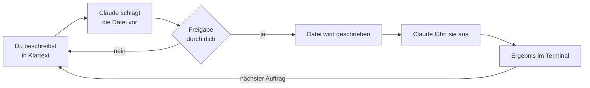

# S1.1 · Erster Kontakt: sofort eine Datei bauen

<!-- meta:start -->
> **Regal:** [Erste Schritte & Denkmodell](README.md#start) · **Stufe:** Kern · **~25 Min** · **Voraussetzungen:** [S0.1 Werkstatt einrichten](s0-01-werkstatt-einrichten.md)
>
> ← [S0.1 Werkstatt einrichten](s0-01-werkstatt-einrichten.md) · [Bibliothek](README.md) · [S1.2 Coding-Agent statt Chat: das Denkmodell](s1-02-agent-statt-chat.md) →
<!-- meta:end -->

## Schnellcheck

- Hast du Claude Code schon einmal in einem leeren Ordner gestartet und eine Datei erzeugen und ausführen lassen?
- Kannst du ohne Nachschlagen die vier Schritte nennen, die dabei ablaufen: Vorschlag, Freigabe, Schreiben, Ausführen?

## Auf einen Blick

Du startest Claude Code in einem leeren Ordner und bittest in normaler Sprache um eine kleine Datei. Claude schlägt die Datei vor, fragt um Freigabe, schreibt sie, führt sie aus und zeigt dir das Ergebnis. Diese Schleife ist das ganze Spiel: Du beschreibst, der Agent handelt, du prüfst.

Das Kapitel beginnt mit dieser Schleife an deinem eigenen Rechner. Die Erklärung kommt danach.

## Bild im Kopf

Claude Code ist ein Berater mit Ausweis: Er darf ins Gebäude, Türen öffnen und selbst Hand anlegen. Dieses Kapitel ist sein erster Gang durchs Haus. Du sagst ihm, was du willst, er zeigt dir, was er vorhat, du nickst, und er erledigt es vor deinen Augen.



## Im Detail

### Zuerst: Hallo, Claude Code (etwa 5 Minuten)

Leg einen leeren Ordner an und starte Claude Code darin:

```bash
# macOS / Linux / Git Bash
mkdir -p ~/cc-workshop/hello && cd ~/cc-workshop/hello
claude --permission-mode default
```

```powershell
# Windows PowerShell
New-Item -ItemType Directory -Force -Path "$HOME\cc-workshop\hello" | Out-Null
Set-Location "$HOME\cc-workshop\hello"
claude --permission-mode default
```

In einem neuen Ordner fragt Claude Code zuerst, ob du dem Ordner vertraust. Es ist dein eigener, leerer Ordner: Wähl mit den Pfeiltasten „Yes, I trust this folder“ und drück Enter.

Jetzt wartet die Eingabezeile. Gib diesen Auftrag ein und drück Enter:

<!-- cockpit:example -->
```
Create a file hello.py that prints "Hello from Claude Code" and run it.
```

Schau zu, was passiert:

1. **Vorschlag.** Claude zeigt den Inhalt der Datei und fragt „Do you want to create hello.py?“
2. **Freigabe.** Wähl „Yes“. Die Datei entsteht erst jetzt.
3. **Zweite Freigabe.** Claude will die Datei ausführen und zeigt den Befehl, etwa `python3 hello.py`. Wähl wieder „Yes“.
4. **Ergebnis.** Claude meldet, was das Skript ausgegeben hat: `Hello from Claude Code`.

Nimm beide Male das schlichte „Yes“. Die anderen Antworten („don't ask again“, „switch to …“) ändern, wie oft Claude künftig fragt; was sie bedeuten, lernst du in [S1.5](s1-05-rechte-im-alltag.md). `/exit` beendet die Sitzung.

### Die Schleife: Vorschlag, Freigabe, Schreiben, Ausführen

Was du gerade gesehen hast, wiederholt sich bei jeder Aufgabe, ob sie eine Zeile ändert oder zwanzig Dateien. Claude hat dir nicht *erklärt*, wie du die Datei schreibst. Es hat sie *selbst geschrieben und ausgeführt*, in deinem Ordner, mit deinen Rechten. Das unterscheidet einen Coding-Agenten von einem Chat-Assistenten; [S1.2](s1-02-agent-statt-chat.md) packt den Unterschied aus.

Die Freigabe ist der Moment, in dem du entscheidest. Davor ist alles Vorschlag, danach ist es geschehen.

### Warum du mit `--permission-mode default` gestartet hast

Ob Claude vor einer Aktion fragt, hängt vom Rechte-Modus der Sitzung ab. Im Modus `default` (in der Oberfläche „Manual“) fragt Claude vor Dateiänderungen und vor den meisten Shell-Befehlen; die Statusleiste unten zeigt dann `⏸ manual mode on`.

Startest du nur mit `claude`, läuft eine Sitzung im Terminal ab Version 2.1.283 im Modus `auto`: Ein zweites Modell prüft die Aktionen an deiner Stelle, und die Rückfragen bleiben meist aus. Für die ersten Kapitel startest du deshalb mit dem Flag, damit du jede Aktion siehst, bevor sie passiert. Die Modi im Einzelnen stehen in [S1.5](s1-05-rechte-im-alltag.md) und [S1.6](s1-06-rechte-modi.md).

### Was Claude Code für dich tun kann

- **Lesen:** Verzeichnisse durchgehen, Dateien lesen, ein Projekt als Ganzes erfassen
- **Schreiben:** neue Dateien anlegen, bestehende ändern, über mehrere Dateien hinweg umbauen
- **Ausführen:** Shell-Befehle, Tests, Builds
- **Git bedienen:** committen, Branches anlegen, Pull Requests erstellen ([S1.16](s1-16-git-in-einem-fluss.md))

Später kommen Websuche, parallele Helfer, Anschlüsse an andere Systeme und ein Gedächtnis über Sitzungen hinweg dazu. Für den Anfang reichen diese vier.

## Selbst machen

### Übung: dein erstes kleines Werkzeug (etwa 15 Minuten)

**Ziel:** Die Schleife an einer echten Aufgabe üben: beschreiben, umsetzen, ausführen, erweitern, erklären lassen. Du baust ein kleines Werkzeug, ohne selbst Code zu schreiben.

**Startzustand:** ein neuer, leerer Ordner, Claude Code im Modus `default`:

```bash
# macOS / Linux / Git Bash
mkdir -p ~/cc-workshop/werkzeug && cd ~/cc-workshop/werkzeug
claude --permission-mode default
```

```powershell
# Windows PowerShell
New-Item -ItemType Directory -Force -Path "$HOME\cc-workshop\werkzeug" | Out-Null
Set-Location "$HOME\cc-workshop\werkzeug"
claude --permission-mode default
```

**1. Das Werkzeug bauen lassen.** Das Beispiel stammt aus der Zutrittstechnik: ein Protokoll mit Türen, Karten und Ereignissen. Nimm es, wie es ist, oder ersetz Format und Auswertung durch etwas aus deiner eigenen Arbeit.

```
Create a Python script called event_log_parser.py.
It should read a text file where each line has this format:
  TIMESTAMP DOOR_ID EVENT_TYPE CARD_ID
Example line:
  2024-03-15T09:42:11 DOOR-03 ACCESS_GRANTED CARD-1047

The script should:
- Accept a filename as a command-line argument
- Parse each line
- Count how many ACCESS_GRANTED and ACCESS_DENIED events occurred per door
- Print a summary table to stdout

Create a sample input file called sample_events.txt with 10 test lines covering
at least 3 different doors and both event types.
```

**2. Beobachten.** Lies jeden Vorschlag, bevor du ihn freigibst: Legt Claude beide Dateien an? Sieht der Code für dich vernünftig aus?

**3. Ausführen lassen.**

```
Run event_log_parser.py on sample_events.txt and show me the output
```

**4. Eine Funktion ergänzen lassen.**

```
Add a --door flag that filters the output to show only events for a specific door.
Example: python event_log_parser.py sample_events.txt --door DOOR-03
```

**5. Erklären lassen, was sich geändert hat.**

```
Explain in plain language what changes you made to support the --door flag.
Then show me the diff.
```

**Geschafft, wenn:**

- [ ] `event_log_parser.py` und `sample_events.txt` (mindestens 10 Zeilen) im Ordner liegen
- [ ] das Skript eine Übersicht je Tür ausgibt, ohne abzustürzen
- [ ] `--door DOOR-03` nur noch diese eine Tür zeigt
- [ ] du jede Änderung gesehen hast, bevor sie passiert ist, und mit eigenen Worten sagen kannst, was Claude für `--door` geändert hat

### Extra: Befehle entdecken (etwa 5 Minuten)

Befehle, die mit `/` beginnen, steuern Claude Code selbst. Gib in einer Sitzung nur `/` ein: Es erscheint die Liste. Probier vier Befehle aus und notier zu jedem einen Satz, was er zeigt: `/help`, `/context`, `/cost` und einen, den du noch nie gesehen hast. Die drei genannten zeigen nur etwas an und ändern nichts.

## Typische Fallen

- **Es kommt keine Freigabe-Abfrage.** Die Sitzung läuft nicht im Modus `default`, meist weil das Flag fehlt. Beende sie mit `/exit` und starte mit `claude --permission-mode default`.
- **Claude Code beendet sich gleich nach dem Start.** Im Vertrauensdialog war „No, exit“ markiert, und du hast Enter gedrückt. Starte neu und wähl mit der Pfeiltaste „Yes, I trust this folder“. Den Dialog bestätigst du nur für Ordner, deren Inhalt du kennst.
- **`python3` wird nicht gefunden.** Unter Windows heißt der Befehl `python`. Sag es Claude: `Use python instead of python3.`
- **Claude hat eine Datei angelegt, aber du siehst sie nicht.** Frag nach: `What files did you create? List them.`
- **Das Skript stürzt beim Einlesen der Beispieldatei ab.** Gib Claude den Fehler zurück: `The script crashes with this error: [paste error]. Fix it without changing the sample file format.`

## Check

Du kannst Claude Code in einem leeren Ordner starten, per Klartext-Auftrag eine kleine Datei bauen und ausführen lassen und die Schleife Vorschlag, Freigabe, Schreiben, Ausführen an deinem eigenen Beispiel erklären.

1. Welche Schritte laufen nach einem Auftrag wie `Create a file hello.py … and run it.` im Modus `default` ab?
2. Warum hast du mit `claude --permission-mode default` gestartet, und was wäre ohne das Flag anders?
3. Was ist an der Freigabe der entscheidende Moment?

<details><summary>Auflösung</summary>

1. Claude schlägt die Datei vor und fragt um Freigabe, schreibt sie nach deinem „Yes“, fragt ein zweites Mal vor dem Ausführen und meldet dann das Ergebnis.
2. Im Modus `default` fragt Claude vor Dateiänderungen und vor den meisten Shell-Befehlen. Ohne das Flag startet eine Sitzung im Terminal ab Version 2.1.283 im Modus `auto`: Ein zweites Modell prüft an deiner Stelle, und die Rückfragen bleiben meist aus.
3. Davor ist alles Vorschlag, danach ist es geschehen: Claude schreibt und führt selbst aus, in deinem Ordner und mit deinen Rechten.

</details>

<details><summary>Quizfrage</summary>

**Frage:** Du startest in einem neuen Ordner nur mit `claude`, bestätigst den Vertrauensdialog und gibst den Auftrag `Create a file hello.py … and run it.` Die Datei entsteht und läuft, aber es kam keine einzige Rückfrage. Was ist die wahrscheinlichste Erklärung?

- **Richtig:** Die Sitzung läuft im Modus `auto`; mit `claude --permission-mode default` fragt Claude vor dem Schreiben und Ausführen.
  - Warum: Ohne Flag startet eine Terminal-Sitzung ab Version 2.1.283 in `auto`: Ein zweites Modell prüft die Aktionen an deiner Stelle, und die Rückfragen bleiben meist aus.
- Falsch: Der Vertrauensdialog hat alle Rückfragen für diesen Ordner abgeschaltet; sie kommen erst in einem neuen Ordner wieder.
  - Warum: Der Vertrauensdialog fragt nur, ob du dem Ordner vertraust. Ob Claude vor einer Aktion fragt, hängt vom Rechte-Modus der Sitzung ab.
- Falsch: Rückfragen gibt es nur bei Shell-Befehlen mit Risiko; das Anlegen und Ausführen einer Datei gilt als harmlos.
  - Warum: Im Modus `default` fragt Claude vor Dateiänderungen und vor den meisten Shell-Befehlen, nicht erst bei riskanten. In der Übung gibst du das Anlegen und das Ausführen je einzeln frei.
- Falsch: Claude hat die Datei nur vorgeschlagen und simuliert; geschrieben wird sie erst, wenn du `/exit` eingibst.
  - Warum: Claude simuliert nichts: Die Datei entsteht wirklich in deinem Ordner und läuft dort, hier ohne Rückfrage, weil die Sitzung in `auto` läuft. `/exit` beendet nur die Sitzung.

</details>

## Weiterlesen

- [Claude Code: Überblick](https://code.claude.com/docs/en/overview)
- [Quickstart](https://code.claude.com/docs/en/quickstart)
- [S0.1 · Werkstatt einrichten](s0-01-werkstatt-einrichten.md)
- [S1.2 · Coding-Agent statt Chat: das Denkmodell](s1-02-agent-statt-chat.md)
- [S1.4 · Eingebaute Werkzeuge und ihre Namen](s1-04-werkzeuge.md)
- [S1.5 · Rechte im Alltag: default und acceptEdits](s1-05-rechte-im-alltag.md)
- [S1.6 · Alle Rechte-Modi im Überblick](s1-06-rechte-modi.md)
