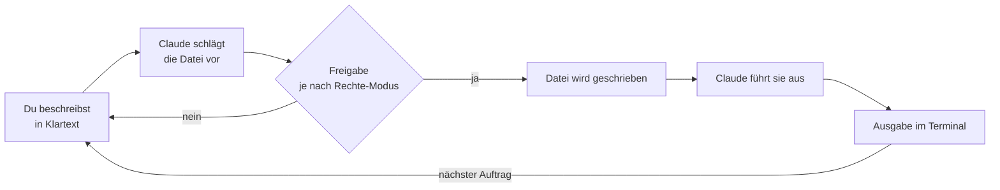

# S1.1 · Erster Kontakt: sofort eine Datei bauen

<!-- meta:start -->
> **Regal:** [Erste Schritte & Denkmodell](README.md#start) · **Stufe:** Kern · **~12 Min** · **Voraussetzungen:** [S0.1 Werkstatt einrichten](s0-01-werkstatt-einrichten.md)
>
> ← [X.2 Mit Claude Code lernen](x-02-lernen-mit-claude-code.md) · [Bibliothek](README.md) · [S1.2 Coding-Agent statt Chat: das Denkmodell](s1-02-agent-statt-chat.md) →
<!-- meta:end -->

## Schnellcheck

- Hast du Claude Code schon einmal in einem leeren Ordner gestartet und eine Datei erzeugen und ausführen lassen?
- Kannst du ohne Nachschlagen die drei Schritte nennen, die du dabei beobachtest: beschreiben, handeln, Ergebnis sehen?

## Auf einen Blick

Vor jeder Theorie steht ein Erfolg: Du startest Claude Code in einem leeren Ordner und bittest in normaler Sprache um eine kleine Datei. Claude schlägt die Datei vor, schreibt sie, führt sie aus und zeigt dir die Ausgabe. Diese Schleife ist das ganze Spiel: Du beschreibst, der Agent handelt, du siehst das Ergebnis.

## Bild im Kopf

Die CLI ist ein Berater mit Ausweis: Er darf ins Gebäude, Türen öffnen und selbst Hand anlegen. Dieses Kapitel ist sein erster Gang durchs Haus. Du sagst ihm, was du willst, er erledigt es vor deinen Augen, und du prüfst, was dabei herauskommt.



## Im Detail

### Die Schleife: beschreiben, handeln, Ergebnis sehen

Schau genau hin, was nach deinem ersten Auftrag passiert (unten in „Selbst machen"): Claude schlägt die Datei vor, fragt, ob es sie schreiben darf, legt sie an, führt sie aus und zeigt dir die Ausgabe. **Diese Schleife ist das ganze Spiel.** Alles Weitere erklärt nur die Mechanik dahinter.

Das Entscheidende für alle, die neu bei Agenten sind: Claude hat dir nicht *erklärt*, wie du die Datei schreibst. Es hat sie *selbst geschrieben und ausgeführt*. Das ist der Unterschied zwischen einem Chat-Assistenten und einem Coding-Agenten; [S1.2](s1-02-agent-statt-chat.md) packt ihn aus.

### Ob du eine Freigabe-Abfrage siehst

Ob Claude vor dem Schreiben fragt, hängt vom Rechte-Modus ab. Im Modus `default` (in der Oberfläche „Manual") fragt Claude vor den meisten Dateiänderungen, Shell-Befehlen und Netzzugriffen. Seit v2.1.283 startet eine interaktive Sitzung im Terminal aber standardmäßig im Modus `auto`: Dann prüft ein Klassifikator die Aktionen an deiner Stelle, und die Abfrage kann ausbleiben. Willst du die Abfrage bewusst sehen, starte mit `claude --permission-mode default`. Die Modi im Einzelnen stehen in [S1.5](s1-05-rechte-im-alltag.md) und [S1.6](s1-06-rechte-modi.md).

### Was Claude Code kann

- **Codebasen lesen:** Verzeichnisse durchgehen, Dateien lesen, ganze Projekte auf einmal erfassen
- **Dateien schreiben und ändern:** neue Dateien anlegen, bestehende ändern, über mehrere Dateien hinweg umbauen
- **Befehle ausführen:** Shell-Befehle, Testsuiten, Builds, Dienste starten
- **Git bedienen:** stagen, committen, Branches anlegen, mergen, pushen, Pull Requests erstellen, alles aus dem Gespräch heraus ([S1.16](s1-16-git-in-einem-fluss.md))
- **Im Web suchen:** Dokumentation recherchieren, Pakete finden, Fehlermeldungen nachschlagen
- **Agenten koordinieren:** parallele Subagenten für unabhängige Teilaufgaben starten ([S3.1](s3-01-was-ist-ein-agent.md))
- **Über MCP andocken:** externe Werkzeuge einbinden, etwa Datenbanken, APIs, Monitoring, GitHub, Slack ([S2.14](s2-14-mcp-stecker.md))
- **Sich über Sitzungen hinweg erinnern:** Kontext mit CLAUDE.md und dem Gedächtnis-System festhalten ([S1.10](s1-10-claude-md.md))

Die letzten drei Punkte kommen erst in späteren Regalen. Für den ersten Kontakt reicht es zu wissen, dass es sie gibt. Was Claude Code nicht kann, steht in [S1.2](s1-02-agent-statt-chat.md).

### Wie es weitergeht

- In [S1.6](s1-06-rechte-modi.md) ordnest du alle sechs Rechte-Modi ein (`default`, `acceptEdits`, `plan`, `auto`, `dontAsk`, `bypassPermissions`) und die Grenzen in Cloud-Sitzungen.
- In [S1.7](s1-07-modellwahl-und-effort.md) wählst du Modell (`fable`, `opus`, `sonnet`, `haiku`) und Effort passend zu Kosten und nötiger Denktiefe.

## Selbst machen

### Deine erste Aufgabe: Hallo, Claude Code (etwa 5 Minuten)

Drei Befehle, ein sichtbares Ergebnis. Leg einen leeren Ordner an und starte Claude Code darin:

```bash
# macOS / Linux / Git Bash
mkdir -p ~/cc-workshop/hello && cd ~/cc-workshop/hello
claude
```

```powershell
# Windows PowerShell
New-Item -ItemType Directory -Force -Path "$HOME\cc-workshop\hello" | Out-Null
Set-Location "$HOME\cc-workshop\hello"
claude
```

Sobald Claude Code läuft, tipp einen Auftrag in normaler Sprache und drück Enter:

<!-- cockpit:example -->
```
Create a file hello.py that prints "Hello from Claude Code" and run it.
```

Beobachte die Schleife aus „Im Detail": Vorschlag, Freigabe (falls dein Rechte-Modus fragt), Schreiben, Ausführen, Ausgabe.

### Varianten

**Noch kleiner (Übung 1.0, etwa 3 Minuten, freiwillig).** Dieselbe Schleife mit einer Textdatei, diesmal ganz allein: Öffne Claude Code in einem eigenen leeren Ordner, etwa `~/cc-workshop/exercises/exercise-1.0`, und gib einen einzigen Auftrag:

```
Create a file hello.txt containing the line "Hallo".
```

Bestätige das Schreiben, wenn Claude fragt. Geschafft, wenn:

- [ ] `hello.txt` existiert und `Hallo` enthält
- [ ] du die Freigabe-Abfrage gesehen und bestätigt hast: Das ist der Agent, der für dich handelt, unter deiner Kontrolle. Kommt keine Abfrage, läuft die Sitzung vermutlich im Modus `auto` (siehe „Im Detail").

**Nur reden (W1, 60–90 Sekunden).** Null Code, null Hürde: Starte `claude` in einem leeren Ordner und gib ihm `Introduce yourself in one sentence and tell me which directory we're in.` Daumen hoch: Du hast mit dem Agenten gesprochen, mehr braucht es für den Anfang nicht.

### Übung: dein erstes kleines Werkzeug (Übung 1.1, 12–15 Minuten)

**Ziel:** Die Kernschleife von Claude Code einüben: beschreiben, umsetzen, ausführen, erweitern, erklären. Du baust ein kleines Werkzeug von Grund auf, ohne selbst Code zu schreiben.

**1. Claude Code in einem sauberen Ordner öffnen**

Im Terminal:

```bash
# macOS / Linux / Git Bash
mkdir -p ~/cc-workshop/exercises/exercise-1.1 && cd ~/cc-workshop/exercises/exercise-1.1
claude
```

```powershell
# Windows PowerShell
New-Item -ItemType Directory -Force -Path "$HOME\cc-workshop\exercises\exercise-1.1" | Out-Null
Set-Location "$HOME\cc-workshop\exercises\exercise-1.1"
claude
```

**2. Claude ein kleines Werkzeug bauen lassen**

Gib Claude diesen Auftrag. Übernimm ihn nicht wörtlich, sondern pass ihn leicht an etwas an, das zu deinem Fachgebiet passt:

```
Create a Python script called event_log_parser.py.
It should read a text file where each line has this format:
  TIMESTAMP DOOR_ID EVENT_TYPE CARD_ID
Example line:
  2024-03-15T09:42:11 DOOR-03 ACCESS_GRANTED CARD-1047

The script should:
- Accept a filename as a command-line argument
- Parse each line
- Count how many ACCESS_GRANTED and ACCESS_DENIED events occurred per door
- Print a summary table to stdout

Create a sample input file called sample_events.txt with 10 test lines covering
at least 3 different doors and both event types.
```

**3. Beobachten, was Claude tut**

Achte darauf: Wiederholt es die Anforderungen? Legt es beide Dateien an? Sieht der Code für dich vernünftig aus?

**4. Das Werkzeug ausführen**

Bitte Claude:

```
Run event_log_parser.py on sample_events.txt and show me the output
```

**5. Eine Funktion ergänzen lassen**

Sobald es läuft, ergänzt du eine Funktion:

```
Add a --door flag that filters the output to show only events for a specific door.
Example: python event_log_parser.py sample_events.txt --door DOOR-03
```

**6. Claude erklären lassen, was es getan hat**

```
Explain in plain language what changes you made to support the --door flag.
Then show me the diff.
```

**Geschafft, wenn:**

- [ ] `event_log_parser.py` im Ordner liegt
- [ ] `sample_events.txt` mit mindestens 10 Zeilen existiert
- [ ] das Skript eine Übersichtstabelle ausgibt (ohne Absturz)
- [ ] das Flag `--door` funktioniert und richtig filtert
- [ ] du aus der Erklärung verstehst, was Claude geändert hat

**Tipp:** Wenn du statt des Log-Parsers lieber ein eigenes Werkzeug aus deinem Fachgebiet baust: nur zu. Es geht um die Schleife, nicht um das Werkzeug. Was tun, wenn etwas hakt: siehe „Typische Fallen".

### Extra: Tab-Complete-Bingo (Gruppe, etwa 5 Minuten, leicht)

**Ziel:** Entdecken, dass es Slash-Commands gibt und dass du gefahrlos daran herumprobieren kannst. Das nimmt die Scheu vor dem leeren Prompt.

**Analogie:** Ein neuer Operator lernt das Pult der Leitstelle kennen, bevor der erste Alarm kommt.

1. Jede Person bekommt eine Karte mit 6 Feldern: `/help`, `/cost`, `/hooks`, `/clear`, „ein Slash-Command, den keiner von euch kennt" und „ein Befehl, der eine Zahl ausgibt".
2. 5-Minuten-Timer: Hak jedes Feld ab, indem du den Befehl wirklich eintippst und in einem Satz notierst, was er tut.
3. Für das unbekannte Feld: Lies `/help`, such dir einen Befehl, den du noch nie gesehen hast, und probier ihn aus.
4. Wer zuerst alle 6 hat, ruft „Bingo" und erklärt den ausgefallensten Befehl. Nachbesprechung in einem Satz: „Welcher Befehl rettet mir am häufigsten den Tag?"

## Typische Fallen

- **Claude hat eine Datei angelegt, aber du siehst sie nicht.** Frag nach: `What files did you create? List them.`
- **Das Skript stürzt beim Einlesen der Beispieldatei ab.** Gib Claude den Fehler zurück: `The script crashes on line X with this error: [paste error]. Fix it without changing the sample file format.`
- **Es kommt keine Freigabe-Abfrage.** Das ist kein Fehler, sondern meist der Modus `auto`; siehe „Ob du eine Freigabe-Abfrage siehst".

## Check

Du kannst Claude Code in einem leeren Ordner starten, per Klartext-Auftrag eine kleine Datei bauen und ausführen lassen und die Schleife beschreiben, handeln, Ergebnis sehen an deinem eigenen Beispiel erklären.

1. Welche Schritte laufen nach einem Auftrag wie `Create a file hello.py … and run it.` ab?
2. Warum siehst du in einer neuen Sitzung womöglich keine Freigabe-Abfrage, und wie startest du so, dass Claude fragt?
3. Nenne drei Dinge, die Claude Code laut „Was Claude Code kann" für dich erledigt.

<details><summary>Quizfrage</summary>

**Frage:** Du tippst in einer frischen Sitzung `Create a file hello.py that prints "Hello from Claude Code" and run it.` Was passiert, und was unterscheidet das von einem Chat-Assistenten?

- **Richtig:** Claude legt die Datei in deinem Ordner an, führt sie über die Shell aus und zeigt die Ausgabe, statt dir nur Code zu schicken.
- Falsch: Claude kompiliert den Code zuerst zu einer Binärdatei, prüft sie auf Schadcode und startet erst danach das Programm.
- Falsch: Claude schickt den Code an einen Interpreter in der Cloud und zeigt das Ergebnis; auf deinem Rechner bleibt dabei nichts liegen.
- Falsch: Claude speichert die Datei im Auto-Memory, damit sie beim nächsten Start der Sitzung automatisch wieder bereitsteht.

</details>

## Weiterlesen

- [Claude Code: Überblick](https://code.claude.com/docs/en/overview)
- [Quickstart](https://code.claude.com/docs/en/quickstart)
- [S0.1 · Werkstatt einrichten](s0-01-werkstatt-einrichten.md)
- [S1.2 · Coding-Agent statt Chat: das Denkmodell](s1-02-agent-statt-chat.md)
- [S1.4 · Eingebaute Werkzeuge und ihre Namen](s1-04-werkzeuge.md)
- [S1.5 · Rechte im Alltag: default und acceptEdits](s1-05-rechte-im-alltag.md)
- [S1.6 · Alle Rechte-Modi im Überblick](s1-06-rechte-modi.md)
- [S1.20 · Praxis-Station Session 1: eine Übung wählen](s1-20-praxis-station-1.md)
