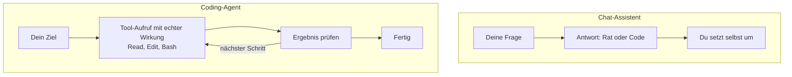

# S1.2 · Coding-Agent statt Chat: das Denkmodell

<!-- meta:start -->
> **Regal:** [Erste Schritte & Denkmodell](README.md#start) · **Stufe:** Kern · **~15 Min** · **Voraussetzungen:** [S1.1 Erster Kontakt: sofort eine Datei bauen](s1-01-erster-kontakt.md)
>
> ← [S1.1 Erster Kontakt: sofort eine Datei bauen](s1-01-erster-kontakt.md) · [Bibliothek](README.md) · [S1.3 Die Oberflächen: CLI, Desktop, IDE, Web, iOS](s1-03-oberflaechen.md) →
<!-- meta:end -->

## Schnellcheck

- Kannst du ohne Nachschlagen erklären, warum ein Coding-Agent etwas anderes ist als ein Chatfenster, in das du Code kopierst?
- Hast du schon einmal eine Rückfrage eines Agenten bewusst abgelehnt, weil du gelesen hattest, welcher Befehl gleich laufen würde?

## Auf einen Blick

Ein Chat-Assistent beantwortet deine Frage und überlässt dir das Umsetzen. Ein Coding-Agent wie Claude Code handelt selbst: Er liest und schreibt Dateien, führt Befehle aus und prüft die Ergebnisse, auf deinem Rechner und mit deinen Rechten. Jede Aktion hat deshalb echte Wirkung, und jede Freigabe ist eine Entscheidung mit Folgen.

Was Claude Code erreichen kann, bestimmt nicht Claude, sondern dein Benutzerkonto. Die Grenze setzt du.

## Bild im Kopf

Der Chat auf claude.ai ist ein Sicherheitsberater am Telefon: Er hört zu, analysiert und rät, fasst aber nichts an. Claude Code ist derselbe Berater mit Hausausweis: Er steht im Gebäude und legt selbst Hand an, unter deiner Aufsicht, mit echter Wirkung.

Am Telefon beschreibst du ihm das Gebäude, und er sagt vielleicht: „Die Tür zum Serverraum braucht einen Kartenleser und ein PIN-Pad.“ Umsetzen musst du das selbst. Mit Hausausweis öffnet er Türen, prüft Schlösser vor Ort, zieht das Zutrittsprotokoll vom Controller und ändert die Konfiguration am Panel. Welche Türen sein Ausweis öffnet, legen die Rechte-Modi fest ([S1.5](s1-05-rechte-im-alltag.md)).



## Im Detail

### Sieht aus wie ein Chat, ist ein Agent

Im Terminal sieht Claude Code aus wie ein Chat: Du schreibst, es antwortet. Der Unterschied liegt in dem, was zwischen deiner Nachricht und der Antwort passiert. Ein Chat-Assistent schickt dir Text. Ein **Agent** ruft Werkzeuge auf: Er liest eine Datei, ändert sie, startet einen Befehl, liest dessen Ausgabe und entscheidet danach über den nächsten Schritt. In [S1.1](s1-01-erster-kontakt.md) hast du das gesehen: Claude hat `hello.py` nicht beschrieben, sondern geschrieben und ausgeführt.

### Was das für jede Freigabe heißt

Startest du `claude` in einem Ordner, bekommt Claude Code Zugriff auf die Dateien dort und auf dein Terminal. Die Doku sagt es so: Was du von der Kommandozeile aus tun kannst, kann Claude auch. Das schließt alles ein, was dein Benutzerkonto erreicht: andere Ordner, Git-Zugänge, Server, zu denen du dich verbinden darfst.

Drei Folgen:

- **Ein freigegebener Befehl läuft sofort und wirklich.** Es gibt keine Probe und keine Kopie, auf der er erst einmal arbeitet.
- **Claude Code weiß nicht, was bei dir wichtig ist.** Ob ein Ordner Wegwerf-Material oder die Arbeit von drei Wochen enthält, sieht man einem `rm` nicht an.
- **Nicht alles lässt sich zurückholen.** Was Claude über seine Datei-Werkzeuge ändert, kannst du in der Sitzung zurückdrehen ([S1.9](s1-09-kontext-steuern.md)). Was ein Shell-Befehl gelöscht hat oder was ein entferntes System verändert hat, eine Datenbank, ein Deployment, ein Push, holst du so nicht zurück.

Deshalb liest du eine Rückfrage, bevor du sie beantwortest. Maßgeblich ist die Zeile mit dem Befehl, nicht die Überschrift darüber.

### Wo die Grenzen liegen

- **Den Bildschirm sieht es nicht.** Von Haus aus sieht Claude Code weder deine grafische Oberfläche noch deinen Browser, nur was es aus dem Dateisystem lesen oder als Befehl ausführen kann. Das ändern erst eigene, standardmäßig abgeschaltete Funktionen: Mit Computer Use steuert Claude Maus und Tastatur und macht Screenshots (in der CLI nur unter macOS als Research Preview, in der Desktop-App unter macOS und Windows); mit Claude in Chrome steuert es deinen Browser.
- **Hintergrund-Befehle enden mit der Sitzung.** Startet Claude einen Server im Hintergrund, räumt Claude Code ihn beim Beenden auf. Für Arbeit, die ohne dein Terminal weiterläuft, gibt es Hintergrund-Sitzungen ([S3.5](s3-05-hintergrund-und-teams.md)).
- **Es kann sich irren, mit voller Überzeugung.** Wie jedes Sprachmodell. Prüf kritische Ergebnisse selbst.

### Ein Beispiel aus der Zutrittstechnik

Angenommen, du arbeitest an Firmware für Zutrittscontroller. Claude Code kann die Konfigurationsdateien deiner Controller lesen, Parser für deine Log-Formate schreiben und Test-Harnesses für Alarm-Zustandsautomaten erzeugen.

Ob ein Panel in deinem Netz produktiv ist, weiß es nicht. Erreicht dein Benutzerkonto das Panel, kann Claude Code es auch erreichen, sobald du den Befehl freigibst oder ein Modus ihn durchwinkt. Die Grenze setzt du: mit Rechte-Regeln ([S1.5](s1-05-rechte-im-alltag.md)), mit einer Sandbox ([S3.9](s3-09-geschuetzte-pfade-und-sandbox.md)) oder indem du auf einem Rechner arbeitest, der gar keinen Zugang zum Panel hat.

## Selbst machen

### Übung: eine Aktion ablehnen (etwa 5 Minuten)

**Ziel:** Du liest eine Rückfrage genau, lehnst sie ab und prüfst, dass nichts passiert ist. Danach benennst du für zwei Befehle, was im schlimmsten Fall geschehen wäre.

**Startzustand:** der Ordner `~/cc-workshop/hello` mit `hello.py` aus S1.1. Fehlt die Datei, leg dort eine beliebige Textdatei an und nimm ihren Namen.

1. Starte dort eine Sitzung, die vor jeder Aktion fragt (die beiden Zeilen laufen auch in PowerShell):

<!-- cockpit:example -->
```bash
cd ~/cc-workshop/hello
claude --permission-mode default
```

2. Gib den Auftrag `Delete hello.py.`
3. Lies die Rückfrage, bevor du antwortest. Oben steht die Art der Aktion („Bash command“), darunter der Befehl, der gleich laufen würde, etwa `rm …/hello.py`. Welche Antworten bietet Claude Code an?
4. Wähl „No“. Claude Code bricht ab und fragt, was es stattdessen tun soll.
5. Prüf nach: `List the files in this folder.` Die Datei ist noch da. Diese Frage läuft ohne Rückfrage, weil sie nur liest.
6. Notier für die beiden folgenden Befehle je zwei Sätze: Was passiert im schlimmsten Fall, und was hätte es verhindert?
   - `rm -rf build/` in einem Projekt, an dem du seit Tagen arbeitest
   - `git push --force` auf den gemeinsamen Hauptbranch

<details><summary>Vergleich für Schritt 6</summary>

- `rm -rf build/`: Der Ordner ist sofort weg, samt allem, was nicht committet oder gesichert war; ein Shell-Befehl lässt sich in der Sitzung nicht zurückdrehen. Verhindert hätte es dein „No“ an der Rückfrage oder eine Deny-Regel für `rm` (S1.5); gemildert ein Commit oder ein Backup davor.
- `git push --force`: Der Stand auf dem Server wird überschrieben, Commits anderer können verschwinden. Das trifft ein entferntes System und lässt sich aus der Sitzung nicht zurückdrehen. Verhindert hätte es dein „No“, eine Deny-Regel für diesen Befehl oder ein Schutz des Branches auf dem Server.

</details>

**Geschafft, wenn:**

- [ ] du in der Rückfrage die Zeile mit dem Befehl gefunden hast und sagen kannst, welches Werkzeug ihn ausführen wollte
- [ ] du abgelehnt hast und `hello.py` danach noch da war
- [ ] du für beide Befehle den schlimmsten Fall und eine Bremse notiert und mit dem Vergleich abgeglichen hast

## Typische Fallen

- **Die Überschrift für die Wahrheit halten.** Über dem Befehl steht eine kurze Beschreibung in Claudes Worten, etwa „Delete hello.py“. Was wirklich läuft, steht in der Befehlszeile darunter. Lies die.
- **„Yes, and don't ask again“ aus Gewohnheit wählen.** Diese Antwort legt eine Erlaubnis an, die über die eine Aktion hinaus gilt. Nimm sie erst, wenn du in [S1.5](s1-05-rechte-im-alltag.md) gesehen hast, was eine Regel ist.
- **Es kommt gar keine Rückfrage.** Die Sitzung läuft nicht im Modus `default`. Beende sie und starte mit `claude --permission-mode default`.

## Check

Du kannst in einem Satz erklären, warum Claude Code kein Chat-Tool ist, und benennen, welche Folge das für jede Freigabe hat.

1. Was tut ein Coding-Agent selbst, das ein Chat-Assistent dir überlässt?
2. Was kann Claude Code auf deinem Rechner erreichen, und wer setzt die Grenze?
3. Welche Änderungen lassen sich aus der Sitzung nicht zurückdrehen?

<details><summary>Auflösung</summary>

1. Er ruft Werkzeuge auf: Er liest und schreibt Dateien, führt Befehle aus, liest deren Ausgabe und entscheidet danach über den nächsten Schritt. Ein Chat-Assistent schickt nur Text, umsetzen musst du.
2. Alles, was du von der Kommandozeile aus tun kannst, also alles, was dein Benutzerkonto erreicht. Die Grenze setzt du: mit deiner Antwort auf die Rückfrage, mit Rechte-Regeln, einer Sandbox oder einem Rechner ohne Zugang zu kritischen Systemen.
3. Was ein Shell-Befehl gelöscht hat und was ein entferntes System verändert hat: eine Datenbank, ein Deployment, ein Push. Zurückdrehen kannst du, was Claude über seine Datei-Werkzeuge geändert hat.

</details>

<details><summary>Quizfrage</summary>

**Frage:** Im Chat kopierst du einen vorgeschlagenen Befehl selbst ins Terminal. In Claude Code beantwortest du eine Rückfrage mit „Yes“. Warum ist das eine andere Entscheidung?

- **Richtig:** Nach dem „Yes“ läuft der Befehl sofort auf deinem Rechner, mit deinen Rechten; im Chat läuft nichts, bis du es selbst tust.
- Falsch: Claude Code legt vor jedem Befehl eine Sicherung des Ordners an, die der Chat nicht hat; ein „Yes“ ist deshalb gefahrlos.
- Falsch: Der Befehl läuft zuerst in einer abgeschotteten Kopie; dein Rechner ändert sich erst, wenn du auch das Ergebnis bestätigst.
- Falsch: Das „Yes“ gibt nur den Text frei; ausführen musst du den Befehl danach weiterhin selbst im eigenen Terminal.

</details>

## Weiterlesen

- [How Claude Code works](https://code.claude.com/docs/en/how-claude-code-works)
- [Claude Code: Überblick](https://code.claude.com/docs/en/overview)
- [S1.1 · Erster Kontakt: sofort eine Datei bauen](s1-01-erster-kontakt.md)
- [S1.3 · Die Oberflächen: CLI, Desktop, IDE, Web, iOS](s1-03-oberflaechen.md)
- [S1.5 · Rechte im Alltag: default und acceptEdits](s1-05-rechte-im-alltag.md)
- [S1.6 · Alle Rechte-Modi im Überblick](s1-06-rechte-modi.md)
- [S3.1 · Was ist ein Agent? Spezialisierung statt Allrounder](s3-01-was-ist-ein-agent.md)
