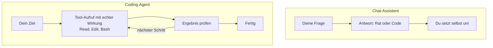

# S1.2 · Coding-Agent statt Chat: das Denkmodell

<!-- meta:start -->
> **Regal:** [Erste Schritte & Denkmodell](README.md#start) · **Stufe:** Kern · **~12 Min** · **Voraussetzungen:** [S1.1 Erster Kontakt: sofort eine Datei bauen](s1-01-erster-kontakt.md)
>
> ← [S1.1 Erster Kontakt: sofort eine Datei bauen](s1-01-erster-kontakt.md) · [Bibliothek](README.md) · [S1.3 Die Oberflächen: CLI, Desktop, IDE, Web, iOS](s1-03-oberflaechen.md) →
<!-- meta:end -->

## Schnellcheck

- Kannst du ohne Nachschlagen erklären, warum ein Coding-Agent etwas anderes ist als ein Chatfenster, in das du Code kopierst?
- Hast du schon einmal bewusst entschieden, ob du einem Agenten eine Aktion erlaubst (Datei schreiben, Shell-Befehl), und weißt du, was im schlimmsten Fall passieren kann?

## Auf einen Blick

Ein Chat-Assistent beantwortet deine Frage und überlässt dir das Umsetzen. Ein Coding-Agent wie Claude Code handelt selbst: Er liest und schreibt Dateien, führt Befehle aus und prüft die Ergebnisse, in deiner Entwicklungsumgebung und innerhalb eines Rechte-Systems, das du steuerst. Jede Aktion hat deshalb echte Wirkung, und jede Freigabe ist eine Entscheidung mit Folgen.

## Bild im Kopf

Der Chat auf claude.ai ist ein Sicherheitsberater am Telefon: Er hört zu, analysiert und rät, fasst aber nichts an. Claude Code ist derselbe Berater mit Besucherausweis: Er legt selbst Hand an, in deiner Umgebung, unter deiner Aufsicht, mit echter Wirkung.

Am Telefon beschreibst du ihm das Gebäude, die Lage der Schlösser, die Kamerawinkel. Er sagt vielleicht: „Die Tür zum Serverraum braucht einen Kartenleser UND ein PIN-Pad." Umsetzen musst du das selbst. Seine Fähigkeit: Rat, Analyse, Review, ohne jeden physischen Fußabdruck.

Mit Ausweis hat ihn eine Begleitung durchs Gebäude geführt. Jetzt öffnet er Türen, prüft Schlösser vor Ort, sieht sich die Verkabelung im Technikraum an, zieht das Zutrittsprotokoll vom Controller und ändert die Konfiguration am Panel. Seine Fähigkeit: Er liest deine Dateien, schreibt deine Dateien, führt deine Befehle aus, committet deinen Code, legt deine Branches an.

Wie dasselbe Bild für Desktop-App, IDE, Web und Handy aussieht, zeigt [S1.3](s1-03-oberflaechen.md).



## Im Detail

### Kein Chatfenster, sondern ein Agent

Claude Code ist kein Chat-Interface. Es ist ein Kommandozeilenwerkzeug, das einem KI-Agenten vollen, aktiven Zugriff auf deine Entwicklungsumgebung gibt. Ein Chat-Assistent beantwortet deine Frage und überlässt dir das Tun. Ein **Agent** handelt in deinem Auftrag: Er liest und schreibt Dateien, führt Befehle aus und prüft die Ergebnisse, innerhalb eines Rechte-Systems, das du steuerst.

Diese Unterscheidung ist das erste Denkmodell, auf dem alles andere aufbaut. In [S1.1](s1-01-erster-kontakt.md) hast du es schon gesehen: Claude hat `hello.py` nicht erklärt, sondern selbst geschrieben und ausgeführt. Wie weit dieser Zugriff im Alltag reichen darf, regeln die Rechte-Modi ([S1.5](s1-05-rechte-im-alltag.md), [S1.6](s1-06-rechte-modi.md)).

### Was Claude Code nicht kann

- **Deinen Bildschirm direkt sehen:** Von Haus aus sieht Claude Code weder deine grafische Oberfläche noch deinen Browser oder Monitor, nur das, was es aus dem Dateisystem lesen oder als Befehl ausführen kann. Das ändern erst eigene, standardmäßig abgeschaltete Funktionen: Mit Computer Use steuert Claude Maus und Tastatur und macht Screenshots (in der CLI nur unter macOS als Research Preview, in der Desktop-App unter macOS und Windows); mit Claude in Chrome steuert es deinen Browser.
- **Dauerhafte Dienste betreiben:** Es kann einen Server starten, hält aber keine Hintergrundprozesse über Sitzungen hinweg am Leben.
- **Ohne Einrichtung in private Netze:** VPN, interne APIs und On-Prem-Systeme brauchen eine ausdrückliche MCP-Konfiguration oder einen Tunnel.
- **Ohne Freigabe über Produktion entscheiden:** Bewährt ist, alles, was Produktion berührt, von einem Menschen freigeben zu lassen. Claude Code pusht nicht von sich aus in Produktion.
- **Wissen, was es nicht weiß:** Wie jedes Sprachmodell kann es sich mit voller Überzeugung irren. Prüf kritische Ergebnisse immer selbst.

### Was das für Physical-Security-Entwicklung heißt

Zu deinem Fachgebiet gehören Firmware für Zutrittscontroller, Integrationsprotokolle (OSDP, Wiegand, RS-485), das Auswerten von Ereignisprotokollen und die Alarmkorrelation, das Konfigurationsmanagement großer Panel-Installationen und Compliance in sicherheitskritischen Systemen.

Claude Code kann die Konfigurationsdateien deiner Controller lesen, deine Protokoll-Implementierungen verstehen, Parser für deine Log-Formate schreiben, Test-Harnesses für Alarm-Zustandsautomaten erzeugen und dir helfen, dich in Compliance-Anforderungen zurechtzufinden. Deine laufenden Panels fasst es aber nicht an. Diese Grenze durchzusetzen ist deine Aufgabe.

### Kein Rezept, sondern ein Werkzeug

Boris Cherny hat Claude Code ursprünglich entwickelt. Seine Designhaltung ist bewusst nicht vorschreibend (übersetzt):

> „Claude Code ist ein Powertool. Es gibt nicht den einen richtigen Weg, damit zu arbeiten. Jeder nutzt es für seine Aufgaben anders. Du musst herausfinden, was für dich am besten funktioniert."

Das setzt die richtige Erwartung: Du lernst hier nicht „die richtige Art, Claude Code zu benutzen", sondern die Mechanik, die Denkmodelle und eine Reihe von Mustern. Was du daraus baust, gehört dir.

Wie bei einer Kreissäge: Das Handbuch erklärt dir das Sägeblatt, die Schutzfunktionen und den Vorschub. Wie du damit dein Projekt baust, entscheidest du. Das Werkzeug schränkt deine Kreativität nicht ein.

## Vorführen

### Demo-Schritt: Claude beschreibt sich selbst

Das ist Schritt 2 der Demo „Erster Kontakt"; die übrigen Schritte stehen in [S1.1](s1-01-erster-kontakt.md).

Tipp in Claude Code:

<!-- cockpit:example -->
```
Describe yourself in exactly 3 bullet points. Focus on what makes you different from a chat interface.
```

Erwartet: Claude antwortet mit drei knappen Punkten, etwa zu (1) Zugriff aufs Dateisystem, (2) Ausführen von Befehlen, (3) Git- und Werkzeug-Integration. Der Wortlaut schwankt, die Substanz ist da.

<details><summary>Für Moderierende</summary>

**Sagen, während Claude antwortet:** „Es sagt nicht ‚Ich bin ein hilfreicher KI-Assistent'. Es beschreibt seine Fähigkeiten zutreffend. Es weiß, dass es ein Agent ist und kein Chatwerkzeug. Diese Einordnung ist wichtig."

**Wenn Claude genau drei Punkte liefert:** Sag: „Gut, und ihr seht, dass es sich an Vorgaben im Prompt hält. Ich habe drei Punkte verlangt, und es hat mir drei gegeben."

</details>

## Check

Du kannst in einem Satz erklären, warum Claude Code kein Chat-Tool ist, und benennen, welche Folge das für jede Freigabe hat.

1. Was tut ein Coding-Agent selbst, das ein Chat-Assistent dir überlässt?
2. Nenne drei Dinge, die Claude Code nicht kann oder nicht von sich aus tut.
3. Wer sorgt dafür, dass Claude Code deine laufenden Panels nicht anfasst?

<details><summary>Quizfrage</summary>

**Frage:** Was ist der entscheidende Unterschied zwischen dem Chat auf claude.ai und Claude Code in der CLI?

- **Richtig:** Der Chat berät, umsetzen musst du. Claude Code liest, schreibt und führt selbst aus, im Rahmen deiner Rechte.
- Falsch: Claude Code kennt mehr Programmiersprachen und Frameworks als der Chat und löst deshalb mehr Coding-Aufgaben.
- Falsch: Der Chat kann keine Codebeispiele anzeigen, die CLI dagegen bietet Syntax-Hervorhebung und eine Diff-Ansicht.
- Falsch: Die CLI arbeitet mit einem größeren Kontextfenster als der Chat und verarbeitet deshalb auch größere Codebasen.

</details>

## Weiterlesen

- [How Claude Code works](https://code.claude.com/docs/en/how-claude-code-works)
- [Claude Code: Überblick](https://code.claude.com/docs/en/overview)
- [S1.1 · Erster Kontakt: sofort eine Datei bauen](s1-01-erster-kontakt.md)
- [S1.3 · Die Oberflächen: CLI, Desktop, IDE, Web, iOS](s1-03-oberflaechen.md)
- [S1.5 · Rechte im Alltag: default und acceptEdits](s1-05-rechte-im-alltag.md)
- [S1.6 · Alle Rechte-Modi im Überblick](s1-06-rechte-modi.md)
- [S3.1 · Was ist ein Agent? Spezialisierung statt Allrounder](s3-01-was-ist-ein-agent.md)
