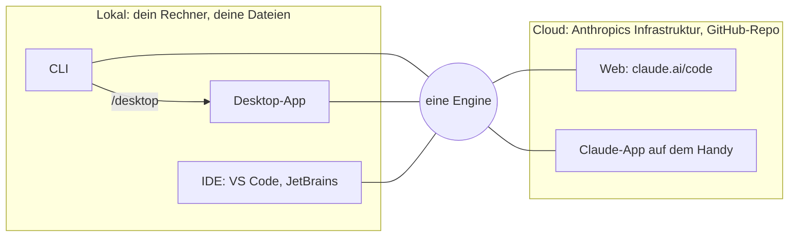

# S1.3 · Die Oberflächen: CLI, Desktop, IDE, Web, iOS

<!-- meta:start -->
> **Regal:** [Erste Schritte & Denkmodell](README.md#start) · **Stufe:** Kern · **~10 Min** · **Voraussetzungen:** [S1.2 Coding-Agent statt Chat: das Denkmodell](s1-02-agent-statt-chat.md)
>
> ← [S1.2 Coding-Agent statt Chat: das Denkmodell](s1-02-agent-statt-chat.md) · [Bibliothek](README.md) · [S1.4 Eingebaute Werkzeuge und ihre Namen](s1-04-werkzeuge.md) →
<!-- meta:end -->

## Schnellcheck

- Hast du Claude Code schon in mindestens zwei verschiedenen Oberflächen genutzt, etwa CLI und IDE oder Desktop?
- Kannst du ohne Nachschlagen sagen, welche Oberflächen lokal auf deinem Rechner arbeiten und welche in der Cloud laufen?

## Auf einen Blick

Claude Code läuft überall mit derselben Engine, nur die Oberfläche wechselt. CLI, Desktop-App und IDE-Erweiterung arbeiten lokal mit deinen Dateien. Web (claude.ai/code) und die Claude-App auf dem Handy arbeiten mit Sitzungen in der Cloud, die an einem GitHub-Repository hängen statt an deinem Dateisystem.

Die wichtigste Frage bei jeder Oberfläche lautet deshalb: Wo arbeitet sie, bei dir oder in der Cloud?

## Bild im Kopf

Es bleibt derselbe Berater wie in S1.2, nur sein Arbeitsplatz ändert sich. In der CLI steht er an deinem Terminal, in der Desktop-App sitzt er an einem Schreibtisch in deinem Büro, in der IDE am Nachbartisch mit Blick auf deinen Editor. In allen drei Fällen ist er in deinem Gebäude und arbeitet an deinen Sachen.

Über Web und Handy erreichst du einen Berater in einem anderen Gebäude. Er sieht nur, was du ihm dorthin gegeben hast: das Repository auf GitHub. Was nur auf deinem Laptop liegt, kennt er nicht.



## Im Detail

### Welche Oberfläche wofür?

| Oberfläche | Wo sie arbeitet | Passt, wenn … |
|---|---|---|
| CLI | lokal, im Terminal | du im Terminal arbeitest oder Abläufe skripten willst |
| Desktop-App | lokal, grafisch | du lieber mit einer grafischen Oberfläche als mit einem Terminal arbeitest |
| IDE (VS Code, JetBrains) | lokal, im Editor | du im Editor bleiben und mit Claude pair-programmieren willst |
| Web (claude.ai/code) | Cloud, mit GitHub-Repo | du lange Aufgaben verfolgen willst, ohne am Laptop zu sitzen |
| Claude-App auf dem Handy | Cloud, mit GitHub-Repo | du unterwegs den Stand prüfen oder einen PR-Review anstoßen willst |

Der Chat auf claude.ai steht nicht in der Tabelle: Er berät nur ([S1.2](s1-02-agent-statt-chat.md)).

### Die lokalen Oberflächen

**CLI.** Der Terminalbefehl `claude`, mit dem du in [S1.1](s1-01-erster-kontakt.md) gearbeitet hast. Mit ihr baust du Claude Code auch in Skripte ein ([S4.3](s4-03-headless.md)); die Desktop-App kann das nicht.

**Desktop-App.** Dieselbe Engine mit grafischer Oberfläche, für macOS und Windows, für Linux als Beta. Praktisch, wenn du Änderungen lieber in einer Diff-Ansicht prüfst als im Terminal.

**IDE-Erweiterungen.** Es gibt die offizielle **VS-Code-Erweiterung** (aus dem Marketplace) und das **JetBrains-Plugin** (u. a. für IntelliJ IDEA, PyCharm, WebStorm und GoLand). In VS Code läuft Claude Code als Panel im Editor; unten im Eingabefeld zeigt eine Modusanzeige den aktuellen Rechte-Modus, und ein Klick darauf schaltet um. Das JetBrains-Plugin startet `claude` im integrierten Terminal der IDE; dort schaltest du die Modi wie in der CLI mit Shift+Tab um ([S1.6](s1-06-rechte-modi.md)). Die Erweiterung kennt deine offenen Dateien und den Projektzusammenhang, schaut dir aber nicht bei jedem Tastendruck zu.

### Web und Handy: Claude Code in der Cloud

Claude Code gibt es im Browser auf **claude.ai/code** und im Tab **Code** der Claude-App auf iPhone und iPad. Eine eigene Claude-Code-App gibt es nicht, und die Claude-App gibt es auch für Android. Beide Wege starten Sitzungen standardmäßig auf Anthropics Infrastruktur, verbunden mit einem GitHub-Repository statt mit deinem lokalen Dateisystem.

Nützlich ist das, um den Stand langer Aufgaben zu prüfen, während du nicht am Laptop bist, oder um vom Handy aus einen PR-Review anzustoßen. In Cloud-Sitzungen stehen nicht alle Rechte-Modi zur Verfügung; welche es sind, steht in [S1.6](s1-06-rechte-modi.md).

### Zwischen Oberflächen wechseln

Du musst dich nicht festlegen. Aus einer laufenden Terminal-Sitzung heraus übergibt `/desktop` das Gespräch an die Desktop-App.

<!-- cockpit:example -->
```
claude
# inside the running session:
/desktop   # continue this session in the Desktop app (macOS or x64 Windows, Claude subscription)
/mobile    # show a QR code to install the Claude app on your phone
```

Zwei Befehle klingen nach Oberflächenwechsel, sind aber keiner:

- `/mobile` zeigt nur einen QR-Code, über den du die Claude-App aufs Handy holst (Aliase `/ios` und `/android`). Die Sitzung wandert dabei nicht mit.
- `/chrome` richtet Claude in Chrome ein, die Browser-Steuerung für Web-Tests. Mit claude.ai/code hat der Befehl nichts zu tun.

Willst du eine lokale Sitzung unterwegs weiterführen, machst du sie vorher mit `/remote-control` erreichbar. Eine Cloud-Sitzung holst du umgekehrt mit `/teleport` ins Terminal. Beides behandelt [S4.6](s4-06-remote-und-teleport.md).

## Selbst machen

### Übung: deine Wechselmöglichkeiten finden (etwa 5 Minuten)

**Ziel:** Du weißt, welche Wechsel dir auf deinem Rechner offenstehen, und ordnest drei Situationen der passenden Oberfläche zu.

**Startzustand:** eine Sitzung im Ordner `~/cc-workshop/hello`, gestartet mit `claude --permission-mode default`.

1. Gib `/desk` ein, ohne Enter zu drücken. Claude Code zeigt die passenden Befehle. Steht `/desktop` in der Liste? Der Befehl erscheint nur unter macOS und x64-Windows und nur mit einem Claude-Abo. Lösch die Eingabe wieder.
2. Gib `/mobile` ein und drück Enter. Du siehst einen QR-Code, mehr nicht. `Esc` schließt die Anzeige; deine Sitzung läuft unverändert im Terminal weiter.
3. Ordne zu: Welche Oberfläche nimmst du?
   - a) Du willst ein Skript schreiben, das jede Nacht einen Bericht mit Claude Code erzeugt.
   - b) Im Zug willst du am Handy sehen, wie weit eine lange Aufgabe an eurem Team-Repository ist.
   - c) Du arbeitest in PyCharm und willst für eine Rückfrage an Claude das Fenster nicht verlassen.

<details><summary>Vergleich für Schritt 3</summary>

- a) Die CLI: Mit ihr baust du Claude Code in Skripte ein.
- b) Die Claude-App auf dem Handy oder claude.ai/code: Beide zeigen Cloud-Sitzungen, die an einem GitHub-Repository hängen.
- c) Das JetBrains-Plugin: Es startet `claude` im Terminal der IDE und kennt deine offenen Dateien.

</details>

**Geschafft, wenn:**

- [ ] du weißt, ob `/desktop` auf deinem Rechner erscheint, und den Grund nennen kannst
- [ ] du gesehen hast, dass `/mobile` nur einen QR-Code zeigt
- [ ] deine drei Zuordnungen zum Vergleich passen oder du deine Abweichung begründen kannst

## Typische Fallen

- **`/desktop` fehlt in der Befehlsliste.** Der Befehl erscheint nur unter macOS und x64-Windows und nur, wenn du mit einem Claude-Abo angemeldet bist.
- **In der Web-Sitzung fehlen deine lokalen Dateien.** Cloud-Sitzungen arbeiten mit einem GitHub-Repository, nicht mit deinem Rechner. Was nicht im Repository liegt, sieht Claude dort nicht.

## Check

Du kannst für eine Arbeitssituation die passende Oberfläche wählen, sagen, welche lokal und welche in der Cloud arbeitet, und den Befehl nennen, der eine Terminal-Sitzung an die Desktop-App übergibt.

1. Welche Oberflächen arbeiten mit deinem lokalen Dateisystem, welche mit einem GitHub-Repository in der Cloud?
2. Was tun `/mobile` und `/chrome` wirklich?
3. Welcher Befehl übergibt eine laufende Terminal-Sitzung an die Desktop-App, und unter welchen Voraussetzungen gibt es ihn?

<details><summary>Auflösung</summary>

1. Lokal arbeiten CLI, Desktop-App und IDE-Erweiterung. Web (claude.ai/code) und die Claude-App auf dem Handy arbeiten in der Cloud mit einem GitHub-Repository.
2. `/mobile` zeigt einen QR-Code, über den du die Claude-App aufs Handy holst; die Sitzung wandert nicht mit. `/chrome` richtet die Browser-Steuerung in Chrome ein und hat mit claude.ai/code nichts zu tun.
3. `/desktop`. Der Befehl erscheint nur unter macOS und x64-Windows und nur, wenn du mit einem Claude-Abo angemeldet bist.

</details>

<details><summary>Quizfrage</summary>

**Frage:** Du hast in der CLI ein langes Refactoring begonnen und willst die Diffs lieber grafisch prüfen. Welcher Befehl bringt dich am direktesten dorthin?

- **Richtig:** `/desktop`: Er übergibt die laufende Sitzung an die Desktop-App, unter macOS oder x64-Windows mit Claude-Abo.
- Falsch: `/teleport`: Er schiebt die laufende Terminal-Sitzung in die Desktop-App und öffnet dort die Diff-Ansicht.
- Falsch: `/mobile`: Er schiebt die laufende Sitzung auf dein Handy, sofern dort die Claude-App angemeldet ist.
- Falsch: `/chrome`: Er öffnet die laufende Sitzung mit grafischem Diff im Browser auf claude.ai/code.

</details>

## Weiterlesen

- [Plattformen und Integrationen](https://code.claude.com/docs/en/platforms)
- [Befehlsreferenz](https://code.claude.com/docs/en/commands)
- [Desktop-App](https://code.claude.com/docs/en/desktop) · [VS Code](https://code.claude.com/docs/en/vs-code) · [JetBrains](https://code.claude.com/docs/en/jetbrains)
- [Claude Code in der Cloud](https://code.claude.com/docs/en/claude-code-on-the-web) · [Claude Code auf dem Handy](https://code.claude.com/docs/en/mobile)
- [S1.2 · Coding-Agent statt Chat: das Denkmodell](s1-02-agent-statt-chat.md)
- [S1.6 · Alle Rechte-Modi im Überblick](s1-06-rechte-modi.md)
- [S4.6 · Unterwegs: Remote Control und /teleport](s4-06-remote-und-teleport.md)
