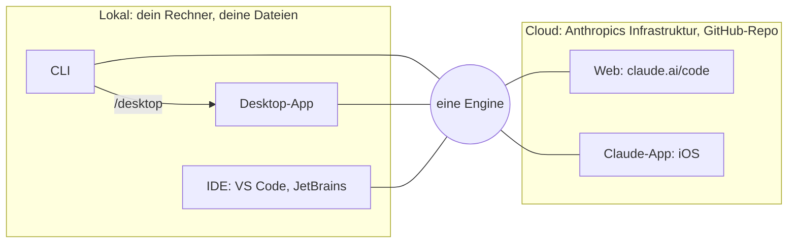

# S1.3 · Die Oberflächen: CLI, Desktop, IDE, Web, iOS

<!-- meta:start -->
> **Regal:** [Erste Schritte & Denkmodell](README.md#start) · **Stufe:** Kern · **~12 Min** · **Voraussetzungen:** [S1.2 Coding-Agent statt Chat: das Denkmodell](s1-02-agent-statt-chat.md)
>
> ← [S1.2 Coding-Agent statt Chat: das Denkmodell](s1-02-agent-statt-chat.md) · [Bibliothek](README.md) · [S1.4 Eingebaute Werkzeuge und ihre Namen](s1-04-werkzeuge.md) →
<!-- meta:end -->

## Schnellcheck

- Hast du Claude Code schon in mindestens zwei verschiedenen Oberflächen genutzt, etwa CLI und IDE oder Desktop?
- Kannst du ohne Nachschlagen sagen, welche Oberflächen lokal auf deinem Rechner arbeiten und welche in der Cloud laufen?

## Auf einen Blick

Claude Code läuft überall mit derselben Engine, nur die Oberfläche wechselt. CLI, Desktop-App und IDE-Erweiterung arbeiten lokal mit deinen Dateien; Web (claude.ai/code) und die Claude-App auf dem Handy arbeiten mit Sitzungen in der Cloud, die an einem GitHub-Repository hängen statt an deinem Dateisystem. Der Chat auf claude.ai gehört nicht dazu: Er berät nur.

## Bild im Kopf

Es bleibt derselbe Berater mit Ausweis wie in S1.2, nur sein Arbeitsplatz ändert sich. In der CLI steht er am Terminal, in der Desktop-App sitzt er an einem richtigen Schreibtisch mit Monitor, in der IDE sitzt er direkt neben dir, und über Web und Handy erreichst du ihn von unterwegs.

**Desktop-App: der Berater in deinem Büro, mit ordentlichem Schreibtisch.** Gleicher Experte, gleicher Ausweis, aber mit Stuhl und Monitor statt am Terminal. Die Arbeit ist dieselbe: Dateizugriff, Befehle, Git. Die Oberfläche ist nur bequemer. Manche Berater arbeiten lieber am Stehpult (CLI), andere lieber im Sessel (Desktop-App). Fähigkeit: wie die CLI, andere Hülle, dieselbe Engine.

**IDE-Erweiterung: der Berater am Nachbartisch.** Er sieht deinen Editor, deine offenen Dateien, deine Projektstruktur. Wenn du fragst, ändert er direkt. Er schaut nicht jedem Tastendruck zu, kennt aber den Zusammenhang, an dem du arbeitest, und springt ein, wenn du ihn rufst. Fähigkeit: Dateikontext, direkte Änderungen, Vorschläge mit Blick aufs Projekt.

**Web und Handy: der Berater, den du von unterwegs erreichst.** Er arbeitet nicht in deinem Gebäude, sondern auf Anthropics Infrastruktur.



## Im Detail

### Zum Vergleich: der Chat auf claude.ai

Den Browser-Chat kennst du vielleicht schon. Du tippst, Claude antwortet. Dateien teilst du, indem du sie von Hand hochlädst. Claude liest und denkt mit, kann aber keinen Code ausführen, keine Dateien schreiben und nicht direkt auf dein System zugreifen. Das ist eine Beratungsoberfläche: Claude gibt Rat, du setzt ihn selbst um. Zu den Oberflächen von Claude Code zählt der Chat deshalb nicht.

### CLI

Installiert als Terminalbefehl `claude`. Startest du ihn, bekommst du eine interaktive Sitzung, in der Claude in deinem Arbeitsverzeichnis Dateien liest und schreibt, Shell-Befehle für dich ausführt, mit Git arbeitet (Commits, Branches, PRs), im Web sucht, über MCP (Model Context Protocol) externe Werkzeuge anspricht, für komplexe Aufgaben parallele Subagenten startet und sich über Sitzungen hinweg erinnert. Das ist kein Chatfenster, sondern ein Agent, der in deiner Umgebung arbeitet. Die Fähigkeiten einzeln erklärt: [S1.1](s1-01-erster-kontakt.md).

### Desktop-App

Claude Code gibt es auch als Desktop-App (macOS und Windows, Linux als Beta). Sie nutzt dieselbe Engine wie die CLI, mit Dateizugriff, Befehlsausführung und Git, aber mit einer grafischen Oberfläche auf deinem eigenen Rechner. Praktisch für alle, die lieber mit Fenstern als mit einem Terminal arbeiten. Einige reine CLI-Funktionen fehlen dafür, etwa Skripting und das Agent SDK. Die Web-App auf claude.ai/code ist etwas anderes; sie läuft in der Cloud (siehe unten).

### IDE-Erweiterungen: VS Code und JetBrains

Es gibt die offizielle **VS-Code-Erweiterung** (aus dem Marketplace) und das **JetBrains-Plugin** (u. a. für IntelliJ IDEA, PyCharm, WebStorm und GoLand). Beide nutzen dieselbe Engine wie die CLI. In VS Code läuft Claude Code als Panel im Editor; unten im Eingabefeld zeigt eine Modusanzeige den aktuellen Rechte-Modus, und ein Klick darauf schaltet um. Das JetBrains-Plugin startet `claude` im integrierten Terminal der IDE und verbindet sich damit; dort schaltest du die Modi wie in der CLI mit Shift+Tab um ([S1.6](s1-06-rechte-modi.md)).

Die Erweiterung kennt deine offenen Dateien und den Projektzusammenhang und kann direkt ändern, schaut dir aber nicht bei jedem Tastendruck in Echtzeit zu. Das ist eine Oberfläche fürs Pair Programming.

### Web und iOS: Claude Code in der Cloud

Claude Code gibt es auch in der Cloud: im Browser auf **claude.ai/code** (Web) und im Tab **Code** der Claude-App auf iPhone und iPad. Eine eigene Claude-Code-App gibt es nicht, und die Claude-App gibt es auch für Android. Beide Wege starten Sitzungen standardmäßig auf Anthropics Infrastruktur, verbunden mit einem GitHub-Repository statt mit deinem lokalen Dateisystem.

Nützlich ist das, um den Stand langer Aufgaben zu prüfen, während du nicht am Laptop bist, um vom Handy aus einen PR-Review anzustoßen und um von mehreren Geräten aus an derselben Sitzung zu arbeiten. In Cloud-Sitzungen stehen nicht alle Rechte-Modi zur Verfügung; welche es sind, steht in [S1.6](s1-06-rechte-modi.md).

### Zwischen Oberflächen wechseln

Du musst dich nicht auf eine Oberfläche festlegen. Aus einer laufenden Terminal-Sitzung heraus übergibt `/desktop` das Gespräch an die Desktop-App, wo du zum Beispiel Diffs grafisch prüfst.

<!-- cockpit:example -->
```
claude
# inside the running session:
/desktop   # continue this session in the Desktop app (macOS or x64 Windows, Claude subscription)
/mobile    # show a QR code to install the Claude app on your phone
```

Zwei Befehle klingen nach Oberflächenwechsel, sind aber keiner:

- `/mobile` zeigt nur einen QR-Code, über den du die Claude-App aufs Handy holst (Aliase `/ios` und `/android`). Die Sitzung wandert dabei nicht mit.
- `/chrome` richtet Claude in Chrome ein, die Browser-Steuerung für Web-Tests. Mit claude.ai/code hat der Befehl nichts zu tun.

Willst du eine lokale Sitzung unterwegs am Handy oder in einem Browser weiterführen, machst du sie vorher mit Remote Control erreichbar (`/remote-control`). Eine Cloud-Sitzung holst du umgekehrt mit `/teleport` ins Terminal. Beides behandelt [S4.6](s4-06-remote-und-teleport.md).

### Welche Oberfläche wofür?

| Oberfläche | Wo sie arbeitet | Passt, wenn … |
|---|---|---|
| CLI | lokal, im Terminal | du im Terminal arbeitest oder Abläufe skripten willst |
| Desktop-App | lokal, grafisch | du lieber mit einer grafischen Oberfläche als mit einem Terminal arbeitest |
| IDE (VS Code, JetBrains) | lokal, im Editor | du im Editor bleiben und mit Claude pair-programmieren willst |
| Web (claude.ai/code) | Cloud, mit GitHub-Repo | du lange Aufgaben verfolgen willst, ohne am Laptop zu sitzen |
| iOS (Claude-App) | Cloud, mit GitHub-Repo | du unterwegs den Stand prüfen oder einen PR-Review anstoßen willst |

## Typische Fallen

- **`/desktop` fehlt in der Befehlsliste.** Der Befehl erscheint nur unter macOS und x64-Windows und nur, wenn du mit einem Claude-Abo angemeldet bist.
- **In der Web-Sitzung fehlen deine lokalen Dateien.** Cloud-Sitzungen arbeiten mit einem GitHub-Repository, nicht mit deinem Rechner. Was nicht im Repository liegt, sieht Claude dort nicht.

## Check

Du kannst für eine Arbeitssituation die passende Oberfläche wählen, sagen, welche lokal und welche in der Cloud arbeitet, und eine Terminal-Sitzung mit `/desktop` an die Desktop-App übergeben.

1. Welche Oberflächen arbeiten mit deinem lokalen Dateisystem, welche mit einem GitHub-Repository in der Cloud?
2. Was tun `/mobile` und `/chrome` wirklich?
3. Warum zählt der Chat auf claude.ai nicht zu den Oberflächen von Claude Code?

<details><summary>Quizfrage</summary>

**Frage:** Du hast in der CLI ein langes Refactoring begonnen und willst die Diffs lieber grafisch prüfen. Welcher Befehl bringt dich am direktesten dorthin?

- **Richtig:** `/desktop`: Er übergibt die laufende Sitzung an die Desktop-App, unter macOS oder x64-Windows mit Claude-Abo.
- Falsch: `/mobile`: Er schiebt die laufende Sitzung auf dein Handy, sofern dort die Claude-App angemeldet ist.
- Falsch: `/chrome`: Er öffnet die Sitzung mit grafischem Diff auf claude.ai/code, sofern Chrome dein Standardbrowser ist.
- Falsch: `/permissions`: Er schaltet die Ansicht um und zeigt alle Änderungen der Sitzung als grafischen Diff im Terminal.

</details>

## Weiterlesen

- [Plattformen und Integrationen](https://code.claude.com/docs/en/platforms)
- [Befehlsreferenz](https://code.claude.com/docs/en/commands)
- [Desktop-App](https://code.claude.com/docs/en/desktop) · [VS Code](https://code.claude.com/docs/en/vs-code) · [JetBrains](https://code.claude.com/docs/en/jetbrains)
- [Claude Code in der Cloud](https://code.claude.com/docs/en/claude-code-on-the-web) · [Claude Code auf dem Handy](https://code.claude.com/docs/en/mobile)
- [S1.2 · Coding-Agent statt Chat: das Denkmodell](s1-02-agent-statt-chat.md)
- [S1.6 · Alle Rechte-Modi im Überblick](s1-06-rechte-modi.md)
- [S4.6 · Unterwegs: Remote Control und /teleport](s4-06-remote-und-teleport.md)
