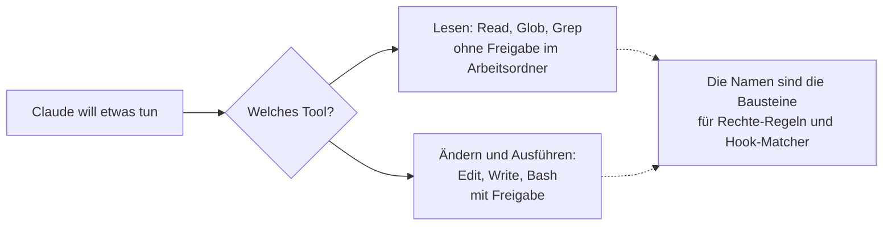

# S1.4 · Eingebaute Werkzeuge und ihre Namen

<!-- meta:start -->
> **Regal:** [Erste Schritte & Denkmodell](README.md#start) · **Stufe:** Kern · **~12 Min** · **Voraussetzungen:** [S1.1 Erster Kontakt: sofort eine Datei bauen](s1-01-erster-kontakt.md)
>
> ← [S1.3 Die Oberflächen: CLI, Desktop, IDE, Web, iOS](s1-03-oberflaechen.md) · [Bibliothek](README.md) · [S1.5 Rechte im Alltag: default und acceptEdits](s1-05-rechte-im-alltag.md) →
<!-- meta:end -->

## Schnellcheck

- Kannst du ohne Nachschlagen sagen, welche der Tools `Read`, `Glob`, `Grep`, `Edit`, `Write` und `Bash` eine Freigabe verlangen?
- Hast du in einer Sitzung schon einmal gesehen, welches Tool Claude gerade aufruft, und den Namen einer Rechte-Regel zuordnen können?

## Auf einen Blick

Claude Code arbeitet über Werkzeuge (Tools), und jedes hat einen festen Namen wie `Read`, `Edit` oder `Bash`. Genau diese Namen schreibst du später in Rechte-Regeln, Hook-Matcher und die Konfiguration von Agenten. Lesende Tools (`Read`, `Glob`, `Grep`) laufen in deinem Arbeitsordner ohne Rückfrage; ändernde und ausführende (`Edit`, `Write`, `Bash`) brauchen im Modus `default` deine Freigabe.

## Bild im Kopf

Jedes Tool ist eine eigene Zutrittszone. `Read` ist die Lobby: Da kommt jeder rein. `Bash` ist der Serverraum: Dafür brauchst du eine ausdrückliche Berechtigung. Wenn du Rechte (allow/deny-Regeln) oder Hook-Matcher einrichtest, sprichst du die Zonen mit genau diesen Namen an.



## Im Detail

### Die sechs Alltags-Werkzeuge

Claude Code arbeitet über **Tools**; jede Fähigkeit hat einen eigenen Tool-Namen. Diese Namen zählen für Rechte, Hooks und die Konfiguration von Agenten. Die folgenden sechs begegnen dir in den ersten Sitzungen, das ist der Alltagskern:

| Tool | Was es tut | Freigabe nötig? |
|------|------------|-----------------|
| `Read` | Dateien lesen | Nein |
| `Glob` | Dateien nach Muster finden | Nein |
| `Grep` | Dateiinhalte durchsuchen | Nein |
| `Edit` | Dateien gezielt ändern (eine Stelle ersetzen) | Ja |
| `Write` | Dateien anlegen oder überschreiben | Ja |
| `Bash` | Shell-Befehle ausführen | Ja |

Ob `Glob` und `Grep` bei dir überhaupt auftauchen, hängt vom Betriebssystem ab; siehe „Typische Fallen".

### Was „Freigabe nötig" genau heißt

Die Spalte gilt für den Modus `default` (in der Oberfläche „Manual") und für Pfade in deinem Arbeitsordner. Zwei Feinheiten: `Read`, `Glob` und `Grep` fragen trotzdem nach, wenn sie außerhalb des Arbeitsordners und der zusätzlich freigegebenen Ordner lesen sollen. `Bash` steht auf „Ja", führt aber eine eingebaute Liste reiner Lesebefehle ohne Rückfrage aus. Im Modus `auto` entscheidet ein Klassifikator statt dir über die meisten Rückfragen. Die Modi im Einzelnen: [S1.5](s1-05-rechte-im-alltag.md) und [S1.6](s1-06-rechte-modi.md).

### Wo du die Namen brauchst

Wenn du Rechte (allow/deny-Regeln) oder Hook-Matcher einrichtest, verwendest du genau diese Tool-Namen. Wie das aussieht, zeigen [S1.5](s1-05-rechte-im-alltag.md) für allow/deny-Regeln, [S2.8](s2-08-hook-einrichten.md) für Hook-Matcher und [S3.3](s3-03-eigener-subagent.md) für die Werkzeugliste eines eigenen Subagenten.

### Die übrigen Werkzeuge

Die vollständige Liste, mit `WebSearch`, `WebFetch`, `LSP`, `Skill`, `Agent`, `Monitor`, `AskUserQuestion`, `TaskCreate`/`TaskList`/`TaskUpdate`, `NotebookEdit`, `PowerShell` und weiteren, steht in der [offiziellen Tools-Referenz](https://code.claude.com/docs/en/tools-reference). Am ersten Tag brauchst du sie nicht. `Skill` und `Agent` lernst du ausführlich in [S2.1](s2-01-skills-und-commands.md) (Skills) und [S3.1](s3-01-was-ist-ein-agent.md) (Agenten) kennen.

## Selbst machen

### Beobachten: welche Tools Claude hat und nutzt

Frag Claude in einer laufenden Sitzung, welche Werkzeuge es gerade hat:

<!-- cockpit:example -->
```text
What tools do you have access to?
```

Claude antwortet mit einer Zusammenfassung in eigenen Worten. Vergleiche sie mit der Tabelle oben: Welche der sechs Alltags-Werkzeuge tauchen auf, welche fehlen? `/mcp` zeigt die verbundenen MCP-Server mit Status und Zahl ihrer Tools; aufrufbar sind diese Tools unter Namen der Form `mcp__<server>__<tool>`.

Lass Claude danach eine kleine Aufgabe erledigen, etwa die aus [S1.1](s1-01-erster-kontakt.md), und achte darauf, welches Tool es jeweils aufruft: zum Beispiel `Write` für die neue Datei und `Bash` zum Ausführen.

## Typische Fallen

- **Auf macOS, Linux und WSL tauchen `Glob` und `Grep` nicht auf.** Dort lässt Claude Code die beiden standardmäßig weg und sucht mit `find` und `grep` über das `Bash`-Tool. Diese Suchen kommen bei deinen Hooks und Rechte-Regeln als `Bash`-Aufrufe an. Unter Windows gehören `Glob` und `Grep` zum Standard.
- **Unter Windows laufen Shell-Befehle oft über `PowerShell`, nicht über `Bash`.** Ohne Git Bash ist das Tool `PowerShell` automatisch aktiv, und `Bash` gibt es gar nicht. Mit Git Bash ist `PowerShell` für claude.ai- und Console-Konten standardmäßig an, und Claude nimmt es dann als Haupt-Shell. Ein Hook, der nur auf `Bash` matcht, verpasst diese Aufrufe; Hooks für Shell-Befehle matchen deshalb `Bash|PowerShell`.

## Check

Du kannst die sechs Alltags-Werkzeuge mit exaktem Namen nennen, sagen, welche eine Freigabe brauchen, und erklären, wo du diese Namen später einsetzt.

1. Welche drei Alltags-Werkzeuge lesen nur, welche drei ändern oder führen aus?
2. In welchen zwei Fällen weicht das Verhalten von der Spalte „Freigabe nötig?" ab?
3. Warum sieht ein Hook auf `Grep` unter macOS keine Suchaufrufe?

<details><summary>Quizfrage</summary>

**Frage:** Warum schreibst du in Rechte-Regeln die exakten Werkzeugnamen wie `Bash`, `Write` oder `Edit` statt Beschreibungen wie „Dateisystem" oder „Ausführung"?

- **Richtig:** Rechte-Regeln, Hook-Matcher und Werkzeuglisten von Subagenten arbeiten mit genau diesen Namen, nicht mit Kategorien.
- Falsch: Nur MCP-Tools brauchen exakte Namen; eingebaute Werkzeuge erkennt Claude Code auch über Kategorien wie „Dateisystem".
- Falsch: Die Namen folgen einem externen Standard für Funktionsaufrufe, ein abweichender Name führt deshalb zu einem API-Fehler.
- Falsch: Beschreibungen wie „Dateisystem" funktionieren nur in `CLAUDE.local.md`; in `settings.json` gehen nur die Werkzeugnamen.

</details>

## Weiterlesen

- [Tools-Referenz](https://code.claude.com/docs/en/tools-reference)
- [S1.1 · Erster Kontakt: sofort eine Datei bauen](s1-01-erster-kontakt.md)
- [S1.5 · Rechte im Alltag: default und acceptEdits](s1-05-rechte-im-alltag.md)
- [S1.6 · Alle Rechte-Modi im Überblick](s1-06-rechte-modi.md)
- [S2.8 · Einen Hook einrichten, der wirklich blockt](s2-08-hook-einrichten.md)
- [S4.9 · Fehlersuche: /debug, --verbose, /doctor](s4-09-fehlersuche-werkzeuge.md)
