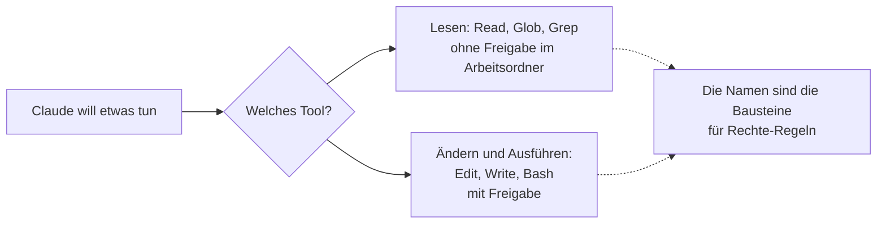

# S1.4 · Eingebaute Werkzeuge und ihre Namen

<!-- meta:start -->
> **Regal:** [Erste Schritte & Denkmodell](README.md#start) · **Stufe:** Kern · **~10 Min** · **Voraussetzungen:** [S1.1 Erster Kontakt: sofort eine Datei bauen](s1-01-erster-kontakt.md)
>
> ← [S1.3 Die Oberflächen: CLI, Desktop, IDE, Web, iOS](s1-03-oberflaechen.md) · [Bibliothek](README.md) · [S1.5 Rechte im Alltag: default und acceptEdits](s1-05-rechte-im-alltag.md) →
<!-- meta:end -->

## Schnellcheck

- Kannst du ohne Nachschlagen sagen, welche der Tools `Read`, `Glob`, `Grep`, `Edit`, `Write` und `Bash` eine Freigabe verlangen?
- Hast du in einer Sitzung schon einmal das ausführliche Transkript geöffnet und abgelesen, welches Tool Claude gerade aufgerufen hat?

## Auf einen Blick

Claude Code arbeitet über Werkzeuge (Tools), und jedes hat einen festen Namen wie `Read`, `Edit` oder `Bash`. Lesende Tools (`Read`, `Glob`, `Grep`) laufen in deinem Arbeitsordner ohne Rückfrage; ändernde und ausführende (`Edit`, `Write`, `Bash`) brauchen im Modus `default` deine Freigabe.

Die Namen sind mehr als Etiketten: Mit genau diesen Namen schreibst du später Rechte-Regeln ([S1.5](s1-05-rechte-im-alltag.md)).

## Bild im Kopf

Jedes Tool ist eine eigene Zutrittszone. `Read` ist die Lobby: Da kommt jeder rein. `Bash` ist der Serverraum: Dafür brauchst du eine ausdrückliche Berechtigung. Und wie an jeder Tür ein Schild hängt, hat jede Zone einen festen Namen, mit dem du sie später in Regeln ansprichst.



## Im Detail

### Die Alltags-Werkzeuge

Diese Werkzeuge begegnen dir in den ersten Sitzungen:

| Tool | Was es tut | Freigabe nötig? |
|------|------------|-----------------|
| `Read` | Dateien lesen | Nein |
| `Glob` | Dateien nach Muster finden | Nein |
| `Grep` | Dateiinhalte durchsuchen | Nein |
| `Edit` | Dateien gezielt ändern (eine Stelle ersetzen) | Ja |
| `Write` | Dateien anlegen oder überschreiben | Ja |
| `Bash` | Shell-Befehle ausführen | Ja |
| `PowerShell` | Shell-Befehle unter Windows ausführen | Ja |

Welche davon bei dir auftauchen, hängt vom Betriebssystem ab:

- **macOS, Linux, WSL:** `Glob` und `Grep` fehlen standardmäßig. Claude sucht dort mit `find` und `grep` über das `Bash`-Tool.
- **Windows:** `Glob` und `Grep` gehören zum Standard. Ohne Git for Windows laufen Shell-Befehle über `PowerShell`. Mit Git for Windows gibt es `Bash`, und für Konten mit Claude-Abo oder Console-Key bleibt `PowerShell` daneben eingeschaltet.

### Was „Freigabe nötig“ genau heißt

Die Spalte gilt für den Modus `default` und für Pfade in deinem Arbeitsordner. Drei Abweichungen solltest du kennen:

- `Read`, `Glob` und `Grep` fragen doch nach, wenn sie **außerhalb des Arbeitsordners** lesen sollen.
- `Bash` führt eine eingebaute Liste **reiner Lesebefehle** ohne Rückfrage aus, etwa `ls` oder `cat`.
- In anderen **Rechte-Modi** verschiebt sich, wer entscheidet. Die Modi stehen in [S1.5](s1-05-rechte-im-alltag.md) und [S1.6](s1-06-rechte-modi.md).

### Wo du die Namen siehst

In der normalen Ansicht fasst Claude Code vieles zusammen: „Read 1 file“, „Ran 1 shell command“. Die genauen Aufrufe zeigt das ausführliche Transkript. `Ctrl+O` schaltet es ein und wieder aus. Dort steht jeder Aufruf mit Name und Argument, etwa `Write(notes.txt)` oder `Bash(wc -l notes.txt)`.

Auch die Rückfrage nennt das Werkzeug: Über einem Shell-Befehl steht „Bash command“ (für das PowerShell-Tool die Entsprechung), über einer neuen Datei „Create file“.

### Weitere Werkzeuge

Claude Code hat mehr Werkzeuge, etwa `WebSearch` und `WebFetch` fürs Netz, `Agent` für Helfer ([S3.1](s3-01-was-ist-ein-agent.md)) und `Skill` ([S2.1](s2-01-skills-und-commands.md)). Die vollständige Liste steht in der [offiziellen Tools-Referenz](https://code.claude.com/docs/en/tools-reference). Am ersten Tag brauchst du sie nicht.

## Selbst machen

### Übung: Werkzeuge im Transkript ablesen (etwa 5 Minuten)

**Ziel:** Du liest im Transkript ab, welche Werkzeuge Claude für eine kleine Aufgabe aufruft, und gleichst mit der Tabelle ab, welches gefragt hat.

**Startzustand:** eine Sitzung im Ordner `~/cc-workshop/hello`, gestartet mit `claude --permission-mode default`.

1. Gib diesen Auftrag ein und beantworte jede Rückfrage mit „Yes“. Zähl mit, wie oft Claude fragt:

<!-- cockpit:example -->
```text
Create notes.txt with three short lines. Then read it back and count its lines with a shell command.
```

2. Drück `Ctrl+O`. Das ausführliche Transkript zeigt jeden Aufruf mit Namen.
3. Schreib die Namen der Werkzeuge ab, die Claude benutzt hat, und notier zu jedem: Hat es gefragt?
4. Drück noch einmal `Ctrl+O`, um zur normalen Ansicht zurückzukehren.
5. Vergleich mit der Tabelle. Hat ein Werkzeug nicht gefragt, obwohl dort „Ja“ steht? Dann sieh dir den Befehl an: Stand er auf der Liste reiner Lesebefehle?

**Geschafft, wenn:**

- [ ] du mindestens zwei Werkzeugnamen aus deinem eigenen Transkript abgeschrieben hast
- [ ] du zu jedem sagen kannst, ob es eine Rückfrage ausgelöst hat
- [ ] du jede Abweichung von der Tabelle mit einer der drei Abweichungen erklären kannst

## Typische Fallen

- **Auf macOS, Linux und WSL tauchen `Glob` und `Grep` nicht auf.** Claude sucht dort über das `Bash`-Tool. Eine Regel, die du später für `Grep` schreibst, sieht diese Suchen nicht; sie kommen als `Bash`-Aufrufe an.
- **Unter Windows laufen Shell-Befehle oft über `PowerShell`, nicht über `Bash`.** Ohne Git for Windows gibt es `Bash` gar nicht. Eine Regel, die nur `Bash` nennt, greift dann nicht. Was du für Shell-Befehle festlegst, legst du deshalb für beide Werkzeuge fest.
- **Claudes Selbstauskunft für die Liste halten.** Auf die Frage `What tools do you have access to?` antwortet Claude mit einer Zusammenfassung in eigenen Worten. Verlässlich ist, was im Transkript steht.

## Check

Du kannst die Alltags-Werkzeuge mit exaktem Namen nennen, im Transkript ablesen, welches Claude nutzt, und sagen, welche eine Freigabe brauchen.

1. Welche drei Alltags-Werkzeuge lesen nur, und welche ändern oder führen aus?
2. In welchen drei Fällen weicht das Verhalten von der Spalte „Freigabe nötig?“ ab?
3. Warum taucht unter macOS in deinem Transkript kein `Grep`-Aufruf auf, obwohl Claude Dateien durchsucht?

<details><summary>Auflösung</summary>

1. `Read`, `Glob` und `Grep` lesen nur. `Edit` und `Write` ändern Dateien, `Bash` und unter Windows `PowerShell` führen Befehle aus.
2. Lesende Werkzeuge fragen, wenn sie außerhalb des Arbeitsordners lesen sollen. `Bash` führt reine Lesebefehle wie `ls` ohne Rückfrage aus. Und in anderen Rechte-Modi als `default` verschiebt sich, wer entscheidet.
3. Auf macOS, Linux und WSL fehlen `Glob` und `Grep` standardmäßig. Claude sucht dort mit `find` und `grep` über das `Bash`-Tool, die Suche erscheint also als `Bash`-Aufruf.

</details>

<details><summary>Quizfrage</summary>

**Frage:** Eine Sitzung läuft im Modus `default`. Claude will erst eine Datei in deinem Arbeitsordner lesen und danach eine Zeile darin ändern. Was passiert?

- **Richtig:** Das Lesen läuft ohne Rückfrage, vor der Änderung fragt Claude: `Read` braucht keine Freigabe, `Edit` schon.
- Falsch: Beides fragt nach, weil im Modus `default` ausnahmslos jeder Aufruf eines Werkzeugs deine Freigabe braucht.
- Falsch: Beides läuft ohne Rückfrage, weil du den Ordner beim Start im Vertrauensdialog als vertraut bestätigt hast.
- Falsch: Das Lesen fragt nach, die Änderung nicht, weil `Edit` nur eine Stelle ersetzt und nichts überschreibt.

</details>

## Weiterlesen

- [Tools-Referenz](https://code.claude.com/docs/en/tools-reference)
- [Interaktiver Modus: Tastenkürzel](https://code.claude.com/docs/en/interactive-mode)
- [S1.1 · Erster Kontakt: sofort eine Datei bauen](s1-01-erster-kontakt.md)
- [S1.5 · Rechte im Alltag: default und acceptEdits](s1-05-rechte-im-alltag.md)
- [S1.6 · Alle Rechte-Modi im Überblick](s1-06-rechte-modi.md)
- [S2.8 · Einen Hook einrichten, der wirklich blockt](s2-08-hook-einrichten.md)
