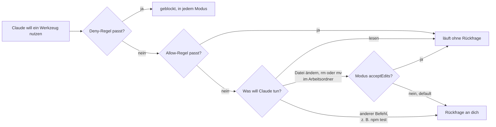

# S1.5 · Rechte im Alltag: default und acceptEdits

<!-- meta:start -->
> **Regal:** [Rechte & Freigaben](README.md#permissions) · **Stufe:** Kern · **~15 Min** · **Voraussetzungen:** [S1.2 Coding-Agent statt Chat: das Denkmodell](s1-02-agent-statt-chat.md) · 🛡 **Sicherheitsboden**
>
> ← [S1.4 Eingebaute Werkzeuge und ihre Namen](s1-04-werkzeuge.md) · [Bibliothek](README.md) · [S1.6 Alle Rechte-Modi im Überblick](s1-06-rechte-modi.md) →
<!-- meta:end -->

## Schnellcheck

- Hast du schon einmal eine Rückfrage von Claude Code bewusst abgelehnt oder eine Allow-Regel in `settings.json` angelegt?
- Kannst du ohne Nachschlagen sagen, was in `acceptEdits` ohne Rückfrage läuft und was weiter nachfragt?

## Auf einen Blick

Der Rechte-Modus legt fest, was Claude ohne Rückfrage tun darf, und jede Freigabe hat echte Folgen. In `default` (in der CLI „Manual" genannt) läuft nur Lesen ohne Rückfrage; `acceptEdits` nimmt zusätzlich Dateiänderungen und Dateisystem-Befehle im Arbeitsordner an, auch zerstörerische wie `rm` und `mv`. Gib Claude die kleinste Stufe, die für die Aufgabe reicht.

Neue interaktive Sitzungen starten in aktuellen Versionen nicht in `default`, sondern in `auto`, sofern er verfügbar ist ([S1.6](s1-06-rechte-modi.md)). Willst du jede Aktion selbst freigeben, startest du mit `claude --permission-mode default`. Allow- und Deny-Regeln in `settings.json` steuern einzelne Werkzeuge; eine Deny-Regel sperrt in jedem Modus.

## Bild im Kopf

Rechte-Modi sind Ausweisstufen an der Zutrittskontrolle. Der Besucherausweis (`default`) bringt dich durch die Lobby, aber nicht in den Serverraum: Lesen ist frei, für alles andere fragt der Empfang nach. Der Wartungsausweis (`acceptEdits`) öffnet zusätzlich die Technikräume, und dort darfst du auch Kabel abklemmen, ohne zu fragen: Dateisystem-Befehle wie `rm` laufen mit. Der Modus legt die Grundstufe fest; Allow- und Deny-Regeln schalten einzelne Türen frei oder sperren sie.

Jede Sitzung hat so eine Freigabestufe, und du entscheidest, was sie erreicht. Das Diagramm zeigt vereinfacht, wie Regeln und Modus zusammenspielen (Ask-Regeln: [S3.8](s3-08-rechte-fuer-autonomie.md), geschützte Pfade: [S3.9](s3-09-geschuetzte-pfade-und-sandbox.md)):



## Im Detail

### Least Privilege, eingebaut

Claude Code hat ein eingebautes Rechte-System, das steuert, welche Werkzeuge es ohne Rückfrage nutzen darf. Das ist Sicherheit nach dem Prinzip der geringsten Rechte (least privilege), das du aus der Zutrittskontrolle kennst. Welche Werkzeuge es gibt und welche davon eine Freigabe brauchen, steht in [S1.4](s1-04-werkzeuge.md). Die drei Alltagsmodi sind `default`, `acceptEdits` und `plan`; die Karte aller sechs Modi steht in [S1.6](s1-06-rechte-modi.md).

### default: jede Änderung fragt

- **Ohne Rückfrage:** Dateien im Arbeitsordner lesen und durchsuchen, dazu reine Lese-Befehle in der Shell.
- **Mit Rückfrage:** Dateien anlegen oder ändern, andere Shell-Befehle, Zugriffe aufs Netz.
- **Name:** In der CLI, in `claude --help`, in den Erweiterungen für VS Code und JetBrains und in der Desktop-App heißt der Modus **Manual**. In Einstellungen und Hooks bleibt der Wert `default`. Ab v2.1.200 akzeptiert die CLI auch `manual`, etwa `claude --permission-mode manual`.
- **Erkennen und starten:** Die Statusleiste zeigt `⏸ manual mode on`. Gezielt startest du mit `claude --permission-mode default`.

### acceptEdits: Dateiänderungen und Dateisystem-Befehle ohne Rückfrage

- **Ohne Rückfrage:** alles aus `default`, dazu Dateien anlegen und ändern im Arbeitsordner und gängige Dateisystem-Befehle wie `mkdir`, `touch`, `rm` und `mv`.
- **Achtung:** Das schließt zerstörerische `rm` und `mv` ein. Die vollständige Liste, die Windows-Variante und warum das bei langen Umbauten zählt, stehen in [S3.8](s3-08-rechte-fuer-autonomie.md).
- **Weiter mit Rückfrage:** alle anderen Shell-Befehle wie `npm test`, Pfade außerhalb des Arbeitsordners und geschützte Pfade wie `.git` ([S3.9](s3-09-geschuetzte-pfade-und-sandbox.md)).
- **Erkennen und starten:** Die Statusleiste zeigt `⏵⏵ accept edits on`. Von Manual aus drückst du einmal `Shift+Tab`, oder du startest mit `claude --permission-mode acceptEdits`.

`acceptEdits` passt, wenn du Änderungen lieber hinterher im Editor oder mit `git diff` prüfst, statt jede einzeln freizugeben.

### plan: erst lesen, dann freigeben

Im dritten Alltagsmodus liest und erkundet Claude und schreibt einen Plan, ändert aber nichts an deinem Code, bis du den Plan freigibst. Wie du damit arbeitest, steht in [S1.14](s1-14-plan-modus.md).

### Allow- und Deny-Regeln in settings.json

Der Modus setzt die Grundstufe. Mit Regeln in `settings.json` schaltest du einzelne Werkzeuge frei (`allow`: läuft ohne Rückfrage) oder sperrst sie (`deny`):

```json
{
  "permissions": {
    "allow": ["Read", "Glob", "Grep", "Bash(npm test)"],
    "deny": ["Bash(rm *)", "Bash(curl*)"]
  }
}
```

- `"Read"`, `"Glob"` und `"Grep"` meinen das ganze Werkzeug, `"Bash(npm test)"` genau diesen einen Befehl.
- `"Bash(rm *)"` trifft jeden Befehl, der mit `rm` und einem Leerzeichen beginnt. `"Bash(curl*)"` hat kein Leerzeichen vor dem `*` und trifft damit alles, was mit `curl` beginnt.
- Claude Code prüft zuerst `deny`, dann `ask`, dann `allow`; die erste passende Regel entscheidet. Eine Deny-Regel sperrt in jedem Modus. Das `rm`, das `acceptEdits` sonst still durchwinkt, wird mit dieser Datei also abgelehnt, in der Form, in der Claude es üblicherweise schreibt. Eine Bash-Regel prüft aber den Befehlstext, sie ist keine Grenze um das Programm: `/bin/rm …` oder `bash -c 'rm …'` trifft sie nicht. Unter Windows löscht Claude über das PowerShell-Tool; dafür ergänzt du `"PowerShell(Remove-Item *)"` (Aliase wie `rm` und `del` zählen mit). Muss eine Sperre wirklich halten, brauchst du Sandbox oder Hook ([S3.9](s3-09-geschuetzte-pfade-und-sandbox.md), [S2.8](s2-08-hook-einrichten.md)). Ask-Regeln lernst du in [S3.8](s3-08-rechte-fuer-autonomie.md) kennen.
- `/permissions` öffnet einen Dialog mit allen Regeln und der `settings.json`, aus der jede stammt. Dort kannst du Regeln auch anlegen und entfernen. Den Modus wechselt `/permissions` nicht.

Dieselbe Regel-Syntax nutzt auch das `if`-Feld von Hooks ([S2.8](s2-08-hook-einrichten.md)).

### Freigaben per Flag: --allowedTools

Beim Start geht es auch ohne Datei: `claude --allowedTools "Read,Glob,Grep"` lässt diese Werkzeuge ohne Rückfrage laufen. Das Flag schränkt nicht ein, welche Werkzeuge es überhaupt gibt; die übrigen bleiben verfügbar und fragen wie gewohnt. Willst du die Werkzeugliste wirklich begrenzen, nimmst du `--tools`.

## Selbst machen

### Übung: der Rückgängig-Reflex (2–3 Minuten, leicht)

**Ziel:** Den Reflex „Ich habe die Kontrolle" aufbauen, bevor echte Arbeit beginnt: Claude legt an, du verwirfst. Dabei siehst du, welcher Schritt in welchem Modus nachfragt.

**Analogie:** ein Probelauf der Türfreigabe auf dem Prüfstand. Du drückst, beobachtest und setzt zurück, bevor du eine echte Tür anfasst.

Starte in einem leeren Ordner zuerst in `default`, danach ein zweites Mal in `acceptEdits`:

<!-- cockpit:example -->
```bash
# Runde 1: jede Änderung selbst freigeben (Manual)
claude --permission-mode default

# Runde 2: Dateiänderungen und Dateisystem-Befehle laufen ohne Rückfrage
claude --permission-mode acceptEdits
```

Gib in jeder Runde nacheinander ein:

1. `Create junk.txt containing the word OOPS.`
2. `Show me its contents.`
3. `Delete junk.txt and confirm it's gone.`

Zähl, wie oft Claude Code nachfragt. Erwartet: In `default` fragen das Anlegen und das Löschen, das Anzeigen nicht. In `acceptEdits` laufen alle drei Schritte ohne Rückfrage, auch das Löschen.

**Erkenntnis:** Du behältst die Kontrolle, solange du zusiehst und prüfst. In `default` siehst du jede Änderung, bevor sie passiert; in `acceptEdits` erst danach, zum Beispiel mit `git diff`.

**Geschafft, wenn:**

- [ ] du in Runde 1 beide Rückfragen gesehen und bewusst beantwortet hast
- [ ] du in Runde 2 gesehen hast, dass auch das Löschen ohne Rückfrage lief
- [ ] `junk.txt` am Ende weg ist und du das selbst geprüft hast

## Typische Fallen

- **Die neue Sitzung fragt gar nicht mehr.** Sie läuft wahrscheinlich in `auto`, dem eingebauten Startmodus interaktiver Sitzungen in aktuellen Versionen. Die Statusleiste zeigt den Modus; mit `claude --permission-mode default` startest du in Manual ([S1.6](s1-06-rechte-modi.md)).
- **`/permissions` wechselt den Modus nicht.** Der Befehl verwaltet Allow-, Ask- und Deny-Regeln. Den Modus wechselst du mit `Shift+Tab` oder beim Start mit `--permission-mode`.
- **Die Allow-Regel greift nicht.** `Bash(npm test)` trifft genau `npm test`, nicht `npm test -v`. Für Varianten schreibst du `Bash(npm test *)`. Das Leerzeichen vor `*` zählt: `Bash(ls *)` trifft `ls -la`, aber nicht `lsof`; `Bash(ls*)` trifft beides.
- **Die Sperre für eine Datei greift nicht.** Pfad-Regeln für Dateien schreibst du als `Edit(…)` oder `Read(…)`. Eine Regel wie `Write(secrets/**)` nimmt Claude Code an, prüft sie aber nie; nimm `Edit(secrets/**)`.
- **Endlose Rückfragen in `default`.** Wechsle für die Aufgabe zu `acceptEdits`, lass dir mit `/fewer-permission-prompts` eine Allow-Liste für häufige Lese-Befehle vorschlagen oder schalte mit `/sandbox` die Sandbox ein ([S3.9](s3-09-geschuetzte-pfade-und-sandbox.md)).

## Check

Du kannst sagen, was `default` und `acceptEdits` ohne Rückfrage erlauben, eine Sitzung gezielt in einem der beiden Modi starten und eine Deny-Regel schreiben, die auch in `acceptEdits` hält.

1. Was läuft in `acceptEdits` ohne Rückfrage, das in `default` nachfragen würde, und was fragt in beiden Modi weiter?
2. In welchem Modus startet eine neue interaktive Sitzung ohne Flag, und wie startest du gezielt in Manual?
3. Warum hält `"deny": ["Bash(rm *)"]` auch in `acceptEdits`, und welche Formen des Löschens trifft die Regel nicht?

<details><summary>Quizfrage</summary>

**Frage:** Du startest mit `claude --permission-mode acceptEdits` und bittest Claude, im Projektordner `rm -rf build/` auszuführen. Du erwartest eine Rückfrage, weil „Bash ja noch fragt". Was passiert?

- **Richtig:** Keine Rückfrage: `acceptEdits` nimmt Dateisystem-Befehle wie `rm` und `mv` im Arbeitsordner automatisch an, auch zerstörerische.
- Falsch: Eine Rückfrage: `rm` gilt intern als Aufruf des Write-Werkzeugs, und Write fragt in `acceptEdits` jedes Mal einzeln nach.
- Falsch: Keine Rückfrage, weil `acceptEdits` ausnahmslos jeden Shell-Befehl ohne Nachfrage ausführt, auch `npm test` und `curl`.
- Falsch: Eine Rückfrage, weil du den Modus per Flag gesetzt hast; nur mit `Shift+Tab` gewählt gilt die Ausnahme für die Dateisystem-Befehle.

</details>

## Weiterlesen

- [Rechte-Modi (offizielle Doku)](https://code.claude.com/docs/en/permission-modes)
- [Rechte-Regeln und /permissions (offizielle Doku)](https://code.claude.com/docs/en/permissions)
- [S1.4 · Eingebaute Werkzeuge und ihre Namen](s1-04-werkzeuge.md)
- [S1.6 · Alle Rechte-Modi im Überblick](s1-06-rechte-modi.md)
- [S1.14 · Plan-Modus und schrittweises Vorgehen](s1-14-plan-modus.md)
- [S3.8 · Rechte für autonome Läufe](s3-08-rechte-fuer-autonomie.md)
- [S2.8 · Einen Hook einrichten, der wirklich blockt](s2-08-hook-einrichten.md), `if`-Filter mit derselben Regel-Syntax
