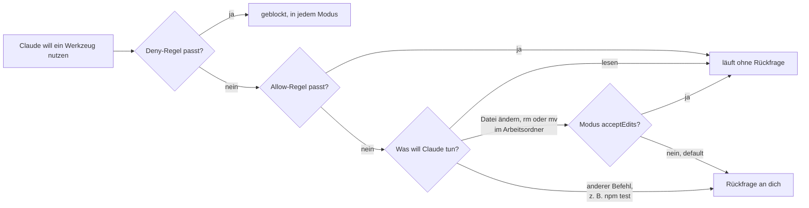

# S1.5 · Rechte im Alltag: default und acceptEdits

<!-- meta:start -->
> **Regal:** [Rechte & Freigaben](README.md#permissions) · **Stufe:** Kern · **~20 Min** · **Voraussetzungen:** [S1.2 Coding-Agent statt Chat: das Denkmodell](s1-02-agent-statt-chat.md) · 🛡 **Sicherheitsboden**
>
> ← [S1.4 Eingebaute Werkzeuge und ihre Namen](s1-04-werkzeuge.md) · [Bibliothek](README.md) · [S1.6 Alle Rechte-Modi im Überblick](s1-06-rechte-modi.md) →
<!-- meta:end -->

## Schnellcheck

- Hast du schon einmal eine Deny-Regel in einer `settings.json` angelegt und geprüft, dass sie greift?
- Kannst du ohne Nachschlagen sagen, was in `acceptEdits` ohne Rückfrage läuft und was weiter nachfragt?

## Auf einen Blick

Der Rechte-Modus legt fest, was Claude ohne Rückfrage tun darf. In `default` (in der Oberfläche „Manual“) läuft nur Lesen ohne Rückfrage; `acceptEdits` nimmt zusätzlich Dateiänderungen und Dateisystem-Befehle im Arbeitsordner an, auch zerstörerische wie `rm` und `mv`. Gib Claude die kleinste Stufe, die für die Aufgabe reicht.

Über jedem Modus liegen deine Regeln in `settings.json`: Eine Allow-Regel lässt ein Werkzeug oder einen Befehl ohne Rückfrage laufen, eine Deny-Regel sperrt ihn, in jedem Modus.

## Bild im Kopf

Rechte-Modi sind Ausweisstufen an der Zutrittskontrolle. Der Besucherausweis (`default`) bringt dich durch die Lobby, aber nicht in den Serverraum: Lesen ist frei, für alles andere fragt der Empfang nach. Der Wartungsausweis (`acceptEdits`) öffnet zusätzlich die Technikräume, und dort darfst du auch Kabel abklemmen, ohne zu fragen: Dateisystem-Befehle wie `rm` laufen mit. Der Modus legt die Grundstufe fest; Allow- und Deny-Regeln schalten einzelne Türen frei oder sperren sie.

Das Diagramm zeigt vereinfacht, wie Regeln und Modus zusammenspielen:



## Im Detail

### default: jede Änderung fragt

- **Ohne Rückfrage:** Dateien im Arbeitsordner lesen und durchsuchen, dazu reine Lesebefehle in der Shell ([S1.4](s1-04-werkzeuge.md)).
- **Mit Rückfrage:** Dateien anlegen oder ändern, andere Shell-Befehle, Zugriffe aufs Netz.
- **Name:** In der Oberfläche heißt der Modus **Manual**. In Einstellungen bleibt der Wert `default`; die CLI nimmt beides, also auch `claude --permission-mode manual`.
- **Erkennen und starten:** Die Statusleiste zeigt `⏸ manual mode on`. Gezielt startest du mit `claude --permission-mode default`.

### acceptEdits: Dateiänderungen und Dateisystem-Befehle ohne Rückfrage

- **Ohne Rückfrage:** alles aus `default`, dazu Dateien anlegen und ändern im Arbeitsordner und gängige Dateisystem-Befehle wie `mkdir`, `touch`, `rm` und `mv`. Unter Windows gilt dasselbe für die PowerShell-Befehle zum Schreiben und Löschen, etwa `Remove-Item`.
- **Achtung:** Das schließt zerstörerische `rm` und `mv` ein. Die vollständige Liste steht in [S3.8](s3-08-rechte-fuer-autonomie.md).
- **Weiter mit Rückfrage:** alle anderen Shell-Befehle wie `npm test`, Pfade außerhalb des Arbeitsordners und geschützte Pfade wie `.git` ([S3.9](s3-09-geschuetzte-pfade-und-sandbox.md)).
- **Erkennen und starten:** Die Statusleiste zeigt `⏵⏵ accept edits on`. Von Manual aus drückst du einmal `Shift+Tab`, oder du startest mit `claude --permission-mode acceptEdits`.

`acceptEdits` passt, wenn du Änderungen lieber hinterher im Editor oder mit `git diff` prüfst, statt jede einzeln freizugeben.

Zwei weitere Modi begegnen dir früh: `plan` lässt Claude erst lesen und einen Plan schreiben, bevor es etwas ändert ([S1.14](s1-14-plan-modus.md)). Und `auto` ist der Modus, in dem eine Sitzung ohne Flag startet ([S1.6](s1-06-rechte-modi.md)).

### Allow- und Deny-Regeln in settings.json

Der Modus setzt die Grundstufe. Mit Regeln schaltest du einzelne Werkzeuge frei (`allow`: läuft ohne Rückfrage) oder sperrst sie (`deny`). Für ein Projekt stehen sie in der Datei `.claude/settings.json` im Projektordner:

```json
{
  "permissions": {
    "allow": ["Read", "Glob", "Grep", "Bash(npm test)"],
    "deny": ["Bash(rm *)", "Bash(curl*)"]
  }
}
```

So liest du eine Regel:

- `"Read"` meint das ganze Werkzeug, `"Bash(npm test)"` genau diesen einen Befehl.
- `"Bash(rm *)"` trifft `rm` allein und jeden Befehl, der mit `rm` und einem Leerzeichen beginnt.
- `"Bash(curl*)"` hat kein Leerzeichen vor dem `*` und trifft alles, was mit `curl` beginnt.

So wirken Regeln:

- **Deny gewinnt.** Claude Code prüft zuerst `deny`, dann `ask`, dann `allow`; die erste passende Regel entscheidet. (Ask-Regeln lernst du in [S3.8](s3-08-rechte-fuer-autonomie.md) kennen.)
- **Deny gilt in jedem Modus.** Das `rm`, das `acceptEdits` sonst still durchwinkt, wird mit der Datei oben abgelehnt.
- **Unter Windows brauchst du die Regel zweimal.** Dort löscht Claude meist über das PowerShell-Tool. Ergänze `"PowerShell(Remove-Item *)"`; Aliase wie `rm` und `del` zählen mit.
- **Eine Bash-Regel prüft den Befehlstext.** Sie ist keine Mauer um das Programm: `/bin/rm …` oder `bash -c 'rm …'` trifft sie nicht. Muss eine Sperre wirklich halten, brauchst du eine Sandbox oder einen Hook ([S3.9](s3-09-geschuetzte-pfade-und-sandbox.md), [S2.8](s2-08-hook-einrichten.md)).

`/permissions` öffnet in der Sitzung einen Dialog mit allen Regeln, getrennt nach Allow, Ask und Deny. Dort kannst du Regeln auch anlegen und entfernen. Den Modus wechselt `/permissions` nicht.

### Freigaben per Flag

Beim Start geht es auch ohne Datei: `claude --allowedTools "Read,Glob,Grep"` lässt diese Werkzeuge ohne Rückfrage laufen. Das Flag schränkt nicht ein, welche Werkzeuge es gibt; die übrigen bleiben verfügbar und fragen wie gewohnt. Willst du die Werkzeugliste wirklich begrenzen, nimmst du `--tools`.

## Selbst machen

### Übung: zwei Modi, eine Sperre (etwa 10 Minuten)

**Ziel:** Du siehst an derselben kleinen Aufgabe, was `default` und `acceptEdits` unterscheidet, und schreibst eine Deny-Regel, die auch in `acceptEdits` hält.

**Startzustand:** ein neuer, leerer Ordner `~/cc-workshop/rechte`. Leg ihn an und wechsle hinein (`mkdir -p ~/cc-workshop/rechte && cd ~/cc-workshop/rechte`, in PowerShell `New-Item -ItemType Directory -Force "$HOME\cc-workshop\rechte"; Set-Location "$HOME\cc-workshop\rechte"`).

Die Übung hat drei Runden. Du startest Claude Code dreimal:

<!-- cockpit:example -->
```bash
# Runde 1: jede Änderung selbst freigeben (Manual)
claude --permission-mode default

# Runde 2: Dateiänderungen und Dateisystem-Befehle laufen ohne Rückfrage
claude --permission-mode acceptEdits
```

Gib in jeder Runde nacheinander diese drei Aufträge ein und zähl, wie oft Claude Code nachfragt:

1. `Create junk.txt containing the word OOPS.`
2. `Show me its contents.`
3. `Delete junk.txt and confirm it's gone.`

**Runde 1, `default`.** Erwartet: Das Anlegen und das Löschen fragen, das Anzeigen nicht. Beantworte beide Rückfragen mit „Yes“ und beende die Sitzung mit `/exit`.

**Runde 2, `acceptEdits`.** Erwartet: Alle drei Schritte laufen ohne Rückfrage, auch das Löschen. Beende die Sitzung.

**Runde 3, `acceptEdits` mit Sperre.** Leg im Übungsordner die Datei `.claude/settings.json` mit diesem Inhalt an (den Ordner `.claude` musst du vorher anlegen):

```json
{
  "permissions": {
    "deny": ["Bash(rm *)", "PowerShell(Remove-Item *)"]
  }
}
```

Starte wieder mit `claude --permission-mode acceptEdits` und gib die Aufträge 1 und 3 ein. Erwartet: Das Anlegen läuft, das Löschen wird abgelehnt. Claude meldet, dass der Befehl verweigert wurde, und `junk.txt` bleibt liegen. `/permissions` zeigt dir unter „Deny“ deine beiden Regeln.

**Aufräumen:** Beende die Sitzung und lösch den Ordner `~/cc-workshop/rechte` selbst. Die Regel gilt nur in diesem Ordner.

**Geschafft, wenn:**

- [ ] du in Runde 1 zwei Rückfragen gezählt und bewusst beantwortet hast
- [ ] du in Runde 2 gesehen hast, dass auch das Löschen ohne Rückfrage lief
- [ ] in Runde 3 das Löschen abgelehnt wurde und `junk.txt` noch da war
- [ ] du deine Regeln im Dialog von `/permissions` wiedergefunden hast

## Typische Fallen

- **Die neue Sitzung fragt gar nicht mehr.** Sie läuft wahrscheinlich in `auto`, dem eingebauten Startmodus interaktiver Sitzungen. Die Statusleiste zeigt den Modus; mit `claude --permission-mode default` startest du in Manual ([S1.6](s1-06-rechte-modi.md)).
- **`/permissions` wechselt den Modus nicht.** Der Befehl verwaltet Allow-, Ask- und Deny-Regeln. Den Modus wechselst du mit `Shift+Tab` oder beim Start mit `--permission-mode`.
- **Die Allow-Regel greift nicht.** `Bash(npm test)` trifft genau `npm test`, nicht `npm test -v`. Für Varianten schreibst du `Bash(npm test *)`. Das Leerzeichen vor `*` zählt: `Bash(ls *)` trifft `ls -la`, aber nicht `lsof`; `Bash(ls*)` trifft beides.
- **Die Sperre für eine Datei greift nicht.** Pfad-Regeln für Dateien schreibst du als `Edit(…)` oder `Read(…)`. Eine Regel wie `Write(secrets/**)` nimmt Claude Code an, prüft sie aber nie; nimm `Edit(secrets/**)`.
- **Endlose Rückfragen in `default`.** Wechsle für die Aufgabe zu `acceptEdits`, lass dir mit `/fewer-permission-prompts` eine Allow-Liste für häufige Lese-Befehle vorschlagen oder schalte mit `/sandbox` die Sandbox ein ([S3.9](s3-09-geschuetzte-pfade-und-sandbox.md)).

## Check

Du kannst sagen, was `default` und `acceptEdits` ohne Rückfrage erlauben, eine Sitzung gezielt in einem der beiden Modi starten und eine Deny-Regel schreiben, die auch in `acceptEdits` hält.

1. Was läuft in `acceptEdits` ohne Rückfrage, das in `default` nachfragen würde, und was fragt in beiden Modi weiter?
2. Wie startest du eine Sitzung gezielt in Manual, und woran erkennst du den Modus?
3. Warum hält `"deny": ["Bash(rm *)"]` auch in `acceptEdits`, und welche Formen des Löschens trifft die Regel nicht?

<details><summary>Auflösung</summary>

1. `acceptEdits` nimmt Dateiänderungen im Arbeitsordner und Dateisystem-Befehle wie `mkdir`, `touch`, `rm` und `mv` ohne Rückfrage an. In beiden Modi fragen andere Shell-Befehle wie `npm test`, Pfade außerhalb des Arbeitsordners und geschützte Pfade wie `.git`.
2. Mit `claude --permission-mode default`. Die Statusleiste zeigt dann `⏸ manual mode on`.
3. Claude Code prüft Deny-Regeln zuerst, und eine Deny-Regel gilt in jedem Modus. Die Regel prüft aber nur den Befehlstext: `/bin/rm …` oder `bash -c 'rm …'` trifft sie nicht, und unter Windows braucht das PowerShell-Tool eine eigene Regel wie `PowerShell(Remove-Item *)`.

</details>

<details><summary>Quizfrage</summary>

**Frage:** Du startest mit `claude --permission-mode acceptEdits` und bittest Claude, im Projektordner `rm -rf build/` auszuführen. Du erwartest eine Rückfrage, weil „Bash ja noch fragt“. Was passiert?

- **Richtig:** Keine Rückfrage: `acceptEdits` nimmt Dateisystem-Befehle wie `rm` und `mv` im Arbeitsordner automatisch an, auch zerstörerische.
  - Warum: `acceptEdits` nimmt neben Dateiänderungen auch gängige Dateisystem-Befehle im Arbeitsordner ohne Rückfrage an. Abgelehnt würde das Löschen erst mit einer Deny-Regel wie `Bash(rm *)`.
- Falsch: Eine Rückfrage: `rm` gilt intern als Aufruf des Write-Werkzeugs, und Write fragt in `acceptEdits` jedes Mal einzeln nach.
  - Warum: `rm` läuft über Bash, nicht über Write; deshalb greift eine Regel wie `Bash(rm *)`. Und Dateien schreiben fragt in `acceptEdits` gerade nicht nach.
- Falsch: Keine Rückfrage, weil `acceptEdits` ausnahmslos jeden Shell-Befehl ohne Nachfrage ausführt, auch `npm test` und `curl`.
  - Warum: Die Ausnahme gilt nur für Dateisystem-Befehle wie `mkdir`, `rm` und `mv`. Andere Shell-Befehle wie `npm test` fragen auch in `acceptEdits` weiter nach.
- Falsch: Eine Rückfrage, weil du den Modus per Flag gesetzt hast; nur mit `Shift+Tab` gewählt gilt die Ausnahme für die Dateisystem-Befehle.
  - Warum: Der Weg in den Modus ändert nichts: `Shift+Tab` und `--permission-mode acceptEdits` führen in denselben Modus mit denselben Regeln.

</details>

## Weiterlesen

- [Rechte-Modi (offizielle Doku)](https://code.claude.com/docs/en/permission-modes)
- [Rechte-Regeln und /permissions (offizielle Doku)](https://code.claude.com/docs/en/permissions)
- [S1.4 · Eingebaute Werkzeuge und ihre Namen](s1-04-werkzeuge.md)
- [S1.6 · Alle Rechte-Modi im Überblick](s1-06-rechte-modi.md)
- [S1.14 · Plan-Modus und schrittweises Vorgehen](s1-14-plan-modus.md)
- [S3.8 · Rechte für autonome Läufe](s3-08-rechte-fuer-autonomie.md)
- [S2.8 · Einen Hook einrichten, der wirklich blockt](s2-08-hook-einrichten.md), `if`-Filter mit derselben Regel-Syntax
