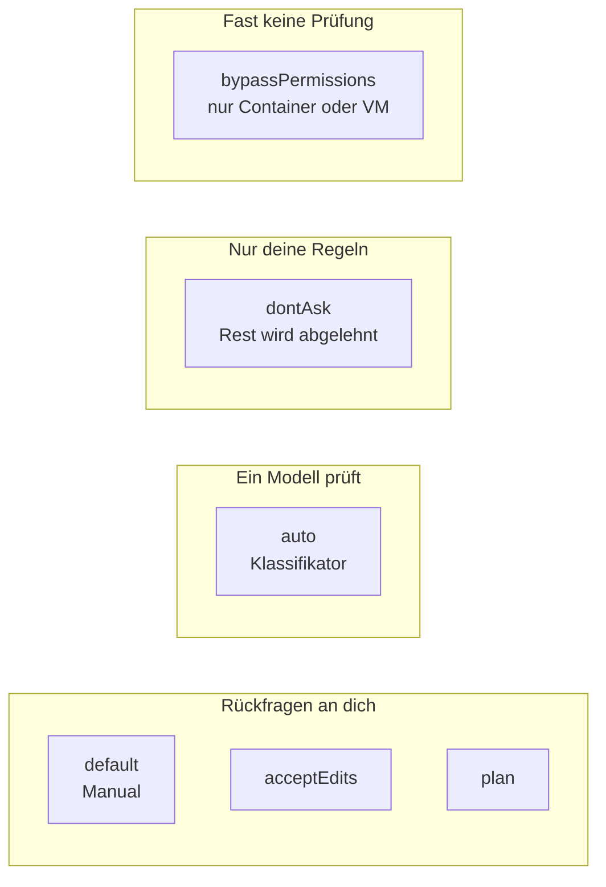

# S1.6 · Alle Rechte-Modi im Überblick

<!-- meta:start -->
> **Regal:** [Rechte & Freigaben](README.md#permissions) · **Stufe:** Kern · **~15 Min** · **Voraussetzungen:** [S1.5 Rechte im Alltag: default und acceptEdits](s1-05-rechte-im-alltag.md) · 🛡 **Sicherheitsboden**
>
> ← [S1.5 Rechte im Alltag: default und acceptEdits](s1-05-rechte-im-alltag.md) · [Bibliothek](README.md) · [S1.7 Modellwahl und Effort](s1-07-modellwahl-und-effort.md) →
<!-- meta:end -->

## Schnellcheck

- Kannst du ohne Nachschlagen alle sechs Rechte-Modi nennen und sagen, welchen du für ein Repository wählst, das du noch nie gesehen hast?
- Hast du in deiner letzten Sitzung in der Statusleiste nachgesehen, in welchem Modus sie lief?

## Auf einen Blick

Die sechs Rechte-Modi unterscheiden sich darin, wer eine Aktion prüft, bevor sie läuft. In `default`, `acceptEdits` und `plan` fragt Claude Code dich. In `auto` prüft ein zweites Modell, der Klassifikator. In `dontAsk` gelten nur deine vorab geschriebenen Regeln, alles andere wird abgelehnt. In `bypassPermissions` prüft fast nichts mehr; der Modus gehört deshalb ausschließlich in einen isolierten Container oder eine VM.

Welcher Modus gerade gilt, zeigt die Statusleiste, und `Shift+Tab` wechselt ihn. Eine neue Sitzung im Terminal startet ohne Flag in `auto`, sofern der Modus verfügbar ist.

## Bild im Kopf

Die sechs Modi sind die Freigabestufen einer Zutrittskontrolle. `default` ist der Besucherausweis (nur die Lobby), `acceptEdits` der Wartungsausweis (auch die Technikräume), `plan` die Begehung mit Klemmbrett: erst ansehen und aufschreiben, dann entscheiden. `auto` ist der Smart Badge: Das System entscheidet an jeder Tür selbst. `dontAsk` ist der Automat ohne Wachmann, der nur Karten auf seiner Liste durchlässt und alle anderen abweist. `bypassPermissions` ist der Generalschlüssel; den gibst du keinem Handwerker im laufenden Gebäude, nur in der abgeschlossenen Testhalle.

Die Gruppen sind keine Leiter von streng nach locker: `dontAsk` lässt weniger durch als `default`.



## Im Detail

### Die sechs Modi auf einer Karte

| Modus | Läuft ohne Rückfrage | Wer prüft den Rest | Wofür | Ausweis |
|---|---|---|---|---|
| `default` (Manual) | Lesen | du, bei jeder Änderung | sensible Arbeit, fremder Code | Besucherausweis |
| `acceptEdits` | Lesen, Dateiänderungen und Dateisystem-Befehle wie `mkdir`, `rm`, `mv` im Arbeitsordner | du, bei allen anderen Befehlen | Code, den du hinterher prüfst | Wartungsausweis |
| `plan` | Lesen und Erkunden; mit verfügbarem `auto` auch Befehle, die der Klassifikator freigibt | du, beim Freigeben des Plans | erst verstehen, dann ändern | Begehung mit Klemmbrett |
| `auto` | fast alles, mit Sicherheitsprüfung im Hintergrund | ein Klassifikator-Modell | lange Aufgaben, weniger Rückfragen | Smart Badge |
| `dontAsk` | Lesen und vorab erlaubte Werkzeuge; alles, was fragen würde, wird abgelehnt | deine Allow-Regeln | abgeschottete CI-Läufe und Skripte | Automat nach Liste |
| `bypassPermissions` | fast alles | nur noch Deny-Regeln und wenige Schutzfragen | nur isolierte Container und VMs | Generalschlüssel |

`default` und `acceptEdits` kennst du aus [S1.5](s1-05-rechte-im-alltag.md). Mit `plan` arbeitest du in [S1.14](s1-14-plan-modus.md). Über jeden Modus legst du Allow-, Ask- und Deny-Regeln; Deny-Regeln blocken in jedem Modus, auch in `bypassPermissions`.

### Die drei Modi ohne Rückfrage an dich

- **`auto`:** Ein Klassifikator-Modell prüft Aktionen, bevor sie laufen, und blockt, was über deinen Auftrag hinausgeht. Er senkt die Zahl der Rückfragen, garantiert aber keine Sicherheit. Voraussetzungen und Grenzen: [S3.8](s3-08-rechte-fuer-autonomie.md).
- **`dontAsk`:** fragt nie. Was eine Rückfrage bräuchte, lehnt Claude Code ab. Es läuft nur, was auch in Manual keine Freigabe braucht (etwa Lesen im Arbeitsordner), und was deine Allow-Regeln abdecken.
- **`bypassPermissions`:** nimmt fast alles an, auch Schreibzugriffe auf geschützte Pfade wie `.git` ([S3.9](s3-09-geschuetzte-pfade-und-sandbox.md)). Deny-Regeln blocken weiter, ausdrückliche Ask-Regeln und `rm` auf kritische Pfade fragen noch ([S3.8](s3-08-rechte-fuer-autonomie.md)). Nur für isolierte Container und VMs, in denen Claude Code deinem Rechner nicht schaden kann.

### In welchem Modus eine Sitzung startet

Die schnelle Antwort steht in der Statusleiste. Die Regel dahinter: Es gilt das Erste, das zutrifft.

1. das Flag `--permission-mode <modus>`
2. `permissions.defaultMode` in einer Settings-Datei
3. der eingebaute Startmodus

Der eingebaute Startmodus ist im Terminal und in der VS-Code-Erweiterung `auto`, bei `claude -p` und im Agent SDK meist `default`; bei einem Drittanbieter oder mit abgeschalteter Telemetrie kann es `auto` sein, setz den Modus in Skripten deshalb immer selbst. Ist `auto` für die Sitzung nicht verfügbar, etwa weil das Modell ihn nicht unterstützt oder die Organisation ihn abgeschaltet hat, startet sie in Manual. Ausnahmen und ältere Versionen führt der [Kanon](../_canonical.md#rechte-startmodus-quelle-permission-modesmd-which-mode-a-session-starts-in).

Willst du jede Terminal-Sitzung auf deinem Rechner in Manual starten, schreibst du den Startmodus in `~/.claude/settings.json`:

<!-- cockpit:example -->
```json
{
  "permissions": {
    "defaultMode": "default"
  }
}
```

Die nächste Sitzung zeigt dann `⏸ manual mode on` in der Statusleiste.

### Umschalten während der Sitzung

In der CLI wechselst du mit `Shift+Tab`. Der Zyklus läuft `default` → `acceptEdits` → `plan` → `auto` → zurück zu `default`; `auto` erscheint nur, wenn er verfügbar ist. Zwei Modi fehlen darin:

- **`bypassPermissions`** erscheint nur, wenn du die Sitzung damit gestartet oder freigeschaltet hast.
- **`dontAsk`** erscheint nie im Zyklus; du setzt ihn beim Start mit `--permission-mode dontAsk`.

Die Statusleiste zeigt den aktiven Modus: `⏸ manual mode on`, `⏵⏵ accept edits on`, `⏸ plan mode on`, `⏵⏵ auto mode on`, `⏵⏵ don't ask on` oder `⏵⏵ bypass permissions on`. In VS Code klickst du auf die Modus-Anzeige unten im Eingabefeld, in der Desktop-App auf die Modus-Auswahl neben dem Senden-Knopf.

### Cloud-Sitzungen

Cloud-Sitzungen auf claude.ai/code und in der Claude-App bieten im Modus-Menü **Accept edits**, **Plan** und **Auto** an. Auto erscheint nur, wenn deine Organisation ihn erlaubt und das gewählte Modell ihn unterstützt. **Bypass permissions** gibt es dort nicht. Accept edits steht an der Stelle von Manual, weil Cloud-Sitzungen Dateiänderungen in jedem Modus vorab freigeben.

`defaultMode: "dontAsk"` oder `"bypassPermissions"` aus Settings-Dateien übernehmen Cloud-Sitzungen nicht. Die eingecheckte `settings.json` eines Repositorys kann eine Cloud-Sitzung also nicht im Bypass-Modus starten; die Einstellung wird still ignoriert.

## Selbst machen

### Übung: Modus ablesen, umschalten, wählen (etwa 5 Minuten)

**Ziel:** Du liest den Modus deiner Sitzung ab, gehst den Zyklus einmal durch, startest gezielt in einem Modus und wählst für drei Situationen den passenden.

**Startzustand:** der Ordner `~/cc-workshop/hello`. Du gibst in dieser Übung keinen Auftrag ein, es ändert sich also nichts.

1. Starte nur mit `claude`, ohne Flag. Lies die Statusleiste unten: In welchem Modus läuft die Sitzung?
2. Drück `Shift+Tab` so oft, bis der Modus vom Anfang wieder dasteht. Notier die Reihenfolge. Welche beiden Modi sind nie erschienen?
3. Beende mit `/exit` und starte mit `claude --permission-mode plan`. Die Statusleiste zeigt `⏸ plan mode on`. Beende wieder.
4. Wähl für jede Situation einen Modus und begründe in einem Satz:
   - a) Du öffnest ein Repository, das du noch nie gesehen hast, und willst verstehen, was es tut.
   - b) Du lässt Claude in deinem eigenen Projekt zwanzig Dateien umbenennen und prüfst das Ergebnis danach mit `git diff`.
   - c) Ein Skript soll nachts ohne dich einen Bericht erzeugen und darf dafür nur lesen und `npm test` ausführen.

<details><summary>Vergleich für Schritt 2 und 4</summary>

- Schritt 2: Aus `auto` führt `Shift+Tab` zu `default` (Manual), dann zu `acceptEdits`, `plan` und zurück zu `auto`. Nie erschienen sind `dontAsk` und `bypassPermissions`.
- a) `plan` oder `default`: Claude liest und erkundet, ändert aber nichts ohne deine Freigabe. Das ist das Prinzip der geringsten Rechte.
- b) `acceptEdits`: Dateiänderungen und `mv` im Arbeitsordner laufen ohne Rückfrage, und du prüfst hinterher.
- c) `dontAsk` mit Allow-Regeln für `Read` und `Bash(npm test)`: Niemand ist da, der eine Rückfrage beantworten könnte, also wird abgelehnt, was nicht auf der Liste steht.

</details>

**Geschafft, wenn:**

- [ ] du den Startmodus deiner Sitzung aus der Statusleiste abgelesen hast
- [ ] du die Reihenfolge des Zyklus notiert hast und die zwei fehlenden Modi nennen kannst
- [ ] du eine Sitzung gezielt in `plan` gestartet hast
- [ ] deine drei Zuordnungen zum Vergleich passen oder du deine Abweichung begründen kannst

## Typische Fallen

- **`dontAsk` für den lockersten Modus halten.** Der Name täuscht: Der Modus fragt nicht, weil er ablehnt, was fragen würde. Er ist strenger als `default`.
- **`defaultMode: "auto"` in der Projekt-`settings.json` wirkt nicht.** In `.claude/settings.json` und `.claude/settings.local.json` greift `auto` nicht, die Sitzung nimmt den eingebauten Startmodus; `bypassPermissions` dort startet in Manual. Soll `auto` dein Startmodus sein, gehört er in `~/.claude/settings.json`.
- **`Shift+Tab` findet `bypassPermissions` nicht.** Du erreichst ihn nur, wenn die Sitzung damit freigeschaltet gestartet ist.
- **`/permissions` für den Modusschalter halten.** Der Befehl verwaltet Regeln, keinen Modus ([S1.5](s1-05-rechte-im-alltag.md)).

## Check

Du kannst die sechs Rechte-Modi danach ordnen, wer statt dir prüft, den Startmodus deiner Sitzung ablesen und begründen, warum `bypassPermissions` nur in einen isolierten Container gehört.

1. Welchen Modus gibst du Claude für ein Repository, das du noch nie gesehen hast, und nach welchem Prinzip?
2. Woran erkennst du den Modus deiner Sitzung, und in welchem startet sie im Terminal ohne Flag?
3. Warum gehört `bypassPermissions` nur in einen isolierten Container oder eine VM?

<details><summary>Auflösung</summary>

1. `default` oder `plan`: Claude liest, ändert aber nichts ohne deine Freigabe. Das ist das Prinzip der geringsten Rechte: die kleinste Stufe, die für die Aufgabe reicht.
2. An der Statusleiste, etwa `⏸ manual mode on` oder `⏵⏵ auto mode on`. Ohne Flag und ohne `defaultMode` in den Settings startet eine Terminal-Sitzung in `auto`, sofern er verfügbar ist.
3. Der Modus nimmt fast alles ohne Prüfung an, auch Schreibzugriffe auf geschützte Pfade wie `.git`. Nur Deny-Regeln und wenige Schutzfragen greifen noch. Vertretbar ist das nur dort, wo Claude Code deinem Rechner nicht schaden kann.

</details>

<details><summary>Quizfrage</summary>

**Frage:** Claude will einen Befehl ausführen, der im Modus `default` eine Rückfrage auslösen würde. Was passiert mit ihm in `auto`, und was in `dontAsk`?

- **Richtig:** In `auto` entscheidet ein Klassifikator-Modell über den Befehl; in `dontAsk` lehnt Claude Code ihn ab.
- Falsch: In `auto` lehnt Claude Code ihn ab; in `dontAsk` läuft er, weil dieser Modus nie nachfragt.
- Falsch: In beiden Modi läuft er ungeprüft; sie unterscheiden sich nur in der Anzeige der Statusleiste.
- Falsch: In beiden Modi sammelt Claude Code die Rückfrage und stellt sie dir am Ende der Aufgabe.

</details>

## Weiterlesen

- [Rechte-Modi (offizielle Doku)](https://code.claude.com/docs/en/permission-modes)
- [Modus wechseln je Oberfläche (offizielle Doku)](https://code.claude.com/docs/en/permission-modes#switch-permission-modes)
- [Rechte-Regeln (offizielle Doku)](https://code.claude.com/docs/en/permissions)
- [S1.5 · Rechte im Alltag: default und acceptEdits](s1-05-rechte-im-alltag.md)
- [S1.14 · Plan-Modus und schrittweises Vorgehen](s1-14-plan-modus.md)
- [S3.8 · Rechte für autonome Läufe](s3-08-rechte-fuer-autonomie.md)
- [S3.9 · Geschützte Pfade und Sandbox-Stufen](s3-09-geschuetzte-pfade-und-sandbox.md)
- [S1.3 · Die Oberflächen: CLI, Desktop, IDE, Web, iOS](s1-03-oberflaechen.md)
- [S4.6 · Unterwegs: Remote Control und /teleport](s4-06-remote-und-teleport.md)
