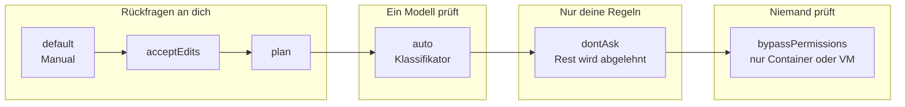

# S1.6 · Alle Rechte-Modi im Überblick

<!-- meta:start -->
> **Regal:** [Rechte & Freigaben](README.md#permissions) · **Stufe:** Kern · **~15 Min** · **Voraussetzungen:** [S1.5 Rechte im Alltag: default und acceptEdits](s1-05-rechte-im-alltag.md) · 🛡 **Sicherheitsboden**
>
> ← [S1.5 Rechte im Alltag: default und acceptEdits](s1-05-rechte-im-alltag.md) · [Bibliothek](README.md) · [S1.7 Modellwahl und Effort](s1-07-modellwahl-und-effort.md) →
<!-- meta:end -->

## Schnellcheck

- Kannst du ohne Nachschlagen alle sechs Rechte-Modi nennen und sagen, welchen du für ein Repository wählst, das du noch nie gesehen hast?
- Hast du in deiner letzten Sitzung in der Statusleiste nachgesehen, in welchem Modus sie lief?

## Auf einen Blick

Die sechs Rechte-Modi verschieben die Prüfung schrittweise weg von dir: In `default`, `acceptEdits` und `plan` fragt Claude Code dich, in `auto` prüft ein zweites Modell (der Klassifikator), in `dontAsk` gelten nur deine vorab geschriebenen Regeln, in `bypassPermissions` prüft niemand. `bypassPermissions` gehört deshalb ausschließlich in einen isolierten Container oder eine VM.

Neue interaktive Sitzungen im Terminal und in VS Code starten ab v2.1.283 in `auto`, sofern er verfügbar ist; `claude -p` startet in `default`. Welcher Modus gerade gilt, zeigt die Statusleiste, und `Shift+Tab` wechselt ihn.

## Bild im Kopf

Die sechs Modi sind die Freigabestufen einer Zutrittskontrolle, vom Besucherausweis bis zum Generalschlüssel. `default` ist der Besucherausweis (nur die Lobby), `acceptEdits` der Wartungsausweis (auch die Technikräume), `plan` die Einsatzbesprechung (erst der Plan, dann die Freigabe). `auto` ist der Smart Badge: Das System entscheidet an jeder Tür selbst. `dontAsk` ist der Automat ohne Wachmann, der nur Karten auf seiner Liste durchlässt. `bypassPermissions` ist der Generalschlüssel ohne Schlösser; den gibst du keinem Handwerker im laufenden Gebäude, nur in der abgeschlossenen Testhalle.



## Im Detail

### Die sechs Modi auf einer Karte

| Modus | Läuft ohne Rückfrage | Wer prüft den Rest | Wofür | Ausweis |
|---|---|---|---|---|
| `default` (Manual) | Lesen | du, bei jeder Änderung | sensible Arbeit, fremder Code | Besucherausweis |
| `acceptEdits` | Lesen, Dateiänderungen und Dateisystem-Befehle wie `mkdir`, `rm`, `mv` im Arbeitsordner | du, bei allen anderen Befehlen | Code, den du hinterher prüfst | Wartungsausweis |
| `plan` | Lesen und Erkunden; mit verfügbarem `auto` auch Befehle, die der Klassifikator freigibt | du, beim Freigeben des Plans | erst verstehen, dann ändern | Einsatzbesprechung |
| `auto` | fast alles, mit Sicherheitsprüfung im Hintergrund | ein Klassifikator-Modell | lange Aufgaben, weniger Rückfragen | Smart Badge |
| `dontAsk` | Lesen und vorab erlaubte Werkzeuge; alles, was fragen würde, wird abgelehnt | deine Allow-Regeln | abgeschottete CI-Läufe und Skripte | Automat nach Liste |
| `bypassPermissions` | alles | niemand | nur isolierte Container und VMs | Generalschlüssel |

`default` und `acceptEdits` im Alltag: [S1.5](s1-05-rechte-im-alltag.md). Arbeiten mit `plan`: [S1.14](s1-14-plan-modus.md). Was `auto`, `dontAsk` und `bypassPermissions` in autonomen Läufen bedeuten: [S3.8](s3-08-rechte-fuer-autonomie.md). Über jeden Modus legst du Allow-, Ask- und Deny-Regeln; Deny-Regeln blocken in jedem Modus, auch in `bypassPermissions`.

### default heißt jetzt Manual

Der Modus, der jede Aktion von dir prüfen lässt, heißt in der CLI, in `claude --help`, in den Erweiterungen für VS Code und JetBrains und in der Desktop-App **Manual**. Sein Wert in Einstellungen, Hooks und SDK bleibt `default`. Die CLI akzeptiert ab v2.1.200 überall auch `manual`, etwa `claude --permission-mode manual`. Die Zählung bleibt bei sechs Modi.

### In welchem Modus eine Sitzung startet

Startest du im Terminal eine neue Sitzung, gilt das Erste, das zutrifft:

1. das Flag `--permission-mode <modus>` (oder `--dangerously-skip-permissions`)
2. `permissions.defaultMode` in einer Settings-Datei
3. der eingebaute Startmodus

Der eingebaute Startmodus hängt davon ab, wie du Claude Code startest (den aktuellen Stand führt der [Kanon](../_canonical.md#rechte-startmodus-quelle-permission-modesmd-which-mode-a-session-starts-in)):

- **Terminal und VS Code-Erweiterung:** `auto` ab v2.1.283; in älteren Versionen nur auf den Tarifen Pro, Max und Team, sonst `default`.
- **`claude -p` und Agent SDK:** `default`.
- **Eine Settings-Datei setzt `disableAutoMode` auf `"disable"`:** `default`.

Ist `auto` für die Sitzung nicht verfügbar, etwa weil das Modell ihn nicht unterstützt oder die Organisation ihn abgeschaltet hat, startet sie in Manual. Willst du jede Terminal-Sitzung auf deinem Rechner in Manual starten, schreibst du den Startmodus in `~/.claude/settings.json`:

<!-- cockpit:example -->
```json
{
  "permissions": {
    "defaultMode": "default"
  }
}
```

Die nächste Sitzung zeigt dann `⏸ manual mode on` in der Statusleiste.

### Umschalten während der Sitzung

In der CLI wechselst du mit `Shift+Tab`. Aus `auto` springt der erste Druck nach `default`, danach läuft der Zyklus `default` → `acceptEdits` → `plan` → zurück zu `default`. Nicht jeder Modus steckt in diesem Zyklus:

- **`auto`** erscheint, wenn er verfügbar ist, und steht am Ende.
- **`bypassPermissions`** erscheint nur, wenn du die Sitzung damit freigeschaltet hast, etwa mit `--permission-mode bypassPermissions`, `--dangerously-skip-permissions`, `--allow-dangerously-skip-permissions` oder `permissions.defaultMode: "bypassPermissions"` in den User-, `--settings`- oder Managed-Settings. Das dritte Flag nimmt den Modus in den Zyklus auf, ohne ihn zu aktivieren.
- **`dontAsk`** erscheint nie im Zyklus; du setzt ihn beim Start mit `--permission-mode dontAsk`.

Die Statusleiste zeigt den aktiven Modus: `⏸ manual mode on`, `⏵⏵ accept edits on`, `⏸ plan mode on`, `⏵⏵ auto mode on`, `⏵⏵ don't ask on` oder `⏵⏵ bypass permissions on`. In VS Code klickst du auf die Modus-Anzeige unten im Eingabefeld, in der Desktop-App auf die Modus-Auswahl neben dem Senden-Knopf. `/permissions` verwaltet Regeln, keinen Modus ([S1.5](s1-05-rechte-im-alltag.md)).

### Die drei Modi ohne Rückfrage an dich

- **`auto`:** Ein Klassifikator-Modell prüft Aktionen, bevor sie laufen, und blockt, was über deinen Auftrag hinausgeht. Er senkt die Zahl der Rückfragen, garantiert aber keine Sicherheit. Voraussetzungen und Grenzen: [S3.8](s3-08-rechte-fuer-autonomie.md).
- **`dontAsk`:** fragt nie. Was eine Rückfrage bräuchte, lehnt Claude Code ab. Es läuft nur, was auch in Manual keine Freigabe braucht (etwa Lesen im Arbeitsordner), und was deine Allow-Regeln abdecken.
- **`bypassPermissions`:** nimmt fast alles an, auch Schreibzugriffe auf geschützte Pfade wie `.git` ([S3.9](s3-09-geschuetzte-pfade-und-sandbox.md)); Deny-Regeln blocken weiter, ausdrückliche Ask-Regeln und `rm` auf kritische Pfade fragen noch ([S3.8](s3-08-rechte-fuer-autonomie.md)). Nur für isolierte Container und VMs, in denen Claude Code deinem Host nicht schaden kann.

### Cloud-Sitzungen

Cloud-Sitzungen auf claude.ai/code und in der Mobile-App bieten im Modus-Menü **Accept edits**, **Plan** und **Auto** an. Auto erscheint nur, wenn deine Organisation ihn erlaubt und das gewählte Modell ihn unterstützt. **Bypass permissions** gibt es dort nicht. Accept edits steht an der Stelle von Manual, weil Cloud-Sitzungen Dateiänderungen in jedem Modus vorab freigeben.

`defaultMode: "dontAsk"` oder `"bypassPermissions"` aus Settings-Dateien übernehmen Cloud-Sitzungen nicht. Die eingecheckte `settings.json` eines Repositorys kann eine Cloud-Sitzung also nicht im Bypass-Modus starten; die Einstellung wird still ignoriert. Wie Remote-Control-Sitzungen die Modi zeigen: [S4.6](s4-06-remote-und-teleport.md).

## Typische Fallen

- **`defaultMode: "auto"` in der Projekt-`settings.json` wirkt nicht.** In `.claude/settings.json` und `.claude/settings.local.json` greift `auto` nicht, die Sitzung nimmt den eingebauten Startmodus; `bypassPermissions` dort startet in Manual. Soll `auto` dein Startmodus sein, gehört er in `~/.claude/settings.json`.
- **`Shift+Tab` findet `bypassPermissions` nicht.** Du kannst ihn nur erreichen, wenn die Sitzung damit freigeschaltet gestartet ist.
- **`dontAsk` fehlt im Zyklus.** Das ist so gewollt; nur das Start-Flag setzt ihn.

## Check

Du kannst die sechs Rechte-Modi danach ordnen, wer statt dir prüft, den Startmodus deiner Sitzung ablesen und begründen, warum `bypassPermissions` nur in einen isolierten Container gehört.

1. Kurzcheck (60 Sekunden, unbenotet): Welche Freigabestufe gibst du Claude für ein Repository, das du noch nie gesehen hast? Gute Antworten wählen `default` oder `plan` und nennen das Prinzip der geringsten Rechte.
2. Was passiert mit einer Aktion, die eigentlich eine Rückfrage bräuchte, in `auto` und was in `dontAsk`?
3. Welche Modi bietet eine Cloud-Sitzung auf claude.ai/code an, und welcher fehlt immer?

<details><summary>Quizfrage</summary>

**Frage:** Ein Auftrag soll in einem isolierten Wegwerf-Container ganz ohne Rückfragen laufen. Später willst du denselben Auftrag in einer Cloud-Sitzung auf claude.ai/code starten. Was gilt?

- **Richtig:** Im Container passt `bypassPermissions`; in der Cloud-Sitzung gibt es ihn nicht, dort wählst du Accept edits, Plan oder Auto.
- Falsch: In beiden Umgebungen passt `bypassPermissions`, weil die Cloud-Sitzung selbst schon ein isolierter Container von Anthropic ist.
- Falsch: Im Container passt nur `auto`, weil Claude Code `bypassPermissions` in nicht interaktiven `-p`-Läufen grundsätzlich ablehnt.
- Falsch: Die Cloud-Sitzung übernimmt den `defaultMode` `bypassPermissions`, wenn er in der eingecheckten settings.json steht.

</details>

## Weiterlesen

- [Rechte-Modi (offizielle Doku)](https://code.claude.com/docs/en/permission-modes)
- [Modus wechseln je Oberfläche (offizielle Doku)](https://code.claude.com/docs/en/permission-modes#switch-permission-modes)
- [Rechte-Regeln (offizielle Doku)](https://code.claude.com/docs/en/permissions)
- [S1.5 · Rechte im Alltag: default und acceptEdits](s1-05-rechte-im-alltag.md)
- [S1.14 · Plan-Modus und schrittweises Vorgehen](s1-14-plan-modus.md)
- [S3.8 · Rechte für autonome Läufe](s3-08-rechte-fuer-autonomie.md), mit Live-Vorführung vom Besucherausweis zum Generalschlüssel
- [S3.9 · Geschützte Pfade und Sandbox-Stufen](s3-09-geschuetzte-pfade-und-sandbox.md)
- [S1.3 · Die Oberflächen: CLI, Desktop, IDE, Web, iOS](s1-03-oberflaechen.md)
