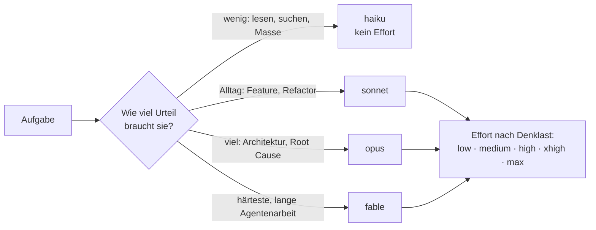

# S1.7 · Modellwahl und Effort

<!-- meta:start -->
> **Regal:** [Modelle & Kosten](README.md#cost) · **Stufe:** Kern · **~15 Min** · **Voraussetzungen:** [S1.1 Erster Kontakt: sofort eine Datei bauen](s1-01-erster-kontakt.md)
>
> ← [S1.6 Alle Rechte-Modi im Überblick](s1-06-rechte-modi.md) · [Bibliothek](README.md) · [S1.8 Das Kontextfenster verstehen](s1-08-kontextfenster.md) →
<!-- meta:end -->

## Schnellcheck

- Hast du schon einmal mit `/model` oder `/effort` das Modell oder die Denktiefe für eine Aufgabe bewusst umgestellt?
- Kannst du ohne Nachschlagen sagen, wann du `haiku`, `sonnet`, `opus` oder `fable` nimmst und warum die Effort-Stufe die Kosten beeinflusst?

## Auf einen Blick

Claude Code bietet vier Modell-Tiers, die du über Aliase wählst: `haiku` für schnelle, kleine Aufgaben, `sonnet` für den Coding-Alltag, `opus` für tiefes Reasoning und Architektur (der Standard in Claude Code) und `fable` für die härtesten, langen Aufgaben. Die Effort-Stufe von `low` bis `max` regelt, wie viel das Modell nachdenkt, und ist damit Qualitäts- und Kostenhebel zugleich; Haiku kennt keinen Effort.

Generationen, Preise, Kontextgrößen und Start-Stufen stehen nur im [Kanon](../_canonical.md). Was deine CLI wirklich anbietet, zeigt `/model`.

## Bild im Kopf

Denk an einen Wachdienst, der ein Objekt mit gemischtem Personal betreut: eine erfahrene Streifenkraft, ein Auszubildender und eine Fachkraft für technische Alarme, jeder mit eigenem Stundensatz. Stellst du die Fachkraft die ganze Nacht an den Empfang, verbrennst du Budget. Setzt du den Auszubildenden bei einem Vorfall an die Alarmzentrale, fehlt die Kompetenz vor Ort. Die Kunst ist, die richtige Person in die richtige Schicht zu stellen. Bei Claude Code ist Opus die Fachkraft, Sonnet die erfahrene Streifenkraft, Haiku der Auszubildende.

Die Effort-Stufe ist die Stufe, auf der du den Einsatz bestellst, wie Junior-, Senior- oder Expertensatz im Vertrag: Je höher die Stufe, desto gründlicher die Arbeit und desto teurer die Stunde.



## Im Detail

### Vier Tiers, vier Rollen

Welches Modell du nimmst, bestimmt Qualität und Kosten:

| Tier (Alias) | Rolle: wann du es nimmst | Kosten relativ zum Opus-Tier |
|---|---|---|
| **Fable** (`fable`) | Das stärkste Tier: härtestes Reasoning, lange Agentenarbeit. Nie der Standard eines Kontos. | etwa 2,5-mal so teuer |
| **Opus** (`opus`) | Tiefes Reasoning, Architektur, komplexe Aufgaben. Der Standard in Claude Code. | Bezugsgröße |
| **Sonnet** (`sonnet`) | Schnell und fähig, der Coding-Alltag. | etwa die Hälfte |
| **Haiku** (`haiku`) | Schnelle Aufgaben, Brainstorming, Massenarbeit. Kleineres Kontextfenster, kein Effort. | etwa ein Viertel |

Die relativen Kosten sind aus den Preisen pro Million Tokens im [Kanon](../_canonical.md) gerechnet; ändern sich die Preise, rechnest du dort neu. Absolute Preise, welches Modell auf welchem Anbieter der Standard ist und wie groß die Kontextfenster sind, steht nur dort.

> Modellnamen ändern sich schnell, deshalb arbeitet dieser Kurs mit Aliasen und Rollen. `/model` zeigt, was deine CLI wirklich anbietet (ein Alias kann je Anbieter auf eine andere Generation zeigen), `/release-notes` die neuesten Änderungen.

### Umschalten

- **Beim Start:** `claude --model sonnet` wählt das Modell für diese Sitzung, `--effort <stufe>` die Effort-Stufe.
- **In der Sitzung:** `/model` öffnet die Auswahl, `/model <alias>` wechselt direkt.
- **Effort:** `/effort <low|medium|high|xhigh|max>` setzt eine von fünf Stufen, von günstig und schnell bis zur tiefsten Analyse. Mit welcher Stufe Claude Code startet, unterscheidet sich je Tier (siehe [Kanon](../_canonical.md)). `xhigh` und `max` gibt es auf den Tiers Fable, Opus und Sonnet, nicht auf Haiku; sie greifen erst, wenn du sie ausdrücklich setzt. `/effort status` zeigt die aktuelle Stufe.
- **Kontext:** `/context` zeigt, wie voll das Kontextfenster ist ([S1.8](s1-08-kontextfenster.md)).
- **Verbrauch:** `/cost` zeigt, was die Sitzung bisher gekostet hat ([S1.19](s1-19-kosten-im-blick.md)).

So sieht das im Alltag aus:

<!-- cockpit:example -->
```text
# Alltag: Sonnet, Effort für diese Sitzung auf medium
claude --model sonnet --effort medium

# Architektur: Opus mit tiefem Reasoning, nur für diese Sitzung
claude --model opus --effort xhigh

# In der Sitzung: Modell und Effort in der Auswahl prüfen
/model
```

### Effort als Kostenhebel

Die Effort-Stufe ist nicht nur ein Qualitätsregler, sondern auch ein Kostenregler. Jede Stufe tauscht Token-Verbrauch gegen Fähigkeit: Je höher die Stufe, desto mehr denkt das Modell nach und desto mehr Tokens verbraucht es. Feste Faktoren je Stufe veröffentlicht Anthropic nicht, und die Skala ist je Modell kalibriert; dieselbe Stufe bedeutet also nicht auf jedem Tier dasselbe.

| Effort | Einsatz |
|---|---|
| `low` | Tippfehler, Refactors einer einzelnen Zeile, schnelle Code-Reviews |
| `medium` | Normales Coding, normale Refactors |
| `high` | Architekturentscheidungen, Refactors über mehrere Dateien |
| `xhigh` | Tiefe Analyse, Root-Cause-Debugging (Tiers Fable, Opus, Sonnet) |
| `max` | Grenzfälle, „schau dir alles an“: sparsam einsetzen |

Prüf vor einer langen Aufgabe, auf welcher Stufe du stehst. Schalte bei wirklich einfachen Aufgaben auf `low` oder `medium` herunter; das ist genauso wichtig wie das Hochschalten bei schweren. `xhigh` für einen einzeiligen Tippfehler ist ein kleines, aber wiederkehrendes Leck. Geh auf `xhigh` oder `max` nur, wenn du einen klaren Bedarf an tiefem Reasoning erkennst.

### Faustregel

Nimm Opus für Planung und Architektur, Sonnet für die Umsetzung und Haiku für Massenlesen und einfache Aufgaben. Schau regelmäßig mit `/cost` auf die Kosten. Wie du daraus eine Pipeline mit einem Modell pro Phase baust, zeigt [S4.1](s4-01-modell-pro-phase.md).

> **Schlanker System-Prompt.** Auf aktuellen Fable- und Opus-Builds bringt Claude Code standardmäßig einen schlankeren System-Prompt mit (welche Modelle ihn bekommen, kann sich von Release zu Release ändern). Das heißt weniger fester Overhead im Kontextfenster und mehr Platz für deinen Code. Anfassen musst du ihn selten. Ergänzen kannst du ihn mit `--append-system-prompt`, ersetzen mit `--system-prompt` oder `--system-prompt-file`.

Wie du den Verbrauch abliest und Modell und Effort für deine eigenen Abläufe festlegst, übst du in [S1.19](s1-19-kosten-im-blick.md).

## Typische Fallen

- **Haiku „vergisst“ den Anfang einer großen Datei.** Haikus Kontextfenster ist deutlich kleiner als das der anderen Tiers (Größen im [Kanon](../_canonical.md)). Das begrenzt Aufgaben, bei denen viel gelesen wird. Nimm Haiku für kleine, gezielte Lesezugriffe und Opus oder Fable für die Analyse einer ganzen Codebasis.
- **Die Wahl bleibt länger als gedacht.** `/model <alias>` speichert das Modell als Standard für neue Sitzungen, und eine Stufe hinter `/effort` speichert sie als Standard für dieses Modell (`max` gilt nur für die laufende Sitzung). Für nur eine Sitzung startest du mit `claude --model … --effort …` oder drückst in der Auswahl `s`. `/model default` holt das Standardmodell deines Kontos zurück, `/effort auto` löscht die gespeicherte Stufe des aktiven Modells.
- **Modellwechsel mitten in der Aufgabe.** Jedes Modell hat seinen eigenen Cache. Wechselst du in einer langen Sitzung mit `/model`, liest das neue Modell beim nächsten Aufruf den ganzen Verlauf ohne Cache-Treffer. Wähl Modell und Effort am Anfang der Sitzung.

## Check

Du kannst für eine Aufgabe Tier und Effort-Stufe begründet wählen, beides nur für eine Sitzung oder dauerhaft umstellen und erklären, warum Haiku an einer großen Codebasis scheitern kann.

1. Welches Tier nimmst du für die Analyse einer ganzen Codebasis, und warum nicht Haiku?
2. Was ändert eine höhere Effort-Stufe, und welches Tier kennt gar keinen Effort?
3. Wie stellst du Modell und Effort für eine einzige Sitzung ein, ohne deinen Standard zu ändern?

<details><summary>Quizfrage</summary>

**Frage:** Jemand analysiert eine Firmware-Codebasis mit 800 Dateien mit `haiku`, weil es das günstigste Tier ist. Warum kann das scheitern, obwohl Haiku für einfache Aufgaben empfohlen wird?

- **Richtig:** Haikus Kontextfenster ist deutlich kleiner als das der anderen Tiers, bei so vielen Dateien fallen frühe Inhalte heraus.
- Falsch: Haiku kennt keinen Plan-Modus und kann deshalb bei Analysen über viele Dateien grundsätzlich keine strukturierte Antwort liefern.
- Falsch: Haiku wird ab 500 Dateien pro Sitzung gedrosselt und liefert danach nur noch Antworten aus dem Cache.
- Falsch: Haiku läuft fest auf `low`, und höhere Effort-Stufen lassen sich für große Analysen nicht freischalten.

</details>

## Weiterlesen

- [Modellkonfiguration](https://code.claude.com/docs/en/model-config)
- [Befehlsreferenz](https://code.claude.com/docs/en/commands)
- [Kanon: Modelle, Preise, Effort-Startwerte](../_canonical.md)
- [S1.19 · Kosten im Blick: /cost, /usage und Budgetgrenzen](s1-19-kosten-im-blick.md)
- [S1.8 · Das Kontextfenster verstehen](s1-08-kontextfenster.md)
- [S4.1 · Das richtige Modell pro Phase](s4-01-modell-pro-phase.md)
- [S4.4 · CI-Zugangsdaten, Kostengrenzen und Kosten-Feinschliff](s4-04-ci-zugang-und-kosten.md)
