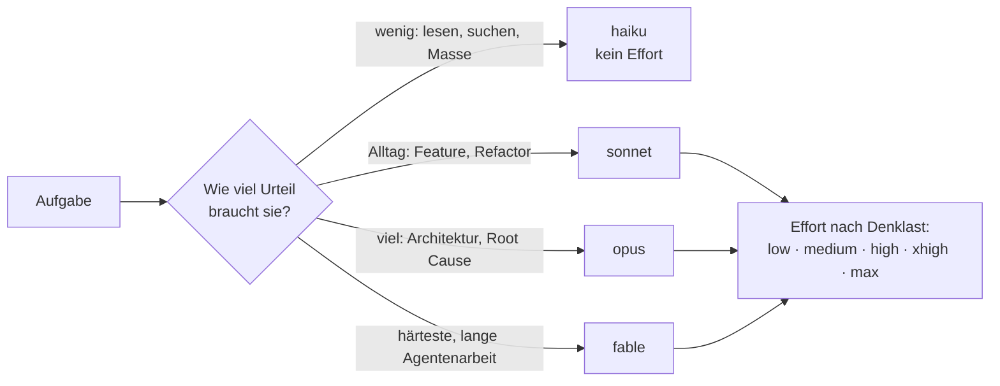

# S1.7 · Modellwahl und Effort

<!-- meta:start -->
> **Regal:** [Modelle & Kosten](README.md#cost) · **Stufe:** Kern · **~15 Min** · **Voraussetzungen:** [S1.1 Erster Kontakt: sofort eine Datei bauen](s1-01-erster-kontakt.md)
>
> ← [S1.6 Alle Rechte-Modi im Überblick](s1-06-rechte-modi.md) · [Bibliothek](README.md) · [S1.8 Das Kontextfenster verstehen](s1-08-kontextfenster.md) →
<!-- meta:end -->

## Schnellcheck

- Hast du schon einmal mit `/model` oder `/effort` das Modell oder die Denktiefe für eine Aufgabe bewusst umgestellt?
- Kannst du ohne Nachschlagen sagen, wofür du `haiku`, `sonnet`, `opus` und `fable` jeweils nimmst?

## Auf einen Blick

Claude Code bietet vier Modell-Tiers, die du über Aliase wählst: `haiku` für schnelle, kleine Aufgaben, `sonnet` für den Coding-Alltag, `opus` für tiefes Reasoning und Architektur und `fable` für die härtesten, langen Aufgaben. Die Effort-Stufe von `low` bis `max` regelt, wie gründlich das Modell nachdenkt, und ist damit Qualitäts- und Kostenhebel zugleich.

Beides stellst du beim Start per Flag ein oder in der Sitzung mit `/model` und `/effort`. Generationen, Preise und Kontextgrößen stehen nur im [Kanon](../_canonical.md); was deine CLI wirklich anbietet, zeigt `/model`.

## Bild im Kopf

Ein Wachdienst betreut ein Objekt mit gemischtem Personal, jede Kraft mit eigenem Stundensatz. Der Auszubildende (`haiku`) ist schnell zur Stelle, hat aber nur einen kleinen Notizblock. Die erfahrene Streifenkraft (`sonnet`) erledigt den Alltag. Die Fachkraft für technische Alarme (`opus`) holst du für die schwierigen Fälle, den Sachverständigen (`fable`) für den großen Schadensfall, der Tage dauert. Stellst du die Fachkraft die ganze Nacht an den Empfang, verbrennst du Budget.

Die Effort-Stufe ist die Zeit, die sich die gerufene Kraft für den Auftrag nimmt: ein kurzer Blick oder eine gründliche Begehung mit Protokoll. Gründlicher kostet mehr.



## Im Detail

### Vier Tiers, vier Rollen

| Tier (Alias) | Rolle: wann du es nimmst | Kosten relativ zum Opus-Tier |
|---|---|---|
| **Fable** (`fable`) | Das stärkste Tier: härtestes Reasoning, lange Agentenarbeit. Nie der Standard eines Kontos. | etwa 2,5-mal so teuer |
| **Opus** (`opus`) | Tiefes Reasoning, Architektur, komplexe Aufgaben. | Bezugsgröße |
| **Sonnet** (`sonnet`) | Schnell und fähig, der Coding-Alltag. | etwa die Hälfte |
| **Haiku** (`haiku`) | Schnelle Aufgaben, Massenarbeit. Kleineres Kontextfenster, kein Effort. | etwa ein Viertel |

Die relativen Kosten sind aus den Preisen im [Kanon](../_canonical.md) gerechnet; ändern sich die Preise, rechnest du dort neu. Abgerechnet wird nach Tokens, der Einheit, in der Modelle Text zählen. Das Kontextfenster ist das Arbeitsgedächtnis einer Sitzung ([S1.8](s1-08-kontextfenster.md)); bei Haiku ist es deutlich kleiner als bei den anderen Tiers.

Welches Modell dein Konto ohne Angabe nimmt, zeigt die Zeile „Default“ in `/model`. Modellnamen ändern sich schnell, deshalb arbeitet diese Bibliothek mit Aliasen und Rollen.

### Effort: wie gründlich

Jede Stufe tauscht Token-Verbrauch gegen Gründlichkeit. Feste Faktoren je Stufe veröffentlicht Anthropic nicht, und die Skala ist je Modell kalibriert; dieselbe Stufe bedeutet also nicht auf jedem Tier dasselbe.

| Effort | Wann laut Doku |
|---|---|
| `low` | kurzer Austausch, bei dem du jedes Ergebnis ansiehst: Ideen sammeln, ein erster Entwurf, eine kleine Änderung wie ein Umbenennen |
| `medium` | Alltagsarbeit mit klarem Umfang, etwa ein neues Feature |
| `high` | wenn Prüfung zählt oder Randfälle wahrscheinlich sind, etwa ein Fehler in einer bestehenden Codebasis |
| `xhigh` | tieferes Reasoning bei höherem Verbrauch |
| `max` | harte Probleme, die Claude ohne dich durcharbeiten soll, etwa die Suche nach Sicherheitslücken; neigt zum Übergrübeln, also sparsam einsetzen |

Haiku kennt keinen Effort. `xhigh` und `max` gibt es auf den aktuellen Generationen der Tiers Fable, Opus und Sonnet; ältere Generationen und manche Anbieter kennen sie nicht. Mit welcher Stufe ein Modell startet, steht im [Kanon](../_canonical.md).

Schalte bei wirklich einfachen Aufgaben herunter; das ist genauso wichtig wie das Hochschalten bei schweren. `xhigh` für einen einzeiligen Tippfehler ist ein kleines, aber wiederkehrendes Leck.

### Umschalten

- **Beim Start, nur für diese Sitzung:** `claude --model sonnet` wählt das Modell, `--effort <stufe>` die Effort-Stufe.
- **In der Sitzung:** `/model` öffnet die Auswahl, `/model <alias>` wechselt direkt. `/effort <low|medium|high|xhigh|max>` setzt die Stufe, `/effort status` zeigt sie.
- **Achtung, die Wahl in der Sitzung bleibt:** `/model <alias>` und Enter in der Auswahl speichern das Modell als Standard für neue Sitzungen. Eine Stufe hinter `/effort` wird als Standard für dieses Modell gespeichert; nur `max` gilt allein für die laufende Sitzung. Für eine einzige Sitzung drückst du in der Auswahl `s` oder nimmst die Start-Flags.
- **Zurück zum Standard:** `/model default` holt das Standardmodell deines Kontos zurück, `/effort auto` löscht die gespeicherte Stufe des aktiven Modells.

So sieht das im Alltag aus:

<!-- cockpit:example -->
```text
# Alltag: Sonnet, Effort für diese Sitzung auf medium
claude --model sonnet --effort medium

# Hartnäckiger Fehler: Opus mit tieferem Reasoning, nur für diese Sitzung
claude --model opus --effort xhigh

# In der Sitzung: Modell und Effort in der Auswahl prüfen
/model
```

### Faustregel

Nimm Opus für Planung und Architektur, Sonnet für die Umsetzung und Haiku für Massenlesen und einfache Aufgaben. Wähl Modell und Effort am Anfang einer Aufgabe, nicht mittendrin. Wie du den Verbrauch abliest, zeigt [S1.19](s1-19-kosten-im-blick.md); wie du daraus eine Pipeline mit einem Modell pro Phase baust, [S4.1](s4-01-modell-pro-phase.md).

## Selbst machen

### Übung: Modell und Effort für eine Sitzung setzen (etwa 5 Minuten)

**Ziel:** Du startest eine Sitzung gezielt mit einem Modell und einer Effort-Stufe, prüfst beides in der Sitzung und siehst, dass dein Standard unverändert bleibt. Danach wählst du für drei Aufgaben Tier und Stufe.

**Startzustand:** der Ordner `~/cc-workshop/hello`. Du änderst in dieser Übung nichts an deinen Einstellungen.

1. Starte mit `claude --model sonnet --effort high --permission-mode default`. Lies die Kopfzeile: Sie nennt Modell und Effort.
2. Gib `/effort status` ein. Die Antwort nennt die Stufe `high`.
3. Gib `/model` ein. Such die Zeile „Default“: Das ist das Modell, das dein Konto ohne Angabe nimmt. Lies die Hinweise am unteren Rand: Enter speichert die Wahl als Standard, `s` gilt nur für diese Sitzung. Schließ die Auswahl mit `Esc`, ohne etwas zu wählen.
4. Beende mit `/exit` und starte mit `claude --model haiku --permission-mode default`. Die Kopfzeile nennt Haiku, eine Effort-Anzeige fehlt. Frag: `In one sentence: what does git status do?` Beende wieder.
5. Starte nur mit `claude`. Die Kopfzeile nennt wieder dein übliches Modell: Die Flags haben nichts gespeichert.
6. Wähl für jede Aufgabe Tier und Effort und begründe in einem Satz:
   - a) einen Tippfehler in der README korrigieren
   - b) ein neues Feature mit klarem Umfang über drei Dateien bauen
   - c) einen Fehler finden, der nur unter Last auftritt und den noch niemand versteht

<details><summary>Vergleich für Schritt 6</summary>

- a) `haiku`, oder `sonnet` mit `low`: wenig Urteil nötig, du siehst das Ergebnis sofort.
- b) `sonnet` mit `medium`: Alltagsarbeit mit klarem Umfang.
- c) `opus` mit `high` oder `xhigh`: Prüfung zählt, Randfälle sind wahrscheinlich, die Ursache ist unklar.

</details>

**Geschafft, wenn:**

- [ ] du Modell und Effort in der Kopfzeile und mit `/effort status` abgelesen hast
- [ ] du in `/model` die Zeile „Default“ gefunden und die Auswahl ohne Änderung geschlossen hast
- [ ] eine neue Sitzung ohne Flags wieder dein übliches Modell zeigt
- [ ] deine drei Zuordnungen zum Vergleich passen oder du deine Abweichung begründen kannst

## Typische Fallen

- **Haiku „vergisst“ den Anfang einer großen Datei.** Haikus Kontextfenster ist deutlich kleiner als das der anderen Tiers (Größen im [Kanon](../_canonical.md)). Nimm Haiku für kleine, gezielte Lesezugriffe und Opus oder Fable für die Analyse einer ganzen Codebasis.
- **Die Wahl bleibt länger als gedacht.** `/model <alias>` und eine Stufe hinter `/effort` gelten nicht nur für die laufende Sitzung, sondern werden gespeichert. Für eine einzige Sitzung nimmst du die Start-Flags oder `s` in der Auswahl.
- **Modellwechsel mitten in der Aufgabe.** Nach einem Wechsel muss das neue Modell den ganzen bisherigen Verlauf neu einlesen; das kostet in einer langen Sitzung spürbar. Wähl Modell und Effort am Anfang.

## Check

Du kannst für eine Aufgabe Tier und Effort-Stufe begründet wählen, beides nur für eine Sitzung oder dauerhaft umstellen und erklären, warum Haiku an einer großen Codebasis scheitern kann.

1. Welches Tier nimmst du für die Analyse einer ganzen Codebasis, und warum nicht Haiku?
2. Was ändert eine höhere Effort-Stufe, und welches Tier kennt gar keinen Effort?
3. Wie stellst du Modell und Effort für eine einzige Sitzung ein, ohne deinen Standard zu ändern?

<details><summary>Auflösung</summary>

1. Opus oder Fable. Haikus Kontextfenster ist deutlich kleiner als das der anderen Tiers; bei vielen Dateien passt nicht alles hinein.
2. Das Modell denkt gründlicher nach und verbraucht dafür mehr Tokens: Qualität und Kosten steigen zusammen. Haiku kennt keinen Effort.
3. Beim Start mit `claude --model … --effort …`, oder in der Auswahl von `/model` mit `s`. `/model <alias>`, Enter in der Auswahl und eine Stufe hinter `/effort` speichern die Wahl dagegen.

</details>

<details><summary>Quizfrage</summary>

**Frage:** Du willst für genau eine Sitzung Sonnet mit der Stufe `high` nutzen. Dein Standard soll danach unverändert sein. Was tust du?

- **Richtig:** Mit `claude --model sonnet --effort high` starten; die Start-Flags gelten nur für diese eine Sitzung.
- Falsch: In der Sitzung `/model sonnet` und `/effort high` eingeben; beides gilt nur, bis du `/exit` eingibst.
- Falsch: In der Auswahl von `/model` Sonnet wählen und mit Enter bestätigen; gespeichert wird erst mit `s`.
- Falsch: `/effort high` eingeben; eine Effort-Stufe gilt grundsätzlich nur für die Sitzung, in der du sie setzt.

</details>

## Weiterlesen

- [Modellkonfiguration](https://code.claude.com/docs/en/model-config)
- [Befehlsreferenz](https://code.claude.com/docs/en/commands)
- [Kanon: Modelle, Preise, Effort-Startwerte](../_canonical.md)
- [S1.19 · Kosten im Blick: /cost, /usage und Budgetgrenzen](s1-19-kosten-im-blick.md)
- [S1.8 · Das Kontextfenster verstehen](s1-08-kontextfenster.md)
- [S4.1 · Das richtige Modell pro Phase](s4-01-modell-pro-phase.md)
- [S4.4 · CI-Zugangsdaten, Kostengrenzen und Kosten-Feinschliff](s4-04-ci-zugang-und-kosten.md)
