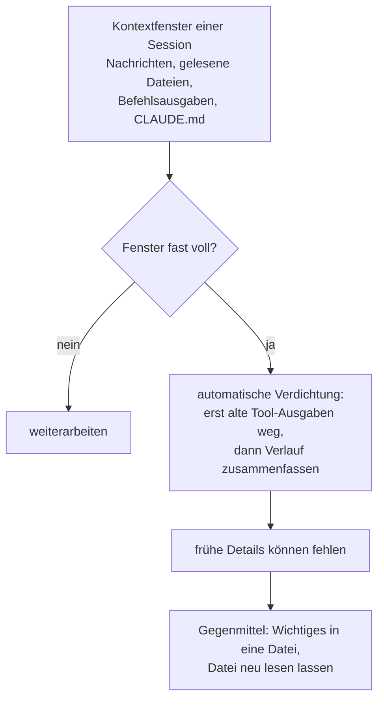

# S1.8 · Das Kontextfenster verstehen

<!-- meta:start -->
> **Regal:** [Kontext & Gedächtnis](README.md#context) · **Stufe:** Kern · **~15 Min** · **Voraussetzungen:** [S1.2 Coding-Agent statt Chat: das Denkmodell](s1-02-agent-statt-chat.md)
>
> ← [S1.7 Modellwahl und Effort](s1-07-modellwahl-und-effort.md) · [Bibliothek](README.md) · [S1.9 Kontext steuern mit /compact und /rewind](s1-09-kontext-steuern.md) →
<!-- meta:end -->

## Schnellcheck

- Kannst du ohne Nachschlagen aufzählen, was alles in das Kontextfenster einer Session zählt?
- Hast du schon einmal bemerkt, dass Claude nach einer langen Session eine frühe Absprache vergessen hat, und wusstest du, warum?

## Auf einen Blick

Das Kontextfenster ist Claudes Arbeitsgedächtnis für eine Session: Deine Nachrichten, Claudes Antworten, gelesene Dateien und Befehlsausgaben liegen alle darin. Was nicht im Fenster liegt, weiß Claude nicht; es muss es erst lesen. Das Fenster ist begrenzt. Wird es voll, verdichtet Claude Code den Verlauf automatisch zu einer Zusammenfassung, und Details vom Anfang können dabei verloren gehen.

Verlass dich deshalb in einer langen Session nicht darauf, dass Claude frühe Absprachen noch wörtlich kennt.

## Bild im Kopf

Deine Leitstelle hat eine Monitorwand: 200 Kameras, aber nur 20 Monitorplätze. Meldet Tür 47 einen Alarm, schaltest du ihren Feed auf. Was nicht auf einem Monitor läuft, existiert für die Entscheidung des Operators nicht.

Ist die Wand voll, muss ein älterer Feed weichen. Der Operator schreibt dazu einen kurzen Lagebericht und schaltet den Feed ab. Fragt später jemand nach einem Detail, bekommt er, was im Bericht steht. Das Bild selbst ist weg.



## Im Detail

### Was im Kontextfenster liegt

Alles, was Claude während deines Gesprächs „weiß“, liegt in diesem Fenster:

- deine Nachrichten und Claudes Antworten
- Dateien, die Claude liest, auch die, die du mit `@dateiname` in deine Nachricht holst
- Befehlsausgaben
- die `CLAUDE.md`, eine Datei mit festen Vorgaben für das Projekt, die Claude Code bei jedem Start lädt ([S1.10](s1-10-claude-md.md))

Schon bevor du etwas tippst, ist das Fenster nicht leer: Claude Code lädt seine eigenen Anweisungen und die Beschreibungen der Werkzeuge. Wie viel Platz was belegt, zeigt dir `/context`. Die Zeile „Messages“ ist der Teil, den dein Gespräch füllt.

### Wie groß das Fenster ist

Die Größe hängt vom Modell ab; die aktuellen Werte stehen im [Kanon](../_canonical.md). Das klingt oft riesig, aber eine große Codebasis mit vielen Dateien und langen Befehlsausgaben füllt auch ein großes Fenster.

### Was passiert, wenn es voll wird

Nähert sich das Fenster seiner Grenze, verdichtet Claude Code automatisch. Zuerst räumt es ältere Tool-Ausgaben ab, dann fasst es bei Bedarf das Gespräch zusammen. Deine Aufträge und wichtige Code-Stellen bleiben erhalten; ausführliche Anweisungen vom Anfang des Gesprächs können verloren gehen. Die Zusammenfassung ersetzt den wörtlichen Verlauf, und der Wortlaut lässt sich danach nicht zurückholen.

Deshalb zählt ein Gedächtnis außerhalb des Gesprächs. Die `CLAUDE.md` im Projektordner lädt Claude Code nach einer Verdichtung neu von der Platte, und in jeder neuen Session sowieso.

### Woran du die Verdichtung erkennst

- Es erscheint die Meldung „Conversation compacted“.
- Danach beantwortet Claude Fragen zu frühen Entscheidungen ungenauer oder hat eine frühe Vorgabe nicht mehr parat.

Wie du gegensteuerst, bevor es so weit ist, zeigt [S1.9](s1-09-kontext-steuern.md).

## Selbst machen

### Übung: das Fenster füllen und leeren (etwa 8 Minuten)

**Ziel:** Du siehst, dass Claude nur weiß, was im Fenster liegt, und misst mit `/context`, wie eine Datei das Fenster füllt und `/clear` es leert.

**Startzustand:** ein neuer Ordner mit zwei Dateien, die Claude noch nie gesehen hat. Der Befehl legt beide an: eine Notiz mit einem Türcode und ein Ereignisprotokoll mit 800 Zeilen.

```bash
# macOS / Linux / Git Bash
mkdir -p ~/cc-workshop/kontext && cd ~/cc-workshop/kontext
python3 -c "open('notes.txt','w').write('The gate code for DOOR-03 is 4711.\n'); open('events.log','w').write(''.join(f'2026-03-15T09:{i%60:02d}:11 DOOR-{i%7:02d} ACCESS_GRANTED CARD-{1000+i}\n' for i in range(800)))"
claude --permission-mode default
```

```powershell
# Windows PowerShell
New-Item -ItemType Directory -Force -Path "$HOME\cc-workshop\kontext" | Out-Null
Set-Location "$HOME\cc-workshop\kontext"
python -c "open('notes.txt','w').write('The gate code for DOOR-03 is 4711.\n'); open('events.log','w').write(''.join(f'2026-03-15T09:{i%60:02d}:11 DOOR-{i%7:02d} ACCESS_GRANTED CARD-{1000+i}\n' for i in range(800)))"
claude --permission-mode default
```

1. Gib `/context` ein und notier den Wert in der Zeile „Messages“. Er ist winzig: Das Gespräch hat noch nicht begonnen.
2. Frag nach etwas, das nur in der Datei steht, und verbiete das Nachsehen:

```text
Without using any tools: what is the gate code for DOOR-03?
```

   Claude kennt den Code nicht und sagt das. Er liegt nicht im Fenster.

3. Hol die Datei ins Fenster:

<!-- cockpit:example -->
```text
@notes.txt What is the gate code for DOOR-03?
```

   Jetzt nennt Claude den Code.

4. Hol das große Protokoll dazu: `@events.log How many lines mention DOOR-03?` Gib danach wieder `/context` ein. „Messages“ ist um viele tausend Tokens gewachsen: Das ganze Protokoll liegt jetzt im Fenster und bleibt dort bei jeder weiteren Nachricht.
5. Gib `/clear` ein, dann `/context`. „Messages“ ist wieder fast leer. Stell die Frage aus Schritt 2 noch einmal: Claude kennt den Code nicht mehr.

**Geschafft, wenn:**

- [ ] du drei Werte für „Messages“ notiert hast: am Anfang, nach `@events.log` und nach `/clear`
- [ ] Claude den Türcode nur genannt hat, solange `notes.txt` im Fenster lag
- [ ] du in einem Satz sagen kannst, wer das Fenster füllt und wer es leert

## Typische Fallen

- **Eine frühe Absprache gilt nach langer Session nicht mehr.** Sie stand nur im Gespräch und ist bei der Verdichtung untergegangen. Was dauerhaft gelten soll, gehört in die `CLAUDE.md` ([S1.10](s1-10-claude-md.md)).
- **„Das Fenster ist riesig, da geht nichts verloren.“** Auch ein großes Fenster füllt sich mit vielen Dateien und langen Befehlsausgaben. Je voller es wird, desto eher übersieht Claude frühere Anweisungen.
- **Große Dateien mit `@` holen, obwohl eine Zeile reicht.** `@` lädt die ganze Datei. Für eine einzelne Auskunft genügt oft ein gezielter Auftrag wie `Count the lines in events.log that mention DOOR-03`; dann landet nur das Ergebnis im Fenster.

## Check

Du kannst erklären, was im Kontextfenster liegt, was mit frühen Gesprächsinhalten passiert, wenn es voll wird, und woran du die Verdichtung erkennst.

1. Was liegt alles im Kontextfenster einer Session? Nenne mindestens vier Dinge.
2. Was macht Claude Code, wenn das Fenster voll wird, und was kann dabei verloren gehen?
3. Woran erkennst du, dass verdichtet wurde?

<details><summary>Auflösung</summary>

1. Deine Nachrichten, Claudes Antworten, gelesene Dateien (auch die mit `@` geholten), Befehlsausgaben und die `CLAUDE.md`. Dazu kommen von Anfang an Claude Codes eigene Anweisungen und die Beschreibungen der Werkzeuge.
2. Es verdichtet automatisch: Zuerst räumt es ältere Tool-Ausgaben ab, dann fasst es das Gespräch zusammen. Ausführliche Anweisungen vom Anfang können verloren gehen, weil die Zusammenfassung den wörtlichen Verlauf ersetzt.
3. An der Meldung „Conversation compacted“ und daran, dass Claude frühe Entscheidungen danach ungenauer wiedergibt oder eine frühe Vorgabe nicht mehr parat hat.

</details>

<details><summary>Quizfrage</summary>

**Frage:** Nach drei Stunden in derselben Session hält sich Claude nicht mehr an eine Vorgabe, die du ganz am Anfang im Gespräch gemacht hast. Was ist die wahrscheinlichste Ursache?

- **Richtig:** Das Fenster lief voll, Claude Code hat verdichtet, und die Vorgabe steckt nur noch ungenau in der Zusammenfassung.
- Falsch: Claude gewichtet neuere Nachrichten grundsätzlich höher und überschreibt ältere Vorgaben, sobald sie sich widersprechen.
- Falsch: Vorgaben aus dem Gespräch gelten nur für die nächste Antwort; für mehr hättest du sie jedes Mal wiederholen müssen.
- Falsch: Die `CLAUDE.md` wurde nach einer Verdichtung neu geladen und hat dabei alle Vorgaben aus dem Gespräch ersetzt.

</details>

## Weiterlesen

- [Kontextfenster: was lädt und was eine Verdichtung übersteht](https://code.claude.com/docs/en/context-window)
- [So arbeitet Claude Code: wenn der Kontext voll wird](https://code.claude.com/docs/en/how-claude-code-works)
- [Best Practices: der Kontext als wichtigste Ressource](https://code.claude.com/docs/en/best-practices)
- [S1.9 · Kontext steuern mit /compact und /rewind](s1-09-kontext-steuern.md)
- [S1.10 · CLAUDE.md: die Hausordnung des Projekts](s1-10-claude-md.md)
- [S1.11 · Alle Gedächtnis-Ebenen im Überblick](s1-11-gedaechtnis-ebenen.md)
