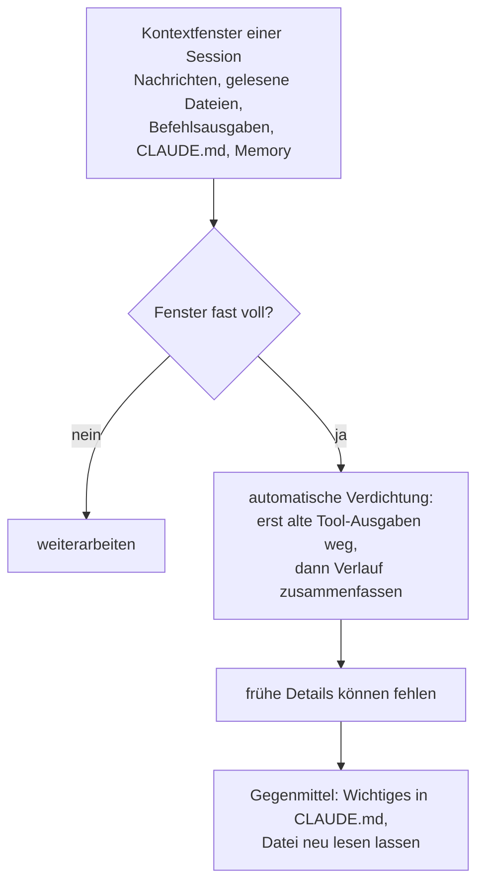

# S1.8 · Das Kontextfenster verstehen

<!-- meta:start -->
> **Regal:** [Kontext & Gedächtnis](README.md#context) · **Stufe:** Kern · **~15 Min** · **Voraussetzungen:** [S1.2 Coding-Agent statt Chat: das Denkmodell](s1-02-agent-statt-chat.md)
>
> ← [S1.7 Modellwahl und Effort](s1-07-modellwahl-und-effort.md) · [Bibliothek](README.md) · [S1.9 Kontext steuern mit /compact und /rewind](s1-09-kontext-steuern.md) →
<!-- meta:end -->

## Schnellcheck

- Kannst du ohne Nachschlagen aufzählen, was alles in das Kontextfenster einer Session zählt?
- Hast du schon einmal bemerkt, dass Claude nach einer langen Session eine frühe Absprache vergessen hat, und wusstest du, warum?

## Auf einen Blick

Das Kontextfenster ist Claudes Arbeitsgedächtnis für eine Session: Deine Nachrichten, Claudes Antworten, gelesene Dateien, Befehlsausgaben und die CLAUDE.md liegen alle darin. Es ist begrenzt. Wird es voll, verdichtet Claude Code den Verlauf automatisch, und Details vom Anfang können dabei verloren gehen.

Verlass dich deshalb in einer langen Session nicht darauf, dass Claude frühe Absprachen noch kennt. Was wichtig ist, schreibst du in eine Datei wie die CLAUDE.md und lässt Claude sie bei Bedarf neu lesen.

## Bild im Kopf

Deine Leitstelle hat eine Monitorwand: 200 Kameras, aber nur 20 Monitorplätze. Meldet Tür 47 einen Alarm, schaltest du ihren Feed auf. Dafür muss ein älterer Feed ins Archiv. Der Operator kann ihn zurückholen, aber das kostet Zeit und Mühe.

So arbeitet das Kontextfenster. Was gerade aktiv ist, steht auf den Monitoren. Älteres wird archiviert, also verdichtet. Du kannst dich darauf beziehen, aber mit weniger Detail als live. Und was nicht auf dem Schirm ist, existiert für die Entscheidung nicht.



## Im Detail

### Was im Kontextfenster liegt

Das Kontextfenster ist Claudes aktives Gedächtnis für eine Session. Alles, was Claude während deines Gesprächs „weiß", liegt in diesem Fenster:

- deine Nachrichten und Claudes Antworten
- Dateien, die Claude liest
- Befehlsausgaben (stdout/stderr)
- der Inhalt der CLAUDE.md
- Memory-Einträge, die beim Sessionstart geladen werden

Schon bevor du etwas tippst, lädt Claude Code außerdem die Namen der MCP-Tools und die Beschreibungen der Skills. Wie viel Platz das alles belegt, zeigt dir `/context` ([S1.9](s1-09-kontext-steuern.md)).

### Wie groß das Fenster ist

Die Größe hängt vom Modell ab; die aktuellen Werte stehen im [Kanon](../_canonical.md). Das klingt oft riesig, aber eine große Codebasis mit vielen Dateien füllt auch ein großes Fenster schnell.

### Was passiert, wenn es voll wird

Nähert sich das Fenster seiner Grenze, verdichtet Claude Code automatisch. Zuerst räumt es ältere Tool-Ausgaben ab, dann fasst es bei Bedarf das Gespräch zusammen. Deine Aufträge und wichtige Code-Stellen bleiben erhalten; ausführliche Anweisungen vom Anfang des Gesprächs können verloren gehen. Die Zusammenfassung ersetzt den wörtlichen Verlauf.

Deshalb zählt ein Gedächtnis außerhalb des Gesprächs. Die CLAUDE.md im Projektordner und das Auto-Memory lädt Claude Code nach einer Verdichtung neu von der Platte, und in jeder neuen Session sowieso ([S1.10](s1-10-claude-md.md), [S1.11](s1-11-gedaechtnis-ebenen.md)).

### Woran du die Verdichtung erkennst

- Claude vergisst Dinge, die es vorher „wusste".
- Antworten zu früheren Entscheidungen werden ungenauer.
- Es erscheint die Meldung „Conversation compacted".

Wie du gegensteuerst, bevor es so weit ist, zeigt [S1.9](s1-09-kontext-steuern.md).

## Selbst machen

### Übung: die Kontext-Streichliste (etwa 4 Minuten, leicht)

**Ziel:** „Kontext" greifbar machen. Dieselbe Frage wird sichtbar besser, sobald die passende Datei per `@` im Kontext liegt. Das bereitet RAG ([S2.18](s2-18-rag-und-notebooklm.md)) und die Isolation von Agenten ([S3.1](s3-01-was-ist-ein-agent.md)) vor.

**Analogie:** die Leitstelle mit wenigen Monitoren. Was nicht auf dem Schirm ist, existiert für die Entscheidung nicht.

**Schritt 1:** Starte Claude Code im `workshop-playground/` und frag ohne Dateiverweis:

```text
Which three vulnerabilities are in the access control?
```

Notier dir die Antwort: geraten oder konkret?

**Schritt 2:** Füll den Kontext gezielt mit der Datei:

<!-- cockpit:example -->
```text
@access_control.py Which vulnerabilities are in here, with line numbers?
```

Sieh zu, wie die Antwort konkret wird.

**Schritt 3:** Tipp `/clear` und stell die Frage aus Schritt 1 noch einmal, ohne `@`. Der Kontext ist *weg*. **Du** füllst und leerst das Fenster, nicht der Zufall.

**Auflösung:** Die Frage aus Schritt 1 nennt drei Schwachstellen. In `access_control.py` stecken fünf absichtlich eingebaute; die Liste steht in den [Lösungen zum Playground](../reference/playground-loesungen.md). Schau nach, ob Claude die Zahl aus der Frage einfach übernommen hat.

## Typische Fallen

- **Eine frühe Absprache gilt nach langer Session nicht mehr.** Sie stand nur im Chat und ist bei der Verdichtung untergegangen. Schreib sie in die CLAUDE.md; die lädt Claude Code nach der Verdichtung neu.
- **„Das Fenster ist riesig, da geht nichts verloren."** Auch ein großes Fenster füllt sich mit vielen Dateien und langen Befehlsausgaben. Je voller es wird, desto eher vergisst Claude frühere Anweisungen oder macht mehr Fehler.

## Check

Du kannst erklären, was mit frühen Gesprächsinhalten passiert, wenn das Kontextfenster voll wird, und warum wichtige Absprachen deshalb in die CLAUDE.md gehören.

1. Was liegt alles im Kontextfenster einer Session? Nenne mindestens vier Dinge.
2. Was macht Claude Code, wenn das Fenster voll wird, und was kann dabei verloren gehen?
3. Woran merkst du, dass die Verdichtung gerade zuschlägt?

<details><summary>Quizfrage</summary>

**Frage:** Claude „vergisst" plötzlich eine Anforderung, die du zu Beginn der Session ausdrücklich genannt hast. Was ist die wahrscheinlichste technische Ursache?

- **Richtig:** Das Fenster lief voll, Claude Code hat verdichtet, und die Anforderung steckt nur noch ungenau in der Zusammenfassung.
- Falsch: Ein Rechte-Fehler hat den Read-Aufruf nachträglich geblockt, mit dem die Anforderung ursprünglich in den Kontext kam.
- Falsch: Das Auto-Memory hat die Anforderung in eine Memory-Datei ausgelagert und sie dafür aus dem Kontext entfernt.
- Falsch: Ein Modellwechsel mitten in der Session hat den Kontext geleert, weil zwei Modelle keine gemeinsame Session haben können.

</details>

## Weiterlesen

- [Kontextfenster: was lädt und was eine Verdichtung übersteht](https://code.claude.com/docs/en/context-window)
- [So arbeitet Claude Code: wenn der Kontext voll wird](https://code.claude.com/docs/en/how-claude-code-works)
- [Best Practices: der Kontext als wichtigste Ressource](https://code.claude.com/docs/en/best-practices)
- [S1.9 · Kontext steuern mit /compact und /rewind](s1-09-kontext-steuern.md)
- [S1.10 · CLAUDE.md: die Hausordnung des Projekts](s1-10-claude-md.md)
- [S1.11 · Alle Gedächtnis-Ebenen im Überblick](s1-11-gedaechtnis-ebenen.md)
