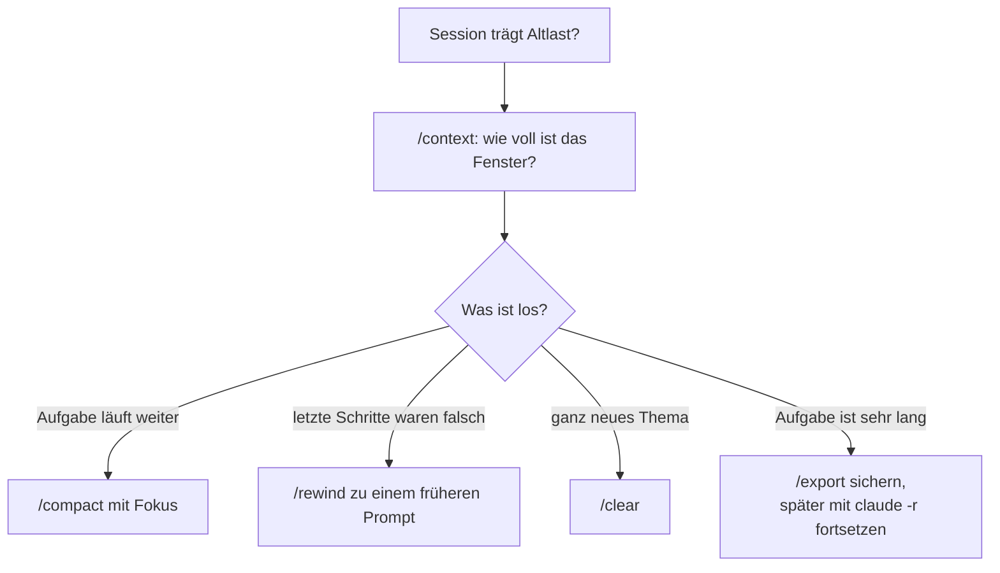

# S1.9 · Kontext steuern mit /compact und /rewind

<!-- meta:start -->
> **Regal:** [Kontext & Gedächtnis](README.md#context) · **Stufe:** Kern · **~12 Min** · **Voraussetzungen:** [S1.8 Das Kontextfenster verstehen](s1-08-kontextfenster.md)
>
> ← [S1.8 Das Kontextfenster verstehen](s1-08-kontextfenster.md) · [Bibliothek](README.md) · [S1.10 CLAUDE.md: die Hausordnung des Projekts](s1-10-claude-md.md) →
<!-- meta:end -->

## Schnellcheck

- Hast du schon einmal `/compact` mit einem Fokus-Hinweis oder `/rewind` benutzt, um eine Session zu retten?
- Kannst du ohne Nachschlagen sagen, wann du `/compact`, `/clear` oder eine neue Session wählst?

## Auf einen Blick

Kontext steuerst du selbst, statt auf die automatische Verdichtung zu warten. `/context` zeigt, wie voll das Fenster ist, und `/compact` verdichtet den Verlauf, auf Wunsch mit einem Fokus, der bestimmt, was die Zusammenfassung behält. `/rewind` springt zu einem früheren Prompt zurück und stellt Code, Gespräch oder beides wieder her. Für ein ganz neues Thema beginnt `/clear` mit leerem Kontext.

## Bild im Kopf

Ein guter Operator wartet nicht, bis die Monitorwand von selbst alte Feeds ins Archiv schiebt. Er schaut nach, wie voll die Wand ist, und räumt selbst auf: Er legt fest, welche Feeds bleiben, und fasst den Rest in einem kurzen Lagebericht zusammen. War eine Umschaltung falsch, springt er auf einen gespeicherten Stand zurück, statt jeden Schritt einzeln rückgängig zu machen. Beginnt ein ganz neuer Einsatz, macht er die Wand frei.

Übersetzt: `/context` ist der Blick auf die Wand, `/compact` mit Fokus der Lagebericht, `/rewind` der Sprung auf den gespeicherten Stand und `/clear` die freie Wand.



## Im Detail

### Mit der Verdichtung umgehen

1. **Verdichte rechtzeitig selbst.** Nimm `/compact`, bevor das Limit erreicht ist, gern mit einem Fokus-Hinweis: `/compact focus on the API changes`. Die Zusammenfassung behält dann, was du wählst, statt was die Automatik für wichtig hält.
2. **Schau auf die Auslastung.** `/context` zeigt, wie viel vom Fenster verbraucht ist und welche CLAUDE.md- und Memory-Dateien geladen sind.
3. **Halte wichtige Entscheidungen in der CLAUDE.md fest**, nicht nur im Gespräch. Die CLAUDE.md im Projektordner lädt Claude Code nach jeder Verdichtung neu.
4. **Bemerkst du Drift**, sag „Reread the CLAUDE.md" oder füge die wichtigste Vorgabe noch einmal ein.
5. **Lass wichtige Dateien vor kritischen Schritten neu lesen.** Verlass dich nicht darauf, dass Claude sich an etwas von vor vielen Runden erinnert.
6. **Teile sehr lange Aufgaben auf mehrere Sessions auf.** `/export` sichert den Gesprächsverlauf, `claude -r <name>` setzt eine benannte Session fort. Fokussierte Sessions vermeiden Drift durch Verdichtung bei komplexer Arbeit.
7. **Was in allen Sessions gelten soll**, gehört ins Gedächtnis: in die CLAUDE.md ([S1.10](s1-10-claude-md.md)) oder ins Auto-Memory ([S1.11](s1-11-gedaechtnis-ebenen.md)). Die CLAUDE.md schreibst du selbst und hältst sie knapp, weil sie in jeder Session Platz belegt; das Auto-Memory führt Claude laufend fort.

### /compact, /clear oder neue Session?

- **`/compact [focus]`** verdichtet das Gespräch und behält die wichtigen Punkte. Das passt zu langen Sessions, deren Aufgabe noch nicht fertig ist.
- **`/clear`** beginnt ein neues Gespräch mit leerem Kontext. Das passt zu einem kompletten Themenwechsel: Ein altes Gespräch verdrängt sonst die Dateien, die du als Nächstes brauchst, und kostet bei jeder Nachricht Tokens.
- **Hast du Claude in einer Session mehr als zweimal zum selben Problem korrigiert**, steckt der Kontext voller gescheiterter Anläufe. Dann hilft `/clear` mit einem neuen, genaueren Auftrag, der das Gelernte enthält.

### /rewind: mehrere Schritte zurück

Jeder Prompt, mit dem du einen neuen Arbeitsschritt startest, legt einen Checkpoint an. `/rewind` (oder zweimal `Esc` bei leerer Eingabe) öffnet ein Menü mit deinen bisherigen Prompts. Du wählst einen Punkt und dann, was passieren soll:

- **Restore code and conversation:** Code und Gespräch auf diesen Stand zurück
- **Restore conversation:** nur das Gespräch zurück, der Code bleibt
- **Restore code:** nur die Dateiänderungen zurück, das Gespräch bleibt
- **Summarize from here** und **Summarize up to here:** den Verlauf ab oder bis zu diesem Punkt zusammenfassen, wie ein gezieltes `/compact`

So machst du mehrere Schritte auf einmal rückgängig, nicht nur den letzten. Zwei Grenzen: Dateien, die Claude per Bash-Befehl geändert hat (etwa mit `rm`, `mv` oder `cp`), erfasst der Checkpoint nicht. Und Checkpoints ersetzen Git nicht. Wie `/rewind` neben den Git-Befehlen in der Session einzuordnen ist, zeigt [S1.17](s1-17-git-befehle.md).

So sieht das in einer laufenden Session aus:

<!-- cockpit:example -->
```text
# Kontext proaktiv verdichten, Fokus auf den OSDP-Parser-Refactor:
/compact focus on the OSDP parser refactor and relay timing changes

# Mehrere Schritte auf einmal zurückdrehen:
/rewind
# Das Menü listet deine bisherigen Prompts: Punkt wählen, dann z. B. "Restore code and conversation"
```

### Die wichtigsten Kontext-Befehle

| Befehl | Was er tut |
|---|---|
| `/context` | Zeigt die Auslastung des Kontextfensters, also wie voll deine „Monitorwand" ist |
| `/compact [focus]` | Verdichtet den Kontext proaktiv, optional mit Fokus-Hinweis |
| `/clear` | Beginnt ein neues Gespräch mit leerem Kontext |
| `/rewind` | Springt zu einem Checkpoint zurück und macht mehrere Schritte auf einmal rückgängig |
| `/export [file]` | Exportiert das Gespräch in eine Datei zum Nachlesen |
| `/resume <name>` | Setzt eine benannte Session mit ihrem Verlauf fort |
| `/memory` | CLAUDE.md-Dateien bearbeiten, Auto-Memory ein- oder ausschalten und seine Einträge ansehen |
| `/init` | Legt eine CLAUDE.md für das Projekt an oder schlägt Verbesserungen vor ([S1.10](s1-10-claude-md.md)) |

## Typische Fallen

- **`/compact` macht nichts rückgängig.** Es fasst nur den Verlauf zusammen; die Dateien auf der Platte bleiben, wie sie sind. Zum Zurückdrehen nimmst du `/rewind`.
- **`/rewind` holt eine per Bash gelöschte Datei nicht zurück.** Nur Änderungen über Claudes Datei-Werkzeuge landen im Checkpoint. Für alles andere brauchst du Git.
- **Nach `/compact` ist eine Vorgabe weg.** Sie stand nur im Gespräch, oder in einer verschachtelten CLAUDE.md oder einer Regel mit `paths:`, die seitdem nicht wieder geladen wurde ([S1.11](s1-11-gedaechtnis-ebenen.md)). Was dauerhaft gelten soll, gehört in die CLAUDE.md im Projektordner.

## Check

Du kannst in einem Satz sagen, wann du `/compact` und wann `/rewind` nimmst, und was keins von beiden leistet: Wissen über Sessions hinweg sichern.

1. Was bewirkt ein Fokus-Hinweis bei `/compact`?
2. Welche Änderungen kann `/rewind` nicht zurückholen?
3. Wann ist `/clear` besser als `/compact`?

<details><summary>Quizfrage</summary>

**Frage:** Du willst die letzten fünf Dateiänderungen zurücknehmen, die Claude in einer Refactor-Session gemacht hat. Welcher Befehl ist richtig, und was würde `/compact` hier bewirken?

- **Richtig:** `/rewind` springt zu einem Checkpoint und stellt den Code wieder her; `/compact` fasst nur den Verlauf zusammen, Dateien bleiben.
- Falsch: `/export` schreibt die geänderten Dateien als Patch, den du danach mit `/revert` zurückspielst; `/compact` spielt dabei keine Rolle.
- Falsch: `/context --undo` nimmt mehrstufige Änderungen zurück; `/compact` würde dabei nur den Tokenverbrauch neu zählen.
- Falsch: Beide wirken gleich, wenn du `/compact reset` aufrufst, weil das den Kontext und alle Dateien auf den Start zurücksetzt.

</details>

## Weiterlesen

- [Checkpointing und /rewind](https://code.claude.com/docs/en/checkpointing)
- [Kontextfenster: wenn es voll wird](https://code.claude.com/docs/en/context-window)
- [Befehlsreferenz](https://code.claude.com/docs/en/commands)
- [S1.8 · Das Kontextfenster verstehen](s1-08-kontextfenster.md)
- [S1.10 · CLAUDE.md: die Hausordnung des Projekts](s1-10-claude-md.md)
- [S1.11 · Alle Gedächtnis-Ebenen im Überblick](s1-11-gedaechtnis-ebenen.md)
- [S1.17 · Git-Befehle in der Sitzung](s1-17-git-befehle.md)
