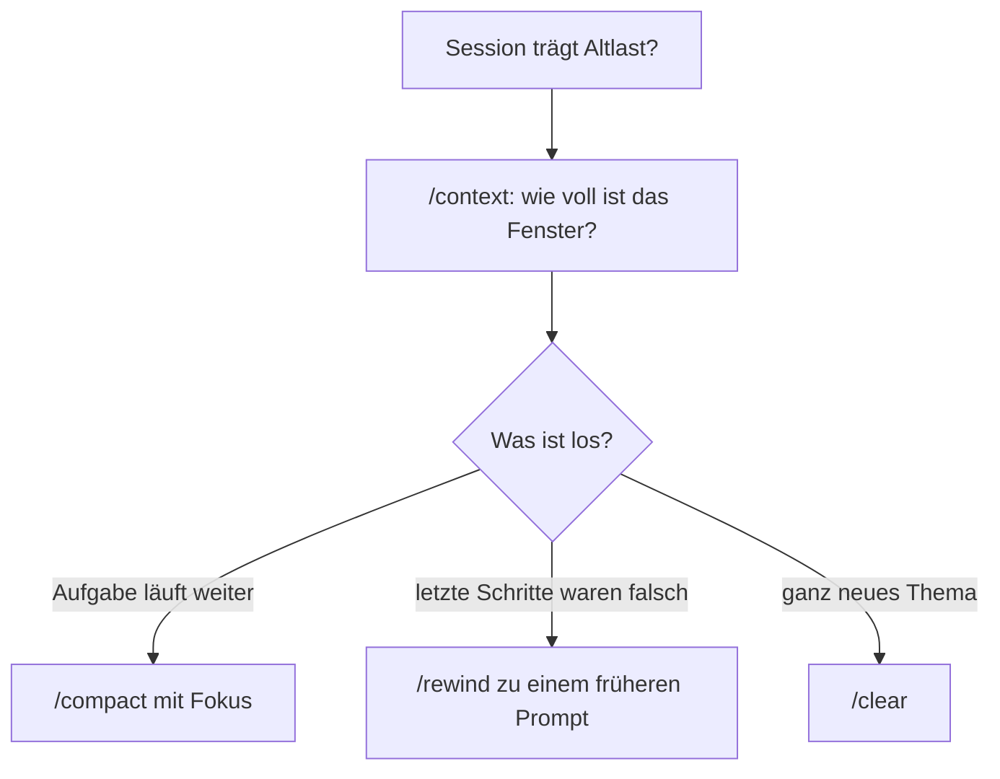

# S1.9 · Kontext steuern mit /compact und /rewind

<!-- meta:start -->
> **Regal:** [Kontext & Gedächtnis](README.md#context) · **Stufe:** Kern · **~15 Min** · **Voraussetzungen:** [S1.8 Das Kontextfenster verstehen](s1-08-kontextfenster.md)
>
> ← [S1.8 Das Kontextfenster verstehen](s1-08-kontextfenster.md) · [Bibliothek](README.md) · [S1.10 CLAUDE.md: die Hausordnung des Projekts](s1-10-claude-md.md) →
<!-- meta:end -->

## Schnellcheck

- Hast du schon einmal `/compact` mit einem Fokus-Hinweis oder `/rewind` benutzt, um eine Session zu retten?
- Kannst du ohne Nachschlagen sagen, wann du `/compact`, `/clear` oder eine neue Session wählst?

## Auf einen Blick

Kontext steuerst du selbst, statt auf die automatische Verdichtung zu warten. `/context` zeigt, wie voll das Fenster ist, und `/compact` verdichtet den Verlauf, auf Wunsch mit einem Fokus, der bestimmt, was die Zusammenfassung behält. `/rewind` springt zu einem früheren Prompt zurück und stellt Code, Gespräch oder beides wieder her. Für ein ganz neues Thema beginnt `/clear` mit leerem Kontext.

Keiner dieser Befehle sichert Wissen über Sessions hinweg. Dafür gibt es die `CLAUDE.md` ([S1.10](s1-10-claude-md.md)).

## Bild im Kopf

Ein guter Operator wartet nicht, bis die Monitorwand von selbst alte Feeds abschaltet. Er schaut nach, wie voll die Wand ist, und räumt selbst auf: Er legt fest, welche Feeds bleiben, und fasst den Rest in einem Lagebericht zusammen, in dem steht, was ihm wichtig ist. War eine Umschaltung falsch, springt er auf einen gespeicherten Stand zurück, statt jeden Schritt einzeln rückgängig zu machen. Beginnt ein ganz neuer Einsatz, macht er die Wand frei.

Übersetzt: `/context` ist der Blick auf die Wand, `/compact` mit Fokus der Lagebericht, `/rewind` der Sprung auf den gespeicherten Stand und `/clear` die freie Wand.



## Im Detail

### /context und /compact: nachsehen und gezielt verdichten

`/context` zeigt, wie viel vom Fenster verbraucht ist und wofür. Verdichte selbst, bevor die Automatik es tut, und sag dazu, was bleiben soll:

```text
/compact focus on the API changes
```

Die Zusammenfassung behält dann, was du wählst, statt was die Automatik für wichtig hält. Claude Code meldet „Compacted“; ein zweites `/context` zeigt, was die Verdichtung gebracht hat.

Zwei Gewohnheiten gehören dazu. Lass wichtige Dateien vor einem kritischen Schritt neu lesen, statt dich darauf zu verlassen, dass Claude sich an etwas von vor vielen Runden erinnert. Und bemerkst du, dass Claude von einer Vorgabe abweicht, füg sie noch einmal ein.

### /compact, /clear oder neue Session?

- **`/compact [focus]`** passt zu langen Sessions, deren Aufgabe noch nicht fertig ist.
- **`/clear`** passt zu einem Themenwechsel: Ein altes Gespräch belegt sonst den Platz, den du für die neue Aufgabe brauchst, und kostet bei jeder Nachricht Tokens.
- **Hast du Claude mehr als zweimal zum selben Problem korrigiert**, steckt der Kontext voller gescheiterter Anläufe. Dann hilft `/clear` mit einem neuen, genaueren Auftrag, der das Gelernte enthält.
- **Eine neue Session** passt, wenn eine sehr lange Aufgabe einen natürlichen Schnitt hat. Fokussierte Sessions vermeiden Drift durch Verdichtung.

### /rewind: mehrere Schritte zurück

Jeder Prompt, mit dem du einen neuen Arbeitsschritt startest, legt einen Checkpoint an. `/rewind` (oder zweimal `Esc` bei leerer Eingabe) öffnet eine Liste deiner bisherigen Prompts, je mit den Dateien, die sich danach geändert haben. Du wählst einen Prompt, und Claude Code stellt den Stand **vor** diesem Prompt wieder her. Was genau, entscheidest du:

- **Restore code and conversation:** Code und Gespräch zurück
- **Restore conversation:** nur das Gespräch zurück, der Code bleibt
- **Restore code:** nur die Dateiänderungen zurück, das Gespräch bleibt
- **Summarize from here** und **Summarize up to here:** den Verlauf ab oder bis zu diesem Punkt zusammenfassen, wie ein gezieltes `/compact`

So machst du mehrere Schritte auf einmal rückgängig, nicht nur den letzten. Drei Grenzen: Dateien, die Claude per Shell-Befehl geändert hat (etwa mit `rm`, `mv` oder `cp`), erfasst der Checkpoint nicht. Symbolisch oder hart verlinkte Dateien überspringt die Wiederherstellung. Und Checkpoints ersetzen Git nicht ([S1.17](s1-17-git-befehle.md)).

So sieht das in einer laufenden Session aus:

<!-- cockpit:example -->
```text
# Kontext proaktiv verdichten, Fokus auf den OSDP-Parser-Refactor:
/compact focus on the OSDP parser refactor and relay timing changes

# Mehrere Schritte auf einmal zurückdrehen:
/rewind
# Das Menü listet deine bisherigen Prompts: Punkt wählen, dann z. B. "Restore code and conversation"
```

### Die Befehle auf einen Blick

| Befehl | Was er tut |
|---|---|
| `/context` | zeigt die Auslastung des Kontextfensters |
| `/compact [focus]` | verdichtet den Verlauf, optional mit Fokus-Hinweis |
| `/rewind` | springt zum Stand vor einem früheren Prompt zurück |
| `/clear` | beginnt ein neues Gespräch mit leerem Kontext |

## Selbst machen

### Übung: zurückdrehen und verdichten (etwa 10 Minuten)

**Ziel:** Du drehst eine unerwünschte Änderung mit `/rewind` zurück und verdichtest danach mit Fokus. Beides prüfst du nach: am Code und an `/context`.

**Startzustand:** der Ordner `~/cc-workshop/kontext` aus [S1.8](s1-08-kontextfenster.md) mit `events.log`. Starte dort mit `claude --permission-mode acceptEdits`, damit Dateiänderungen ohne Rückfrage laufen; das Ausführen des Skripts gibst du weiter einzeln frei.

1. Lass ein kleines Skript bauen: `Create summary.py that prints the number of events per door in events.log, and run it.`
2. Lass es erweitern: `Add a --door flag to summary.py that limits the output to one door.`
3. Jetzt eine Änderung, die du nicht behalten willst: `Rename every variable in summary.py to a single letter. Do not run anything.` Bitte Claude danach, dir die Datei zu zeigen. Die Namen sind unlesbar.
4. Gib `/rewind` ein. Wähl mit der Pfeiltaste den Prompt aus Schritt 3 und drück Enter. Claude Code zeigt, was es wiederherstellen würde. Wähl „Restore code and conversation“.
5. Der zurückgenommene Auftrag steht jetzt wieder in der Eingabezeile. Lösch ihn. Bitte Claude, dir `summary.py` zu zeigen: Die Namen sind wieder lesbar, das Flag `--door` ist noch da.
6. Gib `/context` ein und notier „Messages“. Verdichte dann gezielt: `/compact focus on the --door flag`. Gib wieder `/context` ein und vergleich.

**Geschafft, wenn:**

- [ ] `summary.py` das Flag `--door` hat, aber keine einbuchstabigen Variablennamen
- [ ] du im Menü von `/rewind` den Prompt aus Schritt 3 gewählt und die Vorschau der Wiederherstellung gelesen hast
- [ ] „Messages“ nach `/compact` kleiner ist als davor
- [ ] du sagen kannst, warum hier `/rewind` und nicht `/compact` die Änderung zurückgenommen hat

## Typische Fallen

- **`/compact` macht nichts rückgängig.** Es fasst nur den Verlauf zusammen; die Dateien auf der Platte bleiben, wie sie sind. Zum Zurückdrehen nimmst du `/rewind`.
- **`/rewind` holt eine per Shell-Befehl gelöschte Datei nicht zurück.** Nur Änderungen über Claudes Datei-Werkzeuge landen im Checkpoint. Für alles andere brauchst du Git.
- **Nach `/compact` ist eine Vorgabe weg.** Sie stand nur im Gespräch. Was dauerhaft gelten soll, gehört in die `CLAUDE.md` im Projektordner ([S1.10](s1-10-claude-md.md)).

## Check

Du kannst sagen, wann du `/compact`, `/rewind` oder `/clear` nimmst, und was keiner der drei leistet: Wissen über Sessions hinweg sichern.

1. Was bewirkt ein Fokus-Hinweis bei `/compact`?
2. Welchen Stand stellt `/rewind` wieder her, und welche Änderungen kann es nicht zurückholen?
3. Wann ist `/clear` besser als `/compact`?

<details><summary>Auflösung</summary>

1. Die Zusammenfassung behält, was du nennst, statt was die Automatik für wichtig hält.
2. Den Stand vor dem gewählten Prompt, je nach Wahl Code, Gespräch oder beides. Nicht zurückholen kann es Dateien, die Claude per Shell-Befehl geändert oder gelöscht hat, etwa mit `rm` oder `mv`, und verlinkte Dateien.
3. Bei einem Themenwechsel und wenn du Claude mehr als zweimal zum selben Problem korrigiert hast: Dann stört der alte Verlauf mehr, als er nützt.

</details>

<details><summary>Quizfrage</summary>

**Frage:** Claude hat in einer Refactor-Session fünf Dateien über seine Datei-Werkzeuge geändert, und du willst alle fünf Änderungen zurücknehmen. Welcher Befehl ist richtig?

- **Richtig:** `/rewind`: den Prompt wählen, mit dem die Änderungen begannen, und den Code wiederherstellen lassen.
- Falsch: `/compact`: Es verdichtet den Verlauf und setzt dabei die geänderten Dateien auf ihren alten Stand.
- Falsch: `/clear`: Es leert den Kontext und verwirft damit auch alle Änderungen der laufenden Session.
- Falsch: `/context`: Es zeigt die geänderten Dateien an und bietet für jede das Zurücksetzen an.

</details>

## Weiterlesen

- [Checkpointing und /rewind](https://code.claude.com/docs/en/checkpointing)
- [Kontextfenster: wenn es voll wird](https://code.claude.com/docs/en/context-window)
- [Befehlsreferenz](https://code.claude.com/docs/en/commands)
- [S1.8 · Das Kontextfenster verstehen](s1-08-kontextfenster.md)
- [S1.10 · CLAUDE.md: die Hausordnung des Projekts](s1-10-claude-md.md)
- [S1.11 · Alle Gedächtnis-Ebenen im Überblick](s1-11-gedaechtnis-ebenen.md)
- [S1.17 · Git-Befehle in der Sitzung](s1-17-git-befehle.md)
