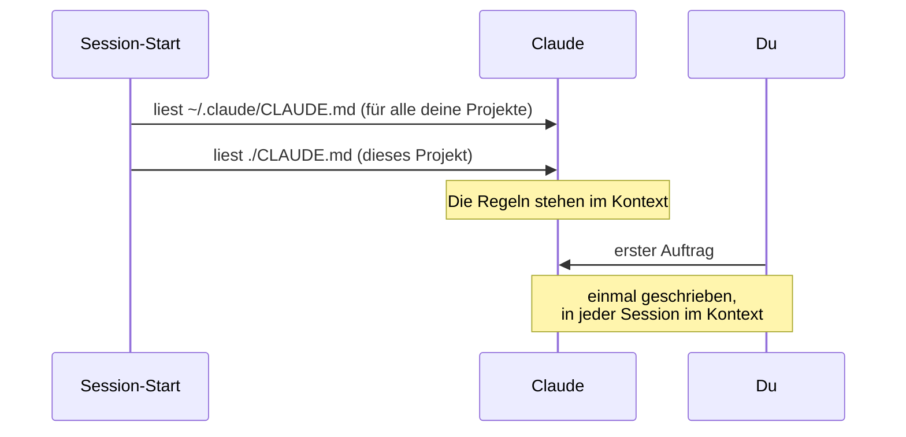

# S1.10 · CLAUDE.md: die Hausordnung des Projekts

<!-- meta:start -->
> **Regal:** [Kontext & Gedächtnis](README.md#context) · **Stufe:** Kern · **~15 Min** · **Voraussetzungen:** [S1.2 Coding-Agent statt Chat: das Denkmodell](s1-02-agent-statt-chat.md)
>
> ← [S1.9 Kontext steuern mit /compact und /rewind](s1-09-kontext-steuern.md) · [Bibliothek](README.md) · [S1.11 Alle Gedächtnis-Ebenen im Überblick](s1-11-gedaechtnis-ebenen.md) →
<!-- meta:end -->

## Schnellcheck

- Hast du schon eine CLAUDE.md für ein echtes Projekt geschrieben und nach einem Neustart geprüft, dass Claude die Regeln kennt?
- Kannst du ohne Nachschlagen drei Dinge nennen, die in eine CLAUDE.md gehören, und drei, die nicht hineingehören?

## Auf einen Blick

CLAUDE.md ist eine Markdown-Datei, die Claude Code zu Beginn jeder Session automatisch liest: die Hausordnung deines Projekts mit Stack, Konventionen und Verboten. Du schreibst die Regeln einmal, und Claude hat sie in jeder Session vor Augen, ohne dass du sie wiederholst. Halte die Datei knapp und schreib nie Geheimnisse hinein.

Eine Hausordnung ist aber kein Türschloss. Claude behandelt die CLAUDE.md als Kontext, nicht als erzwungene Regel: Meist hält es sich daran, garantiert ist es nicht. Was sicher verhindert werden muss, blockt ein Hook ([S2.8](s2-08-hook-einrichten.md)).

## Bild im Kopf

Ein neuer Auftragnehmer bekommt beim Betreten des Geländes die Hausordnung: welche Bereiche er betreten darf, welche gesperrt sind, was bei einem Alarm zu tun ist, wen er anruft. Er liest sie, bevor er mit der Arbeit anfängt, und zwar bei jedem Einsatz.

Die CLAUDE.md ist genau diese Hausordnung. Claude liest sie zu Beginn jeder Session, bevor es irgendetwas tut. Steht darin „always run pytest before committing", lässt Claude vor dem Commit pytest laufen. Steht darin „never modify the legacy firmware parser", behandelt Claude den Parser als Sperrzone. Du schreibst die Hausordnung einmal, und Claude liest sie jede Session, ohne dass du erinnern musst. Aber wie beim Auftragnehmer gilt: Wer eine Regel übersieht, kommt trotzdem durch die Tür. Verriegeln kann nur ein Schloss.



## Im Detail

### Zwei Ebenen für den Anfang

- `./CLAUDE.md`: Projektebene, im Repo eingecheckt, gilt für dieses Projekt. Sie darf auch unter `./.claude/CLAUDE.md` liegen.
- `~/.claude/CLAUDE.md`: Nutzerebene, gilt für alle deine Claude-Code-Sessions.

Claude Code liest beide und fügt sie zusammen; die Nutzerebene steht dabei zuerst im Kontext, das Projekt danach. Es gibt noch weitere Ebenen: deine private `CLAUDE.local.md`, die Managed Policy deiner Organisation und Regeln unter `.claude/rules/`. Die stehen in [S1.11](s1-11-gedaechtnis-ebenen.md).

### Mit /init anfangen

`/init` erzeugt eine erste CLAUDE.md. Claude untersucht dafür die Codebasis und schreibt Build-Befehle, Testaufrufe und Konventionen hinein, die es findet. Gibt es schon eine CLAUDE.md, schlägt `/init` Verbesserungen vor, statt sie zu überschreiben. Danach ergänzt du, was Claude nicht selbst herausfinden kann.

### Was hineingehört

- Technologie-Stack und Versionen
- Code-Konventionen (Benennung, Formatierung, Test-Framework, Lint-Regeln)
- Projektbegriffe und Fachwissen aus deiner Domäne
- Was nicht getan werden darf (etwa „never use global state", „never modify the legacy parser")
- Hinweise zum Deployment, wichtige Dateiorte
- Kontakt- oder Eskalationshinweise, wenn sie relevant sind

### Was nicht hineingehört

- **Geheimnisse** (API-Keys, Passwörter): Sie gehören nie in Klartextdateien. Die CLAUDE.md ist eingecheckt, und Versionskontrolle ist kein Tresor.
- **Vorübergehender Aufgabenkontext:** Dafür ist das Gespräch da.
- **Lange Dokumentation:** Claude liest die Datei jede Session, also halte sie knapp. Die offizielle Doku empfiehlt unter 200 Zeilen je CLAUDE.md; längere Dateien belegen mehr Kontext und werden schlechter befolgt. Für eine eingecheckte CLAUDE.md schlägt `/doctor` Kürzungen vor.

### Leitplanke, keine Sperre

Claude liest die CLAUDE.md als Kontext, nicht als erzwungene Konfiguration. Eine Regel wie „never modify …" respektiert das Modell meistens. Weil sein Verhalten aber nicht deterministisch ist, tut es das nicht garantiert jedes Mal. CLAUDE.md-Regeln sind **Leitplanken**, kein hartes Schloss. Die harte Sperre ist ein **Hook**: Er blockt die Aktion, egal wie das Modell gerade entscheidet ([S2.8](s2-08-hook-einrichten.md)).

## Vorführen

### Demo: CLAUDE.md live

**Ziel:** Zeigen, wie eine CLAUDE.md entsteht, wie Claude beendet und neu gestartet wird und danach die Projektkonventionen noch kennt, ohne dass du sie wiederholst. Schritt 5 der Demo, ein Memory-Eintrag, steht in [S1.11](s1-11-gedaechtnis-ebenen.md).

**Schritt 1: das Demo-Projekt anlegen**

Im Terminal (außerhalb von Claude Code oder über Claudes Bash):

```
mkdir -p ~/cc-workshop/demos/demo-1.2 && cd ~/cc-workshop/demos/demo-1.2 && git init
```

Starte dann Claude Code in diesem Ordner:

```
claude
```

**Schritt 2: die CLAUDE.md über Claude Code anlegen**

Tipp in Claude Code:

```
Create a CLAUDE.md file for this project. It's a Python CLI tool for access control management.
Include these conventions:
- Python 3.11+
- pytest for all tests (pytest-cov for coverage)
- black for formatting (line length 88)
- Type hints required on all function signatures
- Explicit error handling — never use bare except clauses
- No global state — all configuration passed as parameters
- Log using the standard logging module, not print statements
- The legacy module legacy_panel_parser.py must never be modified
```

**Erwartet:** Claude legt `./CLAUDE.md` mit diesen Konventionen in sauberem Markdown an.

Zeig die Datei kurz. Du kannst Claude bitten: „Show me the CLAUDE.md you just created."

**Schritt 3: beenden und neu starten**

Tipp in Claude Code:

```
exit
```

Starte dann neu:

```
claude
```

**Schritt 4: prüfen, ob die CLAUDE.md geladen wurde**

Tipp in Claude Code:

```
What are the coding conventions for this project?
```

**Erwartet:** Claude zählt die Konventionen aus der CLAUDE.md auf: pytest, black, Type Hints, kein globaler Zustand, kein nacktes `except` und so weiter. Es hat die CLAUDE.md beim Start gelesen.

Eine Nachfrage zum Festigen:

```
If I ask you to modify legacy_panel_parser.py, what would you do?
```

**Erwartet:** Claude sagt, dass es ablehnen oder nachfragen würde, weil die CLAUDE.md verbietet, diese Datei zu ändern.

<details><summary>Für Moderierende</summary>

**Dauer:** Die ganze Demo 1.2 dauert etwa 10 Minuten, Schritt 5 aus [S1.11](s1-11-gedaechtnis-ebenen.md) eingeschlossen.

**Sagen:**

- Schritt 1: „Frisches Projekt. Keine CLAUDE.md, kein Memory. Claude weiß über dieses Projekt nichts außer dem, was ich ihm jetzt sage."
- Schritt 2: „Das ist unsere Hausordnung. Jede Regel steht Claude in jeder Session vor Augen, ohne dass ich erinnern muss. Denkt an die Sicherheitsrichtlinie, die jeder Auftragnehmer vor Arbeitsbeginn in die Hand bekommt."
- Schritt 3, während des Neustarts: „Neue Session. Leeres Blatt. Claude erinnert sich nicht an unser Gespräch. Außer …"
- Schritt 4: „Ich habe Claude die Regeln genau einmal gesagt. Ich habe beendet, neu gestartet, und es kennt sie noch. Die CLAUDE.md wird jede Session automatisch geladen. So schreibst du die Regeln einmal, und Claude hat sie immer vor Augen."
- Nach der Nachfrage: „Die Vorgabe steht in der Datei, nicht in meinem Kopf. Ich muss nicht daran denken, sie Claude zu sagen. Durchgesetzt ist sie damit aber nicht: Das schafft erst ein Hook."

**Wenn Claude die CLAUDE.md nach dem Neustart nicht kennt:** Prüf, ob die Datei im Arbeitsordner oder unter `~/.claude/CLAUDE.md` liegt. `/context` zeigt unter **Memory files**, was geladen ist.

**Wenn Claude die Konventionen in Schritt 4 nicht kennt:** Prüf mit `ls -la CLAUDE.md`, ob die Datei im aktuellen Ordner liegt. Starte Claude Code dann neu und versuch es noch einmal; vielleicht ist die Datei in einem anderen Ordner gelandet.

</details>

## Selbst machen

### Übung: deinen Kontext einrichten

**Ziel:** Eine CLAUDE.md für deinen echten Arbeitsbereich anlegen und prüfen, dass sie einen Neustart der Session übersteht. Der persönliche Memory-Eintrag (Schritt 8) folgt in [S1.11](s1-11-gedaechtnis-ebenen.md).

**Schritt 1: einen Projektordner anlegen**

Such dir einen Ordner, der für ein echtes oder realistisches Projekt aus deiner Arbeit steht. Er darf leer sein; er ist nur das Zuhause für die CLAUDE.md.

macOS, Linux oder Git Bash:

```
mkdir -p ~/cc-workshop/exercises/exercise-1.2 && cd ~/cc-workshop/exercises/exercise-1.2
git init
claude
```

PowerShell:

```powershell
New-Item -ItemType Directory -Force -Path "$HOME\cc-workshop\exercises\exercise-1.2" | Out-Null
Set-Location "$HOME\cc-workshop\exercises\exercise-1.2"
git init
claude
```

**Schritt 2: Claude von deinem Projekt erzählen und die CLAUDE.md schreiben lassen**

Denk daran, woran du wirklich arbeitest. Gib Claude dann einen Auftrag wie diesen:

<!-- cockpit:example -->
```
Create a CLAUDE.md for this project. It is a [describe your project — e.g.,
Python-based alarm management system for commercial buildings].

Include these conventions:
- [Your language/framework, e.g., Python 3.11, asyncio]
- [Your test framework, e.g., pytest with pytest-asyncio]
- [Any formatting tools you use]
- [A rule about something that must never be changed — e.g., the legacy panel interface]
- [A domain-specific convention — e.g., all alarm codes must be in SCREAMING_SNAKE_CASE]
- [Anything else that's specific to your domain or team]
```

**Schritt 3: prüfen und nachschärfen**

Lies, was Claude angelegt hat. Fehlt etwas oder stimmt etwas nicht, sag:

```
Add: [missing rule]
Change the section on [X] to say: [correction]
```

**Schritt 4: in dieser Session prüfen (30 Sekunden)**

Frag Claude, bevor du neu startest, *jetzt gleich* in derselben laufenden Session:

```
What conventions apply to this project?
```

Claude antwortet aus der CLAUDE.md, die es gerade mitgeschrieben hat; sie steht schon im laufenden Kontext. Merk dir diese Antwort: Im nächsten Schritt startest du neu und fragst noch einmal. Es **zweimal** funktionieren zu sehen, einmal in der Session (Kontext im laufenden Prozess) und einmal nach dem Neustart (frisch von der Platte geladen), macht den Unterschied zwischen *Kontext im Gespräch* und *gespeichert* greifbar. Außerdem ist es ein kleiner Erfolg vor dem technisch heikleren Neustart.

**Schritt 5: beenden und neu starten**

```
exit
```

Dann:

```
claude
```

**Schritt 6: die Dauerhaftigkeit testen (nach dem Neustart)**

Frag Claude:

```
What are the coding conventions for this project?
```

Weiß es Bescheid? Nennt es die Regeln, die du in die CLAUDE.md geschrieben hast? Diesmal kommt die Antwort nur aus der CLAUDE.md, frisch von der Platte geladen; der Kontext von vorher ist weg.

**Schritt 7: die „Nie ändern"-Grenze testen**

Bitte Claude:

```
Modify the legacy panel interface module
```

Widerspricht Claude? Meistens sollte es darauf hinweisen, dass die CLAUDE.md das verbietet, **aber nicht garantiert jedes Mal** (siehe „Leitplanke, keine Sperre" oben). Widerspricht es nicht, ist das eine nützliche Lektion und nicht dein Fehler. Die harte Sperre ist ein Hook ([S2.8](s2-08-hook-einrichten.md)): Er blockt die Aktion, egal wie das Modell gerade entscheidet.

Weiter geht es mit Schritt 8 in [S1.11](s1-11-gedaechtnis-ebenen.md): einem persönlichen Memory-Eintrag.

**Geschafft, wenn:**

- [ ] die CLAUDE.md mit deinen echten Konventionen im Projektordner liegt
- [ ] Claude die Konventionen in der Session **und** nach dem Neustart aufzählen kann, ohne dass du sie nennst
- [ ] Claude *meistens* widerspricht, wenn es das geschützte Modul ändern soll, und du weißt, warum das nicht garantiert ist (Schritt 7)

**Tipps**

- Widerspricht Claude beim geschützten Modul nicht, prüf deine CLAUDE.md. Die Regel muss genau sein: „Never modify [exact filename]", nicht nur „be careful with the legacy module".
- Du kannst Claude jederzeit bitten, dir die aktuelle CLAUDE.md zu zeigen: „Show me the contents of CLAUDE.md."
- Eine Regel nachträglich ergänzen: „Add this rule to CLAUDE.md: [rule]"
- Memory oder CLAUDE.md? Projektregeln gehören in die CLAUDE.md des Projekts. Soll eine Vorliebe für alle deine Projekte gelten, gehört sie in `~/.claude/CLAUDE.md`. Das Auto-Memory („Remember that …") gilt nur für das jeweilige Repository ([S1.11](s1-11-gedaechtnis-ebenen.md)).

## Typische Fallen

- **Claude hält sich trotz Regel nicht daran.** Oft ist die Datei zu lang, und die Regel geht unter. Kürze die CLAUDE.md, formuliere die Regel prüfbar, und bau für Unverzichtbares einen Hook.
- **Claude kennt die CLAUDE.md nicht.** Sie liegt in einem anderen Ordner als dem, in dem du Claude gestartet hast. `/context` zeigt unter **Memory files**, welche Dateien geladen sind.
- **Ein Passwort steht „nur kurz" in der CLAUDE.md.** Die Datei ist eingecheckt und landet in jeder Session im Kontext. Geheimnisse gehören nie in Klartextdateien.

## Check

Du kannst eine knappe CLAUDE.md schreiben, nach einem Neustart prüfen, dass Claude sie geladen hat, und erklären, warum sie eine Leitplanke und keine Sperre ist.

1. Nenne eine Dauerregel, die für dein Team in die CLAUDE.md gehört. Gute Antworten sind dauerhafte Projektregeln, keine einmaligen Aufträge.
2. Welche drei Dinge gehören nicht in eine CLAUDE.md, und warum?
3. Wie prüfst du, ob Claude deine CLAUDE.md geladen hat?

<details><summary>Quizfrage</summary>

**Frage:** In deiner CLAUDE.md steht „Never modify legacy_panel_parser.py". Wie verlässlich schützt diese Zeile die Datei?

- **Richtig:** Claude hält sich meist daran, aber garantiert ist es nicht; eine sichere Sperre baust du mit einem Hook.
- Falsch: Vollständig: Claude Code liest die Zeile als Rechte-Regel und lehnt jeden Edit an der Datei technisch ab.
- Falsch: Gar nicht: Die CLAUDE.md liest nur `/init`, in normalen Sessions wirkt die Zeile überhaupt nicht.
- Falsch: Erst nach `/compact`: Vorher steht die CLAUDE.md nicht im Kontext, danach wirkt die Zeile als Sperre.

</details>

## Weiterlesen

- [CLAUDE.md-Dateien](https://code.claude.com/docs/en/memory#claude-md-files)
- [Best Practices: eine wirksame CLAUDE.md schreiben](https://code.claude.com/docs/en/best-practices#write-an-effective-claude-md)
- [S1.11 · Alle Gedächtnis-Ebenen im Überblick](s1-11-gedaechtnis-ebenen.md)
- [S1.12 · Imports, --add-dir und AGENTS.md](s1-12-imports-und-agents-md.md)
- [S1.9 · Kontext steuern mit /compact und /rewind](s1-09-kontext-steuern.md)
- [S2.8 · Einen Hook einrichten, der wirklich blockt](s2-08-hook-einrichten.md)
