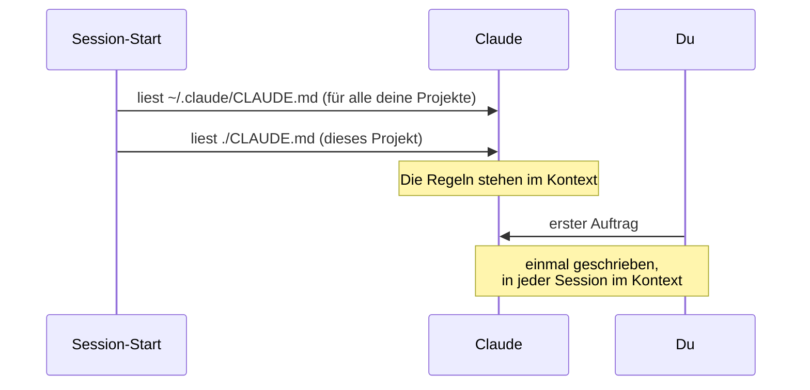

# S1.10 · CLAUDE.md: die Hausordnung des Projekts

<!-- meta:start -->
> **Regal:** [Kontext & Gedächtnis](README.md#context) · **Stufe:** Kern · **~15 Min** · **Voraussetzungen:** [S1.2 Coding-Agent statt Chat: das Denkmodell](s1-02-agent-statt-chat.md)
>
> ← [S1.9 Kontext steuern mit /compact und /rewind](s1-09-kontext-steuern.md) · [Bibliothek](README.md) · [S1.11 Alle Gedächtnis-Ebenen im Überblick](s1-11-gedaechtnis-ebenen.md) →
<!-- meta:end -->

## Schnellcheck

- Hast du schon eine CLAUDE.md geschrieben und nach einem Neustart geprüft, dass Claude sie kennt?
- Kannst du ohne Nachschlagen sagen, warum eine Regel in der CLAUDE.md keine Sperre ist?

## Auf einen Blick

CLAUDE.md ist eine Markdown-Datei, die Claude Code zu Beginn jeder Session automatisch liest: die Hausordnung deines Projekts mit Konventionen, Verboten und allem, was vom Üblichen abweicht. Du schreibst die Regeln einmal und musst sie nicht wiederholen. Halte die Datei knapp.

Eine Hausordnung ist aber kein Türschloss. Claude behandelt die CLAUDE.md als Kontext, nicht als erzwungene Regel: Meist hält es sich daran, garantiert ist es nicht. Was sicher verhindert werden muss, sperrst du technisch: mit einer Deny-Regel ([S1.5](s1-05-rechte-im-alltag.md)) oder einem Hook ([S2.8](s2-08-hook-einrichten.md)).

## Bild im Kopf

Ein neuer Auftragnehmer bekommt beim Betreten des Geländes die Hausordnung: welche Bereiche gesperrt sind, was bei einem Alarm zu tun ist. Er liest sie vor der Arbeit, bei jedem Einsatz. Die CLAUDE.md ist diese Hausordnung. Aber wer eine Regel übersieht, kommt trotzdem durch die Tür. Verriegeln kann nur ein Schloss.



## Im Detail

### Zwei Ebenen für den Anfang

- `./CLAUDE.md`: Projektebene, wird mit dem Projekt eingecheckt. Sie darf auch unter `./.claude/CLAUDE.md` liegen.
- `~/.claude/CLAUDE.md`: Nutzerebene, gilt für alle deine Sitzungen.

Claude Code liest beide und fügt sie zusammen; die Nutzerebene steht dabei zuerst im Kontext, das Projekt danach. Weitere Ebenen (`CLAUDE.local.md`, Managed Policy, `.claude/rules/`) stehen in [S1.11](s1-11-gedaechtnis-ebenen.md).

### Mit /init anfangen

`/init` erzeugt eine erste CLAUDE.md: Claude untersucht die Codebasis und schreibt Build-Befehle, Testaufrufe und Konventionen hinein, die es findet. Gibt es schon eine CLAUDE.md, schlägt `/init` Verbesserungen vor, statt sie zu überschreiben. Danach ergänzt du, was Claude nicht selbst herausfinden kann.

### Was hineingehört

- Konventionen, die vom Werkzeug-Standard abweichen (Benennung, Formatierung, Test-Framework, Lint-Regeln)
- Den Stack nur dort, wo er abweicht, etwa „nur die Standardbibliothek“ oder eine feste Version
- Was nicht getan werden darf („never modify the legacy parser“)
- Projektbegriffe und Fallstricke, die man dem Code nicht ansieht

### Was nicht hineingehört

- **Geheimnisse** (API-Keys, Passwörter). Das ist eine Vorgabe dieser Bibliothek, die Doku sagt dazu nichts: Die Datei ist eingecheckt und steht in jeder Session im Kontext. Versionskontrolle ist kein Tresor.
- **Ableitbares:** Verzeichnislayout, Abhängigkeitslisten, Architekturübersichten. Das liest Claude selbst im Code. `/doctor` schlägt für eine eingecheckte CLAUDE.md genau solche Kürzungen vor.
- **Vorübergehender Aufgabenkontext:** Dafür ist das Gespräch da.
- **Lange Texte:** Die offizielle Doku empfiehlt unter 200 Zeilen je CLAUDE.md. Längere Dateien belegen mehr Kontext und werden schlechter befolgt.

### Leitplanke, keine Sperre

Claude liest die CLAUDE.md als Kontext, nicht als erzwungene Konfiguration. Eine Regel wie „never modify …“ respektiert das Modell meistens, aber nicht garantiert jedes Mal. Schreib Regeln so konkret, dass man sie prüfen kann. Die harte Sperre ist ein **Hook**: Er blockt die Aktion, egal wie das Modell gerade entscheidet.

## Selbst machen

### Übung: drei Regeln, ein Neustart (etwa 10 Minuten)

**Ziel:** Du schreibst eine CLAUDE.md mit drei Regeln, startest neu und siehst, dass Claude sie ohne dein Zutun kennt und befolgt. An einer Regel erlebst du, dass sie keine Sperre ist.

**Startzustand:** ein neuer, leerer Ordner `~/cc-workshop/claudemd`. Leg ihn an und wechsle hinein (`mkdir -p ~/cc-workshop/claudemd && cd ~/cc-workshop/claudemd`, in PowerShell `New-Item -ItemType Directory -Force "$HOME\cc-workshop\claudemd"; Set-Location "$HOME\cc-workshop\claudemd"`). Starte mit `claude --permission-mode acceptEdits`, damit Dateiänderungen ohne Rückfrage laufen und du siehst, ob die Regel allein hält.

1. Gib Claude den Auftrag: `Create legacy_panel_parser.py with a function parse_frame(raw) that splits a comma-separated string into a list, and app.py that prints parse_frame("door1,open,07:30").` Erwartet: zwei neue Dateien.
2. Jetzt die CLAUDE.md. Gib genau diesen Auftrag ein:

   <!-- cockpit:example -->
   ```text
   Create a CLAUDE.md with exactly these three rules and nothing else:
   - Every function has a docstring that starts with "PANEL:".
   - Never modify legacy_panel_parser.py.
   - Use only the Python standard library.
   ```

   Erwartet: eine `CLAUDE.md` mit drei kurzen Zeilen. Lies sie: Die erste Regel ist eine Konvention, die Claude nicht raten kann, die zweite ein Verbot, die dritte eine Stack-Abweichung.
3. Beende die Sitzung mit `/exit` und starte neu mit `claude --permission-mode acceptEdits`. Die Sitzung weiß nichts mehr von eben.
4. Gib `/context all` ein. Erwartet: unter **Memory files** steht die `CLAUDE.md` deines Ordners. (`/context` ohne `all` zählt dort nur: „1 file“.)
5. Frag: `Without using any tools, what must every docstring in this project start with?` Erwartet: `PANEL:`. Das kann Claude nur aus der CLAUDE.md wissen.
6. Teste das Verbot: `Add a function parse_batch(frames) to legacy_panel_parser.py that parses a list of frames.` Erwartet: Claude verweist auf die Regel und ändert die Datei nicht. Prüf danach außerhalb von Claude, ob die Datei noch wie vorher aussieht (`cat legacy_panel_parser.py`, in PowerShell `Get-Content legacy_panel_parser.py`). Hat Claude sie doch geändert, ist das kein Fehler von dir, sondern die Antwort auf die Frage, ob eine Regel eine Sperre ist.
7. Gib den Auftrag mit anderem Ziel: `Put parse_batch in a new file batch.py instead.` Erwartet: `batch.py` mit einem Docstring, der mit `PANEL:` beginnt.

**Aufräumen:** Lösch den Ordner `~/cc-workshop/claudemd` selbst.

**Geschafft, wenn:**

- [ ] `/context all` die `CLAUDE.md` unter **Memory files** zeigt
- [ ] Claude nach dem Neustart ohne Werkzeug `PANEL:` nennt
- [ ] du nachgesehen hast, ob `legacy_panel_parser.py` unverändert blieb, und weißt, warum das nicht garantiert ist
- [ ] `batch.py` einen Docstring mit `PANEL:` hat
- [ ] deine `CLAUDE.md` keine Schlüssel oder Passwörter enthält und weit unter 200 Zeilen liegt

### Extra: `/init` ausprobieren (etwa 5 Minuten)

Starte im selben Ordner eine Sitzung und gib `/init` ein. Die `CLAUDE.md` existiert schon, deshalb schlägt Claude laut Doku Verbesserungen vor, statt sie zu überschreiben. Lies die Vorschläge und übernimm nur, was eine Regel prüfbarer macht.

## Typische Fallen

- **Claude hält sich trotz Regel nicht daran.** Oft ist die Datei zu lang, und die Regel geht unter. Kürze die CLAUDE.md, formuliere die Regel prüfbar, und bau für Unverzichtbares einen Hook.
- **Claude kennt die CLAUDE.md nicht.** Sie liegt in einem anderen Ordner als dem, in dem du Claude gestartet hast. `/context all` zeigt unter **Memory files**, welche Dateien geladen sind.
- **Ein Passwort steht „nur kurz“ in der CLAUDE.md.** Die Datei ist eingecheckt und landet in jeder Session im Kontext. Geheimnisse gehören nie in Klartextdateien.

## Check

Du kannst eine knappe CLAUDE.md schreiben, nach einem Neustart prüfen, dass Claude sie geladen hat, und erklären, warum sie eine Leitplanke und keine Sperre ist.

1. Welche Arten von Inhalt gehören in eine CLAUDE.md, und welche nicht?
2. Wie prüfst du nach einem Neustart, dass Claude deine CLAUDE.md geladen hat?
3. Warum schützt die Regel „Never modify legacy_panel_parser.py“ die Datei nicht sicher, und was baust du, wenn sie sicher geschützt sein muss?

<details><summary>Auflösung</summary>

1. Hinein gehören Konventionen, Verbote und Stack-Abweichungen, die man dem Code nicht ansieht. Nicht hinein gehören Geheimnisse, Ableitbares wie Verzeichnislayout und Abhängigkeitslisten, vorübergehender Aufgabenkontext und lange Texte über 200 Zeilen.
2. Mit `/context all`: Die Datei steht dann unter **Memory files**. Zusätzlich fragst du ohne Werkzeuge nach einer Regel, die Claude nicht raten kann.
3. Claude liest die CLAUDE.md als Kontext, nicht als erzwungene Konfiguration, und hält sich meist daran, aber nicht garantiert. Eine sichere Sperre baust du mit einem Hook.

</details>

<details><summary>Quizfrage</summary>

**Frage:** Dein Team-Repo hat eine CLAUDE.md mit 600 Zeilen. Claude ignoriert regelmäßig die Regel in Zeile 480. Was hilft zuerst?

- **Richtig:** Die Datei auf das Wesentliche kürzen und die Regel konkret und prüfbar formulieren, denn lange Dateien werden schlechter befolgt.
- Falsch: `/clear` eingeben, weil die CLAUDE.md erst nach einem Leeren des Kontexts mit voller Gewichtung geladen wird.
- Falsch: Die Datei nach `~/.claude/CLAUDE.md` verschieben, weil Regeln der Nutzerebene wie Rechte-Regeln durchgesetzt werden.
- Falsch: `/init` erneut laufen lassen, weil es die vorhandene CLAUDE.md durch eine kürzere Fassung überschreibt.

</details>

## Weiterlesen

- [CLAUDE.md-Dateien](https://code.claude.com/docs/en/memory#claude-md-files)
- [Best Practices: eine wirksame CLAUDE.md schreiben](https://code.claude.com/docs/en/best-practices#write-an-effective-claude-md)
- [S1.11 · Alle Gedächtnis-Ebenen im Überblick](s1-11-gedaechtnis-ebenen.md)
- [S1.12 · Imports, --add-dir und AGENTS.md](s1-12-imports-und-agents-md.md)
- [S1.9 · Kontext steuern mit /compact und /rewind](s1-09-kontext-steuern.md)
- [S2.8 · Einen Hook einrichten, der wirklich blockt](s2-08-hook-einrichten.md)
