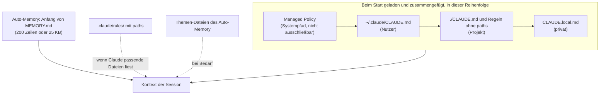

# S1.11 · Alle Gedächtnis-Ebenen im Überblick

<!-- meta:start -->
> **Regal:** [Kontext & Gedächtnis](README.md#context) · **Stufe:** Vertiefung · **~18 Min** · **Voraussetzungen:** [S1.10 CLAUDE.md: die Hausordnung des Projekts](s1-10-claude-md.md)
>
> ← [S1.10 CLAUDE.md: die Hausordnung des Projekts](s1-10-claude-md.md) · [Bibliothek](README.md) · [S1.12 Imports, --add-dir und AGENTS.md](s1-12-imports-und-agents-md.md) →
<!-- meta:end -->

## Schnellcheck

- Hast du schon einmal in `~/.claude/projects/<project>/memory/MEMORY.md` nachgesehen, was Claude über dich oder dein Projekt notiert hat?
- Kannst du ohne Nachschlagen sagen, wann du eine `.claude/rules/`-Datei mit `paths`-Filter statt einer großen CLAUDE.md nimmst?

## Auf einen Blick

Neben der CLAUDE.md hat Claude Code weitere Gedächtnis-Ebenen: das Auto-Memory, in das Claude selbst Notizen schreibt, Regeln unter `.claude/rules/`, die nur für passende Pfade laden, deine private `CLAUDE.local.md` und die Managed Policy deiner Organisation. Das Auto-Memory lädt Claude Code in jede Session, und damit geht es als Kontext an Anthropic: Geheimnisse haben dort nichts verloren.

Die Ebenen werden zusammengefügt, nicht gegeneinander ausgespielt, und keine davon sperrt technisch etwas. Eine harte Grenze setzen nur Einstellungen wie `permissions.deny` oder ein Hook.

## Bild im Kopf

Denk an einen Wachdienst. Das Wachbuch füllt sich von selbst: Die Streife notiert, was ihr auffällt, ohne dass jemand es anordnet. Das ist das Auto-Memory. Für einzelne Zonen gibt es eigene Anweisungen: Die Regeln für den Serverraum sind nicht die der Empfangshalle, und der Pförtner am Empfang muss die Serverraum-Regeln nicht in jeder Schicht auswendig kennen. Sie liegen erst auf dem Tisch, wenn jemand die Zone betritt. Das sind die Regeln unter `.claude/rules/`.

Dazu kommen der private Notizzettel des Technikers (`CLAUDE.local.md`), der nicht ins gemeinsame Handbuch wandert, und die Konzernrichtlinie (Managed Policy), die an jedem Standort ausliegt und die niemand aus dem Ordner nehmen kann. Alle Blätter liegen im selben Ordner; widersprechen sie sich, entscheidet der Leser. Durchgesetzt wird nur, was an der Tür technisch verriegelt ist.



## Im Detail

### Auto-Memory: Claude schreibt selbst mit

Neben der CLAUDE.md hat Claude Code ein Gedächtnis, das Claude selbst führt. Es liegt unter `~/.claude/projects/<project>/memory/`. Auto-Memory ist standardmäßig an: Du musst Claude nicht bitten, sich etwas zu merken. Claude legt während der Arbeit Notizen auf der Platte ab, und die nächste Session startet mit diesem Wissen im Kontext.

Der `<project>`-Ordner wird aus dem Git-Repository abgeleitet. Alle Worktrees und Unterordner desselben Repos teilen sich also ein Auto-Memory. Es bleibt auf deinem Rechner und wird nicht zwischen Rechnern geteilt.

**Der Aufbau:**

- `MEMORY.md` ist die **Index-Datei**, eine Zeile je Notiz. Die ersten 200 Zeilen oder die ersten 25 KB, je nachdem, was zuerst erreicht ist, lädt Claude Code zu Beginn jeder Session.
- **Themen-Dateien** wie `user_role.md` oder `feedback_testing.md` enthalten die einzelnen Notizen. Claude liest sie erst, wenn es sie braucht, so wie eine Bibliothekarin ein bestimmtes Buch aus dem Regal holt, statt die ganze Bibliothek mitzuschleppen.

So bleibt der Sessionstart schlank, und trotzdem kommt Claude bei Bedarf an ein tiefes Archiv.

**Was Claude notiert:** Jede Notiz gehört zu einer von vier Arten.

- `user`: deine Rolle, deine Erfahrung, deine Arbeitsvorlieben, etwa „I prefer German for communication but English for code."
- `feedback`: Korrekturen und Vorgehensweisen, die du bestätigt hast, etwa „Last time you refactored the parser this way, it broke the alarm correlation module."
- `project`: laufende Arbeit, Termine und Entscheidungen, die Claude nicht aus dem Code oder der Git-Historie ableiten kann
- `reference`: wo Informationen außerhalb des Projekts liegen, etwa ein Issue-Tracker oder ein Dashboard

Was Claude aus dem Code ableiten kann (Architektur, Dateipfade, Debugging-Fixes) oder was schon in deiner CLAUDE.md steht, notiert es nicht. Und nicht jede Session hinterlässt eine Notiz.

**Nachsehen, was Claude weiß:** Öffne `~/.claude/projects/<your-project-hash>/memory/MEMORY.md` im Editor oder wähl in `/memory` den Auto-Memory-Ordner. Wahrscheinlich hat Claude schon Notizen angelegt, ohne dass du darum gebeten hast. Unter Windows entsteht der Ordnername aus dem vollen Pfad, mit Bindestrichen statt `:` und `\`: Aus `C:\Users\du\projekt` wird `C--Users-du-projekt`. Die Notizen sind einfaches Markdown; du kannst sie jederzeit bearbeiten oder löschen.

**Merken lassen:** Die Formulierung „Remember that …" funktioniert weiterhin: Bittest du Claude ausdrücklich, sich etwas zu merken, legt es das im Auto-Memory ab. Soll es stattdessen in die CLAUDE.md, sag das ausdrücklich („add this to CLAUDE.md"). Nötig ist die Bitte nicht; das Auto-Memory wächst auch so.

**Ausschalten:** In `/memory` schaltest du das Auto-Memory ab; das speichert `autoMemoryEnabled` in `~/.claude/settings.json`. Für ein einzelnes Projekt setzt du `"autoMemoryEnabled": false` in dessen Einstellungen, per Umgebungsvariable geht es mit `CLAUDE_CODE_DISABLE_AUTO_MEMORY=1`. `claude --bare` ist dagegen kein Memory-Schalter: Dieser Minimalmodus für Skripte lädt neben dem Auto-Memory auch Hooks, Skills, Plugins, MCP-Server und die CLAUDE.md nicht automatisch, und er nutzt keinen Abo-Login ([S4.3](s4-03-headless.md), Zugangsdaten in [S4.4](s4-04-ci-zugang-und-kosten.md)).

> **Datenschutz, das Wichtigste jetzt:** Das Auto-Memory schreibt Notizen auf die Platte und schickt sie als
> Teil des Kontexts jeder Session an Anthropic. **Lass nie Geheimnisse (API-Keys, Zugangsdaten,
> Kundendaten) hineingeraten.** Schau regelmäßig in `MEMORY.md`. Wie du falsche oder veraltete Notizen
> erkennst und entfernst, steht in [S4.10](s4-10-diagnose-schritt-fuer-schritt.md).
> Soll alles weg, was Claude Code lokal zu einem Projekt hält (Transkripte samt Auto-Memory,
> Prompt-Verlauf, den Eintrag in `~/.claude.json`), nimm `claude project purge`. Es zeigt den
> Löschplan und fragt nach; mit `--dry-run` zeigt es nur den Plan und löscht nichts:

```bash
claude project purge ~/work/my-repo --dry-run
```

### `.claude/rules/`: Regeln je Pfad

Eine einzige CLAUDE.md reicht für kleine Projekte. In größeren Codebasen mit eigenen Konventionen je Unterordner, etwa `src/api/` nach REST-Konventionen und `src/firmware/` als C mit Embedded-Regeln, nimmst du **pfadbezogene Regeln**.

Regeln liegen in `.claude/rules/<name>.md` und nennen im **YAML-Frontmatter** unter `paths` ein Glob-Muster, für das sie gelten:

```markdown
---
paths: ["src/api/**/*.ts"]
---

# API Conventions

- All endpoints use Zod for input validation.
- Error responses follow RFC 7807 (Problem Details for HTTP APIs).
- Never use `any` in request/response types — use `unknown` with a type guard.
```

Diese Regel lädt erst, wenn Claude Dateien liest, die zu `src/api/**/*.ts` passen. Berührt die Aufgabe `src/firmware/`, bleibt die API-Regel still, und dort kann eine andere Regel wie `firmware-conventions.md` greifen. Regeln ohne `paths` lädt Claude Code bei jedem Start, wie eine `.claude/CLAUDE.md`.

**Wann Regeln statt CLAUDE.md:**

- eine größere Codebasis mit mehreren klar getrennten Bereichen
- unterschiedliche Test-Runner, Linter oder Namenskonventionen in verschiedenen Unterordnern
- eine Regel, die *nicht* in Claudes Überlegungen einfließen soll, wenn es woanders arbeitet

### `CLAUDE.local.md`: persönliche Projektnotizen

`CLAUDE.local.md` liegt im selben Ordner wie die CLAUDE.md, ist aber nur für dich. Trag sie in die `.gitignore` ein, dann landet sie nicht im Team-Repo. Nimm sie für persönliche Notizen, die nicht ins Repo gehören: deinen bevorzugten Stil für Branch-Namen, eine Sandbox-URL, den Hinweis, dass auf deinem Laptop eine andere Python-Version installiert ist. Claude liest sie zusammen mit der CLAUDE.md, im selben Ordner direkt danach.

### Managed Policy: die Richtlinie der Organisation

Für Administratoren gibt es eine zentral verwaltete CLAUDE.md, die für alle Nutzer auf einem Rechner gilt: Sicherheitsrichtlinien, Compliance-Hinweise, verbindliche Eskalationswege. Sie liegt an einem Systempfad, für den du Admin-Rechte brauchst:

| OS | Pfad |
|---|---|
| macOS | `/Library/Application Support/ClaudeCode/CLAUDE.md` |
| Windows | `C:\Program Files\ClaudeCode\CLAUDE.md` |
| Linux und WSL | `/etc/claude-code/CLAUDE.md` |

Die Datei lädt bei jedem Start still mit, ohne Opt-in, und niemand kann sie per Einstellung ausschließen.

**Vorrang, richtig verstanden:** Managed, dann Nutzer, dann Projekt, zuletzt `CLAUDE.local.md` ist die **Lade-Reihenfolge**. Claude Code fügt alle gefundenen Dateien zusammen; keine überschreibt die andere. Widersprechen sich zwei Anweisungen, kann Claude jede davon befolgen. Eine Untergrenze, die kein Entwickler aufheben kann, setzt ein Sicherheitsteam deshalb nicht in der CLAUDE.md, sondern in den **Managed Settings**: Nur Einstellungen setzt der Client durch, egal wie Claude entscheidet.

| Anliegen | Wohin damit |
|---|---|
| Code-Standards, Hinweise zu Datenhaltung und Compliance (etwa HIPAA, ISO 27001), Verhaltensregeln für Claude | Managed CLAUDE.md |
| Bestimmte Werkzeuge, Befehle oder Pfade sperren, etwa `Bash(curl *)` | Managed Settings: `permissions.deny` |
| Umgebungsvariablen wie `DISABLE_TELEMETRY=1` vorgeben | Managed Settings: `env` |

### Die Ebenen auf einen Blick

| Ebene | Ort | Wer schreibt | Wann geladen | Geteilt mit |
|---|---|---|---|---|
| Managed Policy | Systempfad (siehe oben) | IT oder Admin | bei jedem Start, nicht ausschließbar | allen Nutzern des Rechners |
| Nutzer | `~/.claude/CLAUDE.md` | du | bei jedem Start | nur dir, in allen Projekten |
| Projekt | `./CLAUDE.md` | du und dein Team | bei jedem Start | dem Team über Git |
| Lokal | `./CLAUDE.local.md` | du | bei jedem Start, im Ordner nach der CLAUDE.md | nur dir, in diesem Projekt |
| Regeln | `.claude/rules/*.md` | du und dein Team | ohne `paths` beim Start, mit `paths` beim Lesen passender Dateien | dem Team über Git |
| Auto-Memory | `~/.claude/projects/<project>/memory/` | Claude | Anfang von `MEMORY.md` bei jedem Start, Themen-Dateien bei Bedarf | nur dir, in diesem Repo |

## Vorführen

### Demo: einen Memory-Eintrag anlegen (Demo 1.2, Schritt 5)

Fortsetzung der Demo aus [S1.10](s1-10-claude-md.md): Claude kennt die CLAUDE.md schon, jetzt kommt ein persönlicher Eintrag dazu.

Tipp in Claude Code:

```
Remember that I prefer German for communication but all code and file names must be in English.
```

**Erwartet:** Claude bestätigt, dass es das als Memory gespeichert hat. In künftigen Sessions in diesem Projekt spricht Claude mit dir Deutsch.

<details><summary>Für Moderierende</summary>

**Sagen:**

- „Das ist etwas anderes als die CLAUDE.md. Die CLAUDE.md liegt auf Projektebene, beim Projekt, und ist der verlässliche Ort für Team-Konventionen. Das Auto-Memory liegt unter meinem Nutzerprofil und kann über Sessions hinweg bestehen bleiben. Behandelt es als persönliches, situationsbezogenes Gedächtnis für Vorlieben, nicht als Ersatz für Projektregeln."
- Zum Abschluss der Demo: „Die CLAUDE.md ist eure Hausordnung. Sie lebt beim Projekt. Schreibt die Regeln einmal, und Claude hat sie in jeder Session vor Augen."

**Wenn das Auto-Memory nach dem Neustart keine Einträge zeigt:** Sieh selbst nach, mit `cat ~/.claude/projects/<project-hash>/memory/MEMORY.md` oder über `/memory` und den Auto-Memory-Ordner. Speichert Claude etwas, erscheint eine Meldung wie „Saved 2 memories".

**Wenn im Memory Drift sichtbar wird:** Nimm es als Lernmoment: „Genau deshalb prüfen wir das Auto-Memory regelmäßig" ([S4.10](s4-10-diagnose-schritt-fuer-schritt.md)).

</details>

## Selbst machen

### Übung: einen persönlichen Memory-Eintrag anlegen (Übung 1.2, Schritt 8)

Fortsetzung der Übung aus [S1.10](s1-10-claude-md.md), im selben Projektordner:

<!-- cockpit:example -->
```
Remember that my primary working language for communication is [your preference].
Also remember that in my projects, door IDs always follow the format SITE-FLOOR-DOOR
(e.g., MAIN-02-EAST).
```

Beende Claude Code und starte es neu. Frag Claude: „What door ID format should I use in this project?" Es sollte die Antwort kennen.

Das Auto-Memory gilt für dieses Repository. Soll eine Vorliebe in allen deinen Projekten gelten, gehört sie in `~/.claude/CLAUDE.md`.

**Geschafft, wenn:**

- [ ] der Memory-Eintrag angelegt ist und nach dem Neustart abgerufen wird

## Typische Fallen

- **Eine Regel ist nach `/compact` verschwunden.** Regeln mit `paths:` und verschachtelte CLAUDE.md-Dateien in Unterordnern landen erst im Verlauf, wenn Claude eine passende Datei liest, und die Verdichtung fasst sie mit weg. Sie laden erst beim nächsten passenden Lesezugriff neu. Muss eine Regel die Verdichtung überstehen, nimm `paths:` heraus oder verschieb sie in die CLAUDE.md im Projektordner.
- **„Managed gewinnt immer."** Nein: Alle Ebenen werden zusammengefügt. Die Managed-CLAUDE.md lädt zuerst und lässt sich nicht ausschließen, aber sie sperrt nichts. Sperren gehören in die Managed Settings.
- **Auto-Memory mit `--bare` abschalten.** Das schaltet viel mehr ab als das Memory und ist für Skripte gedacht. Nimm `/memory`, `autoMemoryEnabled` oder `CLAUDE_CODE_DISABLE_AUTO_MEMORY=1`.
- **Die `CLAUDE.local.md` fehlt im zweiten Worktree.** Eine Datei, die Git ignoriert, gibt es nur in dem Worktree, in dem du sie angelegt hast. Für persönliche Anweisungen über alle Worktrees hinweg importierst du eine Datei aus deinem Home-Ordner ([S1.12](s1-12-imports-und-agents-md.md)).
- **Das Auto-Memory hat sich etwas Falsches gemerkt.** Wie du falsche Notizen findest und korrigierst, steht in [S4.10](s4-10-diagnose-schritt-fuer-schritt.md).

## Check

Du kannst die Gedächtnis-Ebenen neben der CLAUDE.md benennen, sagen, wer sie schreibt und wann sie laden, und erklären, warum keine davon technisch etwas sperrt.

1. Welchen Teil des Auto-Memory lädt Claude Code beim Start, welchen erst bei Bedarf?
2. Wann nimmst du `.claude/rules/` mit `paths` statt einer größeren CLAUDE.md?
3. Managed-CLAUDE.md und Projekt-CLAUDE.md widersprechen sich. Was passiert, und wo setzt ein Sicherheitsteam eine echte Untergrenze?

<details><summary>Quizfrage</summary>

**Frage:** Welche Aussage beschreibt den Unterschied zwischen Auto-Memory und CLAUDE.md richtig?

- **Richtig:** Die CLAUDE.md pflegst du selbst; ins Auto-Memory schreibt Claude eigene Notizen, auch ohne dass du „merk dir das" sagst.
- Falsch: Beide pflegst du von Hand; nur der Ort unterscheidet sich: CLAUDE.md im Repo, Auto-Memory in `.claude/` im Projekt.
- Falsch: Auto-Memory gibt es nur in Cloud-Sessions, weil es bei Anthropic liegt; die CLAUDE.md ist die lokale Variante davon.
- Falsch: Beide leisten dasselbe; die CLAUDE.md ist nur das ältere Format und wird in neueren Versionen schrittweise vom Auto-Memory ersetzt.

</details>

## Weiterlesen

- [Auto-Memory](https://code.claude.com/docs/en/memory#auto-memory)
- [Regeln mit .claude/rules/](https://code.claude.com/docs/en/memory#organize-rules-with-claude/rules/)
- [CLAUDE.md für große Teams](https://code.claude.com/docs/en/memory#manage-claude-md-for-large-teams)
- [Was eine Verdichtung übersteht](https://code.claude.com/docs/en/context-window#what-survives-compaction)
- [Managed Settings](https://code.claude.com/docs/en/managed-settings)
- [S1.10 · CLAUDE.md: die Hausordnung des Projekts](s1-10-claude-md.md)
- [S1.12 · Imports, --add-dir und AGENTS.md](s1-12-imports-und-agents-md.md)
- [S2.8 · Einen Hook einrichten, der wirklich blockt](s2-08-hook-einrichten.md)
- [S4.10 · Diagnose Schritt für Schritt](s4-10-diagnose-schritt-fuer-schritt.md)
