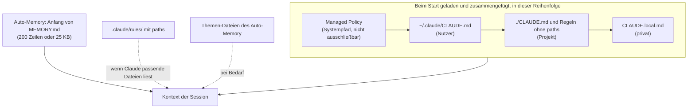

# S1.11 · Alle Gedächtnis-Ebenen im Überblick

<!-- meta:start -->
> **Regal:** [Kontext & Gedächtnis](README.md#context) · **Stufe:** Vertiefung · **~20 Min** · **Voraussetzungen:** [S1.10 CLAUDE.md: die Hausordnung des Projekts](s1-10-claude-md.md)
>
> ← [S1.10 CLAUDE.md: die Hausordnung des Projekts](s1-10-claude-md.md) · [Bibliothek](README.md) · [S1.12 Imports, --add-dir und AGENTS.md](s1-12-imports-und-agents-md.md) →
<!-- meta:end -->

## Schnellcheck

- Hast du schon einmal in die `MEMORY.md` deines Projekts geschaut und gelesen, was Claude darin über dich notiert hat?
- Kannst du ohne Nachschlagen sagen, wann eine Regel unter `.claude/rules/` mit `paths` lädt?

## Auf einen Blick

Neben der CLAUDE.md hat Claude Code weitere Gedächtnis-Ebenen: das Auto-Memory, in das Claude selbst Notizen schreibt, Regeln unter `.claude/rules/`, die nur für passende Pfade laden, deine private `CLAUDE.local.md` und die Managed Policy deiner Organisation. Alles, was davon im Kontext steht, geht mit deinen Anfragen an Anthropic: Geheimnisse haben in keiner Ebene etwas verloren. Das gilt auch für das Auto-Memory, das Claude ohne dein Zutun füllt.

Die Ebenen werden zusammengefügt, nicht gegeneinander ausgespielt, und keine davon sperrt technisch etwas. Eine harte Grenze setzen nur Einstellungen wie `permissions.deny` oder ein Hook.

## Bild im Kopf

Zur Hausordnung aus [S1.10](s1-10-claude-md.md) kommen zwei Dinge. Das Wachbuch führt die Streife selbst: Sie notiert, was ihr auffällt, ohne dass jemand es anordnet. Das ist das Auto-Memory. Und für einzelne Zonen hängen Schilder an den Zonentoren: Die Serverraum-Regel liest die Streife erst, wenn sie den Serverraum betritt. Das sind die Regeln unter `.claude/rules/` mit `paths`.



## Im Detail

### Auto-Memory: Claude schreibt selbst mit

Claude Code führt neben der CLAUDE.md ein Gedächtnis, in das Claude selbst schreibt. Es liegt unter `~/.claude/projects/<project>/memory/`. Auto-Memory ist standardmäßig an: Du musst Claude nicht bitten, sich etwas zu merken. Die nächste Session startet mit diesem Wissen im Kontext. Es bleibt auf deinem Rechner und wird nicht zwischen Rechnern geteilt.

Den Ordnernamen `<project>` bildet Claude Code aus dem Pfad deines Projekts, wobei jedes Zeichen außer Buchstaben und Ziffern zu `-` wird: Aus `C:\Users\du\projekt` wird `C--Users-du-projekt`. Bei einem Git-Repository teilen sich alle Worktrees und Unterordner ein Auto-Memory.

- `MEMORY.md` ist die **Index-Datei**, eine Zeile je Notiz. Die ersten 200 Zeilen oder 25 KB lädt Claude Code zu Beginn jeder Session.
- **Themen-Dateien** wie `user_role.md` enthalten die einzelnen Notizen. Claude liest sie erst, wenn es sie braucht.

Jede Notiz gehört zu einer von vier Arten: `user` (deine Rolle und Vorlieben), `feedback` (bestätigte Korrekturen), `project` (laufende Arbeit und Entscheidungen, die nicht im Code stehen) und `reference` (wo Informationen außerhalb des Projekts liegen). Ableitbares notiert Claude nicht, und nicht jede Session hinterlässt eine Notiz.

**Merken lassen:** „Remember that …“ legt eine Notiz im Auto-Memory ab. Soll es in die CLAUDE.md, sag das ausdrücklich („add this to CLAUDE.md“).

**Nachsehen und ändern:** `/memory` öffnet die Gedächtnis-Dateien und den Auto-Memory-Ordner; es ist einfaches Markdown, du kannst jede Notiz bearbeiten oder löschen. Dort schaltest du das Auto-Memory auch ab. Das speichert `autoMemoryEnabled` in `~/.claude/settings.json`; je Projekt geht `"autoMemoryEnabled": false`, per Umgebungsvariable `CLAUDE_CODE_DISABLE_AUTO_MEMORY=1`.

> **Datenschutz:** Schau regelmäßig in `MEMORY.md`, und lass nie Geheimnisse (API-Keys, Zugangsdaten, Kundendaten) hineingeraten. Wie du falsche Notizen findest und entfernst, steht in [S4.10](s4-10-diagnose-schritt-fuer-schritt.md). Soll alles weg, was Claude Code lokal zu einem Projekt hält (Transkripte samt Auto-Memory, Prompt-Verlauf, den Eintrag in `~/.claude.json`), nimm `claude purge`. Es zeigt den Löschplan und fragt nach; mit `--dry-run` löscht es nichts. Vor v2.1.288 hieß der Befehl `claude project purge`.

```bash
claude purge ~/work/my-repo --dry-run
```

### `.claude/rules/`: Regeln je Pfad

Eine CLAUDE.md reicht für kleine Projekte. In größeren Codebasen mit eigenen Konventionen je Unterordner nimmst du **pfadbezogene Regeln**. Sie liegen in `.claude/rules/<name>.md` und nennen im Frontmatter unter `paths` ein Glob-Muster:

```markdown
---
paths:
  - "src/api/**/*.ts"
---

# API Conventions

- All endpoints use Zod for input validation.
- Never use `any` in request/response types.
```

Laut Doku lädt so eine Regel, wenn Claude mit Read, Write oder Edit eine passende Datei anfasst, nicht bei jedem Werkzeugaufruf. Berührt die Aufgabe nur `src/firmware/`, bleibt die API-Regel außen vor. Regeln ohne `paths` lädt Claude Code bei jedem Start wie die `.claude/CLAUDE.md`. Nimm Regeln, wenn Unterordner verschiedene Test-Runner, Linter oder Namenskonventionen haben.

### `CLAUDE.local.md`: persönliche Projektnotizen

`CLAUDE.local.md` liegt im selben Ordner wie die CLAUDE.md, ist aber nur für dich. Trag sie in die `.gitignore` ein, dann landet sie nicht im Team-Repo. Nimm sie für Persönliches: eine Sandbox-URL oder den Hinweis, dass auf deinem Laptop eine andere Python-Version läuft. Claude liest sie im selben Ordner direkt nach der CLAUDE.md.

### Managed Policy: die Richtlinie der Organisation

Administratoren legen eine zentral verwaltete CLAUDE.md an einem Systempfad ab, für den man Admin-Rechte braucht (macOS `/Library/Application Support/ClaudeCode/CLAUDE.md`, Windows `C:\Program Files\ClaudeCode\CLAUDE.md`, Linux und WSL `/etc/claude-code/CLAUDE.md`). Sie lädt bei jedem Start mit, und niemand kann sie per Einstellung ausschließen.

**Vorrang, richtig verstanden:** Managed, dann Nutzer, dann Projekt, zuletzt `CLAUDE.local.md` ist die **Lade-Reihenfolge**. Claude Code fügt alle gefundenen Dateien zusammen; keine überschreibt die andere. Widersprechen sich zwei Anweisungen, kann Claude jede davon befolgen. Eine Untergrenze, die kein Entwickler aufheben kann, gehört deshalb in die **Managed Settings** (etwa `permissions.deny`): Nur Einstellungen setzt der Client durch.

### Die Ebenen auf einen Blick

| Ebene | Ort | Wer schreibt | Wann geladen | Geteilt mit |
|---|---|---|---|---|
| Managed Policy | Systempfad (siehe oben) | IT oder Admin | bei jedem Start, nicht ausschließbar | allen Nutzern des Rechners |
| Nutzer | `~/.claude/CLAUDE.md` | du | bei jedem Start | nur dir, in allen Projekten |
| Projekt | `./CLAUDE.md` | du und dein Team | bei jedem Start | dem Team über Git |
| Lokal | `./CLAUDE.local.md` | du | bei jedem Start, im Ordner nach der CLAUDE.md | nur dir, in diesem Projekt |
| Regeln | `.claude/rules/*.md` | du und dein Team | ohne `paths` beim Start, mit `paths` beim Lesen passender Dateien | dem Team über Git |
| Auto-Memory | `~/.claude/projects/<project>/memory/` | Claude | Anfang von `MEMORY.md` bei jedem Start, Themen-Dateien bei Bedarf | nur dir, in diesem Repo |

## Selbst machen

### Übung: Notiz und Pfadregel beobachten (etwa 10 Minuten)

**Ziel:** Du siehst, wie Claude eine Notiz im Auto-Memory ablegt und nach dem Neustart kennt, und dass eine Regel mit `paths` erst lädt, wenn Claude eine passende Datei liest.

**Startzustand:** ein neuer, leerer Ordner `~/cc-workshop/gedaechtnis`. Leg ihn an und wechsle hinein (`mkdir -p ~/cc-workshop/gedaechtnis && cd ~/cc-workshop/gedaechtnis`, in PowerShell `New-Item -ItemType Directory -Force "$HOME\cc-workshop\gedaechtnis"; Set-Location "$HOME\cc-workshop\gedaechtnis"`). Starte mit `claude --permission-mode acceptEdits`.

1. Gib ein: `Remember that in this project door IDs follow the format SITE-FLOOR-DOOR, for example MAIN-02-EAST.` Erwartet: Claude bestätigt die Notiz.
2. Gib ein: `Create api/handler.py with a function that returns "ok", and tools/helper.py with a function that returns 1.` Erwartet: zwei neue Dateien. Beende die Sitzung mit `/exit`.
3. Sieh im Auto-Memory-Ordner nach. Er liegt unter `~/.claude/projects/` und hat `gedaechtnis` im Namen (`ls ~/.claude/projects/*gedaechtnis*/memory/`, in PowerShell `Get-ChildItem "$HOME\.claude\projects\*gedaechtnis*\memory"`). Erwartet: eine `MEMORY.md` und mindestens eine Themen-Datei. Öffne die `MEMORY.md` und lies, was dort über die Türnummern steht. Findest du den Ordner nicht, öffne ihn in einer Sitzung über `/memory`.
4. Leg die Regeldatei an, den Ordner `.claude/rules` musst du vorher anlegen: `.claude/rules/api.md` mit diesem Inhalt. Claude selbst darf in `.claude` nicht ohne Rückfrage schreiben, deshalb legst du die Datei selbst an.

   <!-- cockpit:example -->
   ```markdown
   ---
   paths:
     - "api/**/*.py"
   ---

   Every function name in api/ ends with _v1.
   ```
5. Starte neu mit `claude --permission-mode acceptEdits` und frag: `Without using any tools, what format do door IDs follow in this project?` Erwartet: `SITE-FLOOR-DOOR`. Die Notiz kam aus dem Auto-Memory.
6. Frag: `Without using any tools, what must every function name in api/ end with?` Erwartet: Claude kann es nicht wissen. Die Regel ist noch nicht geladen, weil Claude keine Datei in `api/` berührt hat.
7. Gib ein: `Use the Read tool to read api/handler.py and say only "done".` Frag dann die Frage aus Schritt 6 noch einmal. Erwartet: Jetzt nennt Claude `_v1`. Die Regel lud, als Claude die passende Datei mit dem Read-Werkzeug las. Ein Shell-Befehl wie `cat` hätte sie nicht geladen.

**Aufräumen:** Lösch den Ordner `~/cc-workshop/gedaechtnis` und den Auto-Memory-Ordner aus Schritt 3 selbst.

**Geschafft, wenn:**

- [ ] du die `MEMORY.md` mit der Notiz zu den Türnummern gefunden und gelesen hast
- [ ] Claude die Türnummern nach dem Neustart ohne Werkzeug nannte
- [ ] Claude `_v1` vor dem Lesen von `api/handler.py` nicht kannte und danach nannte
- [ ] du sagen kannst, warum die Regel nicht schon beim Start geladen war

### Extra: Fünf Sätze, fünf Ebenen (etwa 5 Minuten)

Ordne jedem Satz die Ebene zu, in die er gehört: Managed Policy, Nutzer, Projekt, Lokal, Regeln mit `paths` oder Auto-Memory.

1. „Ich antworte in allen Projekten lieber auf Deutsch.“
2. „Der Testbefehl dieses Projekts lautet `pytest -q`, das gilt für das ganze Team.“
3. „Meine Sandbox-URL für dieses Projekt.“
4. „Unter `src/firmware/` gilt ein C-Stil mit festen Typbreiten.“
5. „Auf allen Rechnern der Firma sind Zugangsdaten in Dateien verboten.“

<details><summary>Vergleich</summary>

1. Nutzer (`~/.claude/CLAUDE.md`)
2. Projekt (`./CLAUDE.md`)
3. Lokal (`./CLAUDE.local.md`)
4. Regeln mit `paths: ["src/firmware/**"]`
5. Managed Policy. Eine Sperre, die niemand aufheben soll, gehört zusätzlich in die Managed Settings.

Das Auto-Memory taucht nicht auf: Dort schreibt Claude selbst, du ordnest keine Sätze zu.

</details>

## Typische Fallen

- **Eine Regel ist nach `/compact` verschwunden.** Regeln mit `paths:` und verschachtelte CLAUDE.md-Dateien in Unterordnern landen erst im Verlauf, wenn Claude eine passende Datei liest, und die Verdichtung fasst sie mit weg. Sie laden erst beim nächsten passenden Lesezugriff neu. Muss eine Regel die Verdichtung überstehen, nimm `paths:` heraus oder verschieb sie in die CLAUDE.md im Projektordner.
- **„Managed gewinnt immer.“** Nein: Alle Ebenen werden zusammengefügt. Die Managed-CLAUDE.md lädt zuerst und lässt sich nicht ausschließen, aber sie sperrt nichts.
- **Das Auto-Memory mit `--bare` abschalten.** Dieser Minimalmodus für Skripte ([S4.3](s4-03-headless.md)) lädt neben dem Auto-Memory auch Hooks, Skills, Plugins, MCP-Server und die CLAUDE.md nicht und nutzt keinen Abo-Login. Nimm `/memory`, `autoMemoryEnabled` oder `CLAUDE_CODE_DISABLE_AUTO_MEMORY=1`.
- **Die `CLAUDE.local.md` fehlt im zweiten Worktree.** Eine Datei, die Git ignoriert, gibt es nur in dem Worktree, in dem du sie angelegt hast. Für persönliche Anweisungen über alle Worktrees importierst du eine Datei aus deinem Home-Ordner ([S1.12](s1-12-imports-und-agents-md.md)).

## Check

Du kannst die Gedächtnis-Ebenen neben der CLAUDE.md benennen, sagen, wer sie schreibt und wann sie laden, und erklären, warum keine davon technisch etwas sperrt.

1. Welchen Teil des Auto-Memory lädt Claude Code beim Start, welchen erst bei Bedarf?
2. Du willst eine Konvention nur für den Ordner `api/`. Was legst du an, und wann wird sie geladen?
3. Managed-CLAUDE.md und Projekt-CLAUDE.md widersprechen sich. Was passiert, und wo setzt ein Sicherheitsteam eine echte Untergrenze?

<details><summary>Auflösung</summary>

1. Beim Start lädt Claude Code den Anfang der `MEMORY.md` (die ersten 200 Zeilen oder 25 KB). Die Themen-Dateien liest Claude erst, wenn es sie braucht.
2. Eine Regeldatei unter `.claude/rules/` mit `paths: ["api/**"]`. Sie lädt, wenn Claude mit Read, Write oder Edit eine passende Datei anfasst.
3. Claude Code fügt beide zusammen, keine überschreibt die andere, und Claude kann jede der beiden befolgen. Eine echte Untergrenze setzt das Sicherheitsteam in den Managed Settings, etwa mit `permissions.deny`.

</details>

<details><summary>Quizfrage</summary>

**Frage:** Nach einem Neustart „weiß“ Claude etwas Falsches über dein Projekt, das du nie in eine CLAUDE.md geschrieben hast. Was ist die wahrscheinlichste Quelle, und was tust du?

- **Richtig:** Eine Notiz im Auto-Memory: Du öffnest sie über `/memory` und bearbeitest oder löschst sie.
  - Warum: Ins Auto-Memory schreibt Claude selbst mit, und die nächste Session startet damit. Über `/memory` siehst du jede Notiz und kannst sie bearbeiten oder löschen.
- Falsch: Eine Notiz im Auto-Memory: Ein `/clear` leert neben dem Gespräch auch dieses Gedächtnis des Projekts.
  - Warum: `/clear` leert nur das Gespräch (S1.9). Das Auto-Memory liegt in Dateien außerhalb davon, und jede neue Session lädt den Anfang der `MEMORY.md`. Die Notiz löschst du über `/memory`.
- Falsch: Eine Notiz im Auto-Memory: Du startest künftig mit `claude --bare`, dem vorgesehenen Schalter dafür.
  - Warum: `--bare` ist kein Gedächtnis-Schalter, sondern ein Minimalmodus für Skripte, der fast alles weglässt, auch die CLAUDE.md. Das Auto-Memory schaltest du über `/memory` oder `autoMemoryEnabled` ab.
- Falsch: Keine Notiz: Das Auto-Memory entsteht nur nach „Remember that …“, die Quelle ist also ein Irrtum.
  - Warum: Auto-Memory ist standardmäßig an: Claude füllt es ohne dein Zutun. „Remember that …“ legt zwar gezielt eine Notiz ab, ist aber nicht die einzige Quelle.

</details>

## Weiterlesen

- [Auto-Memory](https://code.claude.com/docs/en/memory#auto-memory)
- [Regeln mit .claude/rules/](https://code.claude.com/docs/en/memory#organize-rules-with-claude/rules/)
- [CLAUDE.md für große Teams](https://code.claude.com/docs/en/memory#manage-claude-md-for-large-teams)
- [Was eine Verdichtung übersteht](https://code.claude.com/docs/en/context-window#what-survives-compaction)
- [Lokale Daten löschen (claude purge)](https://code.claude.com/docs/en/claude-directory#clear-local-data)
- [Managed Settings](https://code.claude.com/docs/en/managed-settings)
- [S1.10 · CLAUDE.md: die Hausordnung des Projekts](s1-10-claude-md.md)
- [S1.12 · Imports, --add-dir und AGENTS.md](s1-12-imports-und-agents-md.md)
- [S2.8 · Einen Hook einrichten, der wirklich blockt](s2-08-hook-einrichten.md)
- [S4.10 · Diagnose Schritt für Schritt](s4-10-diagnose-schritt-fuer-schritt.md)
