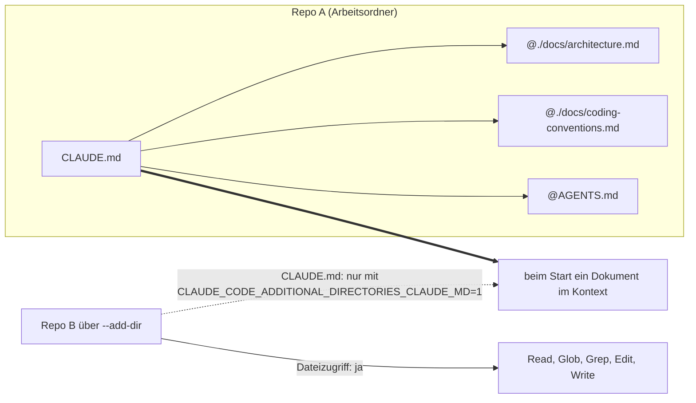

# S1.12 · Imports, --add-dir und AGENTS.md

<!-- meta:start -->
> **Regal:** [Kontext & Gedächtnis](README.md#context) · **Stufe:** Vertiefung · **~20 Min** · **Voraussetzungen:** [S1.10 CLAUDE.md: die Hausordnung des Projekts](s1-10-claude-md.md)
>
> ← [S1.11 Alle Gedächtnis-Ebenen im Überblick](s1-11-gedaechtnis-ebenen.md) · [Bibliothek](README.md) · [S1.13 Vager und präziser Auftrag im Vergleich](s1-13-vager-und-praeziser-auftrag.md) →
<!-- meta:end -->

## Schnellcheck

- Hast du schon einmal eine CLAUDE.md mit `@`-Imports aufgebaut oder eine AGENTS.md eingebunden?
- Kannst du ohne Nachschlagen sagen, was Claude Code aus einem per `--add-dir` hinzugefügten Ordner lädt und was nicht?

## Auf einen Blick

Mit `@path` bindest du weitere Dateien in deine CLAUDE.md ein; Claude Code lädt sie beim Start mit. Das ordnet, spart aber keinen Kontext. Hat ein Repo nur eine AGENTS.md, die Anweisungsdatei anderer Coding-Agents wie Codex, liest Claude Code sie direkt; neben einer CLAUDE.md holst du sie mit `@AGENTS.md` dazu, damit alle Werkzeuge aus derselben Quelle lesen.

`--add-dir` gibt Claude Dateizugriff auf ein zweites Repo. Dessen CLAUDE.md lädt Claude Code nur, wenn du es mit einer Umgebungsvariable einschaltest. Skills, Command-Dateien und Subagenten aus dem `.claude/`-Ordner des zweiten Repos lädt es aber immer: Zusätzliche Ordner fremder Herkunft bringen ihre eigenen Anweisungen mit, also gib nur Ordner frei, denen du traust.

## Bild im Kopf

Denk an eine Hausordnung mit Anlagen. Das Hauptdokument ist kurz und verweist auf „Anlage A: Brandschutz“ und „Anlage B: Serverraum“. Zu Einsatzbeginn bekommt der Techniker alles zusammengeheftet, als ein Paket. So arbeiten `@path`-Imports: getrennt pflegbar, beim Start ein Dokument. Leichter wird das Paket dadurch nicht; gelesen wird trotzdem alles.

`--add-dir` ist ein Arbeitsplatz in einer Außenstelle. Du darfst dort Akten lesen und ablegen, aber die Hausordnung der Außenstelle gilt für dich erst, wenn die Leitstelle sie ausdrücklich zuweist. Ihre Dienstanweisungen (Skills) bringt sie allerdings mit.



## Im Detail

### `@path`-Imports

Die CLAUDE.md kann andere Dateien über die Syntax `@path` einbinden. Statt einer großen Datei verteilst du dein Projektgedächtnis auf kleinere Dokumente:

```markdown
# Project: Access Controller Firmware

@./docs/architecture.md
@./docs/coding-conventions.md
@AGENTS.md
```

Beim Sessionstart lädt Claude Code die eingebundenen Dateien zusammen mit der CLAUDE.md in den Kontext. Änderst du eine eingebundene Datei, gilt das ab der nächsten Session. Ob eine CLAUDE.md oder Regeldatei geladen wurde, zeigt `/context`.

- Relative Pfade gelten relativ zur Datei, die importiert, nicht zum Arbeitsordner. Eingebundene Dateien dürfen selbst importieren, höchstens vier Ebenen tief.
- Ein Pfad in Anführungszeichen wird nicht importiert.
- Imports ordnen eine lange Datei, sparen aber keinen Kontext: Auch eingebundene Dateien laden beim Start.
- Zeigt ein Import aus deinem Arbeitsordner hinaus, etwa in dein Home-Verzeichnis, fragt Claude Code beim ersten Mal, ob es diese externen Dateien laden darf.

### AGENTS.md: eine Quelle für mehrere Werkzeuge

AGENTS.md ist die Anweisungsdatei, die OpenAI Codex und mehrere andere Coding-Agents lesen. Was Claude davon liest, hängt davon ab, welche Dateien dein Repo hat:

| Dein Repo hat | Claude liest |
|---|---|
| eine AGENTS.md, aber keine CLAUDE.md oder CLAUDE.local.md im Arbeitsordner oder darüber | die AGENTS.md |
| eine AGENTS.md und eine CLAUDE.md oder CLAUDE.local.md | nur die CLAUDE.md-Dateien |
| eine CLAUDE.md, die `@AGENTS.md` importiert | die CLAUDE.md und über den Import auch die AGENTS.md |

Soll die AGENTS.md neben einer CLAUDE.md für alle Werkzeuge gelten, schreibst du `@AGENTS.md` in die CLAUDE.md. Dann lesen Claude Code und Codex dieselbe Quelle. Den Import brauchst du auch in Sessions, in denen Claude die AGENTS.md nicht direkt lesen kann, etwa in Versionen vor v2.1.277. Welche Dateien geladen werden, stellst du in `/config` unter **Project instructions** um, zum Beispiel auf CLAUDE.md und AGENTS.md zusammen.

### Ein zweites Repo mit `--add-dir`

Braucht eine Session Dateizugriff auf ein zweites Repository, startest du mit `--add-dir`:

```bash
claude --add-dir /path/to/other/project
```

Der Ordner gehört dann zu Claudes erlaubtem Arbeitsbereich für `Read`, `Glob`, `Grep`, `Edit` und `Write`.

**Standard:** Claude lädt die CLAUDE.md aus `--add-dir`-Ordnern **nicht**. Du bekommst Dateizugriff, aber die Regeln des zweiten Repos bleiben außen vor. So formen die Konventionen eines anderen Projekts nicht unbemerkt, wie Claude in deinem Projekt arbeitet.

**Aber:** Skills, Command-Dateien und Subagenten aus dem `.claude/`-Ordner des zusätzlichen Verzeichnisses lädt Claude Code sehr wohl. Gib deshalb nur Repos frei, denen du vertraust. (Was Skills und Subagenten sind, lernst du in Session 2 und 3.)

**CLAUDE.md aus zusätzlichen Ordnern einschalten:**

```bash
CLAUDE_CODE_ADDITIONAL_DIRECTORIES_CLAUDE_MD=1 claude --add-dir /path/to/other/project
```

Mit der Variable lädt Claude Code aus jedem `--add-dir`-Ordner zusätzlich `CLAUDE.md`, `.claude/CLAUDE.md`, `.claude/rules/*.md` und `CLAUDE.local.md`. Eine AGENTS.md aus diesen Ordnern lädt es nicht. Die Inline-Form gilt in Bash oder Zsh für genau diesen einen Start; in PowerShell setzt du vorher `$env:CLAUDE_CODE_ADDITIONAL_DIRECTORIES_CLAUDE_MD = "1"`. Dauerhaft setzt du die Variable im `env`-Block von `~/.claude/settings.json`.

## Selbst machen

### Übung: Import und zweites Repo (etwa 10 Minuten)

**Ziel:** Du siehst, dass eine importierte Datei im Kontext steht, dass `--add-dir` die CLAUDE.md des zweiten Ordners zunächst nicht lädt und dass die Umgebungsvariable das ändert.

**Startzustand:** ein neuer, leerer Ordner `~/cc-workshop/imports`. Leg ihn an und wechsle hinein (`mkdir -p ~/cc-workshop/imports && cd ~/cc-workshop/imports`, in PowerShell `New-Item -ItemType Directory -Force "$HOME\cc-workshop\imports"; Set-Location "$HOME\cc-workshop\imports"`). Starte dort mit `claude --permission-mode acceptEdits`.

1. Lass Claude die Dateien anlegen. Gib genau diesen Auftrag ein, dann beende die Sitzung mit `/exit`. Erwartet: drei neue Dateien.

   <!-- cockpit:example -->
   ```text
   Create exactly three files. app/docs/style.md with the single line "Log lines start with EVT|." app/CLAUDE.md with the two lines "# App" and "@./docs/style.md". shared/CLAUDE.md with the single line "Names of shared helpers start with ZZ_."
   ```
2. Wechsle in den Ordner `app` (`cd app`) und starte `claude --permission-mode default`. Frag: `Without using any tools, what do log lines start with in this project?` Erwartet: `EVT|`. Das steht nicht in der `app/CLAUDE.md`, sondern nur in der importierten Datei. Beende die Sitzung.
3. Starte mit `claude --permission-mode default --add-dir ../shared` und frag: `Without using any tools, what do names of shared helpers start with?` Erwartet: Claude kann es nicht wissen. Der Ordner ist freigegeben, aber seine CLAUDE.md nicht geladen. Beende die Sitzung.
4. Starte mit der Variable. Bash: `CLAUDE_CODE_ADDITIONAL_DIRECTORIES_CLAUDE_MD=1 claude --permission-mode default --add-dir ../shared`. PowerShell: `$env:CLAUDE_CODE_ADDITIONAL_DIRECTORIES_CLAUDE_MD = "1"; claude --permission-mode default --add-dir ../shared`. Stell dieselbe Frage. Erwartet: `ZZ_`.
5. Beende die Sitzung. In PowerShell nimmst du die Variable wieder weg: `Remove-Item Env:CLAUDE_CODE_ADDITIONAL_DIRECTORIES_CLAUDE_MD`.

**Aufräumen:** Lösch den Ordner `~/cc-workshop/imports` selbst. Die Variable galt nur für diesen einen Start (Bash) bzw. diese PowerShell-Sitzung.

**Geschafft, wenn:**

- [ ] Claude `EVT|` nannte, obwohl es nur in der importierten Datei steht
- [ ] Claude `ZZ_` ohne die Variable nicht kannte und mit der Variable nannte
- [ ] du sagen kannst, was Claude trotz fehlender Variable aus `shared/` hätte laden können (Skills, Commands, Subagenten aus `.claude/`)

### Extra: Wann liest Claude die AGENTS.md? (etwa 5 Minuten)

Leg im Ordner `~/cc-workshop/imports/agentsonly` eine Datei `AGENTS.md` mit der Zeile `Release names in this project are bird names.` an. Starte dort `claude --permission-mode default` und frag ohne Werkzeuge nach den Release-Namen. Erwartet: `bird names`. Die Doku nennt für interaktive Sitzungen eine Zeile, die mit `no CLAUDE.md found; AGENTS.md loaded:` beginnt. Leg dann eine leere `CLAUDE.local.md` daneben, starte neu und frag noch einmal. Erwartet: Claude kennt die Regel nicht mehr. Liegt in einem Ordner über `~/cc-workshop` schon eine CLAUDE.md, liest Claude die AGENTS.md von Anfang an nicht.

## Typische Fallen

- **Die AGENTS.md wird nicht gelesen.** Meist liegt irgendwo auf dem Pfad eine `CLAUDE.md`, `.claude/CLAUDE.md` oder `CLAUDE.local.md`; dann liest Claude diese statt der AGENTS.md. Abhilfe: `@AGENTS.md` importieren oder unter **Project instructions** beide Dateiarten einschalten.
- **Imports gegen eine zu große CLAUDE.md.** Aufteilen macht die Datei übersichtlicher, aber im Kontext nicht kleiner. Was nur für einen Teil der Codebasis gilt, gehört in eine Regel mit `paths` ([S1.11](s1-11-gedaechtnis-ebenen.md)).
- **Symlink `CLAUDE.md` → `AGENTS.md` unter Windows.** Ein Symlink braucht dort Administratorrechte oder den Entwicklermodus, und ohne `core.symlinks` checkt Git ihn als einzeilige Textdatei aus. Nimm unter Windows den `@AGENTS.md`-Import.
- **Die Umgebungsvariable wirkt nicht.** Die Inline-Form ist Bash- bzw. Zsh-Syntax. In PowerShell setzt du die Variable vorher mit `$env:`, shell-unabhängig und dauerhaft im `env`-Block von `~/.claude/settings.json`.

## Check

Du kannst sagen, was `--add-dir` lädt und was nicht, wie du die CLAUDE.md des zweiten Ordners einschaltest und wann Claude eine AGENTS.md von selbst liest.

1. Spart ein `@path`-Import Kontext? Warum nicht?
2. Was lädt Claude Code aus einem `--add-dir`-Ordner auch ohne die Umgebungsvariable, und was nicht?
3. Dein Repo hat nur eine AGENTS.md, und du legst eine `CLAUDE.local.md` an. Was ändert sich?

<details><summary>Auflösung</summary>

1. Nein. Auch eingebundene Dateien laden beim Start, der Import ordnet die Datei nur.
2. Ohne die Variable lädt es keine CLAUDE.md aus dem Ordner. Skills, Command-Dateien und Subagenten aus dem `.claude/`-Ordner lädt es trotzdem, und Dateizugriff gibt es ohnehin.
3. Claude liest dann nur noch die CLAUDE.md-Dateien, auch eine `CLAUDE.local.md` zählt, und nicht mehr die AGENTS.md. Abhilfe ist `@AGENTS.md` in einer CLAUDE.md oder die Einstellung unter **Project instructions**.

</details>

<details><summary>Quizfrage</summary>

**Frage:** Deine `.claude/CLAUDE.md` enthält `@./docs/style.md`, die Datei liegt aber im Projektordner unter `docs/style.md`. Claude kennt ihre Regeln nicht. Woran liegt es?

- **Richtig:** Der Pfad gilt relativ zur importierenden Datei, Claude sucht also in `.claude/docs/`; richtig wäre `@../docs/style.md`.
  - Warum: Relative Pfade gelten relativ zur Datei, die importiert, nicht zum Arbeitsordner. Die Datei liegt in `.claude/`, also zeigt `./docs/` auf `.claude/docs/`.
- Falsch: Der Pfad muss in Anführungszeichen stehen, sonst erkennt Claude Code den Import nicht als Import.
  - Warum: Es ist umgekehrt: Ein Pfad in Anführungszeichen wird nicht importiert. `@./docs/style.md` ist richtig geschrieben, nur der Bezugsordner stimmt nicht.
- Falsch: Claude Code folgt nur einer Importebene, und diese Datei liegt schon eine Ebene zu tief.
  - Warum: Imports dürfen bis zu vier Ebenen tief gehen, und `style.md` wird direkt aus der CLAUDE.md eingebunden, ist also erste Ebene. Die Tiefe ist nicht das Problem.
- Falsch: Imports wirken nur für Ordner aus `--add-dir`; im eigenen Projekt brauchst du dafür Regeldateien.
  - Warum: `@path`-Imports gehören in die CLAUDE.md deines eigenen Projekts, etwa `@./docs/architecture.md`. `--add-dir` gibt dagegen nur Dateizugriff auf ein zweites Repo.

</details>

## Weiterlesen

- [Dateien importieren](https://code.claude.com/docs/en/memory#import-additional-files)
- [AGENTS.md](https://code.claude.com/docs/en/memory#agents-md)
- [CLAUDE.md aus zusätzlichen Ordnern laden](https://code.claude.com/docs/en/memory#load-from-additional-directories)
- [Zusätzliche Ordner: Dateizugriff, keine Konfiguration](https://code.claude.com/docs/en/permissions#additional-directories-grant-file-access-not-configuration)
- [S1.10 · CLAUDE.md: die Hausordnung des Projekts](s1-10-claude-md.md)
- [S1.11 · Alle Gedächtnis-Ebenen im Überblick](s1-11-gedaechtnis-ebenen.md)
- [S4.2 · Codex-Schwarm und die Datenfluss-Grenze](s4-02-codex-schwarm.md)
