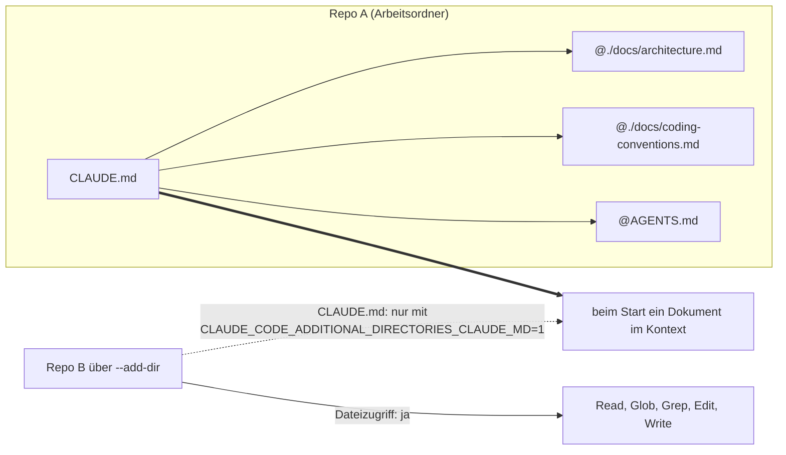

# S1.12 · Imports, --add-dir und AGENTS.md

<!-- meta:start -->
> **Regal:** [Kontext & Gedächtnis](README.md#context) · **Stufe:** Vertiefung · **~12 Min** · **Voraussetzungen:** [S1.10 CLAUDE.md: die Hausordnung des Projekts](s1-10-claude-md.md)
>
> ← [S1.11 Alle Gedächtnis-Ebenen im Überblick](s1-11-gedaechtnis-ebenen.md) · [Bibliothek](README.md) · [S1.13 Vager und präziser Auftrag im Vergleich](s1-13-vager-und-praeziser-auftrag.md) →
<!-- meta:end -->

## Schnellcheck

- Hast du schon einmal eine CLAUDE.md mit `@`-Imports aufgebaut oder eine AGENTS.md eingebunden?
- Kannst du ohne Nachschlagen sagen, ob Claude die CLAUDE.md eines per `--add-dir` hinzugefügten Ordners lädt, und wie du das änderst?

## Auf einen Blick

Mit `@path` bindest du weitere Dateien in deine CLAUDE.md ein; Claude Code lädt sie beim Start mit. Das ordnet, spart aber keinen Kontext. Hat ein Repo nur eine AGENTS.md, die Anweisungsdatei anderer Coding-Agents wie Codex, liest Claude Code sie direkt; neben einer CLAUDE.md holst du sie mit `@AGENTS.md` dazu, damit alle Werkzeuge aus derselben Quelle lesen. `--add-dir` gibt Claude Dateizugriff auf ein zweites Repo, lädt dessen CLAUDE.md aber nur, wenn du es mit einer Umgebungsvariable ausdrücklich einschaltest.

## Bild im Kopf

Denk an eine Hausordnung mit Anlagen. Das Hauptdokument ist kurz und verweist auf „Anlage A: Brandschutz" und „Anlage B: Serverraum". Zu Einsatzbeginn bekommt der Techniker alles zusammengeheftet, als ein Paket. So arbeiten `@path`-Imports: getrennt pflegbar, beim Start ein Dokument. Leichter wird das Paket dadurch nicht; gelesen wird trotzdem alles.

`--add-dir` ist ein Besucherausweis für ein zweites Gebäude. Du kommst hinein und kannst dort arbeiten, aber die Hausordnung des zweiten Gebäudes bekommst du nicht automatisch ausgehändigt, erst wenn die Leitstelle sie ausdrücklich freigibt. Und `@AGENTS.md` ist eine Hausordnung, die zwei Dienstleister gemeinsam nutzen, statt zwei Fassungen zu pflegen, die auseinanderlaufen.



## Im Detail

### `@path`-Imports

Die CLAUDE.md kann andere Dateien über die Syntax `@path` einbinden. Statt einer großen Datei verteilst du dein Projektgedächtnis auf kleinere Dokumente und holst sie herein:

```markdown
# Project: Access Controller Firmware

@./docs/architecture.md
@./docs/coding-conventions.md
@AGENTS.md
```

Beim Sessionstart lädt Claude Code die eingebundenen Dateien zusammen mit der CLAUDE.md in den Kontext; Claude sieht alles wie ein zusammenhängendes Dokument. Änderst du eine eingebundene Datei, gilt das ab der nächsten Session.

Drei Details:

- Relative Pfade gelten relativ zur Datei, die importiert, nicht zum Arbeitsordner. Eingebundene Dateien dürfen selbst importieren, höchstens vier Ebenen tief.
- Imports ordnen eine lange Datei, sparen aber keinen Kontext: Auch eingebundene Dateien laden beim Start.
- Zeigt ein Import aus deinem Arbeitsordner hinaus, etwa in dein Home-Verzeichnis, fragt Claude Code beim ersten Mal, ob es diese externen Dateien laden darf.

### AGENTS.md: eine Quelle für mehrere Werkzeuge

AGENTS.md ist die Anweisungsdatei, die OpenAI Codex und mehrere andere Coding-Agents lesen. Was Claude davon liest, hängt davon ab, welche Dateien dein Repo hat:

| Dein Repo hat | Claude liest |
|---|---|
| eine AGENTS.md, aber keine CLAUDE.md oder CLAUDE.local.md im Arbeitsordner oder darüber | die AGENTS.md |
| eine AGENTS.md und eine CLAUDE.md oder CLAUDE.local.md | nur die CLAUDE.md-Dateien |
| eine CLAUDE.md, die `@AGENTS.md` importiert | die CLAUDE.md und über den Import auch die AGENTS.md |

Hat dein Repo also schon eine CLAUDE.md und soll die AGENTS.md für alle Werkzeuge gelten, schreibst du `@AGENTS.md` in die CLAUDE.md, wie im Beispiel oben. Dann lesen Claude Code und Codex dieselbe Quelle: kein Kopieren, kein Auseinanderlaufen. Den Import brauchst du auch in Sessions, in denen Claude die AGENTS.md nicht direkt lesen kann, etwa in Versionen vor v2.1.277. Welche Dateien geladen werden, kannst du in `/config` unter **Project instructions** umstellen, zum Beispiel auf CLAUDE.md und AGENTS.md zusammen.

### Ein zweites Repo mit `--add-dir`

Braucht eine Session Dateizugriff auf ein zweites Repository, etwa für ein Refactoring über zwei Repos oder für eine in ein eigenes Repo ausgelagerte Bibliothek, startest du mit `--add-dir`:

```bash
claude --add-dir /path/to/other/project
```

Der angegebene Ordner gehört dann zu Claudes erlaubtem Arbeitsbereich für `Read`, `Glob`, `Grep`, `Edit` und `Write`.

**Standard:** Claude lädt die CLAUDE.md aus `--add-dir`-Ordnern **nicht**. Du bekommst Dateizugriff, aber die Regeln des zweiten Repos bleiben außen vor. Das ist ein bewusster Schutz: Die Konventionen eines anderen Projekts sollen nicht unbemerkt formen, wie Claude in deinem aktuellen Projekt arbeitet.

**Aber:** Skills, Command-Dateien und Subagenten aus dem `.claude/`-Ordner des zusätzlichen Verzeichnisses lädt Claude Code sehr wohl. Ein fremdes Repo bringt so seine eigenen Skills mit.

**CLAUDE.md aus zusätzlichen Ordnern einschalten:**

<!-- cockpit:example -->
```bash
CLAUDE_CODE_ADDITIONAL_DIRECTORIES_CLAUDE_MD=1 claude --add-dir /path/to/other/project
```

Mit der Variable lädt Claude Code aus jedem `--add-dir`-Ordner zusätzlich `CLAUDE.md`, `.claude/CLAUDE.md`, `.claude/rules/*.md` und `CLAUDE.local.md`. Eine AGENTS.md aus diesen Ordnern lädt es nicht. Die Inline-Form im Beispiel gilt in Bash oder Zsh für genau diesen einen Start; dauerhaft setzt du die Variable im `env`-Block von `~/.claude/settings.json`.

**Typische Einsätze:** eine gemeinsame Hilfsfunktion in zwei Repos umbauen, ein Feature von einem Dienst in einen anderen übertragen, ein Frontend-Repo und das Backend-Repo, das es nutzt, in einer Session bearbeiten.

## Typische Fallen

- **Die AGENTS.md wird nicht gelesen.** Meist liegt irgendwo auf dem Pfad eine `CLAUDE.md`, `.claude/CLAUDE.md` oder `CLAUDE.local.md`; dann liest Claude diese statt der AGENTS.md. Auch eine private `CLAUDE.local.md` reicht dafür. Abhilfe: `@AGENTS.md` importieren oder unter **Project instructions** beide Dateiarten einschalten.
- **Imports gegen eine zu große CLAUDE.md.** Aufteilen macht die Datei übersichtlicher, aber im Kontext nicht kleiner. Was nur für einen Teil der Codebasis gilt, gehört in eine Regel mit `paths` ([S1.11](s1-11-gedaechtnis-ebenen.md)).
- **Symlink `CLAUDE.md` → `AGENTS.md` unter Windows.** Ein Symlink braucht dort Administratorrechte oder den Entwicklermodus, und ohne `core.symlinks` checkt Git ihn als einzeilige Textdatei aus. Nimm unter Windows den `@AGENTS.md`-Import.
- **Die Umgebungsvariable wirkt nicht.** Die Inline-Form `CLAUDE_CODE_ADDITIONAL_DIRECTORIES_CLAUDE_MD=1 claude …` ist Bash- bzw. Zsh-Syntax. Shell-unabhängig und dauerhaft setzt du die Variable im `env`-Block von `~/.claude/settings.json`.

## Check

Du kannst erklären, warum `--add-dir` standardmäßig keine CLAUDE.md aus dem fremden Ordner lädt, mit welcher Umgebungsvariable du das änderst und wann Claude eine AGENTS.md von selbst liest.

1. Spart ein `@path`-Import Kontext? Warum nicht?
2. Was lädt Claude Code aus einem `--add-dir`-Ordner auch ohne die Umgebungsvariable?
3. Dein Repo hat nur eine AGENTS.md, und du legst eine `CLAUDE.local.md` an. Was ändert sich?

<details><summary>Quizfrage</summary>

**Frage:** Dein Repo hat eine AGENTS.md für Codex und eine CLAUDE.md. Wozu schreibst du `@AGENTS.md` in die CLAUDE.md?

- **Richtig:** Damit Claude die AGENTS.md mitliest; neben einer CLAUDE.md liest es sie sonst nicht, und beide Tools teilen eine Quelle.
- Falsch: `@AGENTS.md` schaltet den Multi-Agent-Modus ein, in dem mehrere parallele Subagenten den Inhalt lesen und sich darüber abstimmen.
- Falsch: `@AGENTS.md` markiert produktionskritische Regeln, die Claude Code mit höherer Priorität befolgt als den Rest.
- Falsch: `@AGENTS.md` lädt alle MCP-Server-Konfigurationen im Repo; es ist das Gegenstück zur CLAUDE.md für externe Tools.

</details>

## Weiterlesen

- [Dateien importieren](https://code.claude.com/docs/en/memory#import-additional-files)
- [AGENTS.md](https://code.claude.com/docs/en/memory#agents-md)
- [CLAUDE.md aus zusätzlichen Ordnern laden](https://code.claude.com/docs/en/memory#load-from-additional-directories)
- [Zusätzliche Ordner: Dateizugriff, keine Konfiguration](https://code.claude.com/docs/en/permissions#additional-directories-grant-file-access-not-configuration)
- [S1.10 · CLAUDE.md: die Hausordnung des Projekts](s1-10-claude-md.md)
- [S1.11 · Alle Gedächtnis-Ebenen im Überblick](s1-11-gedaechtnis-ebenen.md)
- [S4.2 · Codex-Schwarm und die Datenfluss-Grenze](s4-02-codex-schwarm.md)
