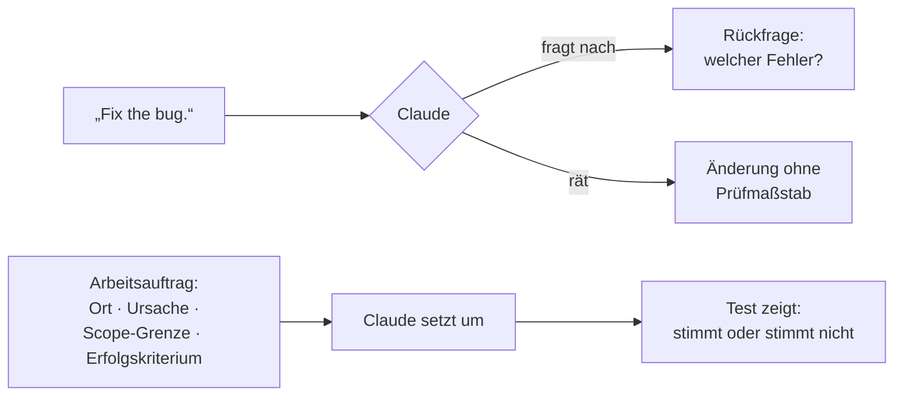

# S1.13 · Vager und präziser Auftrag im Vergleich

<!-- meta:start -->
> **Regal:** [Aufträge formulieren](README.md#prompting) · **Stufe:** Kern · **~15 Min** · **Voraussetzungen:** [S1.1 Erster Kontakt: sofort eine Datei bauen](s1-01-erster-kontakt.md)
>
> ← [S1.12 Imports, --add-dir und AGENTS.md](s1-12-imports-und-agents-md.md) · [Bibliothek](README.md) · [S1.14 Plan-Modus und schrittweises Vorgehen](s1-14-plan-modus.md) →
<!-- meta:end -->

## Schnellcheck

- Hast du schon einmal denselben Auftrag erst vage und dann präzise formuliert und die beiden Ergebnisse verglichen?
- Kannst du ohne Nachschlagen die vier Bestandteile eines guten Arbeitsauftrags nennen?

## Auf einen Blick

Was Claude Code kann, bleibt gleich; wie gut das Ergebnis wird, hängt davon ab, was du ihm mitgibst. Ein guter Auftrag nennt vier Dinge: den Ort (Datei, Zeile), die Ursache oder den Auslöser, die Scope-Grenze (was nicht angefasst wird) und das Erfolgskriterium (welcher Test grün sein muss). Fehlt das, fragt Claude nach oder rät.

## Bild im Kopf

Ein Prompt ist ein Wartungsauftrag an einen Techniker, der Zugang zum ganzen Gebäude hat. Einen Zettel „Tür reparieren“ gibst du ihm nicht. Du schreibst, welcher Leser an welcher Tür was nicht tut, was das Log zeigt, wo er zuerst prüft und was er am Ende dokumentiert.

So sieht so ein Auftrag aus:

> „Der Kartenleser an der Nordtür des Serverraums (Asset-ID CR-047) schaltet nach einer gültigen Karte das Relais nicht. Das Controller-Log zeigt, dass die Karte gelesen wird (Ereignistyp 0x01), aber kein Relais-Ereignis (0x04) folgt. Prüf die Relais-Verdrahtung an Panel P-03, Klemmleiste TB-6. Ist das Relais in Ordnung, prüf in der Controller-Konfiguration die Zuordnung zur Türgruppe. Dokumentiere, was du findest.“

Genau so schreibst du Prompts: konkret, mit Kontext, umsetzbar, mit festgelegtem Ergebnis.



## Im Detail

### Klarheit vor Raffinesse

Der häufigste Fehler mit KI-Werkzeugen: vage bleiben, damit die KI „selbst draufkommt“. Das ist das falsche Denkmodell. Claude Code kann keine Gedanken lesen, es arbeitet mit dem, was du ihm gibst.

**Vage:**

```
Fix the bug.
```

Claude weiß nicht, welcher Fehler gemeint ist. Es rät vielleicht, ändert etwas, baut dabei womöglich einen neuen Fehler ein, und du kannst nicht prüfen, ob es den richtigen behoben hat.

**Präzise:**

```
Fix the null pointer exception in auth.py at line 45. It occurs when a user account
has no email address set. The function assumes email is always present but new accounts
created via LDAP import can have null email fields. Add a null check before accessing
user.email and return an appropriate error response.
```

Jetzt weiß Claude: welche Datei, welche Zeile, die Ursache, den auslösenden Zustand und die erwartete Lösung. Das Ergebnis wird deutlich besser.

Vage Prompts haben trotzdem ihren Platz: wenn du bewusst erkundest und nachsteuern kannst. Eine offene Frage wie „what would you improve in this file?“ bringt Dinge zutage, nach denen du selbst nicht gefragt hättest. Sobald Claude etwas ändern soll, formulierst du den Auftrag präzise.

### Scope-Grenzen setzen

Kleine, fokussierte Aufträge liefern bessere Ergebnisse als breite.

**Zu breit:**

```
Refactor the entire alarm processing module.
```

Das lässt Claude Spielraum, Dinge zu ändern, mit denen du nicht gerechnet hast. Du verlierst die Kontrolle darüber, was sich ändert.

**Besser:**

```
Refactor the alarm_deduplicator.py file only. Current issue: it uses a list for O(n)
lookups. Replace with a set or dict for O(1) lookups. Do not change the function
signatures or the public interface. Tests are in tests/test_alarm_deduplicator.py —
make sure they still pass.
```

Der Scope ist festgelegt. Was nicht angefasst wird, steht ausdrücklich da. Das Erfolgskriterium ist genannt.

### Die vier Bestandteile eines Arbeitsauftrags

| Bestandteil | Frage | In den Beispielen oben |
|---|---|---|
| Ort | Welche Datei, welche Zeile, welche Funktion? | `auth.py`, Zeile 45; nur `alarm_deduplicator.py` |
| Ursache oder Auslöser | Wann tritt es auf, und warum? | Konten aus dem LDAP-Import ohne E-Mail-Adresse |
| Scope-Grenze | Was bleibt unangetastet? | Funktionssignaturen und öffentliche Schnittstelle |
| Erfolgskriterium | Woran erkennst du, dass es stimmt? | Die Tests in `tests/test_alarm_deduplicator.py` laufen weiter durch |

### Schlecht und gut nebeneinander

| Schlechter Prompt | Guter Prompt |
|---|---|
| "Fix the code" | "Fix the off-by-one error in event_parser.py line 78. The loop should iterate from index 1, not 0, because the first byte is always the sync byte." |
| "Make it faster" | "The alarm_correlator.process() function takes 200ms per call with 1000 events. Profile it and optimize — the bottleneck is probably the nested loop in lines 45-67." |
| "Add tests" | "Write pytest unit tests for the IPv4 validator in validators.py. Cover: valid addresses, leading zeros (invalid), out-of-range octets, too few octets, non-numeric characters, empty string." |
| "Refactor this" | "Refactor the state machine in door_controller.py to use Python's enum module instead of integer constants. Keep all function signatures identical. Run the existing tests to confirm nothing broke." |

Die Aufgabe aus Demo und Übung unten, ein IPv4-Validator, kommt später wieder: Die Git-Demo in [S1.16](s1-16-git-in-einem-fluss.md) baut auf `validators.py` und den Tests auf, und in [S1.19](s1-19-kosten-im-blick.md) löst du dieselbe Aufgabe mit drei Modellen.

## Vorführen

### Demo: gute und schlechte Aufträge

**Ziel:** Zwei Aufträge im selben Werkzeug mit sehr unterschiedlichem Ergebnis zeigen: einer ohne jeden Anhaltspunkt, einer als vollständiger Arbeitsauftrag.

**Vorbereitung:** Arbeite im Demo-Ordner aus [S1.10](s1-10-claude-md.md) weiter (`~/cc-workshop/demos/demo-1.2`). Die Git-Demo in [S1.16](s1-16-git-in-einem-fluss.md) braucht die Dateien, die hier entstehen.

**Schritt 1: der vage Auftrag**

Tipp in Claude Code:

```
Fix the code
```

Erwartet: Claude fragt nach („Welcher Code? Was ist das Problem?“) oder sagt, dass es mehr Kontext braucht.

**Schritt 2: der gute Auftrag**

Tipp in Claude Code:

```
Write a Python function called validate_ipv4(address: str) -> bool in a new file
called validators.py.

Requirements:
- Returns True for valid IPv4 addresses, False for anything else
- Valid format: four octets separated by dots, e.g. "192.168.1.1"
- Each octet must be an integer 0-255
- No leading zeros allowed (e.g., "192.168.01.1" is invalid)
- Must handle edge cases: empty string, None input, extra whitespace, IPv6 addresses
- Do not use regex — use explicit parsing for clarity

After creating the function, write pytest tests in tests/test_validators.py covering:
- 5 valid addresses
- Leading zeros (invalid)
- Out-of-range octet (256, -1)
- Too few octets
- Too many octets
- Non-numeric characters
- Empty string
- None input
- IPv6 address (should return False)
```

Erwartet: Claude legt `validators.py` mit einer klaren, expliziten Prüfung an und `tests/test_validators.py` mit allen verlangten Fällen.

**Schritt 3: prüfen lassen**

Wenn Claude fertig ist:

```
Run the tests
```

Erwartet: Claude führt `pytest tests/test_validators.py -v` aus und zeigt, dass alle Tests grün sind.

**Zum Vergleich zeigen oder anschreiben:**

| | Vager Auftrag | Guter Auftrag |
|---|---|---|
| **Eingabe** | „Fix the code“ | Funktion, Datei, Anforderungen, Grenzfälle, Tests |
| **Antwort von Claude** | fragt nach oder rät | setzt genau das Verlangte um |
| **Ergebnis** | unklar | prüfbar: Die Tests zeigen, ob es stimmt |
| **Nötige Runden** | viele | eine (meistens) |

<details><summary>Für Moderierende</summary>

**Dauer:** etwa 10 Minuten.

**Sagen:**

- Vor Schritt 1: „Gleiches Werkzeug, gleiche Fähigkeiten. Mal sehen, was bei einer vagen Bitte passiert.“
- Nach Schritt 1: „Claude macht das Richtige: Es rät nicht. Aber der Prompt ist nutzlos. Hätte ich vorher Code gezeigt, würde Claude vielleicht etwas reparieren, aber ohne Kontext wäre jeder Versuch ein Schuss ins Blaue. Im Alltag hätte es auch einfach eine Deutung wählen können. Jetzt ein Auftrag, der alles mitbringt, was Claude braucht.“
- Während Claude an Schritt 2 arbeitet: „Seht, was der Prompt festlegt: die Signatur, den Dateinamen, die Prüfregeln, die Grenzfälle, eine Vorgabe zur Umsetzung (kein Regex) und die Tests. Das ist ein Arbeitsauftrag, kein Wunsch.“
- Nach Schritt 3: „Erster Versuch, alle Tests grün, weil die Spezifikation vollständig war. Das Werkzeug ist zwischen den beiden Prompts nicht klüger geworden. Die Prompts sind klüger geworden. Das ist die Fähigkeit, um die es geht.“
- Zum Abschluss: „Das ist die Fähigkeit mit dem größten Hebel in diesem Workshop. Nicht die Git-Integration, nicht das Gedächtnis, sondern das hier. Schreibt Prompts wie Arbeitsaufträge: konkret, abgegrenzt, mit Erfolgskriterium. Das Werkzeug belohnt Präzision.“

**Wenn es anders läuft:**

- **Claude liest unerwartet Dateien:** Bei neueren Versionen normal. Mach weiter und besprich in der Rückschau, warum Claude sich Kontext holt.
- **Die Tests des IPv4-Validators schlagen fehl:** Zeig die Fehlermeldung als Lehrmoment: „Seht ihr, auch mit gutem Prompt musst du prüfen.“
- **Claude weigert sich, den vagen Prompt überhaupt zu bearbeiten:** Lass Schritt 1 weg, erzähl, was passiert wäre, und geh direkt zum guten Prompt. Der Kontrast wirkt trotzdem.

Den Schritt „Run the tests“ als festes Muster („Mit Z testen“) behandelt [S1.14](s1-14-plan-modus.md).

</details>

## Selbst machen

### Übung: die Prompting-Challenge (etwa 15 Minuten)

**Ziel:** Den Unterschied zwischen vagem und präzisem Auftrag selbst erleben. Dieselbe Aufgabe, zwei Runden, dann vergleichen. Schummeln gibt es nicht, es geht darum, den Kontrast zu spüren.

Du lässt Claude zweimal einen IPv4-Adress-Validator in Python schreiben. Mach Runde 1 und Runde 2 in derselben Sitzung.

**Runde 1: der vage Auftrag**

Tipp genau das ein:

```
Write an IPv4 validator
```

Lass Claude antworten. Schick keine Folgefrage, schau nur zu.

Notier dir:

- Fragt Claude nach, oder erzeugt es einfach etwas?
- Welche Programmiersprache hat es genommen?
- Hat es Tests dazugeschrieben?
- Hat es Grenzfälle behandelt, und welche?
- Wie sah die Signatur der Funktion aus?
- Wie sicher bist du, dass das ist, was du gebraucht hättest?

**Runde 2: der präzise Auftrag**

Gib Claude jetzt diesen Auftrag (du darfst ihn leicht anpassen, es geht um die Genauigkeit):

<!-- cockpit:example -->
```
Write a Python function called validate_ipv4(address: str) -> bool
in a new file called validators.py in the current directory.

Requirements:
- Returns True only for valid IPv4 addresses in dotted-decimal notation
- Valid: four octets 0-255 separated by single dots, no leading zeros
- Invalid: leading zeros (e.g., 192.168.01.1)
- Invalid: out-of-range octets (256, -1, or any non-integer)
- Invalid: wrong number of octets (3 or 5)
- Invalid: extra whitespace anywhere
- Invalid: IPv6 addresses
- Invalid: empty string or None
- Do not use regex — parse explicitly for code clarity
- Add a docstring with one valid and one invalid example

Then write pytest tests in tests/test_validators.py covering:
1. Five valid addresses (including 0.0.0.0 and 255.255.255.255)
2. Leading zeros in one octet
3. Octet value 256
4. Octet value -1
5. Only 3 octets
6. 5 octets
7. Non-numeric characters
8. Empty string
9. None input
10. IPv6 address (e.g., "2001:db8::1")
```

Lass Claude antworten.

Notier dir:

- Wie schneidet das Ergebnis gegen Runde 1 ab?
- Sind alle 10 Testfälle da?
- Behandelt die Funktion alle genannten Grenzfälle?
- Wie viel Nacharbeit bräuchte Runde 1, um Runde 2 zu erreichen?

**Runde 2b: die Tests laufen lassen**

```
Run the tests and show me the results
```

Wie viele sind grün?

**Zum Nachdenken** (allein oder mit deinem Nachbarn):

1. Wie viel Zeit würdest du nach dem Prompt aus Runde 1 mit Nachfragen und Nachbessern verbringen, bis du die Qualität von Runde 2 erreichst?
2. Für welche wiederkehrenden Aufgaben in deiner Arbeit könntest du einmal einen ausführlichen Arbeitsauftrag schreiben und ihn dann wiederverwenden?
3. Welches Wissen trägst du im Kopf, das du beim Prompten ausdrücklich hinschreiben müsstest?

**Geschafft, wenn:**

- [ ] Runde 1 erledigt ist (Ausgabe ohne Folgefrage beobachtet)
- [ ] Runde 2 mit dem präzisen Auftrag erledigt ist
- [ ] die Tests laufen und grün sind (oder du verstehst, warum einer fehlschlägt)
- [ ] du mindestens drei konkrete Unterschiede zwischen den beiden Ergebnissen benennen kannst

**Tipps:**

- Schlagen in Runde 2 Tests fehl, ändere den Code nicht von Hand. Sag: „Test [test name] fails with [error]. Fix the implementation to handle this case.“ Lass Claude reparieren.
- Fragt Claude in Runde 1 nach, ist das gutes Verhalten: Claude rät nicht. Was es nach der Klärung erzeugt, ist auch ein Datenpunkt.
- Die Vorgabe „kein Regex“ ist Absicht. Sie zeigt, dass du auch die Umsetzung vorgeben kannst, nicht nur die Anforderungen.

### Extra: das Orakel-Spiel (etwa 3 Minuten, leicht)

**Ziel:** Claudes Rückfrage-Verhalten provozieren: Wann fragt es, wann rät es? Gut als Aufwärmen vor der Übung oben.

**Analogie:** der Wachmann, der einen unklaren Ausweis **nicht** durchwinkt, sondern nachfragt.

1. Gib in einem leeren Ordner absichtlich zu wenig vor: `Build me the parser.` (sonst nichts).
2. Antworte nicht, zähl nur, wie viele Annahmen Claude trifft.
3. Dreh es um: `Build NOTHING. Ask me exactly 3 questions you'd need to build an OSDP frame parser.`
4. Lies die drei Fragen laut vor. Aha: Genau das gehört beim nächsten Mal in deinen Prompt.

### Extra: Blind Vault, Spezifikation diktieren (etwa 20 Minuten, zu zweit, schwer)

**Ziel:** Präzise Arbeitsaufträge im schweren Modus: Wer promptet, sieht den Bildschirm nicht und muss allein mit Sprache zu einer korrekten Umsetzung kommen.

**Analogie:** Ein Operator lotst einen Techniker, den er nicht sieht, per Funk durch die Verdrahtung im Tresorraum; jede Unklarheit kostet.

1. Bildet Paare: „Sprecher“ und „Tipper“. Der Sprecher dreht sich vom Bildschirm **weg** und darf nicht hinsehen.
2. Das Ziel (nur der Sprecher hat die Spezifikation, auf einem Zettel): eine Funktion `is_valid_access_window(now, start, end)`, die prüft, ob ein Zeitpunkt in einem erlaubten Zeitfenster liegt, **einschließlich des Wechsels über Mitternacht** (22:00–06:00).
3. Der Sprecher diktiert *nur Prompts*; der Tipper tippt wörtlich und darf weder „helfen“ noch korrigieren.
4. Trifft Claude eine Annahme, die der Spezifikation widerspricht, muss der Sprecher das aus Claudes Antwort heraushören und mit einem Folgeprompt korrigieren, weiterhin ohne hinzusehen.
5. Lasst die Tests laufen (der Mitternachtsfall ist die Falle). Erst wenn sie grün sind, darf der Sprecher hinsehen. Nachbesprechung: Welche unausgesprochene Annahme hätte euch fast versenkt?

## Check

Du kannst einen vagen Prompt aus deiner eigenen Arbeit in einen Arbeitsauftrag umschreiben und dabei Ort, Ursache, Scope-Grenze und Erfolgskriterium ausdrücklich nennen.

1. Welche vier Angaben machen aus „Fix the bug.“ einen Arbeitsauftrag?
2. Warum steht im Refactoring-Auftrag „Do not change the function signatures or the public interface“?
3. Wann ist ein vager Prompt trotzdem die richtige Wahl?

<details><summary>Quizfrage</summary>

**Frage:** Was unterscheidet einen guten von einem schlechten Prompt am stärksten, unabhängig davon, wie ausführlich er ist?

- **Richtig:** Er nennt Ort, Ursache, Scope-Grenze und Erfolgskriterium; ohne sie rät Claude, egal wie lang der Prompt ist.
- Falsch: Seine Länge: Ein längerer Prompt gibt Claude mehr Kontext und liefert deshalb immer bessere Ergebnisse als ein kurzer.
- Falsch: Seine Sprache: Englische Prompts setzt Claude Code zuverlässiger um, weil sein Training beim Code englisch geprägt ist.
- Falsch: Sein Ablageort: Steht ein Auftrag in der CLAUDE.md statt im Chat, setzt Claude ihn deutlich genauer und vollständiger um.

</details>

## Weiterlesen

- [Best Practices für Claude Code](https://code.claude.com/docs/en/best-practices)
- [S1.14 · Plan-Modus und schrittweises Vorgehen](s1-14-plan-modus.md)
- [S1.15 · Output Styles und Personas](s1-15-output-styles.md)
- [S1.10 · CLAUDE.md: die Hausordnung des Projekts](s1-10-claude-md.md)
- [S1.16 · Git in einem Fluss: Branch, Commit, PR](s1-16-git-in-einem-fluss.md)
