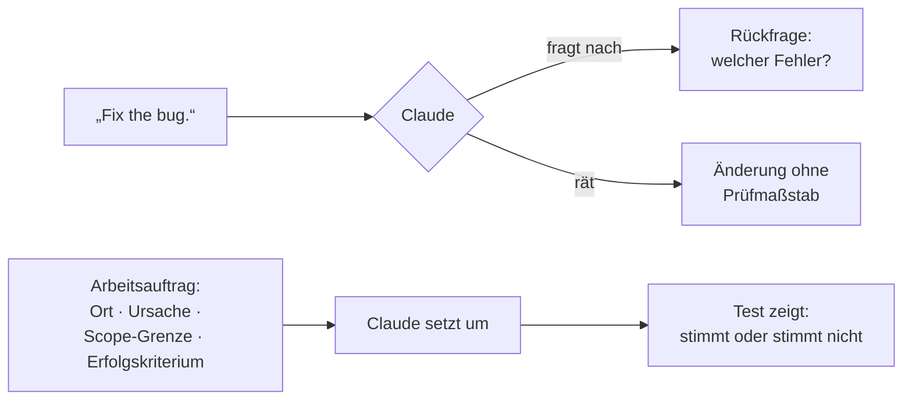

# S1.13 · Vager und präziser Auftrag im Vergleich

<!-- meta:start -->
> **Regal:** [Aufträge formulieren](README.md#prompting) · **Stufe:** Kern · **~15 Min** · **Voraussetzungen:** [S1.1 Erster Kontakt: sofort eine Datei bauen](s1-01-erster-kontakt.md)
>
> ← [S1.12 Imports, --add-dir und AGENTS.md](s1-12-imports-und-agents-md.md) · [Bibliothek](README.md) · [S1.14 Plan-Modus und schrittweises Vorgehen](s1-14-plan-modus.md) →
<!-- meta:end -->

## Schnellcheck

- Hast du schon einmal denselben Auftrag erst vage und dann präzise formuliert und die beiden Änderungen verglichen?
- Kannst du ohne Nachschlagen die vier Bestandteile eines guten Arbeitsauftrags nennen?

## Auf einen Blick

Was Claude Code kann, bleibt gleich; wie gut das Ergebnis wird, hängt davon ab, was du mitgibst. Ein guter Auftrag nennt vier Dinge: den Ort (Datei, Funktion), die Ursache oder den Auslöser, die Scope-Grenze (was nicht angefasst wird) und das Erfolgskriterium (woran du siehst, dass es stimmt). Fehlt das, fragt Claude nach oder rät. Die vier Bausteine sind das Gerüst dieser Bibliothek; die Doku nennt Verwandtes: Datei, Szenario und Testwünsche angeben, Symptom, vermuteten Ort und das Aussehen von „behoben“ beschreiben.

## Bild im Kopf

Ein Prompt ist ein Wartungsauftrag an einen Techniker, der Zugang zum ganzen Gebäude hat. Einen Zettel „Tür reparieren“ gibst du ihm nicht. Du schreibst, welcher Leser an welcher Tür was nicht tut, was das Log zeigt, wo er zuerst prüft, was er nicht anfassen soll und was er am Ende dokumentiert.



## Im Detail

### Klarheit vor Raffinesse

Der häufigste Fehler: vage bleiben, damit die KI „selbst draufkommt“. Claude Code kann keine Gedanken lesen, es arbeitet mit dem, was du ihm gibst.

**Vage:**

```
Fix the bug.
```

Claude weiß nicht, welcher Fehler gemeint ist. Es rät, ändert vielleicht etwas Falsches, und du kannst nicht prüfen, ob es den richtigen Fehler behoben hat.

**Präzise:**

```
Fix the null pointer exception in auth.py at line 45. It occurs when a user account
has no email address set. The function assumes email is always present but new accounts
created via LDAP import can have null email fields. Add a null check before accessing
user.email and return an appropriate error response.
```

Jetzt weiß Claude: Datei, Zeile, Ursache, auslösenden Zustand und die erwartete Lösung.

Vage Prompts haben trotzdem ihren Platz: wenn du bewusst erkundest und nachsteuern kannst. Eine offene Frage wie „what would you improve in this file?“ bringt Dinge zutage, nach denen du nicht gefragt hättest. Soll Claude etwas ändern, formulierst du den Auftrag präzise.

### Scope-Grenzen setzen

Kleine, fokussierte Aufträge liefern bessere Ergebnisse als breite. „Refactor the entire alarm processing module“ lässt Claude Spielraum, Dinge zu ändern, mit denen du nicht gerechnet hast. Besser:

```
Refactor the alarm_deduplicator.py file only. Current issue: it uses a list for O(n)
lookups. Replace with a set or dict for O(1) lookups. Do not change the function
signatures or the public interface. Tests are in tests/test_alarm_deduplicator.py —
make sure they still pass.
```

Der Scope ist festgelegt, was nicht angefasst wird, steht ausdrücklich da, und das Erfolgskriterium ist genannt.

### Die vier Bestandteile eines Arbeitsauftrags

| Bestandteil | Frage | In den Beispielen oben |
|---|---|---|
| Ort | Welche Datei, welche Zeile, welche Funktion? | `auth.py`, Zeile 45; nur `alarm_deduplicator.py` |
| Ursache oder Auslöser | Wann tritt es auf, und warum? | Konten aus dem LDAP-Import ohne E-Mail-Adresse |
| Scope-Grenze | Was bleibt unangetastet? | Funktionssignaturen und öffentliche Schnittstelle |
| Erfolgskriterium | Woran erkennst du, dass es stimmt? | Die Tests in `tests/test_alarm_deduplicator.py` laufen weiter durch |

Ein Erfolgskriterium ist am stärksten, wenn es von dir kommt. Lässt du Claude die Tests selbst schreiben, belegen grüne Tests nur, dass Code und Tests zueinander passen.

### Schlecht und gut nebeneinander

| Schlechter Prompt | Guter Prompt |
|---|---|
| "Make it faster" | "The alarm_correlator.process() function takes 200ms per call with 1000 events. Profile it and optimize — the bottleneck is probably the nested loop in lines 45-67." |
| "Refactor this" | "Refactor the state machine in door_controller.py to use Python's enum module instead of integer constants. Keep all function signatures identical. Run the existing tests to confirm nothing broke." |

## Selbst machen

### Übung: erst vage, dann deine vier Bausteine (etwa 10 Minuten)

**Ziel:** Du formulierst einen Auftrag selbst um und prüfst am Diff, dass Claude nur das geändert hat, was du freigegeben hast.

**Startzustand:** ein neuer Ordner `~/cc-workshop/auftrag` mit Git und Python (beides aus [S0.1](s0-01-werkstatt-einrichten.md)). Leg ihn an und wechsle hinein (`mkdir -p ~/cc-workshop/auftrag && cd ~/cc-workshop/auftrag`, in PowerShell `New-Item -ItemType Directory -Force "$HOME\cc-workshop\auftrag"; Set-Location "$HOME\cc-workshop\auftrag"`). Leg dort mit einem Editor zwei Dateien an.

`prices.py`:

```python
import os

def total(items, discount_code=None):
    s = 0
    for name, price, qty in items:
        s = s + price * qty
    if discount_code == "SAVE10":
        s = s - s * 10 / 100
    return s

def format_receipt(items):
    lines = []
    for name, price, qty in items:
        lines.append("%s x%d: %d cents" % (name, qty, price * qty))
    return "\n".join(lines)
```

`test_prices.py`:

```python
import unittest
from prices import total, format_receipt

ITEMS = [("pen", 199, 3), ("book", 1250, 1)]

class TestPrices(unittest.TestCase):
    def test_total_without_code(self):
        self.assertEqual(total(ITEMS), 1847)

    def test_total_with_code(self):
        self.assertEqual(total(ITEMS, "SAVE10"), 1662)

    def test_receipt(self):
        self.assertEqual(format_receipt(ITEMS), "pen x3: 597 cents\nbook x1: 1250 cents")
```

1. Führ `git init` und `git add .` aus (so hält Git den Ausgangsstand fest, ohne dass du committen musst) und dann `python -m unittest`. Erwartet: ein Test schlägt fehl, `test_total_with_code` mit `1662.3 != 1662`.
2. **Runde 1, vage.** Starte `claude --permission-mode acceptEdits` und gib genau diesen Auftrag ein: `Clean up prices.py and make the tests pass.` Gib den Testlauf frei, wenn Claude fragt. Beende die Sitzung mit `/exit`.
3. Sieh dir an, was sich geändert hat: `git diff --stat` und `git diff`. Notier, wie viele Zeilen und welche Funktionen betroffen sind. Erwartet: meist mehr als die eine Zeile, die den Fehler verursacht; Claude hat vermutlich auch aufgeräumt, was du nicht verlangt hast. Das ist nicht garantiert, aber ohne Grenze wäre es erlaubt. Setz den Stand zurück: `git restore prices.py`.
4. **Runde 2, dein Auftrag.** Schreib den Auftrag selbst, bevor du ihn abschickst. Er soll alle vier Bausteine nennen: den Ort, die Ursache aus der Fehlermeldung, die Scope-Grenze (was in `prices.py` und im Test unangetastet bleibt) und das Erfolgskriterium. Starte eine neue Sitzung (`claude --permission-mode acceptEdits`), gib den Auftrag ein und beende sie.
5. Führ `git diff` und `python -m unittest` aus. Erwartet: Das Diff betrifft nur `total`, und der Testlauf endet mit `OK`.

<details><summary>Vergleich</summary>

Ein möglicher Auftrag für Runde 2:

<!-- cockpit:example -->
```text
Fix total() in prices.py only. With discount_code "SAVE10" it returns a float (1662.3), but prices are whole cents, so test_total_with_code expects the int 1662. Round the discounted total to whole cents. Do not touch format_receipt, the unused import, the function signatures or test_prices.py. Success: python -m unittest prints OK.
```

Ort: `total()` in `prices.py`. Ursache: Der Rabatt erzeugt eine Kommazahl. Scope-Grenze: alles andere, einschließlich der Tests. Erfolgskriterium: `python -m unittest` zeigt `OK`.

</details>

**Aufräumen:** Lösch den Ordner `~/cc-workshop/auftrag` selbst.

**Geschafft, wenn:**

- [ ] `python -m unittest` vor Runde 1 einen Fehlschlag zeigte und nach Runde 2 `OK`
- [ ] dein Auftrag aus Runde 2 Ort, Ursache, Scope-Grenze und Erfolgskriterium je mit einem Satz nennt
- [ ] das Diff nach Runde 2 nur `total` betrifft
- [ ] du zwei Unterschiede zwischen den Diffs der beiden Runden benennen kannst

### Extra: das Orakel-Spiel (etwa 3 Minuten)

Gib in einem leeren Ordner absichtlich zu wenig vor: `Build me the parser.` Zähl, wie viele Annahmen Claude trifft. Dreh es dann um: `Build NOTHING. Ask me exactly 3 questions you'd need to build a parser for my log files.` Was Claude fragt, gehört beim nächsten Mal in deinen Prompt.

## Typische Fallen

- **Länge mit Präzision verwechseln.** Ein langer Prompt ohne Ort und Erfolgskriterium rät trotzdem. Zähl die vier Bausteine, nicht die Zeilen.
- **Die Scope-Grenze vergessen.** Ohne sie darf Claude „nebenbei“ aufräumen. Schreib hin, was bleiben soll, und prüf es mit `git diff`.
- **Claude schreibt die Tests selbst.** Dann prüfen grüne Tests nur, ob Code und Tests zueinander passen. Gib das Kriterium vor oder lies die Tests.

## Check

Du kannst einen vagen Prompt aus deiner eigenen Arbeit in einen Arbeitsauftrag umschreiben und dabei Ort, Ursache, Scope-Grenze und Erfolgskriterium ausdrücklich nennen.

1. Welche vier Angaben machen aus „Fix the bug.“ einen Arbeitsauftrag?
2. Warum steht im Refactoring-Auftrag „Do not change the function signatures or the public interface“?
3. Wann ist ein vager Prompt trotzdem die richtige Wahl?

<details><summary>Auflösung</summary>

1. Ort (Datei, Funktion), Ursache oder Auslöser, Scope-Grenze und Erfolgskriterium.
2. Das ist die Scope-Grenze: Ohne sie darf Claude Dinge ändern, mit denen du nicht gerechnet hast, und du verlierst die Kontrolle darüber, was sich ändert.
3. Beim Erkunden, wenn du nachsteuern kannst, etwa mit „what would you improve in this file?“. Soll Claude etwas ändern, formulierst du präzise.

</details>

<details><summary>Quizfrage</summary>

**Frage:** Du hast „Clean up prices.py and make the tests pass.“ eingegeben. Die Tests sind grün, aber das Diff zeigt Änderungen an drei Funktionen. Was fehlte im Auftrag vor allem?

- **Richtig:** Eine Scope-Grenze: Er sagte nicht, welche Funktionen und Dateien unangetastet bleiben, also war „Clean up“ eine Erlaubnis.
- Falsch: Die Ursache: Hätte der Auftrag den Fehler erklärt, dürfte Claude außerhalb der betroffenen Zeile nichts mehr ändern.
- Falsch: Das Erfolgskriterium: Mit grünen Tests als Ziel hätte Claude weiter aufgeräumt, nur ohne Rückfrage zu stellen.
- Falsch: Ein längerer Auftrag: Mehr Wörter geben Claude mehr Kontext und verhindern damit Änderungen außerhalb des Fehlers.

</details>

## Weiterlesen

- [Best Practices für Claude Code](https://code.claude.com/docs/en/best-practices)
- [S1.14 · Plan-Modus und schrittweises Vorgehen](s1-14-plan-modus.md)
- [S1.15 · Output Styles und Personas](s1-15-output-styles.md)
- [S1.10 · CLAUDE.md: die Hausordnung des Projekts](s1-10-claude-md.md)
- [S1.16 · Git in einem Fluss: Branch, Commit, PR](s1-16-git-in-einem-fluss.md)
