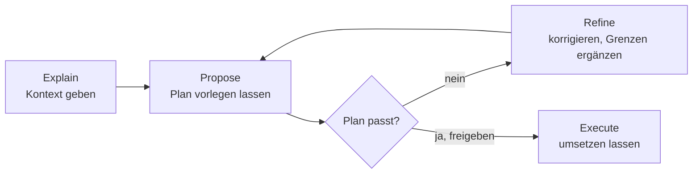

# S1.14 · Plan-Modus und schrittweises Vorgehen

<!-- meta:start -->
> **Regal:** [Aufträge formulieren](README.md#prompting) · **Stufe:** Kern · **~15 Min** · **Voraussetzungen:** [S1.5 Rechte im Alltag: default und acceptEdits](s1-05-rechte-im-alltag.md) · [S1.13 Vager und präziser Auftrag im Vergleich](s1-13-vager-und-praeziser-auftrag.md)
>
> ← [S1.13 Vager und präziser Auftrag im Vergleich](s1-13-vager-und-praeziser-auftrag.md) · [Bibliothek](README.md) · [S1.15 Output Styles und Personas](s1-15-output-styles.md) →
<!-- meta:end -->

## Schnellcheck

- Hast du schon einmal einen Plan von Claude geprüft und korrigiert, bevor Code geschrieben wurde?
- Kannst du ohne Nachschlagen sagen, wann der Plan-Modus seine Bearbeitungssperre nicht durchsetzt?

## Auf einen Blick

Bei größeren Aufgaben lässt du Claude erst einen Plan vorlegen und korrigierst ihn, bevor Code entsteht. Der Plan-Modus ist dafür ein Rechte-Modus: Claude liest, erkundet und plant, und Bearbeitungen bleiben blockiert, bis du den Plan freigibst. Die Sperre hat eine Ausnahme: In interaktiven Terminal-Sitzungen, in denen `bypassPermissions` im Modus-Zyklus verfügbar ist, setzt Claude Code sie nicht durch ([S1.6](s1-06-rechte-modi.md)). Kannst du den Diff in einem Satz beschreiben, sparst du dir den Plan.

## Bild im Kopf

Der Plan-Modus ist das Sicherheitsbriefing vor einer Panel-Neukonfiguration. Der Techniker erklärt die Lage und legt das Änderungsprotokoll auf den Tisch. Der Schichtleiter streicht zwei riskante Schritte und ergänzt einen Rückfallweg. Beide zeichnen ab, und erst dann beginnt die Änderung. Freigegeben wird die ganze Mission, bevor jemand eine Klemme löst.



## Im Detail

### Das Arbeitsmuster in vier Schritten

Dieses Muster stammt aus dieser Bibliothek. Die Doku beschreibt verwandt: erkunden, planen, umsetzen, committen.

1. **Explain:** Gib Claude den Kontext. „Das bauen wir, so ist der aktuelle Stand, das ist die Einschränkung.“
2. **Propose:** Lass Claude einen Ansatz vorschlagen, bevor es etwas umsetzt.
3. **Refine:** Prüf den Plan. Korrigier Missverständnisse, ergänze Grenzen. „Gut, aber nimm den vorhandenen Logger.“
4. **Execute:** „Setz es um.“

Das Muster verhindert, dass Claude 300 Zeilen Code in eine Richtung schreibt, die du nicht wolltest.

### Der Plan-Modus: das Muster mit Sperre

Claude recherchiert und schlägt Änderungen vor, ohne sie zu machen: Es liest Dateien, führt zum Erkunden auch Befehle aus und schreibt einen Plan. Deinen Quellcode bearbeitet es nicht, solange du den Plan nicht freigibst. So kommst du hinein:

- `Shift+Tab` drücken, bis die Statuszeile `⏸ plan mode on` zeigt. Die Taste schaltet reihum durch die Rechte-Modi.
- Einem einzelnen Prompt `/plan` voranstellen, zum Beispiel `/plan fix the auth bug`.
- Gleich im Plan-Modus starten: `claude --permission-mode plan`.

Ist der Plan fertig, legt Claude ihn vor und fragt, wie es weitergeht. Laut Doku stehen zur Wahl:

- **Yes, manually approve edits:** Du gibst den Plan frei und prüfst jede Änderung einzeln.
- **Eine Ja-Option mit Auto-Modus** (je nach Sitzung „Yes, and use auto mode“ oder „Yes, auto-accept edits“): Du gibst frei, und Claude bearbeitet ohne Einzelrückfragen. Das Wort der Option nennt den Rechte-Modus, in den die Sitzung danach wechselt.
- **No, keep planning:** Du bleibst im Plan-Modus und sagst, was sich ändern soll. Das ist Refine. So nennt die Doku die Antwort; in Version 2.1.289 heißt sie in der Oberfläche „Tell Claude what to change“.

`Ctrl+G` öffnet den Plan in deinem Editor, damit du ihn direkt änderst. Erneutes `Shift+Tab` verlässt den Plan-Modus, ohne den Plan freizugeben.

### Wann lohnt sich ein Plan?

Der Plan kostet Zeit. Die Doku nennt ihn nützlich, wenn du beim Ansatz unsicher bist, wenn die Änderung mehrere Dateien betrifft oder wenn du den Code nicht kennst. Kleine Änderungen mit klarem Scope, etwa ein Tippfehler oder eine Umbenennung, lässt du Claude direkt machen. Faustregel der Doku: Kannst du den Diff in einem Satz beschreiben, lass den Plan weg.

### Zwei Formulierungen, die den Plan erzwingen

**„Erst X lesen, dann vorschlagen“**

```
Read src/alarm_correlator.py and src/event_parser.py first. Then suggest
how we should add support for zone-group correlation without breaking
the existing per-zone logic.
```

Claude stützt seine Vorschläge auf den echten Code statt auf Annahmen.

**„Erst den Plan zeigen, dann umsetzen“**

```
Show me your implementation plan before writing any code. I want to
review the approach and the list of files you'll change.
```

Du bekommst einen Prüfpunkt, bevor sich etwas ändert, auch ohne Plan-Modus. Der Unterschied: Im Plan-Modus sperrt Claude Code das Bearbeiten, ohne ihn bittest du nur darum.

## Selbst machen

### Übung: planen, korrigieren, freigeben (etwa 10 Minuten)

**Ziel:** Du siehst, dass im Plan-Modus nichts geändert wird, schärfst einen Plan mit einer Scope-Grenze nach und gibst ihn erst dann frei.

**Startzustand:** ein neuer Ordner `~/cc-workshop/plan` mit Git und Python (beides aus [S0.1](s0-01-werkstatt-einrichten.md)). Leg ihn an und wechsle hinein (`mkdir -p ~/cc-workshop/plan && cd ~/cc-workshop/plan`, in PowerShell `New-Item -ItemType Directory -Force "$HOME\cc-workshop\plan"; Set-Location "$HOME\cc-workshop\plan"`).

1. Starte `claude --permission-mode acceptEdits` und gib ein: `Create events.csv with six lines (columns door,time,result), log_reader.py with read_events(path), report.py with count_by_door(events), and main.py that prints the count per door.` Beende die Sitzung mit `/exit`. Führ `git init`, `git add .` und `python main.py` aus. Erwartet: eine Zählung je Tür.
2. Starte `claude --permission-mode plan`. Die Statuszeile zeigt `⏸ plan mode on`. Gib ein:

   <!-- cockpit:example -->
   ```text
   Add a --json flag to main.py that prints the door counts as JSON instead of text. Show me your plan first.
   ```

   Erwartet: Claude liest die Dateien und legt einen Plan vor. Er nennt die Dateien, die es ändern will, und fragt, wie es weitergehen soll.
3. Antworte noch nicht. Öffne ein zweites Terminal im Ordner und führ `git diff` aus. Erwartet: keine Ausgabe, also keine Änderung an deinen Dateien seit Schritt 1. Die Sperre hat gehalten.
4. Wähl im ersten Terminal die Antwort zum Nachschärfen (**Tell Claude what to change**, in der Doku „No, keep planning“) und schreib: `Put the JSON formatting in a new function to_json(counts) in report.py and call it from main.py. Do not change log_reader.py.` Erwartet: ein neuer Plan, der jetzt auch `report.py` nennt und `log_reader.py` ausdrücklich unangetastet lässt.
5. Gib jetzt frei, mit der Option **Yes, manually approve edits**. Bestätige die Änderungen einzeln. Erwartet: Erst jetzt entstehen Änderungen. Beende die Sitzung.
6. Führ `git diff --stat` und `python main.py --json` aus. Erwartet: Das Diff zeigt `main.py` und `report.py`, nicht `log_reader.py`; in `report.py` steht die Funktion `to_json`, und der Aufruf druckt JSON.

**Aufräumen:** Lösch den Ordner `~/cc-workshop/plan` selbst.

**Geschafft, wenn:**

- [ ] `git diff` vor der Freigabe leer war
- [ ] der überarbeitete Plan deine Vorgabe aufnahm (`to_json` in `report.py`)
- [ ] `git diff --stat` nach der Umsetzung `main.py` und `report.py` zeigt, nicht `log_reader.py`
- [ ] `python main.py --json` JSON druckt

## Typische Fallen

- **Mehrere Aufgaben in einem Prompt.** „Behebe den Fehler UND bau das Feature UND aktualisier die Doku“ macht es schwer, jeden Teil für sich zu prüfen.
- **Kritische Grenzen nur im Gespräch.** Wenn „never modify the legacy parser“ wirklich zählt, gehört es in die CLAUDE.md ([S1.10](s1-10-claude-md.md)), und für eine harte Sperre in eine Deny-Regel ([S1.5](s1-05-rechte-im-alltag.md)) oder einen Hook.
- **Vage Freigabe.** „Sieht gut aus“ kann Claude zu einem Schritt bewegen, den du nicht wolltest. Sag genau, was gilt: „Sieht gut aus, setz es um“ oder „Sieht gut aus, hier aufhören“.
- **Auf die Sperre vertrauen, obwohl Bypass verfügbar ist.** Liegt `bypassPermissions` im Modus-Zyklus deiner Sitzung, setzt Claude Code die Sperre des Plan-Modus nicht durch. Eine Bearbeitung oder ein Befehl, den Claude trotzdem versucht, läuft dann ohne Rückfrage. Er kommt in den Zyklus, wenn du mit `--permission-mode bypassPermissions`, `--dangerously-skip-permissions` oder `--allow-dangerously-skip-permissions` startest oder `permissions.defaultMode` entsprechend setzt. Dann zeigt `Shift+Tab` auch `⏵⏵ bypass permissions on`.

## Check

Du kannst eine Mehrdatei-Aufgabe im Plan-Modus planen lassen, den Plan mit einer zusätzlichen Grenze nachschärfen und die Umsetzung erst mit einer ausdrücklichen Freigabe starten.

1. Wie startest du im Plan-Modus, und woran erkennst du ihn?
2. Wann lohnt sich der Plan-Modus nicht mehr, und woran erkennst du das?
3. Unter welcher Bedingung setzt Claude Code die Bearbeitungssperre des Plan-Modus nicht durch, und was folgt daraus für dich?

<details><summary>Auflösung</summary>

1. Mit `claude --permission-mode plan`, mit `Shift+Tab` oder mit `/plan` vor einem Prompt. Die Statuszeile zeigt `⏸ plan mode on`.
2. Bei kleinen Änderungen mit klarem Scope: Kannst du den Diff in einem Satz beschreiben, lass den Plan weg.
3. In interaktiven Terminal-Sitzungen, in denen `bypassPermissions` im Modus-Zyklus verfügbar ist. Dann kann eine Bearbeitung ohne Rückfrage laufen, du darfst dich also nicht auf die Sperre verlassen.

</details>

<details><summary>Quizfrage</summary>

**Frage:** Der Plan sieht gut aus, aber ein Schritt fasst die Konfigurationsdatei an, die du nicht anfassen willst. Was antwortest du?

- **Richtig:** Die Antwort zum Nachschärfen wählen und die Grenze nennen („Do not change the config file“), dann den neuen Plan prüfen.
- Falsch: „Sieht gut aus“ antworten, denn Claude lässt den Schritt dann von selbst weg und fragt vor der Änderung nach.
- Falsch: Den Plan freigeben und die Änderung hinterher mit `/rewind` zurücknehmen, weil ein Checkpoint auch Shell-Befehle erfasst.
- Falsch: `Shift+Tab` drücken, weil das den Plan mit der Grenze neu schreibt und ihn zugleich zur Umsetzung freigibt.

</details>

## Weiterlesen

- [Rechte-Modi: der Plan-Modus](https://code.claude.com/docs/en/permission-modes#analyze-before-you-edit-with-plan-mode)
- [Best Practices: erst erkunden, dann planen, dann coden](https://code.claude.com/docs/en/best-practices#explore-first-then-plan-then-code)
- [S1.13 · Vager und präziser Auftrag im Vergleich](s1-13-vager-und-praeziser-auftrag.md)
- [S1.5 · Rechte im Alltag: default und acceptEdits](s1-05-rechte-im-alltag.md)
- [S1.6 · Alle Rechte-Modi im Überblick](s1-06-rechte-modi.md)
- [S1.7 · Modellwahl und Effort](s1-07-modellwahl-und-effort.md)
- [S1.10 · CLAUDE.md: die Hausordnung des Projekts](s1-10-claude-md.md)
