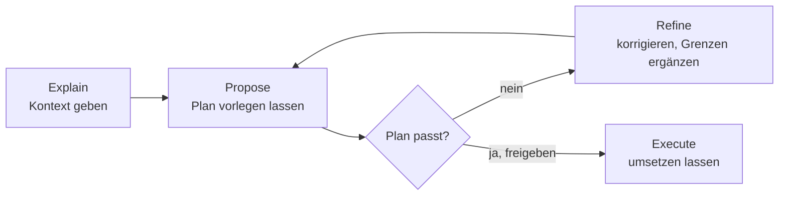

# S1.14 · Plan-Modus und schrittweises Vorgehen

<!-- meta:start -->
> **Regal:** [Aufträge formulieren](README.md#prompting) · **Stufe:** Kern · **~15 Min** · **Voraussetzungen:** [S1.5 Rechte im Alltag: default und acceptEdits](s1-05-rechte-im-alltag.md) · [S1.13 Vager und präziser Auftrag im Vergleich](s1-13-vager-und-praeziser-auftrag.md)
>
> ← [S1.13 Vager und präziser Auftrag im Vergleich](s1-13-vager-und-praeziser-auftrag.md) · [Bibliothek](README.md) · [S1.15 Output Styles und Personas](s1-15-output-styles.md) →
<!-- meta:end -->

## Schnellcheck

- Hast du schon einmal einen Plan von Claude geprüft und korrigiert, bevor Code geschrieben wurde?
- Kannst du ohne Nachschlagen die vier Schritte Explain, Propose, Refine, Execute nennen und sagen, wann sich der Plan-Modus lohnt?

## Auf einen Blick

Bei größeren Aufgaben lässt du Claude erst einen Plan vorlegen und korrigierst ihn, bevor Code entsteht: Explain (Kontext geben), Propose (Vorschlag holen), Refine (korrigieren, Grenzen ergänzen), Execute (umsetzen lassen). Der Plan-Modus baut daraus eine Sperre: Claude liest und plant, Bearbeitungen bleiben blockiert, bis du den Plan freigibst. Kannst du den Diff in einem Satz beschreiben, sparst du dir den Plan.

## Bild im Kopf

Der Plan-Modus ist das Sicherheitsbriefing vor einer Panel-Neukonfiguration. Der Techniker legt das Änderungsprotokoll auf den Tisch (Propose). Der Schichtleiter streicht zwei riskante Schritte und ergänzt einen Rückfallweg (Refine). Beide zeichnen ab, und erst dann beginnt die Änderung (Execute). Freigegeben wird die ganze Mission, bevor jemand eine Klemme löst.



## Im Detail

### Das Arbeitsmuster in vier Schritten

Für komplexe Aufgaben bewährt sich ein Muster aus vier Schritten:

1. **Explain:** Gib Claude den Kontext. „Das bauen wir, so ist der aktuelle Stand, das ist die Einschränkung.“
2. **Propose:** Lass Claude einen Ansatz vorschlagen, bevor es etwas umsetzt. „Wie willst du das angehen?“
3. **Refine:** Prüf den Plan. Korrigier Missverständnisse, ergänze Grenzen. „Gut, aber nimm den vorhandenen Logger, keine print-Anweisungen.“
4. **Execute:** „Setz es um.“

Das Muster verhindert, dass Claude 300 Zeilen Code in eine Richtung schreibt, die du nicht wolltest.

### Der Plan-Modus: das Muster mit eingebauter Sperre

Der Plan-Modus ist einer der Rechte-Modi ([S1.5](s1-05-rechte-im-alltag.md), [S1.6](s1-06-rechte-modi.md)). Claude recherchiert und schlägt Änderungen vor, ohne sie zu machen: Es liest die relevanten Dateien, führt zum Erkunden auch Befehle aus und schreibt einen strukturierten Umsetzungsplan mit den Dateien, die es ändern will. Deinen Quellcode bearbeitet es nicht; Bearbeitungen bleiben gesperrt, bis du den Plan freigibst.

So kommst du hinein:

- `Shift+Tab` drücken, bis die Statuszeile `⏸ plan mode on` zeigt. Die Taste schaltet reihum durch die Rechte-Modi; je nach Startmodus drückst du sie mehrmals.
- Einem einzelnen Prompt `/plan` voranstellen, zum Beispiel `/plan fix the auth bug`.
- Gleich im Plan-Modus starten: `claude --permission-mode plan`.

Ist der Plan fertig, legt Claude ihn vor und fragt, wie es weitergeht:

- Mit einer der **Ja-Optionen** gibst du frei. Claude verlässt den Plan-Modus, wechselt in den Rechte-Modus, den die Option nennt, und beginnt zu bearbeiten.
- Mit **„No, keep planning“** bleibst du im Plan-Modus und sagst, was sich ändern soll. Das ist Schritt 3, Refine.
- `Ctrl+G` öffnet den Plan in deinem Editor; dort änderst du ihn direkt, bevor Claude weitermacht.
- Erneutes `Shift+Tab` verlässt den Plan-Modus, ohne den Plan freizugeben.

Nimm den Plan-Modus für:

- Aufgaben, die mehr als zwei bis drei Dateien berühren
- alles, bei dem du den Ansatz prüfen willst, bevor Code entsteht
- Refactorings über ein ganzes Modul oder Teilsystem
- jede Aufgabe, bei der ein Fehler teuer rückgängig zu machen wäre

Der Plan kostet auch Zeit. Kleine Änderungen mit klarem Scope, etwa einen Tippfehler, eine Log-Zeile oder eine Umbenennung, lässt du Claude direkt machen. Faustregel aus der offiziellen Doku: Kannst du den Diff in einem Satz beschreiben, lass den Plan weg.

### Effort passend zur Aufgabe

Auch der Effort ist ein Hebel beim Prompten. Manche Aufgaben profitieren von `/effort xhigh`: Architekturentscheidungen, die Ursachensuche bei subtilen Fehlern, Refactorings über mehrere Dateien mit Nebenwirkungen, die bedacht werden müssen. Andere gehen besser mit `/effort low`: Boilerplate, Tippfehler, reine Formatänderungen. Den Effort passend zu wählen, gehört selbst zum Prompten: `max` für einen einzeiligen Tippfehler verschwendet Tokens, `low` für eine Architekturentscheidung liefert flache Ergebnisse. Richte den Effort nach der Denklast der Aufgabe. Wie Effort und Modellwahl zusammenspielen, steht in [S1.7](s1-07-modellwahl-und-effort.md).

### Bewährte Formulierungen

Diese Muster kannst du sofort übernehmen.

**„Erst X lesen, dann vorschlagen“**

```
Read src/alarm_correlator.py and src/event_parser.py first. Then suggest
how we should add support for zone-group correlation without breaking
the existing per-zone logic.
```

Claude stützt seine Vorschläge auf den echten Code statt auf Annahmen.

**„Erst den Plan zeigen, dann umsetzen“**

<!-- cockpit:example -->
```
Show me your implementation plan before writing any code. I want to
review the approach and the list of files you'll change.
```

Du bekommst einen Prüfpunkt, bevor sich irgendetwas ändert. Das ist Propose, auch ohne Plan-Modus.

**„Nur X ändern, Y nicht anfassen“**

```
Update the database connection pool settings in config/db.py.
Do not touch any other configuration files or the connection pool
implementation itself — only the settings values.
```

Ausdrückliche Ausschlüsse verhindern, dass der Auftrag unbemerkt wächst. Das ist die Scope-Grenze aus [S1.13](s1-13-vager-und-praeziser-auftrag.md) als feste Formel.

**„Mit Z testen“**

```
After making changes, run pytest tests/test_auth.py -v and show me
the output before we move on.
```

Die Prüfung steckt im Auftrag. Du siehst die Testergebnisse, bevor du committest. In der Übung von [S1.13](s1-13-vager-und-praeziser-auftrag.md) ist das der Schritt „Run the tests“.

**„Erklär, was du gemacht hast“**

```
Explain the changes you made and why, in plain language. Then show
the diff.
```

Claude muss seine Gründe aussprechen. So fallen dir Missverständnisse leichter auf.

## Typische Fallen

- **Mehrere Aufgaben in einem Prompt.** „Behebe den Fehler UND bau das Feature UND aktualisier die Doku“ teilt Claudes Aufmerksamkeit und macht es schwer, jeden Teil für sich zu prüfen.
- **Kritische Grenzen nur im Gespräch.** Verlass dich bei wichtigen Einschränkungen nicht auf Claudes Gedächtnis. Wenn „never modify the legacy parser“ wirklich zählt, gehört es in die CLAUDE.md ([S1.10](s1-10-claude-md.md)).
- **Die erste Ausgabe ungeprüft übernehmen.** Lass Claude seine Gründe erklären und Grenzfälle bedenken. Frag: „Was könnte bei diesem Ansatz schiefgehen?“
- **Vage Freigabe.** „Sieht gut aus“ kann Claude zu einem nächsten Schritt bewegen, den du nicht wolltest. Sag genau, was gilt: „Sieht gut aus, setz es um“ oder „Sieht gut aus, hier aufhören“.
- **Auf die Sperre vertrauen, obwohl Bypass verfügbar ist.** Startest du eine interaktive Terminal-Sitzung so, dass `bypassPermissions` im Modus-Zyklus liegt, setzt Claude Code die Sperre des Plan-Modus nicht durch. Claude soll dann zwar nur planen, aber eine Bearbeitung oder ein Befehl, den es trotzdem versucht, läuft ohne Rückfrage ([S1.6](s1-06-rechte-modi.md)).

## Check

Du kannst eine Mehrdatei-Aufgabe im Plan-Modus planen lassen, den Plan mit einer zusätzlichen Grenze nachschärfen und die Umsetzung erst mit einer ausdrücklichen Freigabe starten.

1. Welche vier Schritte hat das Arbeitsmuster, und in welchem korrigierst du Claude?
2. Wie kommst du in den Plan-Modus, und wie verlässt du ihn, ohne den Plan freizugeben?
3. Woran erkennst du, dass du dir den Plan sparen kannst?

<details><summary>Quizfrage</summary>

**Frage:** Wann ist es richtig, Claude direkt umsetzen zu lassen, statt zuerst den Plan-Modus zu nutzen?

- **Richtig:** Bei einer kleinen Änderung mit klarem Scope, deren Diff du in einem einzigen Satz beschreiben kannst.
- Falsch: Nur wenn die CLAUDE.md keine Verbotsregel enthält, weil Claude solche Grenzen ohne Plan-Modus übergeht.
- Falsch: Fast immer, weil der Plan-Modus Mehrkosten verursacht und die Qualität der Ergebnisse nicht verbessert.
- Falsch: Bei jeder Arbeit in einer einzelnen Sitzung, weil sich der Plan-Modus erst mit mehreren Agenten lohnt.

</details>

## Weiterlesen

- [Rechte-Modi: der Plan-Modus](https://code.claude.com/docs/en/permission-modes#analyze-before-you-edit-with-plan-mode)
- [Best Practices: erst erkunden, dann planen, dann coden](https://code.claude.com/docs/en/best-practices#explore-first-then-plan-then-code)
- [S1.13 · Vager und präziser Auftrag im Vergleich](s1-13-vager-und-praeziser-auftrag.md)
- [S1.5 · Rechte im Alltag: default und acceptEdits](s1-05-rechte-im-alltag.md)
- [S1.6 · Alle Rechte-Modi im Überblick](s1-06-rechte-modi.md)
- [S1.7 · Modellwahl und Effort](s1-07-modellwahl-und-effort.md)
- [S1.10 · CLAUDE.md: die Hausordnung des Projekts](s1-10-claude-md.md)
