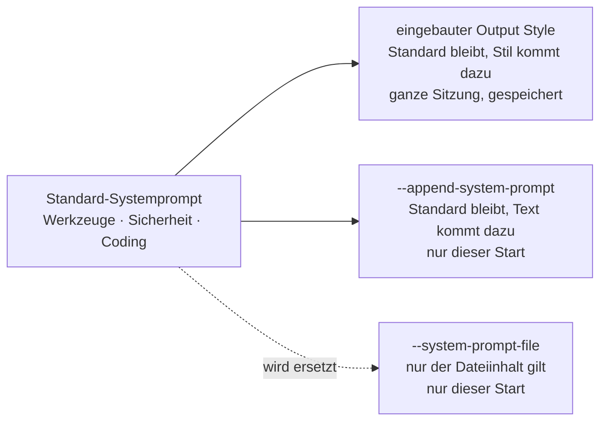

# S1.15 · Output Styles und Personas

<!-- meta:start -->
> **Regal:** [Aufträge formulieren](README.md#prompting) · **Stufe:** Vertiefung · **~12 Min** · **Voraussetzungen:** [S1.13 Vager und präziser Auftrag im Vergleich](s1-13-vager-und-praeziser-auftrag.md)
>
> ← [S1.14 Plan-Modus und schrittweises Vorgehen](s1-14-plan-modus.md) · [Bibliothek](README.md) · [S1.16 Git in einem Fluss: Branch, Commit, PR](s1-16-git-in-einem-fluss.md) →
<!-- meta:end -->

## Schnellcheck

- Hast du schon einmal mit `/output-style` oder `--append-system-prompt` geändert, wie Claude dir antwortet?
- Kannst du ohne Nachschlagen sagen, was vom Standard-Systemprompt übrig bleibt, wenn du Claude mit `--system-prompt-file` startest?

## Auf einen Blick

Ein Output Style legt für die ganze Sitzung fest, wie Claude antwortet und arbeitet: knapp (Concise), mit Begründungen (Explanatory), mit kleinen Aufgaben für dich (Learning) oder ohne Rückfragen bei Routine (Proactive). Du wechselst ihn mit `/output-style`. Für eine Rolle beim Start gibt es die System-Prompt-Flags: `--append-system-prompt` ergänzt den Standard-Systemprompt, `--system-prompt-file` ersetzt ihn ganz, samt Werkzeug- und Sicherheitshinweisen.

## Bild im Kopf

Ein Output Style ist die Sprechweise eines Leitstellen-Operators: Funkkurzbefehl (Concise), Schichtübergabe mit Begründungen (Explanatory) oder Einarbeitung, bei der die neue Kollegin ein Stück selbst verdrahtet (Learning). Derselbe Operator, dieselbe Dienstanweisung, nur ein anderes Protokoll.

`--append-system-prompt` ist ein Zusatzvermerk auf der Dienstanweisung: Alles gilt weiter, eine Regel kommt dazu. `--system-prompt-file` tauscht die Dienstanweisung aus. Dann sitzt praktisch ein anderer Operator am Pult, und er kennt die Hausregeln nur, wenn sie in seiner neuen Anweisung stehen.



## Im Detail

### Output Styles: der Antwortstil einer ganzen Sitzung

Claude Code startet im Style **Default**, seinen Standardanweisungen für Softwareentwicklung. Das Modell bleibt dasselbe, der Style ändert nur die Anweisungen. Vier eingebaute Styles behalten die Standardanweisungen und ergänzen eigene:

| Style | Was sich ändert | Passt, wenn |
|---|---|---|
| `Proactive` | Claude legt sofort los und trifft bei Routineentscheidungen vernünftige Annahmen, statt nachzufragen | du Claude durcharbeiten lassen willst und bei einer falschen Annahme selbst nachsteuerst |
| `Concise` | Antworten beginnen mit dem Ergebnis, ohne Einleitung, Schritt-für-Schritt-Erzählung und Schlusszusammenfassung | dir die Standardantworten zu lang sind |
| `Explanatory` | Claude ergänzt kurze `Insight`-Blöcke, die die Entscheidungen hinter dem Code erklären | du eine Codebasis kennenlernst oder zur Änderung die Begründung willst |
| `Learning` | wie Explanatory, und an echten Entscheidungsstellen lässt Claude dir ein paar Zeilen zum Selberschreiben (markiert mit `TODO(human)`) | du beim Erledigen der Aufgabe selbst üben willst |

Proactive ändert deinen Rechte-Modus nicht: Welche Werkzeugaufrufe ohne Rückfrage laufen, entscheidet weiter der Rechte-Modus ([S1.5](s1-05-rechte-im-alltag.md)).

**Umschalten:** `/output-style <style>`, zum Beispiel `/output-style concise`. Ohne Argument listet der Befehl die Styles und markiert den aktiven. Im Terminal geht es auch über `/config` und dort **Output style**. Claude Code speichert deine Wahl in `.claude/settings.local.json`, sie gilt also auch in späteren Sitzungen in diesem Projekt; zurück kommst du mit `/output-style default`. Der neue Style wirkt ab deiner nächsten Nachricht.

Concise passt gut, wenn du tief im Arbeitsfluss steckst. Maschinenlesbare Ausgabe ist dagegen kein Output Style: Soll ein anderes Programm die Antwort auswerten, nimmst du im Headless-Modus `claude -p --output-format json` ([S4.3](s4-03-headless.md)).

### Personas über den System-Prompt

Ein Output Style gilt für die Sitzung und bleibt gespeichert. Die System-Prompt-Flags setzt du beim Start von Claude Code, für genau diesen Aufruf. Damit gibst du Claude eine Rolle: Code-Reviewer, Doku-Schreiber, Tutor, Principal Engineer. Zwei Flags leisten das:

- `--append-system-prompt "<text>"`: **ergänzend.** Dein Text wird ans Ende des Standard-Systemprompts gehängt. Werkzeugführung, Sicherheitshinweise und Coding-Konventionen bleiben. Nimm es für eine enge Rollenanpassung, die auf dem normalen Verhalten aufsetzt.
- `--system-prompt-file <path>`: **ersetzend.** Der Inhalt der Datei ersetzt den Standard-Systemprompt ganz. Damit fallen auch Werkzeugführung und Sicherheitshinweise weg; was deine Aufgabe davon noch braucht, muss in der Datei stehen.

Dazu gibt es zwei Geschwister: `--system-prompt "<text>"` ersetzt mit Text statt mit einer Datei, `--append-system-prompt-file <path>` ergänzt aus einer Datei. Alle wirken interaktiv und mit `-p`.

Beispiele:

<!-- cockpit:example -->
```bash
# Additive: code-review persona that always cites line numbers
claude --append-system-prompt "Always cite line numbers when referring to code. Never propose changes without showing the affected lines first."

# Full persona from file: tutor mode for onboarding a new teammate
claude --system-prompt-file ~/.claude/personas/tutor.md
```

Typische Persona-Dateien: `code-reviewer.md` (keine Meinungen, nur markieren und nachfragen), `docs-writer.md` (immer Markdown, Code nur auf Nachfrage), `tutor.md` (erklärt auf Junior-Niveau), `architect.md` (skizziert vor jeder Entscheidung die Abwägungen im ADR-Stil).

Beachte beim zweiten Beispiel: Mit `--system-prompt-file` ist der Tutor kein Coding-Assistent mit Zusatzregel mehr, sondern nur noch das, was in `tutor.md` steht. Soll Claude weiter wie gewohnt arbeiten und nur anders erklären, passt `--append-system-prompt-file` besser. Für Personas, zwischen denen du öfter wechselst oder die das Team im Projekt teilen soll, empfiehlt die Doku eigene Output Styles: Markdown-Dateien in `.claude/output-styles/` (Projekt) oder `~/.claude/output-styles/` (nur für dich). Projektkonventionen, die immer gelten sollen, gehören in die CLAUDE.md ([S1.10](s1-10-claude-md.md)).

### Interaktive Personas und CI getrennt halten

Wie der System-Prompt in CI-Pipelines pro Schritt gesetzt wird, steht in [S4.4](s4-04-ci-zugang-und-kosten.md). Misch das interaktive Umschalten von Personas nicht mit dem Prompt-Design für CI. Das sind zwei getrennte Denkschubladen, und wer dieselben Flags für beides überlädt, baut sich Unfälle.

### Nebenbei: Diktieren mit /voice

Kein Output Style, sondern ein Eingabeweg: Für lange Prompts, bei denen Tippen zu langsam ist, schaltet `/voice [hold|tap|off]` das Diktieren ein. Bei `hold` hältst du eine Taste gedrückt, solange du sprichst (standardmäßig die Leertaste). Bei `tap` tippst du einmal zum Starten und noch einmal zum Senden. Nützlich, wenn du ein mehrstufiges Refactoring schneller erzählst als aufschreibst.

## Typische Fallen

- **`/output-styles`, „Detailed“ oder „JSON“ aus älteren Unterlagen.** Die gibt es nicht. Der Befehl heißt `/output-style`, die eingebauten Styles heißen Default, Proactive, Concise, Explanatory und Learning.
- **Die CLI kennt `/output-style` nicht.** Der Befehl braucht Claude Code v2.1.269 oder neuer, der Style Concise v2.1.237. Prüf mit `claude --version` und aktualisiere, wenn nötig.
- **Ein Style als Garantie.** Ein Output Style ist eine Anweisung, der Claude folgt; nichts erzwingt sie. Was jedes Mal ohne Ausnahme passieren muss, etwa das Blocken eines Befehls, gehört in einen Hook ([S2.8](s2-08-hook-einrichten.md)).

## Check

Du kannst erklären, wann du einen Output Style und wann ein System-Prompt-Flag nimmst, und weißt, dass `--system-prompt-file` den Standard-Systemprompt ganz ersetzt.

1. Mit welchem Befehl wechselst du den Output Style, und wo speichert Claude Code deine Wahl?
2. Was bleibt vom Standard-Systemprompt bei `--append-system-prompt`, was bei `--system-prompt-file`?
3. Wofür nimmst du `claude -p --output-format json` statt eines Output Styles?

<details><summary>Quizfrage</summary>

**Frage:** Was ist der entscheidende Unterschied zwischen `--append-system-prompt` und `--system-prompt-file`?

- **Richtig:** `--append-system-prompt` hängt Text an den Standard-Systemprompt an; `--system-prompt-file` ersetzt ihn ganz durch die Datei.
- Falsch: `--append-system-prompt` wird gespeichert und gilt in allen Sitzungen; `--system-prompt-file` gilt nur für diesen einen Start.
- Falsch: `--system-prompt-file` ist die neue Form und `--append-system-prompt` ist veraltet; heute wirken beide Flags genau gleich.
- Falsch: Beide lassen den Systemprompt unverändert und schieben nur Text in deine erste Nachricht, denn der Systemprompt ist fest.

</details>

## Weiterlesen

- [Output Styles](https://code.claude.com/docs/en/output-styles)
- [CLI-Referenz: System-Prompt-Flags](https://code.claude.com/docs/en/cli-reference#system-prompt-flags)
- [Diktieren per Sprache](https://code.claude.com/docs/en/voice-dictation)
- [S1.13 · Vager und präziser Auftrag im Vergleich](s1-13-vager-und-praeziser-auftrag.md)
- [S1.10 · CLAUDE.md: die Hausordnung des Projekts](s1-10-claude-md.md)
- [S4.3 · Headless: claude -p als Pipeline-Stufe](s4-03-headless.md)
- [S4.4 · CI-Zugangsdaten, Kostengrenzen und Kosten-Feinschliff](s4-04-ci-zugang-und-kosten.md)
- [S2.8 · Einen Hook einrichten, der wirklich blockt](s2-08-hook-einrichten.md)
