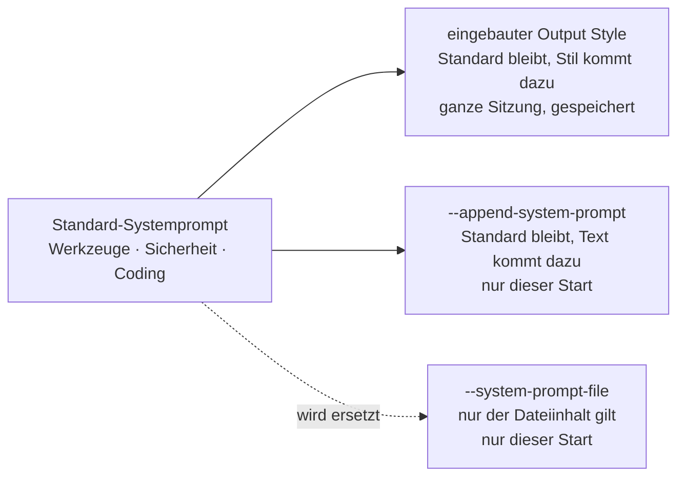

# S1.15 · Output Styles und Personas

<!-- meta:start -->
> **Regal:** [Aufträge formulieren](README.md#prompting) · **Stufe:** Vertiefung · **~15 Min** · **Voraussetzungen:** [S1.13 Vager und präziser Auftrag im Vergleich](s1-13-vager-und-praeziser-auftrag.md)
>
> ← [S1.14 Plan-Modus und schrittweises Vorgehen](s1-14-plan-modus.md) · [Bibliothek](README.md) · [S1.16 Git in einem Fluss: Branch, Commit, PR](s1-16-git-in-einem-fluss.md) →
<!-- meta:end -->

## Schnellcheck

- Hast du schon einmal mit `/output-style` oder `--append-system-prompt` geändert, wie Claude dir antwortet?
- Kannst du ohne Nachschlagen sagen, was vom Standard-Systemprompt übrig bleibt, wenn du Claude mit `--system-prompt-file` startest?

## Auf einen Blick

Ein Output Style legt für die ganze Sitzung fest, wie Claude antwortet und arbeitet: knapp (Concise), mit Begründungen (Explanatory), mit kleinen Aufgaben für dich (Learning) oder ohne Rückfragen bei Routine (Proactive). Du wechselst ihn mit `/output-style`. Für eine Rolle beim Start gibt es die System-Prompt-Flags: `--append-system-prompt` ergänzt den Standard-Systemprompt, `--system-prompt-file` ersetzt ihn ganz, samt Werkzeug- und Sicherheitshinweisen.

## Bild im Kopf

Ein Output Style ist die Sprechweise eines Leitstellen-Operators: Funkkurzbefehl (Concise), Schichtübergabe mit Begründungen (Explanatory) oder Einarbeitung, bei der die neue Kollegin ein Stück selbst verdrahtet (Learning). Derselbe Operator mit derselben Dienstanweisung, nur mit einem anderen Protokoll obendrauf.

`--append-system-prompt` ist ein Zusatzvermerk auf der Dienstanweisung: Alles gilt weiter, eine Regel kommt dazu. `--system-prompt-file` tauscht die Dienstanweisung aus. Dann sitzt praktisch ein anderer Operator am Pult, und er kennt die Hausregeln nur, wenn sie in seiner neuen Anweisung stehen.



## Im Detail

### Output Styles: der Antwortstil einer ganzen Sitzung

Claude Code startet im Style **Default**, seinen Standardanweisungen für Softwareentwicklung. Das Modell bleibt dasselbe, der Style ändert nur die Anweisungen. Vier eingebaute Styles behalten die Standardanweisungen und ergänzen eigene:

| Style | Was sich ändert | Passt, wenn |
|---|---|---|
| `Proactive` | Claude legt sofort los und trifft bei Routineentscheidungen vernünftige Annahmen, statt nachzufragen | du Claude durcharbeiten lassen willst und bei einer falschen Annahme selbst nachsteuerst |
| `Concise` | Antworten beginnen mit dem Ergebnis, ohne Einleitung, Schritt-für-Schritt-Erzählung und Schlusszusammenfassung | dir die Standardantworten zu lang sind |
| `Explanatory` | Claude ergänzt kurze `Insight`-Blöcke, die die Entscheidungen hinter dem Code erklären | du eine Codebasis kennenlernst oder zur Änderung die Begründung willst |
| `Learning` | wie Explanatory, und an echten Entscheidungsstellen lässt Claude dir ein paar Zeilen zum Selberschreiben (markiert mit `TODO(human)`) | du beim Erledigen der Aufgabe selbst üben willst |

Proactive ändert deinen Rechte-Modus nicht: Welche Werkzeugaufrufe ohne Rückfrage laufen, entscheidet weiter der Rechte-Modus ([S1.5](s1-05-rechte-im-alltag.md)).

**Umschalten:** `/output-style <style>`, zum Beispiel `/output-style concise`. Ohne Argument listet der Befehl die Styles und markiert den aktiven. Im Terminal geht es auch über `/config` und dort **Output style**. Claude Code speichert deine Wahl in `.claude/settings.local.json`, sie gilt also auch in späteren Sitzungen in diesem Projekt; zurück kommst du mit `/output-style default`. Der neue Style wirkt ab deiner nächsten Nachricht.

### Personas über den System-Prompt

Ein Output Style gilt für die Sitzung und bleibt gespeichert. Die System-Prompt-Flags setzt du beim Start von Claude Code, für genau diesen Aufruf. Damit gibst du Claude eine Rolle: Code-Reviewer, Doku-Schreiber, Tutor. Zwei Flags leisten das:

- `--append-system-prompt "<text>"`: **ergänzend.** Dein Text wird ans Ende des Standard-Systemprompts gehängt. Werkzeugführung, Sicherheitshinweise und Coding-Konventionen bleiben. Nimm es für eine enge Rollenanpassung, die auf dem normalen Verhalten aufsetzt.
- `--system-prompt-file <path>`: **ersetzend.** Der Inhalt der Datei ersetzt den Standard-Systemprompt ganz. Damit fallen auch Werkzeugführung und Sicherheitshinweise weg; was deine Aufgabe davon noch braucht, muss in der Datei stehen.

Dazu gibt es zwei Geschwister: `--system-prompt "<text>"` ersetzt mit Text statt mit einer Datei, `--append-system-prompt-file <path>` ergänzt aus einer Datei. Alle wirken interaktiv und mit `-p`. Soll Claude weiter wie gewohnt arbeiten und nur anders erklären, passt `--append-system-prompt-file` besser als der Ersatz.

Für Personas, zwischen denen du öfter wechselst oder die das Team teilen soll, empfiehlt die Doku eigene Output Styles: Markdown-Dateien in `.claude/output-styles/` (Projekt) oder `~/.claude/output-styles/` (nur für dich). Projektkonventionen, die immer gelten sollen, gehören in die CLAUDE.md ([S1.10](s1-10-claude-md.md)).

## Selbst machen

### Übung: Stil umschalten, Rolle setzen (etwa 8 Minuten)

**Ziel:** Du siehst, wie derselbe Auftrag in drei Styles anders beantwortet wird, wo Claude Code deine Wahl speichert und dass ein Start-Flag nur für diesen Start gilt.

**Startzustand:** ein neuer, leerer Ordner `~/cc-workshop/stil`. Leg ihn an und wechsle hinein (`mkdir -p ~/cc-workshop/stil && cd ~/cc-workshop/stil`, in PowerShell `New-Item -ItemType Directory -Force "$HOME\cc-workshop\stil"; Set-Location "$HOME\cc-workshop\stil"`). Die Wahl des Styles landet dann in diesem Ordner, nicht in deiner globalen Konfiguration.

1. Starte `claude --permission-mode default` und gib ein: `Explain what a Python list comprehension is.` Merk dir Länge und Aufbau der Antwort.
2. Gib `/output-style concise` ein und dieselbe Frage noch einmal. Erwartet: Die Antwort beginnt mit dem Ergebnis und ist kürzer, ohne Einleitung und Schlusszusammenfassung.
3. Gib `/output-style explanatory` ein und dieselbe Frage noch einmal. Erwartet: Die Antwort begründet zusätzlich, meist in einem Block mit der Überschrift `Insight`. Fehlt er bei dieser reinen Erklärfrage, bitte um ein Beispiel: `Write a one-line example and explain your choice.`
4. Gib `/output-style` ohne Argument ein. Erwartet: eine Liste der Styles, der aktive ist markiert. Beende die Sitzung mit `/exit`.
5. Sieh nach, wo die Wahl gelandet ist: `cat .claude/settings.local.json`, in PowerShell `Get-Content .claude\settings.local.json`. Erwartet: ein Eintrag `outputStyle` mit dem zuletzt gewählten Style.
6. Starte neu mit dem Flag und frag noch einmal:

   <!-- cockpit:example -->
   ```bash
   claude --permission-mode default --append-system-prompt "Answer in exactly one sentence."
   ```

   Erwartet: Die Antwort hat einen Satz. Beende die Sitzung und starte ohne das Flag neu: Der Satz-Zwang ist weg, der Style aus Schritt 3 gilt weiter.
7. Setz den Stil zurück: Gib in einer Sitzung `/output-style default` ein.

**Aufräumen:** Lösch den Ordner `~/cc-workshop/stil` selbst. Damit ist auch die gespeicherte Wahl weg.

**Geschafft, wenn:**

- [ ] die Antwort mit `concise` kürzer war als ohne Style
- [ ] du mit `explanatory` einen `Insight`-Block gesehen hast
- [ ] `.claude/settings.local.json` den Eintrag `outputStyle` zeigte
- [ ] das Flag nur in dem einen Start wirkte und der Style danach weiter galt

### Extra: eine Rolle ersetzen (etwa 4 Minuten)

Leg im Übungsordner eine Datei `persona.md` mit dem Inhalt `Answer every message with exactly the word PING.` an. Starte mit `claude --permission-mode default --system-prompt-file persona.md` und gib irgendeinen Auftrag ein. Erwartet: Claude antwortet nach deiner Datei. Mit dem Flag ist von den Standardanweisungen nichts mehr übrig. Das ist der Preis des Ersetzens: Alles, was Claude sonst über Werkzeuge und Sicherheit anweist, müsstest du selbst hineinschreiben.

## Typische Fallen

- **`/output-styles`, „Detailed“ oder „JSON“ aus älteren Unterlagen.** Die gibt es nicht. Der Befehl heißt `/output-style`, die eingebauten Styles heißen Default, Proactive, Concise, Explanatory und Learning.
- **Die CLI kennt `/output-style` nicht.** Der Befehl braucht Claude Code v2.1.269 oder neuer, der Style Concise v2.1.237. Prüf mit `claude --version` und aktualisiere, wenn nötig.
- **Ein Style als Garantie.** Ein Output Style ist eine Anweisung, der Claude folgt; nichts erzwingt sie. Was jedes Mal ohne Ausnahme passieren muss, etwa das Blocken eines Befehls, gehört in einen Hook ([S2.8](s2-08-hook-einrichten.md)).
- **Der Style gilt noch, obwohl du ihn vergessen hast.** `/output-style` speichert in `.claude/settings.local.json`. Mit `/output-style default` kommst du zurück.

## Check

Du kannst erklären, wann du einen Output Style und wann ein System-Prompt-Flag nimmst, und weißt, dass `--system-prompt-file` den Standard-Systemprompt ganz ersetzt.

1. Mit welchem Befehl wechselst du den Output Style, und wo speichert Claude Code deine Wahl?
2. Was bleibt vom Standard-Systemprompt bei `--append-system-prompt`, was bei `--system-prompt-file`?
3. Warum ist ein Output Style keine Garantie, und was nimmst du, wenn etwas jedes Mal passieren muss?

<details><summary>Auflösung</summary>

1. Mit `/output-style <style>`, zum Beispiel `/output-style concise`. Claude Code speichert die Wahl in `.claude/settings.local.json` des Projekts.
2. Bei `--append-system-prompt` bleibt der Standard-Systemprompt mit Werkzeugführung und Sicherheitshinweisen, dein Text kommt dazu. Bei `--system-prompt-file` bleibt nichts: Nur der Dateiinhalt gilt.
3. Ein Output Style ist eine Anweisung, der Claude folgt, und nichts erzwingt sie. Was jedes Mal passieren muss, gehört in einen Hook.

</details>

<details><summary>Quizfrage</summary>

**Frage:** Du hast gestern in einem Projekt `/output-style concise` gewählt. Heute antwortet Claude dort wieder knapp, obwohl du nichts eingestellt hast. Woran liegt das?

- **Richtig:** Claude Code hat die Wahl in `.claude/settings.local.json` des Projekts gespeichert; sie gilt, bis du `/output-style default` eingibst.
- Falsch: Das Flag `--append-system-prompt` vom Vortag bleibt in der Projektkonfiguration erhalten und wirkt in jeder späteren Sitzung.
- Falsch: Ein Output Style gilt immer für alle deine Projekte, denn Claude Code legt ihn in der globalen `~/.claude/settings.json` ab.
- Falsch: Claude hat den Style in der `CLAUDE.md` des Projekts eingetragen und liest ihn dort bei jedem Start neu.

</details>

## Weiterlesen

- [Output Styles](https://code.claude.com/docs/en/output-styles)
- [CLI-Referenz: System-Prompt-Flags](https://code.claude.com/docs/en/cli-reference#system-prompt-flags)
- [S1.13 · Vager und präziser Auftrag im Vergleich](s1-13-vager-und-praeziser-auftrag.md)
- [S1.10 · CLAUDE.md: die Hausordnung des Projekts](s1-10-claude-md.md)
- [S4.4 · CI-Zugangsdaten, Kostengrenzen und Kosten-Feinschliff](s4-04-ci-zugang-und-kosten.md)
- [S2.8 · Einen Hook einrichten, der wirklich blockt](s2-08-hook-einrichten.md)
