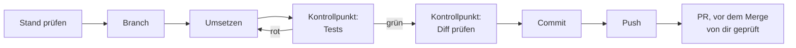

# S1.16 · Git in einem Fluss: Branch, Commit, PR

<!-- meta:start -->
> **Regal:** [Git & Worktrees](README.md#git) · **Stufe:** Kern · **~15 Min** · **Voraussetzungen:** [S1.5 Rechte im Alltag: default und acceptEdits](s1-05-rechte-im-alltag.md) · [S1.13 Vager und präziser Auftrag im Vergleich](s1-13-vager-und-praeziser-auftrag.md)
>
> ← [S1.15 Output Styles und Personas](s1-15-output-styles.md) · [Bibliothek](README.md) · [S1.17 Git-Befehle in der Sitzung](s1-17-git-befehle.md) →
<!-- meta:end -->

## Schnellcheck

- Hast du schon einmal einen ganzen Ablauf von Branch über Diff und Tests bis zum Commit in einer einzigen Claude-Code-Sitzung durchgezogen?
- Kannst du ohne Nachschlagen sagen, an welcher Stelle du den Diff prüfst und wann du Dateien gezielt statt alle stagen lässt?

## Auf einen Blick

Claude Code führt Git-Befehle selbst aus: Branch anlegen, Dateien stagen, committen, pushen und mit der GitHub CLI `gh` einen Pull Request (PR) erstellen, alles in normaler Sprache in einer Sitzung. Claude übernimmt die Mechanik, an zwei Stellen prüfst du selbst: Du liest den Diff vor dem Commit, und du prüfst den PR vor dem Merge.

Der Ablauf hat feste Kontrollpunkte: erst den Stand prüfen, dann Branch, Änderung, Tests, Diff, Commit. Zeigt `git status` Dateien, die nicht zu deiner Änderung gehören, lässt du gezielt stagen statt alles.

## Bild im Kopf

Stell dir das Schichtbuch einer Leitstelle vor. Jeder Eingriff an einer Anlage bekommt dort einen Eintrag: klein, mit Zeitstempel, nachprüfbar. Ein Commit ist so ein Eintrag. Der Branch ist dein eigener Arbeitsauftrag, auf dem du arbeitest, ohne den laufenden Betrieb zu stören, und der PR ist die Abnahme, bevor die Änderung in den Betrieb geht. Den Eintrag schreibt hier Claude, abzeichnen musst du ihn.



## Im Detail

### Was Claude Code mit Git erledigt

Du steuerst die Versionsverwaltung aus der Sitzung heraus. Claude führt `git status`, `git diff`, `git add`, `git commit`, `git branch`, `git push` und `git log` so selbstverständlich aus, wie es Code schreibt. Neu ist `gh pr create`, das einen Pull Request auf GitHub anlegt; es braucht die GitHub CLI `gh`, angemeldet mit `gh auth login`. Das alles verlangst du in normaler Sprache, auch in einem einzigen Prompt:

```
Create a branch called feature/alarm-dedup, implement the deduplication
change we discussed, commit it with a good message, and push it.
```

Wann Claude dafür um Erlaubnis fragt, regeln die Rechte-Modi aus [S1.5](s1-05-rechte-im-alltag.md). In diesem einen Prompt fehlt allerdings der Halt vor dem Commit, an dem du den Diff liest. Deshalb gehst du den Ablauf in Schritten durch.

### Der ganze Ablauf in einem Gespräch

1. **Den Stand prüfen:** `What's the current git status?`
2. **Den Branch anlegen:** `Create a new branch called feature/zone-group-correlation`
3. **Umsetzen:** Lass die Änderung nach dem vorhandenen Muster umsetzen, mit Tests.
4. **Die Tests laufen lassen:** Lass Claude sie ausführen und dir die Ergebnisse zeigen.
5. **Den Diff prüfen, bevor committet wird:** `Show me everything that would be committed, including new files.` Beachte: Ein einfaches `git diff` zeigt neue Dateien nicht, die Git noch nicht kennt. Erst nach dem Stagen zeigt `git diff --staged`, was im Commit landet.
6. **Gezielt stagen und committen:** Nenne die Pfade deiner Änderung. „Stage all“ ist nur in Ordnung, wenn `git status` und der Diff ausschließlich deine Änderung zeigen. Dateien, die nicht dazugehören, etwa eine `.env` oder Schlüsseldateien, gehören nicht in den Commit.
7. **Pushen und den PR anlegen:** `Push this branch and create a GitHub PR with a short description.`

Die Commit-Nachricht kannst du vorgeben oder Claude formulieren lassen. Einen festen Ablauf dafür bietet ein `/commit`-Skill ([S1.17](s1-17-git-befehle.md)).

Für den PR braucht Claude eine installierte und angemeldete GitHub CLI und einen Remote, zu dem der Branch gepusht wird. Beides liegt außerhalb dieser Übung.

## Selbst machen

### Übung: Branch, Test, gezielter Commit (etwa 10 Minuten)

**Ziel:** Du führst Claude durch einen kleinen Git-Ablauf und stagst nur die Dateien deiner Änderung, obwohl im Ordner eine weitere Datei liegt.

**Startzustand:** ein neues lokales Repository in `~/cc-workshop/git`, mit Git und Python aus [S0.1](s0-01-werkstatt-einrichten.md). Ein GitHub-Konto brauchst du nicht. Für den Commit braucht Git einen Namen und eine E-Mail-Adresse (`git config user.name` und `git config user.email`); fehlen sie, sagt Git es dir beim ersten Commit.

```bash
# macOS / Linux / Git Bash
mkdir -p ~/cc-workshop/git && cd ~/cc-workshop/git
git init
echo "# Access Control Utilities" > README.md
git add README.md
git commit -m "Initial commit"
echo "API_KEY=demo-not-a-real-key" > secrets.txt
```

```powershell
# Windows PowerShell
New-Item -ItemType Directory -Force "$HOME\cc-workshop\git"; Set-Location "$HOME\cc-workshop\git"
git init
"# Access Control Utilities" | Set-Content README.md
git add README.md
git commit -m "Initial commit"
"API_KEY=demo-not-a-real-key" | Set-Content secrets.txt
```

Die Datei `secrets.txt` gehört nicht zur Änderung und darf nie in einen Commit. Starte mit `claude --permission-mode acceptEdits`: Dateiänderungen laufen ohne Rückfrage, Git-Befehle, die etwas ändern, gibst du frei.

1. `What is the current git status and which branch are we on?` Erwartet: der Branch (`main` oder `master`) und `secrets.txt` als unbekannte Datei.
2. `Create a new branch called feature/access-log-formatter` Erwartet: Claude legt ihn an und wechselt dorthin.
3. Gib diesen Auftrag ein:

   <!-- cockpit:example -->
   ```text
   Create log_formatter.py with a function format_access_event(event) that takes a dict with the keys timestamp, door_id, event_type and card_id and returns "[2024-03-15 09:42:11] DOOR-03 ACCESS_GRANTED (Card: CARD-1047)". If card_id is missing it prints "Card: UNKNOWN". Add unittest tests in test_log_formatter.py for the normal case and the missing card.
   ```

   Erwartet: zwei neue Dateien.
4. `Run the tests. Show me the full output.` Erwartet: `OK`.
5. `Stage only log_formatter.py and test_log_formatter.py, then show me git diff --staged.` Lies das Diff. Erwartet: nur die beiden Dateien, nicht `secrets.txt`.
6. `Commit with the message "Add access event log formatter".` Gib den Commit frei.
7. `Show me git log --oneline -5 and the git status.` Erwartet: dein Commit auf dem neuen Branch, `secrets.txt` weiterhin unbekannt.

**Aufräumen:** Lösch den Ordner `~/cc-workshop/git` selbst.

**Geschafft, wenn:**

- [ ] `git log` den Commit auf `feature/access-log-formatter` zeigt
- [ ] `python -m unittest` mit `OK` endet
- [ ] `git show --stat` nur `log_formatter.py` und `test_log_formatter.py` auflistet (ein `__pycache__`-Ordner gehört auch nicht hinein)
- [ ] `secrets.txt` im `git status` weiter als unbekannt steht

### Extra: ein PR in einem eigenen Test-Repo (etwa 10 Minuten)

Du brauchst die GitHub CLI und ein GitHub-Konto: Die Karte [Werkstatt erweitern](../reference/werkstatt-erweitern.md#github-cli) beschreibt die Installation. Leg auf GitHub ein leeres, privates Test-Repository an, verbinde es als `origin`, und gib im Übungsordner ein: `Push this branch and create a GitHub PR with a short description.` Erwartet: Claude pusht den Branch und meldet die Adresse des PR. Prüf das Diff auf GitHub, bevor du irgendetwas mergst.

## Typische Fallen

- **Ein Test schlägt fehl.** Bearbeite die Datei nicht selbst. Sag Claude: „Test [name] fails with [error message]. Fix the implementation.“ Lass Claude reparieren und die Tests erneut laufen.
- **Die Commit-Nachricht stimmt nicht.** Sag: „The commit message is wrong. Amend the last commit with this message: [correct message]“
- **Der Diff ist leer, obwohl Claude Dateien angelegt hat.** `git diff` zeigt neue, ungetrackte Dateien nicht. Stage sie und sieh dir `git diff --staged` an.
- **Der PR-Schritt scheitert.** `gh pr create` braucht eine installierte, angemeldete GitHub CLI (`gh auth login`) und einen Remote.

## Check

Du kannst einen Ablauf von Branch über Tests und Diff bis zum Commit in einer Claude-Code-Sitzung führen und weißt, an welchen Stellen du selbst prüfst.

1. In welcher Reihenfolge kommen Tests, Diff-Prüfung und Commit, und warum steht die Diff-Prüfung vor dem Commit?
2. Wann lässt du alle Dateien stagen, und wann nennst du die Pfade einzeln?
3. Was braucht Claude zusätzlich, damit es einen PR anlegen kann?

<details><summary>Auflösung</summary>

1. Erst die Tests, dann der Diff, dann der Commit. Der Diff steht vor dem Commit, weil du nur dort siehst, was wirklich in den Commit geht, und Claude abnehmen musst du.
2. Alle nur, wenn `git status` und der Diff ausschließlich deine Änderung zeigen. Sonst nennst du die Pfade einzeln, damit Fremdes wie eine `.env` nicht mitgeht.
3. Eine installierte und angemeldete GitHub CLI (`gh auth login`) und einen Remote, zu dem der Branch gepusht wird.

</details>

<details><summary>Quizfrage</summary>

**Frage:** Claude hat eine neue Datei `log_formatter.py` angelegt. Du fragst nach `git diff`, die Ausgabe ist leer. Was bedeutet das?

- **Richtig:** Git zeigt neue, ungetrackte Dateien in `git diff` nicht; erst nach dem Stagen zeigt `git diff --staged` sie.
- Falsch: Claude hat die Datei nicht geschrieben, sonst würde `git diff` jede Änderung im Ordner sofort anzeigen.
- Falsch: Claude Code unterdrückt den Diff, bis die Tests laufen und dir einen grünen Lauf melden.
- Falsch: Das Repository ist beschädigt, weil `git diff` auch neue Dateien zeigen müsste, und du musst es neu anlegen.

</details>

## Weiterlesen

- [Häufige Abläufe: Pull Requests erstellen](https://code.claude.com/docs/en/common-workflows#create-pull-requests)
- [S1.5 · Rechte im Alltag: default und acceptEdits](s1-05-rechte-im-alltag.md)
- [S1.13 · Vager und präziser Auftrag im Vergleich](s1-13-vager-und-praeziser-auftrag.md)
- [S1.17 · Git-Befehle in der Sitzung](s1-17-git-befehle.md)
- [S1.18 · Worktrees als Testlabor](s1-18-worktrees.md)
- [S1.20 · Praxis-Station Session 1: alles in einem Ablauf](s1-20-praxis-station-1.md)
