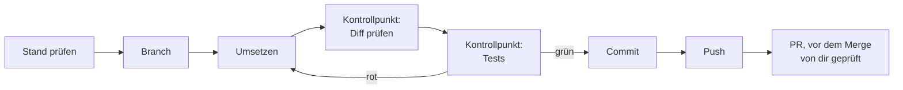

# S1.16 · Git in einem Fluss: Branch, Commit, PR

<!-- meta:start -->
> **Regal:** [Git & Worktrees](README.md#git) · **Stufe:** Kern · **~18 Min** · **Voraussetzungen:** [S1.5 Rechte im Alltag: default und acceptEdits](s1-05-rechte-im-alltag.md) · [S1.13 Vager und präziser Auftrag im Vergleich](s1-13-vager-und-praeziser-auftrag.md)
>
> ← [S1.15 Output Styles und Personas](s1-15-output-styles.md) · [Bibliothek](README.md) · [S1.17 Git-Befehle in der Sitzung](s1-17-git-befehle.md) →
<!-- meta:end -->

## Schnellcheck

- Hast du schon einmal einen ganzen Ablauf von Branch über Commit bis PR in einer einzigen Claude-Code-Sitzung durchgezogen?
- Kannst du ohne Nachschlagen sagen, an welcher Stelle du den Diff prüfst und wann du Dateien gezielt statt alle stagen lässt?

## Auf einen Blick

Claude Code führt Git-Befehle selbst aus: Branch anlegen, Dateien stagen, committen, pushen und mit `gh` einen Pull Request (PR) erstellen, alles in normaler Sprache in einer Sitzung. Claude übernimmt die Mechanik, an zwei Stellen prüfst du selbst: Du liest den Diff vor dem Commit, und du prüfst den PR vor dem Merge.

Der Ablauf hat feste Kontrollpunkte: erst den Stand prüfen, dann Branch, Änderung, Diff, Tests, Commit, Push und PR. Zeigt `git status` Dateien, die nicht zu deiner Änderung gehören, lässt du gezielt stagen statt alles.

## Bild im Kopf

Stell dir das Schichtbuch einer Leitstelle vor. Jeder Eingriff an einer Anlage bekommt dort einen Eintrag: klein, mit Zeitstempel, nachprüfbar. Ein Commit ist so ein Eintrag. Der Branch ist dein eigener Arbeitsauftrag, auf dem du arbeitest, ohne den laufenden Betrieb zu stören, und der PR ist die Abnahme, bevor die Änderung in den Betrieb geht.

Den Eintrag schreibt hier Claude, aber abzeichnen musst du ihn. Bevor etwas ins Schichtbuch kommt, liest du, was wirklich geändert wurde (den Diff), und du schaust, ob die Tests grün sind.



## Im Detail

### Was Claude Code mit Git erledigt

Claude Code hat eine eingebaute Git-Anbindung. Du steuerst die ganze Versionsverwaltung aus der Sitzung heraus: Branches, Commits, Push und Pull Requests, ohne die Sitzung zu verlassen. Claude führt Git-Befehle so selbstverständlich aus, wie es Code schreibt:

- `git status`: zeigt, was sich geändert hat
- `git diff`: zeigt die Änderungen vor dem Commit
- `git add`: staged bestimmte Dateien oder alle Änderungen
- `git commit`: legt Commits mit aussagekräftiger Nachricht an
- `git branch` / `git checkout -b`: legt Branches an und wechselt dorthin
- `git push`: schiebt den Branch zum Remote
- `git log`: zeigt die Commit-Historie
- `gh pr create`: legt einen Pull Request auf GitHub an (braucht die GitHub CLI `gh`)

Das alles verlangst du in normaler Sprache, auch in einem einzigen Prompt:

```
Create a branch called feature/alarm-dedup, implement the deduplication
change we discussed, commit it with a good message, and push it.
```

Claude übernimmt die Git-Mechanik. Du prüfst den Diff und gibst frei; wann Claude dafür um Erlaubnis fragt, regeln die Rechte-Modi aus [S1.5](s1-05-rechte-im-alltag.md). In diesem einen Prompt fehlt allerdings der Halt vor dem Commit, an dem du den Diff liest. Deshalb geht der nächste Abschnitt den Ablauf in Schritten durch.

### Der ganze Ablauf in einem Gespräch

Ein kompletter Durchlauf von der Idee bis zum PR läuft in einer Sitzung. Jeder Schritt ist ein kurzer Auftrag.

**1. Den Stand prüfen, bevor du etwas anfasst**

```
What's the current git status?
```

**2. Kontext geben.** Sag Claude, was du vorhast, und lass es zuerst den bestehenden Code lesen, damit es dem vorhandenen Muster folgt.

**3. Den Branch anlegen**

```
Create a new branch called feature/zone-group-correlation
```

**4. Umsetzen.** Lass die Änderung nach dem vorhandenen Muster umsetzen, mit Tests.

**5. Den Diff prüfen, bevor committet wird**

```
Show me the full diff of what would be committed. I want to review before we commit.
```

**6. Die Tests laufen lassen.** Lass Claude die Tests ausführen und dir die Ergebnisse zeigen.

**7. Stagen und committen**

```
Stage all changed files and commit with message:
"Add zone-group correlation support to alarm correlator"
```

„Stage all" ist nur in Ordnung, wenn `git status` und der Diff ausschließlich deine Änderung zeigen. Liegen dort Dateien, die nicht dazugehören, lass nur die Pfade deiner Änderung stagen, statt `git add -A`. Die Nachricht kannst du wie hier vorgeben oder Claude formulieren lassen; den üblichen Stil für Commit-Nachrichten trifft Claude meist gut. Einen festen Ablauf dafür bietet ein `/commit`-Skill ([S1.17](s1-17-git-befehle.md)).

**8. Pushen und den PR anlegen**

```
Push this branch and create a GitHub PR. Title: "Add zone-group correlation".
Description should explain that this adds support for correlating alarms
by zone group, not just individual zones, and that tests cover the
3 new correlation patterns.
```

Der ganze Ablauf passiert im Gespräch: kein Wechsel ins Terminal, kein Abtippen von Commit-Nachrichten, kein vergessenes `-u origin` beim ersten `git push`. Für den PR braucht Claude eine angemeldete GitHub CLI (`gh auth login`).

## Selbst machen

### Aufwärmen: One-Word Diff (2 Minuten, leicht)

**Ziel:** Die Schleife von `diff` zu `commit` an der kleinsten möglichen Änderung üben, bevor die größere Git-Übung kommt.

1. Leg ein Repo mit einer einzeiligen `README.md` an.
2. Ändere genau ein Wort.
3. Sag `Show me git diff`, dann `commit it with a clear message`, dann `git log --oneline`.
4. Erkenntnis: Ein Commit ist nur ein beschrifteter Schnappschuss, klein und billig.

### Übung: der Git-Ablauf mit Claude Code (etwa 18–20 Minuten)

**Ziel:** Einen Durchlauf von Branch über Umsetzung und Commit bis zum Log, nur über das Gespräch mit Claude Code. Keine Git-Befehle von Hand. Das Übungs-Repo hat keinen Remote, deshalb endet die Übung beim Commit und beim Log; den Worktree-Bonus findest du in [S1.18](s1-18-worktrees.md).

**Setup**

Nimm das Projekt aus der Übung in [S1.10](s1-10-claude-md.md) oder leg ein neues an:

```bash
# macOS / Linux / Git Bash
mkdir -p ~/cc-workshop/exercises/exercise-1.4-git && cd ~/cc-workshop/exercises/exercise-1.4-git
git init
echo "# Access Control Utilities" > README.md
git add README.md
git commit -m "Initial commit"
claude
```

```powershell
# Windows PowerShell
New-Item -ItemType Directory -Force -Path "$HOME\cc-workshop\exercises\exercise-1.4-git" | Out-Null
Set-Location "$HOME\cc-workshop\exercises\exercise-1.4-git"
git init
"# Access Control Utilities" | Set-Content -Encoding utf8 README.md
git add README.md
git commit -m "Initial commit"
claude
```

**1. Die Ausgangslage prüfen**

Frag Claude:

```
What is the current git status and which branch are we on?
```

Notier dir die Antwort.

**2. Einen Feature-Branch anlegen**

Frag Claude:

```
Create a new branch called feature/access-log-formatter
```

Prüf, ob er angelegt wurde: „Which branch are we on now?"

**3. Eine kleine Funktion umsetzen**

Frag Claude:

```
Create a file called log_formatter.py with a function format_access_event
that takes a dictionary with keys: timestamp, door_id, event_type, card_id
and returns a formatted string like:
  [2024-03-15 09:42:11] DOOR-03 ACCESS_GRANTED (Card: CARD-1047)

Add a small test in tests/test_log_formatter.py that tests:
- Normal case with all fields present
- Event type ACCESS_DENIED
- Missing card_id (should show "Card: UNKNOWN")
```

**4. Vor dem Commit prüfen**

Frag Claude:

```
Show me the git diff — what has changed since the last commit?
```

Lies den Diff durch. Passen die Änderungen zu dem, was du verlangt hast?

**5. Die Tests laufen lassen**

Frag Claude:

```
Run the tests. Show me the full output.
```

**6. Stagen und committen**

Frag Claude:

<!-- cockpit:example -->
```
Stage all new and changed files. Then commit with this message:
"Add access event log formatter

Formats access control events into human-readable log lines.
Handles missing card_id gracefully. Tests cover normal case,
ACCESS_DENIED events, and missing card scenarios."
```

**7. Den Commit bestätigen**

Frag Claude:

```
Show me git log --oneline -5
```

Ist dein Commit da?

**Geschafft, wenn:**

- [ ] der Branch `feature/access-log-formatter` über Claude Code angelegt wurde
- [ ] `log_formatter.py` und die Tests existieren
- [ ] die Tests grün sind
- [ ] der Commit die vorgegebene Nachricht hat
- [ ] `git log` den Commit auf dem richtigen Branch zeigt

## Typische Fallen

- **Ein Test schlägt fehl.** Bearbeite die Datei nicht selbst. Sag Claude: „Test [name] fails with [error message]. Fix the implementation." Lass Claude reparieren und die Tests erneut laufen.
- **Die Commit-Nachricht stimmt nicht.** Sag: „The commit message is wrong. Amend the last commit with this message: [correct message]"
- **Der PR-Schritt scheitert.** `gh pr create` braucht eine installierte und angemeldete GitHub CLI (`gh auth login`).

## Check

Du kannst einen ganzen Ablauf von Branch über Diff, Tests und Commit bis zum PR in einer Claude-Code-Sitzung führen und weißt, an welchen Stellen du selbst prüfst.

1. In welcher Reihenfolge kommen Diff-Prüfung, Tests und Commit, und warum steht der Diff vor dem Commit?
2. Wann lässt du alle Dateien stagen, und wann nennst du die Pfade einzeln?
3. Was brauchst du, damit Claude einen PR anlegen kann?

<details><summary>Quizfrage</summary>

**Frage:** Claude übernimmt im Ablauf die Git-Mechanik. Welche Schritte bleiben trotzdem bei dir?

- **Richtig:** Den Diff vor dem Commit lesen und den PR vor dem Merge prüfen: Claude tippt die Befehle, abnehmen musst du.
- Falsch: Nur den Branch-Namen festlegen: Diff, Tests, Commit und Merge erledigt Claude danach ohne jede Prüfung durch dich.
- Falsch: Die Commit-Nachricht tippen, denn Claude Code darf Commit-Nachrichten aus Sicherheitsgründen nicht selbst schreiben.
- Falsch: Das Pushen, denn `git push` kann Claude Code nur vorschlagen; ausführen musst du es selbst in deinem Terminal.

</details>

## Weiterlesen

- [Häufige Abläufe: Pull Requests erstellen](https://code.claude.com/docs/en/common-workflows#create-pull-requests)
- [S1.5 · Rechte im Alltag: default und acceptEdits](s1-05-rechte-im-alltag.md)
- [S1.13 · Vager und präziser Auftrag im Vergleich](s1-13-vager-und-praeziser-auftrag.md)
- [S1.17 · Git-Befehle in der Sitzung](s1-17-git-befehle.md)
- [S1.18 · Worktrees als Testlabor](s1-18-worktrees.md)
- [S1.20 · Praxis-Station Session 1: eine Übung wählen](s1-20-praxis-station-1.md)
