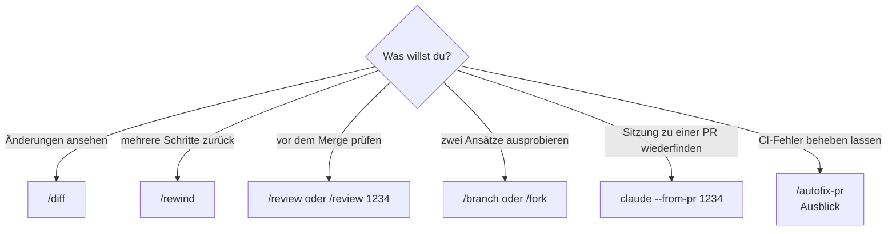

# S1.17 · Git-Befehle in der Sitzung

<!-- meta:start -->
> **Regal:** [Git & Worktrees](README.md#git) · **Stufe:** Vertiefung · **~20 Min** · **Voraussetzungen:** [S1.16 Git in einem Fluss: Branch, Commit, PR](s1-16-git-in-einem-fluss.md)
>
> ← [S1.16 Git in einem Fluss: Branch, Commit, PR](s1-16-git-in-einem-fluss.md) · [Bibliothek](README.md) · [S1.18 Worktrees als Testlabor](s1-18-worktrees.md) →
<!-- meta:end -->

## Schnellcheck

- Hast du schon einmal `/diff` oder `/review` benutzt, bevor du committet oder gemergt hast?
- Kannst du ohne Nachschlagen sagen, was `/rewind` nicht zurückholt und womit du das stattdessen rückgängig machst?

## Auf einen Blick

Rund um Git hat Claude Code eigene Slash-Befehle. Im Alltag brauchst du drei: `/diff` zeigt alle Änderungen im Arbeitsverzeichnis, `/review` (ein Alias von `/code-review`) prüft den aktuellen Diff auf Fehler, und `/rewind` springt zu einem früheren Stand zurück. `/branch` und `/fork` verzweigen das Gespräch, nicht die Git-Historie. `/autofix-pr` ist ein Ausblick auf Cloud-Sitzungen: Es lässt Claude deine PR beobachten und Fixes pushen, und Claude kann dabei unter deinem GitHub-Konto antworten.

## Bild im Kopf

Stell dir das Bedienpult einer Leitstelle vor. Eine Taste zeigt, was seit der letzten Übergabe am Stellwerk geändert wurde (`/diff`), eine zweite ruft die Abnahme auf (`/review`), eine dritte spult die letzten Aktionen zurück (`/rewind`). Die Abnahme ersetzt dein eigenes Lesen nicht, und das Zurückspulen kennt nur, was über Claudes Datei-Werkzeuge lief.



## Im Detail

### Die Befehle im Überblick

| Befehl | Was er tut |
|---|---|
| `/diff` | Zeigt die Änderungen im Arbeitsverzeichnis, auch die von Claude |
| `/rewind` | Springt zu einem Checkpoint zurück: nimmt mehrere Schritte zurück, nicht nur die letzte Änderung |
| `/review [target]` | Alias von `/code-review`: prüft den aktuellen Diff oder eine PR-Nummer, einen Branch oder Pfad, den du angibst |
| `/branch` / `/fork` | Verzweigen das *Gespräch*, nicht die Git-Historie |
| `/autofix-pr` | Startet eine Cloud-Sitzung, die deine PR beobachtet und Fixes pusht |

### /diff: alles sehen, bevor es in die Historie geht

`/diff` zeigt, was Claude geändert hat, zusammen mit allem anderen, das noch nicht committet ist. Das lohnt sich vor dem Commit: Du fängst Probleme ab, bevor sie in der Git-Historie landen. Je nach Darstellung öffnet sich ein Panel neben dem Gespräch (zum Schließen `/diff` noch einmal) oder ein Dialog über der Eingabe (`Esc` schließt ihn). Was Claude über einen Shell-Befehl geändert hat, siehst du nur in der Ansicht `Current`, nicht in den Ansichten je Prompt.

### /rewind: mehrere Schritte zurück

`/rewind` ist das Rückgängig für Änderungen über mehrere Schritte. Hat Claude fünf Änderungen gemacht und die letzten drei gingen schief, springst du zu einem Checkpoint zurück, statt jede Datei von Hand zurückzusetzen. Checkpoints sind für die schnelle Rückkehr innerhalb einer Sitzung gedacht; die dauerhafte Historie bleibt Git. Wie `/rewind` genau arbeitet, steht in [S1.9](s1-09-kontext-steuern.md).

### /review: der letzte Blick vor dem Merge

`/review` ist ein lokales Review. Es prüft den aktuellen Diff: die Commits deines Branchs, die seinem Upstream voraus sind, plus alle noch nicht committeten Änderungen. Gibst du eine PR-Nummer, einen Branch oder einen Pfad an, prüft es stattdessen dieses Ziel. Es meldet Korrektheitsfehler und je nach Modell und Effort auch Stellen, die sich vereinfachen oder effizienter machen lassen. `/security-review` schaut dagegen nur auf Sicherheitsprobleme im Diff ([S3.7](s3-07-eingebaute-reviews.md)).

```text
/review        # reviews the current diff: branch commits ahead of upstream plus uncommitted changes
/review 1234   # reviews pull request #1234 instead of the current diff
```

### /branch und /fork: das Gespräch verzweigen

Beide arbeiten am **Gesprächsbaum**, nicht am Git-Baum. Sie sind die Antwort auf „Ich will Ansatz A *und* Ansatz B ausprobieren, ohne den Kontext zu verlieren.“

- `/branch` legt an dieser Stelle eine Abzweigung des Gesprächs an und wechselt hinein. Das Original bleibt erhalten; mit `/resume` kehrst du dorthin zurück.
- `/fork` kopiert das Gespräch standardmäßig in eine neue Hintergrund-Sitzung ([S3.5](s3-05-hintergrund-und-teams.md)), und du arbeitest hier weiter. Claude Code weist die Kopie an, sich vor Code-Änderungen einen eigenen Worktree anzulegen ([S1.18](s1-18-worktrees.md)).
- `--fork-session` ist die Variante auf Sitzungsebene: Beim Fortsetzen mit `--resume` oder `--continue` legt Claude Code eine neue Sitzungs-ID an, statt die alte weiterzuführen, etwa `claude --resume abc123 --fork-session`.

### Ausblick: /autofix-pr und --from-pr

> **Beim ersten Lesen überfliegen.** Beides gehört zu Abläufen mit Cloud-Sitzungen und mehreren Sitzungen. Für den Git-Alltag brauchst du sie noch nicht; richtig damit arbeitest du später ([S3.5](s3-05-hintergrund-und-teams.md), [S4.5](s4-05-ci-pipelines.md)).

Nach `gh pr create` rufst du `/autofix-pr` auf, während du auf dem Branch der PR stehst. Claude Code erkennt die offene PR über `gh` und startet eine Cloud-Sitzung, die sie beobachtet. Schlägt ein Check fehl oder hinterlässt jemand einen Review-Kommentar, untersucht Claude das und pusht einen Fix, wenn er eindeutig ist. Voraussetzung sind die GitHub CLI `gh`, Zugang zu Cloud-Sitzungen und die Claude GitHub App im Repository. Standardmäßig soll die Cloud-Sitzung jeden CI-Fehler und jeden Review-Kommentar beheben; mit einem Prompt gibst du ihr engere Anweisungen, etwa `/autofix-pr only fix lint and type errors`.

Claude kann dabei auch in Review-Threads auf GitHub antworten, unter deinem GitHub-Konto und als Claude Code gekennzeichnet. Startet in deinem Repo ein PR-Kommentar Automatisierung (etwa Atlantis, Terraform Cloud oder GitHub Actions auf `issue_comment`), kann so eine Antwort diese Abläufe auslösen. Prüf das, bevor du Auto-Fix einschaltest; wo ein Kommentar Infrastruktur deployen kann, lass es aus.

Als Empfehlung dieser Bibliothek, nicht der Doku: Setz `/autofix-pr` nicht bei fehlgeschlagenen Produktions-Deploys und nicht bei Security-, Auth- oder Crypto-Code ein, auch nicht in Repos, deren Haupt-Branch automatisch in Produktion geht. Dort entscheidet ein Mensch. Kombiniere es mit Branch-Protection-Regeln, damit auch ein automatisch gepushter Commit eine menschliche Freigabe braucht.

`claude --from-pr 1234` öffnet die Sitzungsauswahl, gefiltert auf die Sitzungen, die mit dieser PR verknüpft sind. Die Verknüpfung entsteht von selbst, wenn Claude die PR mit `gh pr create` anlegt oder an einer bestehenden PR arbeitet. Statt der Nummer nimmt das Flag auch die URL.

Ein Hinweis zu `/commit`: Es ist kein eingebauter Befehl, sondern ein Skill, den du selbst installierst oder schreibst ([S2.1](s2-01-skills-und-commands.md)).

## Selbst machen

### Übung: diff, review, rewind (etwa 10 Minuten)

**Ziel:** Du siehst eine Änderung von Claude mit `/diff`, lässt sie mit `/review` prüfen und drehst sie mit `/rewind` zurück, sodass Git danach wieder sauber ist.

**Startzustand:** ein lokales Repository in `~/cc-workshop/gitbefehle` mit Git und Python aus [S0.1](s0-01-werkstatt-einrichten.md). Git braucht für den Commit einen Namen und eine E-Mail-Adresse (`git config user.name`, `git config user.email`). Leg den Ordner an und wechsle hinein (`mkdir -p ~/cc-workshop/gitbefehle && cd ~/cc-workshop/gitbefehle`, in PowerShell `New-Item -ItemType Directory -Force "$HOME\cc-workshop\gitbefehle"; Set-Location "$HOME\cc-workshop\gitbefehle"`) und führ `git init` aus.

1. Starte `claude --permission-mode acceptEdits` und gib ein: `Create greet.py with a function greet(name) that returns "Hello, " + name.` Beende die Sitzung mit `/exit`. Führ `git add greet.py` und `git commit -m "Add greet"` aus. Erwartet: Der Stand ist gespeichert, `git status` ist sauber.
2. Starte neu mit `claude --permission-mode acceptEdits` und gib ein:

   <!-- cockpit:example -->
   ```text
   Add a function average(numbers) to greet.py that returns sum(numbers) / len(numbers). Also add a function shout(name) that returns greet(name) in upper case.
   ```

   Erwartet: `greet.py` ist geändert.
3. Gib `/diff` ein. Erwartet: Die Ansicht nennt `greet.py` mit hinzugefügten Zeilen. In einem breiten Terminal blendet Claude Code das Panel nach einer Änderung von selbst ein; dann meldet `/diff` „Diff panel hidden“ und blendet es aus, und ein zweites `/diff` holt es zurück. Einen Dialog schließt du mit `Esc`.
4. Gib `/review` ein. Erwartet: Die Prüfung läuft als eigener Agent im Hintergrund und dauert etwa eine Minute. Er fragt einmal um Freigabe für einen `git diff`-Befehl; gib sie. Danach meldet Claude Befunde oder sagt, dass es nichts gefunden hat. Bei `average` ist ein Befund wahrscheinlich: Eine leere Liste ergäbe eine Division durch null. Lies die Rückmeldung.
5. Gib `/rewind` ein. Wähl in der Liste den Prompt aus Schritt 2 und dann **Restore code and conversation**. Beende die Sitzung.
6. Führ `git status` und `git diff` aus. Erwartet: Beides ist sauber, `greet.py` ist wieder der committete Stand.

**Aufräumen:** Lösch den Ordner `~/cc-workshop/gitbefehle` selbst.

**Geschafft, wenn:**

- [ ] `/diff` `greet.py` als geändert zeigte
- [ ] du die Rückmeldung von `/review` gelesen hast
- [ ] `git status` nach `/rewind` sauber ist
- [ ] du sagen kannst, warum `/rewind` hier genügte und wann du `git` bräuchtest

### Extra: fünf Anlässe, fünf Befehle (etwa 5 Minuten)

Ordne jedem Anlass einen Befehl zu: `/branch`, `/fork`, `--fork-session`, `--from-pr` oder `/autofix-pr`.

1. Du willst Ansatz A und B ausprobieren, ohne den Kontext zu verlieren, und bei Ansatz B im selben Fenster weiterarbeiten.
2. Du willst eine Kopie des Gesprächs als Hintergrund-Sitzung, während du hier weitermachst.
3. Du setzt eine alte Sitzung mit `--resume` fort, willst aber das Original unverändert lassen.
4. Du kommst einen Tag später zu PR 1234 zurück und willst die Sitzung wiederfinden, in der sie entstand.
5. Die CI deiner PR ist wegen eines Lint-Fehlers rot, und eine Cloud-Sitzung soll ihn beheben.

<details><summary>Vergleich</summary>

1. `/branch`
2. `/fork`
3. `--fork-session`
4. `claude --from-pr 1234`
5. `/autofix-pr`

</details>

## Typische Fallen

- **`/rewind` holt nicht alles zurück.** Dateien, die Claude über Bash-Befehle geändert hat (etwa mit `rm`, `mv` oder `cp`), erfasst das Checkpointing nicht; nur Änderungen über Claudes Datei-Werkzeuge. Solche Änderungen nimmst du mit Git zurück.
- **`/branch` legt keinen Git-Branch an.** Der Befehl verzweigt nur das Gespräch. Einen Git-Branch lässt du Claude in normaler Sprache anlegen ([S1.16](s1-16-git-in-einem-fluss.md)).
- **`/autofix-pr` findet deine PR nicht.** Claude Code sucht die offene PR zum ausgecheckten Branch. Für eine andere PR checkst du zuerst deren Branch aus.
- **`claude --from-pr` zeigt keine Sitzung.** Verknüpft sind nur Sitzungen, in denen Claude die PR angelegt oder an ihr gearbeitet hat.

## Check

Du kannst `/diff`, `/review` und `/rewind` in einem Git-Ablauf einsetzen und weißt, was du vor `/autofix-pr` prüfst.

1. Wofür nimmst du `/diff`, wofür `/review`?
2. Welche Änderungen stellt `/rewind` nicht wieder her, und womit nimmst du sie zurück?
3. Was prüfst du in deinem Repo, bevor du `/autofix-pr` einschaltest, und warum?

<details><summary>Auflösung</summary>

1. `/diff` zeigt dir alle Änderungen im Arbeitsverzeichnis, damit du sie selbst liest. `/review` lässt Claude den aktuellen Diff, eine PR, einen Branch oder einen Pfad auf Fehler prüfen.
2. Dateien, die Claude über Bash-Befehle wie `rm`, `mv` oder `cp` geändert hat. Die nimmst du mit Git zurück.
3. Ob in deinem Repo eine Automatisierung auf PR-Kommentare reagiert (etwa Atlantis, Terraform Cloud oder GitHub Actions auf `issue_comment`). Claude kann unter deinem GitHub-Konto antworten, und so eine Antwort kann diese Abläufe auslösen.

</details>

<details><summary>Quizfrage</summary>

**Frage:** Dein Branch hat zwei Commits, die dem Upstream voraus sind, und eine Änderung, die du noch nicht committet hast. Du gibst `/review` ohne Ziel ein. Was prüft Claude?

- **Richtig:** Die zwei Commits, die dem Upstream voraus sind, und deine noch nicht committete Änderung.
- Falsch: Nur die noch nicht committete Änderung, denn bereits committeter Code gilt als geprüft und bleibt außen vor.
- Falsch: Nur den letzten Commit, weil `/review` immer genau einen Commit vom Branch-Ende aus betrachtet.
- Falsch: Die gesamte Historie des Repositorys seit dem ersten Commit, weil `/review` ohne Ziel alles durchsieht.

</details>

## Weiterlesen

- [Befehlsreferenz](https://code.claude.com/docs/en/commands)
- [Code-Review: einen Diff lokal prüfen](https://code.claude.com/docs/en/code-review#review-a-diff-locally)
- [Änderungen mit /diff ansehen](https://code.claude.com/docs/en/interactive-mode#review-changes-with-%2Fdiff)
- [Auto-Fix für Pull Requests](https://code.claude.com/docs/en/claude-code-on-the-web#auto-fix-pull-requests)
- [CLI-Referenz](https://code.claude.com/docs/en/cli-reference)
- [Checkpointing](https://code.claude.com/docs/en/checkpointing)
- [S1.9 · Kontext steuern mit /compact und /rewind](s1-09-kontext-steuern.md)
- [S1.16 · Git in einem Fluss: Branch, Commit, PR](s1-16-git-in-einem-fluss.md)
- [S1.18 · Worktrees als Testlabor](s1-18-worktrees.md)
- [S2.1 · Skills sind Dienstanweisungen, Commands sind Knöpfe](s2-01-skills-und-commands.md)
- [S3.5 · Hintergrund-Sitzungen und Agent Teams](s3-05-hintergrund-und-teams.md)
- [S3.7 · Die eingebauten Reviews](s3-07-eingebaute-reviews.md)
- [S4.5 · CI-Pipelines bauen mit GitHub Actions und GitLab](s4-05-ci-pipelines.md)
