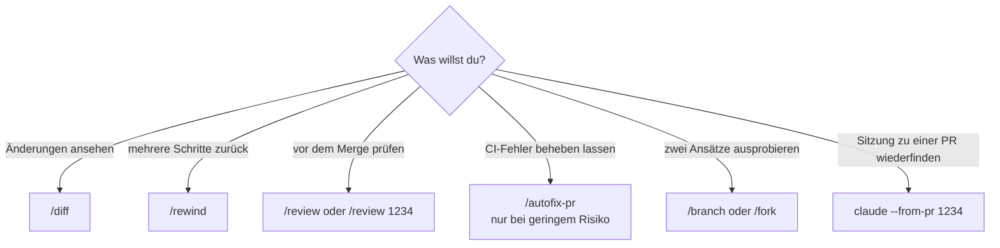

# S1.17 · Git-Befehle in der Sitzung

<!-- meta:start -->
> **Regal:** [Git & Worktrees](README.md#git) · **Stufe:** Vertiefung · **~15 Min** · **Voraussetzungen:** [S1.16 Git in einem Fluss: Branch, Commit, PR](s1-16-git-in-einem-fluss.md)
>
> ← [S1.16 Git in einem Fluss: Branch, Commit, PR](s1-16-git-in-einem-fluss.md) · [Bibliothek](README.md) · [S1.18 Worktrees als Testlabor](s1-18-worktrees.md) →
<!-- meta:end -->

## Schnellcheck

- Hast du schon einmal `/diff` oder `/review` benutzt, bevor du committet oder gemergt hast?
- Kannst du ohne Nachschlagen sagen, in welchen drei Fällen du `/autofix-pr` nie einsetzen würdest?

## Auf einen Blick

Rund um Git hat Claude Code eigene Slash-Befehle: `/diff` zeigt alle Änderungen vor dem Commit, `/rewind` springt zu einem früheren Stand zurück, und `/review`, ein Alias von `/code-review`, prüft vor dem Merge den aktuellen Diff oder eine PR. `/autofix-pr` lässt eine Cloud-Sitzung deine PR beobachten und Fixes pushen, aber nie bei fehlgeschlagenen Produktions-Deploys, nie bei Security-, Auth- oder Crypto-Code und nie in Repos, deren main-Branch automatisch in Produktion geht.

`/branch` und `/fork` verzweigen das Gespräch, nicht die Git-Historie. Mit `claude --from-pr` findest du die Sitzung wieder, in der eine PR entstanden ist.

## Bild im Kopf

Stell dir das Bedienpult einer Leitstelle vor. Eine Taste zeigt die Übersicht aller Kameras (`/diff`), eine zweite spult die letzten Aktionen zurück (`/rewind`), eine dritte ruft die Abnahme vor der Übergabe auf (`/review`). Dazu kommt ein Relais, das bei einem CI-Alarm selbstständig einen Servicetechniker losschickt (`/autofix-pr`), alles vom selben Pult aus.

Dieses Relais schließt du nicht an die Tresortür an. Wo schon ein scheinbar harmloser Handgriff echten Schaden anrichtet, bei Produktions-Deploys und bei Zugangs- und Kryptocode, entscheidet ein Mensch.



## Im Detail

### Die Befehle im Überblick

| Befehl | Was er tut |
|---|---|
| `/diff` | Interaktive Ansicht aller Änderungen im Arbeitsverzeichnis, auch der von Claude |
| `/rewind` | Springt zu einem Checkpoint zurück: nimmt mehrere Schritte zurück, nicht nur die letzte Änderung |
| `/commit` (Skill) | Strukturierter Commit im Conventional-Commit-Format, wenn ein Commit-Skill installiert ist |
| `/review [target]` | Alias von `/code-review`: prüft den aktuellen Diff oder eine PR-Nummer, einen Branch oder Pfad, den du angibst |
| `/autofix-pr` | Startet eine Cloud-Sitzung, die deine PR beobachtet und Fixes pusht |
| `/branch` / `/fork` | Verzweigen das *Gespräch*, nicht die Git-Historie, damit du Ansatz A und Ansatz B ausprobieren kannst |

### /diff: alles sehen, bevor es in die Historie geht

`/diff` lohnt sich vor allem vor dem Commit. Du siehst auf einen Blick, was Claude geändert hat, zusammen mit allem anderen, das noch nicht committet ist, und fängst Probleme ab, bevor sie in deiner Git-Historie landen.

### /rewind: mehrere Schritte zurück

`/rewind` ist das Rückgängig für Änderungen über mehrere Schritte. Hat Claude fünf Änderungen gemacht und die letzten drei gingen schief, springst du mit `/rewind` zu einem bestimmten Checkpoint zurück, statt jede Datei von Hand zurückzusetzen. Checkpoints sind für die schnelle Rückkehr innerhalb einer Sitzung gedacht; die dauerhafte Historie bleibt Git. Wie `/rewind` genau arbeitet, steht in [S1.9](s1-09-kontext-steuern.md).

### /review: der letzte Blick vor dem Merge

`/review` ist das lokale Review, ein letzter Prüfdurchgang vor dem Merge. Es ist ein Alias von `/code-review` und prüft den aktuellen Diff: die Commits deines Branchs, die seinem Upstream voraus sind, plus alle noch nicht committeten Änderungen. Gibst du eine PR-Nummer, einen Branch oder einen Pfad an, prüft es stattdessen dieses Ziel. Es meldet Korrektheitsfehler und Stellen, die sich wiederverwenden, vereinfachen oder effizienter machen lassen. `/security-review` schaut dagegen nur auf Sicherheitsprobleme im Diff ([S3.7](s3-07-eingebaute-reviews.md)). Zwei Aufrufe:

<!-- cockpit:example -->
```text
/review        # reviews the current diff: branch commits ahead of upstream plus uncommitted changes
/review 1234   # reviews pull request #1234 instead of the current diff
```

### /autofix-pr: CI-Fehler von einer Cloud-Sitzung beheben lassen

> **Ausblick: beim ersten Lesen überfliegen.** `/autofix-pr`, `--fork-session` und `--from-pr` gehören zu Abläufen mit Cloud-Sitzungen und mehreren Sitzungen. Für den Git-Alltag brauchst du sie noch nicht; richtig damit arbeitest du später ([S3.5](s3-05-hintergrund-und-teams.md), [S4.5](s4-05-ci-pipelines.md)). Lies sie jetzt als Vorschau.

Nach `gh pr create` rufst du `/autofix-pr` auf, während du auf dem Branch der PR stehst. Claude Code erkennt die offene PR über `gh` und startet eine Cloud-Sitzung, die sie beobachtet. Schlägt ein Check fehl oder hinterlässt jemand einen Review-Kommentar, untersucht Claude das und pusht einen Fix, wenn er eindeutig ist. So musst du die PR nicht selbst hüten. Voraussetzung sind die GitHub CLI `gh`, Zugang zu Cloud-Sitzungen und die Claude GitHub App im Repository. Ein Beispielablauf:

```text
1. Implement feature locally.
2. gh pr create --title "Add IPv4 validation"
3. /autofix-pr      # Claude watches CI from the cloud and pushes fixes
4. Review final state and merge.
```

Standardmäßig soll die Cloud-Sitzung jeden CI-Fehler und jeden Review-Kommentar beheben. Mit einem Prompt gibst du ihr engere Anweisungen, etwa `/autofix-pr only fix lint and type errors`.

> **Wann `/autofix-pr` passt:**
> - **Test-, Lint- und Formatierungsfehler:** Fixes mit geringem Risiko
> - **Tippfehler in der Doku, fehlende Imports:** klar mechanisch
> - **NIE bei fehlgeschlagenen Produktions-Deploys:** die braucht ein menschliches Review
> - **NIE bei Security-, Auth- oder Crypto-Code:** selbst ein „Lint-Fix" kann einen Fehler einbauen
> - **NIE in Repos, deren main-Branch automatisch in Produktion deployt**
>
> Kombiniere `/autofix-pr` mit Branch-Protection-Regeln, damit der automatisch gepushte Commit vor dem Merge trotzdem eine menschliche Freigabe braucht.

Claude kann dabei auch in Review-Threads auf GitHub antworten, unter deinem GitHub-Konto und als Claude Code gekennzeichnet. Startet in deinem Repo ein PR-Kommentar Automatisierung (etwa Atlantis, Terraform Cloud oder GitHub Actions auf `issue_comment`), kann so eine Antwort diese Abläufe auslösen. Prüf das, bevor du Auto-Fix einschaltest; wo ein Kommentar Infrastruktur deployen kann, lass es aus.

Die übliche Reihenfolge: Hat `/autofix-pr` die CI grün gemacht, lässt du `/review` für einen letzten, gut lesbaren Prüfdurchgang laufen, bevor du auf Merge klickst. Die beiden ergänzen sich: `/autofix-pr` für die CI, `/review` für alles, was die CI nicht findet.

### /branch und /fork: das Gespräch verzweigen

`/branch` und `/fork` arbeiten am **Gesprächsbaum**, nicht am Git-Baum. Sie sind die Antwort auf „Ich will Ansatz A *und* Ansatz B ausprobieren, ohne den Kontext zu verlieren."

- `/branch` legt an dieser Stelle eine Abzweigung des Gesprächs an und wechselt hinein. Das Original bleibt erhalten; mit `/resume` kehrst du dorthin zurück.
- `/fork` kopiert das Gespräch standardmäßig in eine neue Hintergrund-Sitzung ([S3.5](s3-05-hintergrund-und-teams.md)), und du arbeitest hier weiter. Claude Code weist die Kopie an, sich vor Code-Änderungen einen eigenen Worktree anzulegen. So verzweigst du Gespräch und Arbeitsverzeichnis zugleich ([S1.18](s1-18-worktrees.md)).

### --fork-session: eine Sitzung beim Fortsetzen kopieren

`--fork-session` ist die Variante auf Sitzungsebene. Du setzt das Flag beim Fortsetzen, zusammen mit `--resume` oder `--continue`, etwa `claude --resume abc123 --fork-session`. Claude Code legt dann eine neue Sitzungs-ID an, statt die alte weiterzuführen. Das Original bleibt unverändert, die Kopie ist eine eigene Sitzung. Nimm das, wenn du etwas Experimentelles probieren willst, ohne das Gespräch zu verlieren, aus dem du kommst.

### Eine Sitzung zu einer PR wiederfinden: --from-pr

```bash
claude --from-pr 1234
```

`--from-pr` öffnet die Sitzungsauswahl, gefiltert auf die Sitzungen, die mit dieser PR verknüpft sind. Die Verknüpfung entsteht von selbst, wenn Claude die PR mit `gh pr create` anlegt oder an einer bestehenden PR arbeitet. Das hilft, wenn du einen Tag später zu einer PR zurückkommst. Statt der Nummer nimmt das Flag auch die URL der PR.

### /commit: ein fester Ablauf für Commits (Skill)

Hast du einen Commit-Skill installiert, startet `/commit` einen festen Ablauf: Diff prüfen, Nachricht im Conventional-Commit-Format erzeugen, bestätigen, committen. Das hält den Stil deiner Commit-Nachrichten einheitlich. Ohne so einen Skill gibt es `/commit` nicht; wie Skills und Commands zusammenspielen, zeigt [S2.1](s2-01-skills-und-commands.md).

## Typische Fallen

- **`/rewind` holt nicht alles zurück.** Dateien, die Claude über Bash-Befehle geändert hat (etwa mit `rm`, `mv` oder `cp`), erfasst das Checkpointing nicht; nur Änderungen über Claudes Datei-Werkzeuge. Solche Änderungen nimmst du mit Git zurück.
- **`/branch` legt keinen Git-Branch an.** Der Befehl verzweigt nur das Gespräch. Einen Git-Branch lässt du Claude in normaler Sprache anlegen ([S1.16](s1-16-git-in-einem-fluss.md)).
- **`/autofix-pr` findet deine PR nicht.** Claude Code sucht die offene PR zum ausgecheckten Branch. Für eine andere PR checkst du zuerst deren Branch aus.
- **`claude --from-pr` zeigt keine Sitzung.** Verknüpft sind nur Sitzungen, in denen Claude die PR angelegt oder an ihr gearbeitet hat.

## Check

Du kannst für jeden Anlass den passenden Befehl wählen, von `/diff` vor dem Commit bis `claude --from-pr` für die Rückkehr zu einer PR, und begründen, wann `/autofix-pr` tabu ist.

1. Was verzweigt `/branch`, und was verzweigt es nicht?
2. Welche Änderungen stellt `/rewind` nicht wieder her?
3. Was zeigt dir `claude --from-pr 1234` an?

<details><summary>Quizfrage</summary>

**Frage:** Für welche PR ist `/autofix-pr` tabu, auch wenn Branch-Protection-Regeln aktiv sind?

- **Richtig:** Für eine PR, die Auth- oder Crypto-Code ändert, weil dort selbst ein scheinbarer Lint-Fix einen Fehler einbauen kann.
- Falsch: Für eine PR mit vielen geänderten Dateien, weil die Cloud-Sitzung große Diffs grundsätzlich nicht vollständig laden kann.
- Falsch: Für eine PR, die nur Tests und Formatierung ändert, weil sich eine Cloud-Sitzung für so kleine Fehler nicht lohnt.
- Falsch: Für eine PR in einem Repo mit aktivem Linter, weil sich `/autofix-pr` und der Linter sonst gegenseitig Commits überschreiben.

</details>

## Weiterlesen

- [Befehlsreferenz](https://code.claude.com/docs/en/commands)
- [Code-Review: einen Diff lokal prüfen](https://code.claude.com/docs/en/code-review#review-a-diff-locally)
- [Auto-Fix für Pull Requests](https://code.claude.com/docs/en/claude-code-on-the-web#auto-fix-pull-requests)
- [CLI-Referenz](https://code.claude.com/docs/en/cli-reference)
- [Checkpointing](https://code.claude.com/docs/en/checkpointing)
- [S1.9 · Kontext steuern mit /compact und /rewind](s1-09-kontext-steuern.md)
- [S1.16 · Git in einem Fluss: Branch, Commit, PR](s1-16-git-in-einem-fluss.md)
- [S1.18 · Worktrees als Testlabor](s1-18-worktrees.md)
- [S2.1 · Skills sind Dienstanweisungen, Commands sind Knöpfe](s2-01-skills-und-commands.md)
- [S3.5 · Hintergrund-Sitzungen und Agent Teams](s3-05-hintergrund-und-teams.md)
- [S3.7 · Die eingebauten Reviews](s3-07-eingebaute-reviews.md)
- [S4.5 · CI-Pipelines bauen mit GitHub Actions und GitLab](s4-05-ci-pipelines.md)
