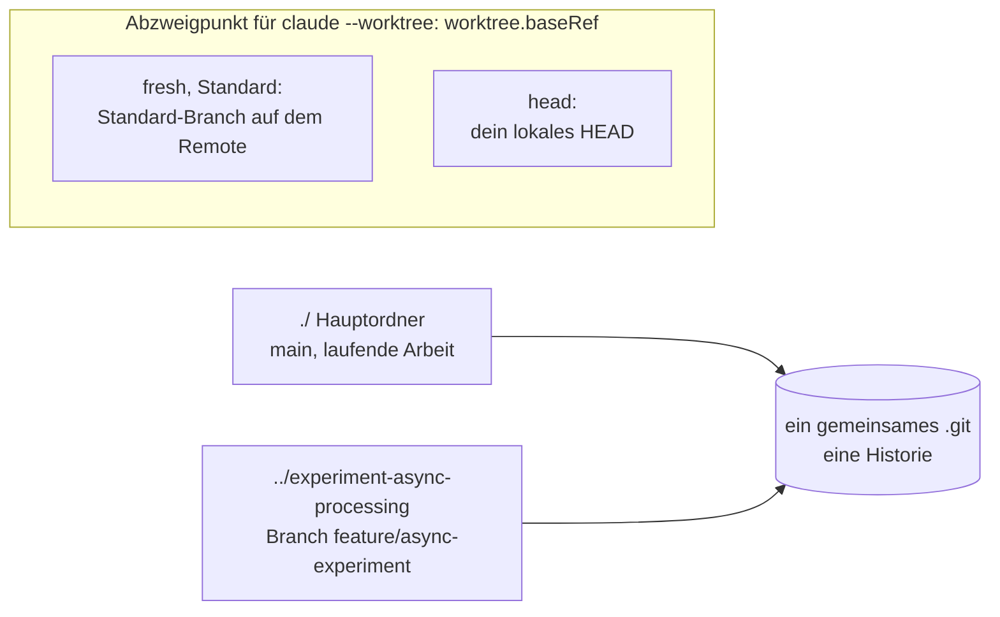

# S1.18 · Worktrees als Testlabor

<!-- meta:start -->
> **Regal:** [Git & Worktrees](README.md#git) · **Stufe:** Vertiefung · **~15 Min** · **Voraussetzungen:** [S1.16 Git in einem Fluss: Branch, Commit, PR](s1-16-git-in-einem-fluss.md)
>
> ← [S1.17 Git-Befehle in der Sitzung](s1-17-git-befehle.md) · [Bibliothek](README.md) · [S1.19 Kosten im Blick: /cost, /usage und Budgetgrenzen](s1-19-kosten-im-blick.md) →
<!-- meta:end -->

## Schnellcheck

- Hast du schon einmal mit `git worktree` oder `claude --worktree` parallel an zwei Branches gearbeitet?
- Kannst du ohne Nachschlagen sagen, von wo ein neuer Worktree standardmäßig abzweigt und wie du das mit `worktree.baseRef` änderst?

## Auf einen Blick

Ein Git-Worktree ist ein zweites Arbeitsverzeichnis mit eigenem Branch, das dasselbe Repository teilt. Darin probierst du etwas aus oder machst einen Hotfix, ohne deinen laufenden Branch anzufassen: kein Stash, kein Branch-Wechsel mitten in der Arbeit. Klappt das Experiment, mergst du; klappt es nicht, entfernst du den Worktree.

`claude --worktree <name>` legt den Worktree an und startet darin eine Sitzung. Ob er vom Standard-Branch auf dem Remote abzweigt (`fresh`, der Standard) oder von deinem lokalen `HEAD` (`head`), bestimmt die Einstellung `worktree.baseRef`.

## Bild im Kopf

Wenn du eine neue Firmware für einen Controller testen willst, spielst du sie nicht zuerst auf das Live-System. Du hast eine Testbank: einen Nachbau der Produktionsanlage in einem eigenen Raum. Dort spielst du die Firmware auf, testest, prüfst das Verhalten und planst erst dann das Update in der Produktion.

Ein Git-Worktree ist deine Testbank für Software: ein eigener Raum mit derselben Ausstattung, getrennt vom Live-System. Du kannst dort etwas kaputtmachen, ohne die Produktion zu berühren. Wenn du dir sicher bist, mergst du.



## Im Detail

### Was ein Worktree ist

Ein Git-Worktree ist ein eigenes Arbeitsverzeichnis, das dasselbe Git-Repository teilt. Du kannst mehrere Worktrees gleichzeitig haben, jeden auf einem anderen Branch.

### Warum das zählt: der Hotfix mitten im Refactor

Stell dir vor, du steckst in einem großen Refactor auf dem Branch `refactor/alarm-correlator`. Da wird ein kritischer Fehler in der Produktion gemeldet. Normalerweise würdest du:

- die Refactor-Änderungen stashen
- den Branch wechseln
- den Fehler beheben
- committen und pushen
- den Stash zurückholen
- mit dem Refactor weitermachen

Mit Worktrees:

- bleibt dein Refactor-Branch genau, wo er ist, in seinem Ordner
- legst du für den Hotfix einen neuen Worktree an
- behebst du den Fehler im Hotfix-Worktree
- committest und pushst du von dort
- kehrst du zu deinem unveränderten Refactor-Worktree zurück

Die beiden Branches liegen nebeneinander als eigene Ordner. Kein Stash, kein Kontextwechsel in deinem Arbeitsverzeichnis.

### Einen Worktree von Hand anlegen

```
# Create a worktree for an experiment
git worktree add ../experiment-async-processing feature/async-experiment

# Now you have:
# ./                          (main branch, ongoing work)
# ../experiment-async-processing   (experiment branch, isolated)
```

Ohne `-b` checkt Git einen Branch aus, den es schon gibt: `feature/async-experiment` muss hier also bereits existieren, lokal oder auf dem Remote. Mit `-b <branch>` legt Git einen neuen Branch an, ausgehend von deinem aktuellen `HEAD`. So arbeiten die Vorführung und die Übung unten.

Du kannst Claude den Worktree auch in normaler Sprache anlegen lassen:

```
Create a worktree at ../alarm-refactor-experiment on a new branch
called experiment/alarm-refactor so I can test this approach in isolation
```

`git worktree list` zeigt alle Worktrees, `git worktree remove ../<ordner>` räumt einen wieder ab.

### In einem Schritt: claude --worktree

Claude Code kann den Worktree auch selbst anlegen, ohne eigenes `git worktree add`:

```bash
claude --worktree feature-zone-correlation
```

Das startet eine frische Claude-Sitzung in einem neuen Worktree unter `<repo>/.claude/worktrees/`. Das Argument ist der Name des Worktrees, kein bestehender Branch: Standardmäßig heißt der Ordner `.claude/worktrees/<name>/`, und Claude Code legt dafür einen neuen Branch `worktree-<name>` an. Die offiziellen Beispiele nutzen Namen ohne Schrägstrich, etwa `feature-auth`; so hält es auch das Beispiel oben. Du legst keinen Ordner von Hand an und brauchst kein `cd`, und weil alle Worktrees gesammelt unter `.claude/` liegen, räumst du sie später leicht auf. Steckt beim Beenden der Sitzung noch Arbeit im Worktree, fragt Claude Code, ob du ihn behalten oder entfernen willst.

### worktree.baseRef: von wo der Worktree abzweigt

Wo `claude --worktree` abzweigt, steuert die Einstellung `worktree.baseRef`. Sie kennt zwei Werte:

- `"fresh"` (Standard): zweigt von `origin/<default-branch>` ab, dem Standard-Branch auf dem Remote, und lässt deinen lokalen Stand außen vor
- `"head"`: zweigt von deinem lokalen `HEAD` ab, mit deinen ungepushten Commits und dem Stand deines Feature-Branchs

Du trägst sie in eine Settings-Datei ein, etwa `{ "worktree": { "baseRef": "fresh" } }` in `settings.json`. Der Standard hat sich zwischen CLI-Versionen verschoben; verlass dich deshalb nicht auf ihn, sondern setz den Wert ausdrücklich. Einen Branch-Namen kannst du dort nicht eintragen; für einen bestimmten Branch legst du den Worktree von Hand mit Git an. Gibt es keinen Remote, fällt `fresh` auf dein lokales `HEAD` zurück.

`fresh` ist besonders wichtig, wenn mehrere Agenten parallel in Worktrees arbeiten: Jeder bekommt einen sauberen Ausgangspunkt, der dem Stand auf dem Remote entspricht, statt auf lokalen Commits aufzubauen, die noch niemand gepusht hat. Auch die Worktrees von Subagenten zweigen nach dieser Einstellung ab. Diese Muster vertiefst du in [S4.7](s4-07-isolation-docker-worktrees.md).

### Wann sich ein Worktree lohnt

| Situation | Worktree? |
|---|---|
| Hotfix, während ein Feature-Branch in Arbeit ist | Ja, der Feature-Branch bleibt unberührt |
| Zwei Ansätze direkt nebeneinander vergleichen | Ja, beide laufen gleichzeitig |
| Riskanter Refactor, den du vielleicht verwirfst | Ja, der main-Branch bleibt sauber |
| Normale Feature-Entwicklung | Nein, ein einzelner Branch reicht |
| Zwei verschiedene Testkonfigurationen | Ja, jeder Worktree hat seinen eigenen Arbeitsstand |

## Vorführen

### Demo: einen Worktree anlegen (Bonus zu Demo 1.4)

**Ziel:** Zeigen, dass ein Experiment in einem eigenen Ordner auf einem eigenen Branch läuft, während der aktuelle Branch unberührt bleibt.

**Vorbereitung:** Die Demo schließt an den Git-Ablauf aus [S1.16](s1-16-git-in-einem-fluss.md) an und läuft im selben Ordner, auf dem Branch `feature/ipv4-validation`. Sie ist ein Bonus, wenn Zeit bleibt.

**Schritt 1: den Worktree anlegen**

Tippe in Claude Code:

```
Create a git worktree at ../validators-experiment on a new branch
called experiment/regex-validators
```

Was passiert: Claude führt `git worktree add ../validators-experiment -b experiment/regex-validators` aus und bestätigt.

**Schritt 2: die Worktrees anzeigen**

Tippe in Claude Code:

```
What worktrees do we have now?
```

Was passiert: Claude führt `git worktree list` aus und zeigt den Hauptordner und den neuen Experiment-Worktree.

<details><summary>Für Moderierende</summary>

**Dauer:** Teil der etwa 10 Minuten von Demo 1.4 ([S1.16](s1-16-git-in-einem-fluss.md)); nur, wenn Zeit bleibt.

**Sagen:**

- Vor Schritt 1: „Angenommen, ich will einen ganz anderen Ansatz ausprobieren, vielleicht doch mit Regex, um zu sehen, ob es damit sauberer wird. Meinen aktuellen Branch will ich dabei nicht durcheinanderbringen. Also: Worktree."
- Nach Schritt 2: „Zwei Branches. Zwei Ordner. Beide gehören zu demselben Repository. Claude kann im Experiment-Ordner arbeiten und den Regex-Ansatz ausprobieren, während mein aktueller Branch völlig unberührt bleibt. Klappt das Experiment, merge ich. Klappt es nicht, lösche ich den Worktree und lasse es liegen. Kein Stash, keine versehentlichen Änderungen an meinem Branch."
- Brücke zur Analogie: „Erinnert euch an die Testbank: eigener Raum, dieselbe Ausstattung, völlig getrennt. Genau das ist das hier. Euer Live-System bekommt nichts davon mit, was im Testlabor passiert."
- Zum Schluss von Demo 1.4: „Worktrees geben euch das Testlabor-Modell, das ihr aus der physischen Sicherheit kennt: getrennte Umgebung, echte Ausstattung, kein Risiko für die Produktion."

**Wenn etwas schiefgeht:**

- **`git worktree add` scheitert, weil es den Branch schon gibt:** Lass `-b` weg; dann nutzt Git den vorhandenen Branch. Den Worktree mit `git worktree remove ../<dir>` zu entfernen, hilft hier allein nicht: Das löscht den Branch nicht, und mit `-b` scheitert der nächste Versuch wieder.

</details>

## Selbst machen

### Bonus-Übung: einen Experiment-Worktree anlegen

**Ziel:** Neben dem Repo aus der Git-Übung in [S1.16](s1-16-git-in-einem-fluss.md) einen Experiment-Worktree anlegen und verstehen, wie er dir hilft. Du brauchst dafür den Ordner `exercise-1.4-git` mit dem Commit aus dieser Übung.

**1. Einen Experiment-Worktree anlegen**

Frag Claude:

<!-- cockpit:example -->
```
Create a git worktree at ../log-formatter-experiment on a new branch
called experiment/json-log-format
```

**2. Prüfen, ob er existiert**

Frag Claude:

```
List all git worktrees
```

Du solltest zwei sehen: den Hauptordner und das Experiment.

**3. Den Ablauf durchdenken**

Stell dir vor, du willst jetzt eine ganz andere Umsetzung ausprobieren: JSON-Logs statt der gut lesbaren Textzeile. Wie hilft dir der eigene Worktree dabei?

Im Experiment-Worktree würdest du:

- `log_formatter.py` so ändern, dass es JSON ausgibt
- die Tests laufen lassen, um zu sehen, ob der Ansatz trägt
- beide Ansätze nebeneinander vergleichen
- entscheiden, welchen du mergst und welchen du verwirfst

Umsetzen musst du das jetzt nicht. Ziel ist, das Modell zu verstehen. Willst du sehen, was im Worktree-Ordner liegt, frag Claude: „List the files in ../log-formatter-experiment". Zum Aufräumen lässt du Claude den Worktree mit `git worktree remove ../log-formatter-experiment` entfernen.

**Geschafft, wenn:**

- [ ] der Worktree angelegt ist und in `git worktree list` erscheint

## Typische Fallen

- **`git worktree add` meldet, dass es den Branch schon gibt.** `-b` legt nur neue Branches an. Nimm einen neuen Branch mit leicht anderem Namen, oder lass `-b` weg, dann checkt Git den vorhandenen Branch aus. `--orphan` hilft hier nicht: Es legt einen leeren Worktree mit einem neuen Branch ohne Commits an, deine Dateien sind dort nicht.
- **Im neuen Worktree fehlen deine ungepushten Commits.** Mit dem Standard `fresh` zweigt `claude --worktree` vom Standard-Branch auf dem Remote ab. Brauchst du deinen lokalen Stand, setz `worktree.baseRef` auf `"head"`.
- **Der Worktree taucht im Hauptordner als ungetrackte Dateien auf.** `claude --worktree` legt Worktrees unter `.claude/worktrees/` im Repo an. Trag `.claude/worktrees/` in deine `.gitignore` ein, sonst erscheinen sie in `git status`.

## Check

Du kannst für ein Experiment einen Worktree anlegen, von Hand oder mit `claude --worktree`, und begründen, wann er sich lohnt und welchen Wert von `worktree.baseRef` du wählst.

1. Was teilen sich Hauptordner und Worktree, und was hat jeder für sich?
2. Was ändert `-b` bei `git worktree add`?
3. Von wo zweigt ein neuer Worktree mit `fresh` ab, und was passiert, wenn es keinen Remote gibt?

<details><summary>Quizfrage</summary>

**Frage:** Dein Feature-Branch hat ungepushte Commits. Du startest zwei Agenten mit `claude --worktree`, und `worktree.baseRef` steht auf `fresh`. Wovon gehen die beiden Worktrees aus?

- **Richtig:** Vom Standard-Branch auf dem Remote; deine ungepushten Commits sind in keinem der beiden Worktrees enthalten.
- Falsch: Von deinem lokalen HEAD; beide Worktrees starten also mit deinen ungepushten Commits als gemeinsamer Basis.
- Falsch: Vom letzten Commit des jeweils anderen Agenten, damit die beiden Worktrees nach jedem Commit synchron bleiben.
- Falsch: Von deinem Arbeitsverzeichnis samt allen nicht committeten Änderungen, damit kein Zwischenstand verloren geht.

</details>

## Weiterlesen

- [Parallele Sitzungen mit Worktrees](https://code.claude.com/docs/en/worktrees)
- [Settings-Referenz: worktree.baseRef](https://code.claude.com/docs/en/settings-reference#worktree-baseref)
- [git worktree in der Git-Dokumentation](https://git-scm.com/docs/git-worktree)
- [S1.16 · Git in einem Fluss: Branch, Commit, PR](s1-16-git-in-einem-fluss.md)
- [S1.17 · Git-Befehle in der Sitzung](s1-17-git-befehle.md)
- [S3.13 · Autonome Loops absichern: Budget und Worktree](s3-13-autonome-loops-absichern.md)
- [S4.7 · Isolation mit Docker und Worktrees](s4-07-isolation-docker-worktrees.md)
- [S1.20 · Praxis-Station Session 1: eine Übung wählen](s1-20-praxis-station-1.md)
