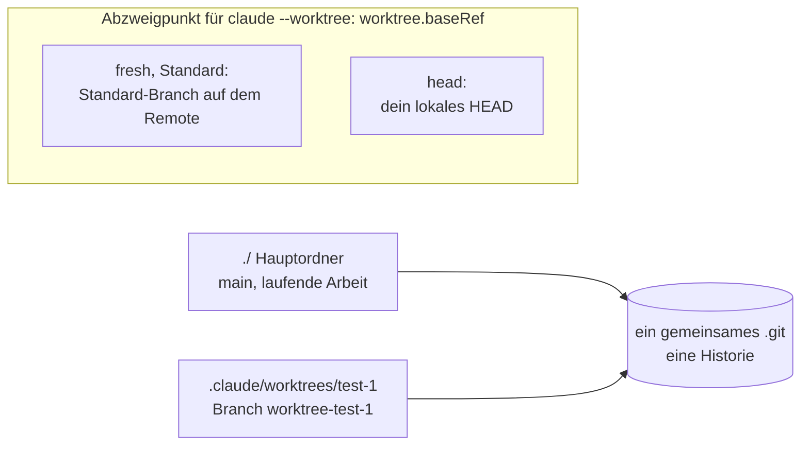

# S1.18 · Worktrees als Testlabor

<!-- meta:start -->
> **Regal:** [Git & Worktrees](README.md#git) · **Stufe:** Vertiefung · **~20 Min** · **Voraussetzungen:** [S1.16 Git in einem Fluss: Branch, Commit, PR](s1-16-git-in-einem-fluss.md)
>
> ← [S1.17 Git-Befehle in der Sitzung](s1-17-git-befehle.md) · [Bibliothek](README.md) · [S1.19 Kosten im Blick: /cost, /usage und Budgetgrenzen](s1-19-kosten-im-blick.md) →
<!-- meta:end -->

## Schnellcheck

- Hast du schon einmal mit `git worktree` oder `claude --worktree` parallel an zwei Branches gearbeitet?
- Kannst du ohne Nachschlagen sagen, was ein Worktree von deinem Rechner trennt und was nicht?

## Auf einen Blick

Ein Git-Worktree ist ein zweites Arbeitsverzeichnis mit eigenem Branch, das dasselbe Repository teilt. Darin probierst du etwas aus oder machst einen Hotfix, ohne deinen laufenden Branch anzufassen: kein Stash, kein Branch-Wechsel mitten in der Arbeit. Klappt das Experiment, mergst du; klappt es nicht, entfernst du den Worktree.

Ein Worktree trennt Dateiänderungen und Branches. Die Doku nennt als Zweck, Dateiänderungen paralleler Sitzungen zu trennen. Prozesse, Datenbanken, Ports und deine Rechte trennt er nicht. Den Schutz für deinen Rechner baust du anders ([S4.7](s4-07-isolation-docker-worktrees.md)).

`claude --worktree <name>` legt den Worktree an und startet darin eine Sitzung.

## Bild im Kopf

Ein Worktree ist ein zweiter Arbeitstisch am selben Archiv. Auf jedem Tisch liegen eigene Unterlagen: eigene Dateien, ein eigener Branch. Aber beide Tische ziehen aus derselben Aktenablage, dem gemeinsamen `.git`, und stehen im selben Gebäude. Was am Tisch geschieht, trennt die Papiere voneinander, nicht das Gebäude vom Experiment.



## Im Detail

### Warum das zählt: der Hotfix mitten im Refactor

Du steckst in einem großen Refactor auf dem Branch `refactor/alarm-correlator`. Da wird ein kritischer Fehler in der Produktion gemeldet. Normalerweise würdest du die Änderungen stashen, den Branch wechseln, den Fehler beheben, committen und pushen, den Stash zurückholen und weitermachen. Mit Worktrees bleibt dein Refactor-Branch in seinem Ordner, wo er ist. Du legst für den Hotfix einen eigenen Worktree an, behebst und pushst von dort und kehrst zu deinem unveränderten Refactor zurück.

### In einem Schritt: claude --worktree

```bash
claude --worktree feature-zone-correlation
```

Das startet eine Claude-Sitzung in einem neuen Worktree unter `<repo>/.claude/worktrees/<name>/`. Das Argument ist der Name des Worktrees, kein bestehender Branch: Claude Code legt dafür einen neuen Branch `worktree-<name>` an. Läuft Claude im Ordner zum ersten Mal, brauchst du vorher einmal eine normale Sitzung dort, in der du dem Ordner vertraust; sonst bricht `--worktree` mit einer Fehlermeldung ab. Ein Worktree ist ein frischer Checkout: Was nicht in Git liegt, etwa eine `.env` oder ein virtuelles Python-Environment, fehlt dort. Trag `.claude/worktrees/` in deine `.gitignore` ein, damit die Worktrees im Hauptordner nicht als ungetrackte Dateien erscheinen.

Beim Beenden prüft Claude Code den Worktree. Ist er sauber und die Sitzung unbenannt, entfernt es ihn samt Branch. Steckt noch Arbeit darin (geänderte oder ungetrackte Dateien, neue Commits), fragt es, ob du ihn behalten oder entfernen willst. Behalten bewahrt Ordner und Branch. Entfernen löscht den Worktree-Ordner und seinen Branch samt der Arbeit darin.

### Einen Worktree von Hand anlegen

```bash
# Worktree auf einem neuen Branch, ausgehend vom aktuellen HEAD
git worktree add -b experiment/async ../experiment-async

git worktree list
git worktree remove ../experiment-async
```

Ohne `-b` checkt Git einen Branch aus, den es schon gibt. Mit `-b <branch>` legt es einen neuen an und scheitert, wenn er schon existiert. `git worktree remove` löscht den Branch nicht; den räumst du mit `git branch -d` ab. Du kannst Claude den Worktree auch in normaler Sprache anlegen lassen.

### worktree.baseRef: von wo der Worktree abzweigt

Wo `claude --worktree` abzweigt, steuert die Einstellung `worktree.baseRef`:

- `"fresh"` (Standard): zweigt vom Standard-Branch auf dem Remote ab und lässt deinen lokalen Stand außen vor.
- `"head"`: zweigt von deinem lokalen `HEAD` ab, mit deinen ungepushten Commits.

Einen Branch-Namen kannst du dort nicht eintragen; für einen bestimmten Branch legst du den Worktree von Hand an. Gibt es keinen Remote, fällt `fresh` laut Doku auf dein lokales `HEAD` zurück. Die Einstellung zählt vor allem, wenn mehrere Agenten parallel arbeiten ([S4.7](s4-07-isolation-docker-worktrees.md)).

### Wann sich ein Worktree lohnt

| Situation | Worktree? |
|---|---|
| Hotfix, während ein Feature-Branch in Arbeit ist | Ja, der Feature-Branch bleibt unberührt |
| Zwei Ansätze direkt nebeneinander vergleichen | Ja, beide laufen gleichzeitig |
| Riskanter Refactor, den du vielleicht verwirfst | Ja, der main-Branch bleibt sauber |
| Normale Feature-Entwicklung | Nein, ein einzelner Branch reicht |

## Selbst machen

### Übung: ein Worktree, den du wieder abräumst (etwa 10 Minuten)

**Ziel:** Du legst mit `claude --worktree` einen Worktree an, änderst darin eine Datei, siehst, dass dein Hauptordner unberührt bleibt, und räumst den Worktree beim Beenden wieder weg.

**Startzustand:** ein neues lokales Repository in `~/cc-workshop/worktree` mit mindestens einem Commit, mit Git aus [S0.1](s0-01-werkstatt-einrichten.md). Git braucht für den Commit einen Namen und eine E-Mail-Adresse (`git config user.name`, `git config user.email`).

```bash
# macOS / Linux / Git Bash
mkdir -p ~/cc-workshop/worktree && cd ~/cc-workshop/worktree
git init
echo "# Worktree test" > README.md
echo ".claude/worktrees/" > .gitignore
git add README.md .gitignore
git commit -m "Initial commit"
```

```powershell
# Windows PowerShell
New-Item -ItemType Directory -Force "$HOME\cc-workshop\worktree"; Set-Location "$HOME\cc-workshop\worktree"
git init
"# Worktree test" | Set-Content README.md
".claude/worktrees/" | Set-Content .gitignore
git add README.md .gitignore
git commit -m "Initial commit"
```

Starte einmal `claude` in diesem Ordner, bestätige den Vertrauensdialog mit „Yes, I trust this folder“ ([S1.1](s1-01-erster-kontakt.md)) und beende die Sitzung mit `/exit`.

1. Starte den Worktree:

   <!-- cockpit:example -->
   ```bash
   claude --worktree test-1 --permission-mode acceptEdits
   ```

   Erwartet: Eine Sitzung startet, aber in einem anderen Ordner als dein Hauptordner.
2. Gib ein: `Create a file experiment.txt containing the word hello.` Erwartet: Die Datei entsteht.
3. Öffne ein zweites Terminal im Hauptordner `~/cc-workshop/worktree` und führ `git worktree list` aus. Erwartet: zwei Einträge, der Hauptordner und `.claude/worktrees/test-1` mit dem Branch `worktree-test-1`. Sieh dann nach, ob `experiment.txt` im Hauptordner liegt (`ls`, in PowerShell `Get-ChildItem`). Erwartet: nein, nur im Worktree.
4. Beende die Sitzung mit `/exit`. Erwartet: Claude Code fragt, ob du den Worktree behalten („Keep worktree“) oder entfernen („Remove worktree“) willst, weil noch eine Datei darin liegt, die nicht committet ist. Wähl „Remove worktree“.
5. Führ im Hauptordner `git worktree list` und `git branch` aus. Erwartet: Nur der Hauptordner steht noch in der Liste, und der Branch `worktree-test-1` ist weg.

**Aufräumen:** Lösch den Ordner `~/cc-workshop/worktree` selbst.

**Geschafft, wenn:**

- [ ] `git worktree list` während der Sitzung zwei Einträge zeigte
- [ ] `experiment.txt` nur im Worktree lag, nicht im Hauptordner
- [ ] nach dem Entfernen weder der Worktree noch der Branch `worktree-test-1` existierte
- [ ] du sagen kannst, was der Worktree nicht von deinem Rechner getrennt hätte

### Extra: ein Worktree von Hand (etwa 5 Minuten)

Leg im Übungsordner einen Worktree von Hand an: `git worktree add -b experiment ../worktree-experiment`. Prüf ihn mit `git worktree list`, entferne ihn mit `git worktree remove ../worktree-experiment` und stell fest, dass der Branch `experiment` danach noch existiert (`git branch`). Lösch ihn mit `git branch -d experiment`.

## Typische Fallen

- **`claude --worktree` bricht mit einer Fehlermeldung ab.** Du hast in diesem Ordner noch nie Claude gestartet: Starte einmal `claude`, bestätige den Vertrauensdialog und versuch es erneut.
- **`git worktree add` meldet, dass es den Branch schon gibt.** `-b` legt nur neue Branches an. Nimm einen neuen Namen, oder lass `-b` weg, dann checkt Git den vorhandenen Branch aus.
- **Im neuen Worktree fehlen deine ungepushten Commits.** Mit dem Standard `fresh` zweigt `claude --worktree` vom Standard-Branch auf dem Remote ab. Brauchst du deinen lokalen Stand, setz `worktree.baseRef` auf `"head"`.
- **Im Worktree fehlt die `.env` oder das virtuelle Environment.** Ein Worktree ist ein frischer Checkout. Richte die Umgebung dort neu ein.
- **Beim Entfernen ist die Arbeit weg.** Entfernen löscht Ordner und Branch samt Arbeit. Willst du sie behalten, wähl „Keep worktree“ oder committe vorher.

## Check

Du kannst für ein Experiment einen Worktree anlegen, begründen, wann er sich lohnt, und sagen, was er nicht isoliert.

1. Was teilen sich Hauptordner und Worktree, und was hat jeder für sich?
2. Was trennt ein Worktree nicht, obwohl er wie ein „Testlabor“ aussieht?
3. Was passiert beim Beenden einer `claude --worktree`-Sitzung, wenn noch Arbeit im Worktree liegt?

<details><summary>Auflösung</summary>

1. Sie teilen das Repository mit seiner Historie und dem Remote. Jeder hat seine eigenen Dateien und seinen eigenen Branch.
2. Prozesse, Datenbanken, Ports und deine Rechte. Ein Worktree trennt Dateiänderungen und Branches, nicht dein System.
3. Claude Code fragt, ob du den Worktree behalten oder entfernen willst. Behalten bewahrt Ordner und Branch, Entfernen löscht beides samt der Arbeit.

</details>

<details><summary>Quizfrage</summary>

**Frage:** Du lässt Claude in einem Worktree ein Migrationsskript ausprobieren, das sich mit dem Datenbankserver auf deinem Rechner verbindet. Was schützt der Worktree?

- **Richtig:** Nur Dateien und Branch: Der Server ist derselbe wie für den Hauptordner, das Skript kann die Datenbank also verändern.
- Falsch: Alles, denn ein Worktree ist eine abgetrennte Testumgebung mit eigener Kopie der Datenbank und der Dienste.
- Falsch: Die Datenbank, denn Claude Code startet Befehle in einem Worktree automatisch in einer Sandbox ohne Zugriff.
- Falsch: Nichts, denn ein Worktree schützt nur lesende Zugriffe, schreibende Dateiänderungen landen im Hauptordner.

</details>

## Weiterlesen

- [Parallele Sitzungen mit Worktrees](https://code.claude.com/docs/en/worktrees)
- [Settings-Referenz: worktree.baseRef](https://code.claude.com/docs/en/settings-reference#worktree-baseref)
- [git worktree in der Git-Dokumentation](https://git-scm.com/docs/git-worktree)
- [S1.16 · Git in einem Fluss: Branch, Commit, PR](s1-16-git-in-einem-fluss.md)
- [S1.17 · Git-Befehle in der Sitzung](s1-17-git-befehle.md)
- [S3.13 · Autonome Loops absichern: Budget und Worktree](s3-13-autonome-loops-absichern.md)
- [S4.7 · Isolation mit Docker und Worktrees](s4-07-isolation-docker-worktrees.md)
- [S1.20 · Praxis-Station Session 1: alles in einem Ablauf](s1-20-praxis-station-1.md)
