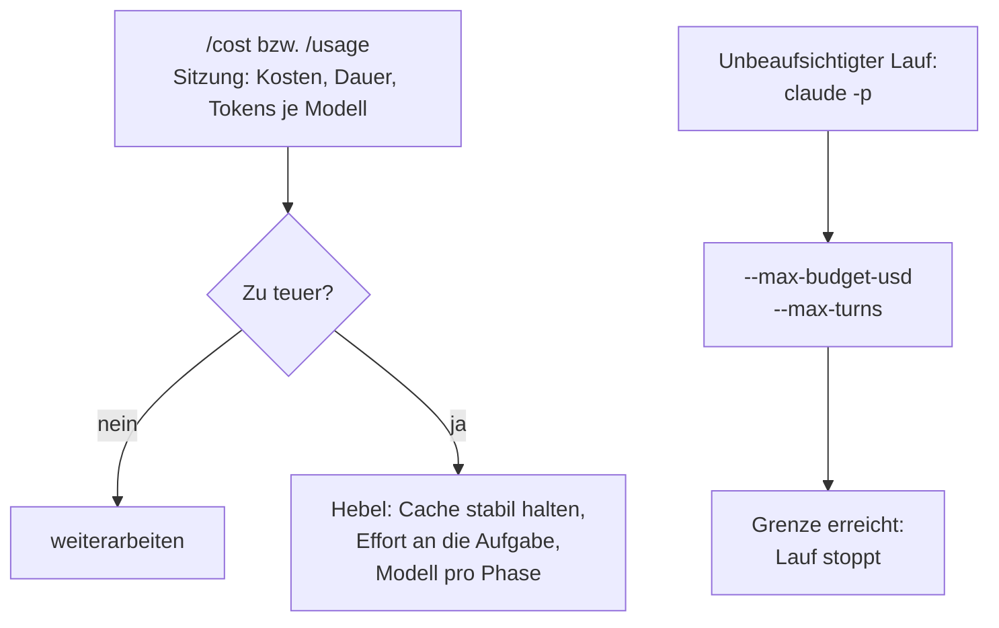

# S1.19 · Kosten im Blick: /cost, /usage und Budgetgrenzen

<!-- meta:start -->
> **Regal:** [Modelle & Kosten](README.md#cost) · **Stufe:** Kern · **~15 Min** · **Voraussetzungen:** [S1.1 Erster Kontakt: sofort eine Datei bauen](s1-01-erster-kontakt.md)
>
> ← [S1.18 Worktrees als Testlabor](s1-18-worktrees.md) · [Bibliothek](README.md) · [S1.20 Praxis-Station Session 1: eine Übung wählen](s1-20-praxis-station-1.md) →
<!-- meta:end -->

## Schnellcheck

- Hast du schon einmal nach einer Sitzung `/cost` geöffnet und daraus eine Modell- oder Effort-Entscheidung abgeleitet?
- Kannst du ohne Nachschlagen sagen, in welchem Modus `--max-budget-usd` überhaupt wirkt?

## Auf einen Blick

Für den Anfang reichen drei Dinge: `/cost` (ein anderer Name für `/usage`) zeigt, was die laufende Sitzung bisher gekostet hat; Modell und Effort sind die großen Hebel, und du vergleichst sie am besten am selben Auftrag; und alles, was unbeaufsichtigt als `claude -p` läuft, deckelst du mit `--max-budget-usd` und `--max-turns`. Beide Grenzen wirken nur im Print-Modus (`-p`), nicht in einer interaktiven Sitzung.

Preise und Caching im Detail kommen später in [S4.4](s4-04-ci-zugang-und-kosten.md); aktuelle Modelle und Preise führt der [Kanon](../_canonical.md).

## Bild im Kopf

Ein Wachdienst rechnet mit Stundenzetteln ab. Der Stundenzettel der laufenden Schicht ist `/cost`. Die Budgetgrenze ist das Tank- und Zeitbudget der Nachtstreife, die allein unterwegs ist: Ist es aufgebraucht, kehrt sie zurück. Das gilt nur für Streifen ohne Aufsicht, also für `claude -p`-Läufe, nicht für einen Einsatz, bei dem du danebenstehst.



## Im Detail

### Verbrauch ablesen: /cost und /usage

Für den Verbrauch hat Claude Code einen Befehl: `/usage`. `/cost` und `/stats` sind andere Namen dafür. Oben zeigt er den Session-Block: Gesamtkosten (`Total cost`), Dauer, Code-Änderungen und die Tokens je Modell. Im Abo (Pro, Max, Team, Enterprise) zeigt er darunter, was deinen Verbrauch getrieben hat, aufgeschlüsselt nach Skills, Subagents, Plugins und MCP-Servern. `/insights` ist dagegen kein Kostenbericht, sondern ein HTML-Bericht über deine Arbeitsweise.

Den Dollarbetrag rechnet Claude Code lokal aus den Tokens zum Listenpreis aus. Er ist eine Schätzung; verbindlich ist die Usage-Seite der [Claude Console](https://platform.claude.com/usage). Mit einem Pro- oder Max-Abo ist der Betrag für die Abrechnung nicht relevant; zum Vergleich von Modellen und Stufen taugt er trotzdem. `/clear` setzt die Summen zurück, die nächste Sitzung beginnt wieder bei null.

### Drei Sparhebel

1. **Stabilen Kontext halten:** Halte `CLAUDE.md` und geladene Skills während eines Arbeitsblocks stabil, damit der Cache greift.
2. **Effort an die Denklast anpassen:** niedrige oder mittlere Stufen für mechanische Änderungen, hohe nur für Architektur oder heikle Fehlersuche ([S1.7](s1-07-modellwahl-und-effort.md)).
3. **Ein Modell pro Phase:** Das stärkste Modell nur, wo Urteil zählt; Routinecode schreibt `sonnet`, günstige erste Lesedurchgänge macht `haiku` ([S4.1](s4-01-modell-pro-phase.md)).

Modell und Effort stellst du für eine einzelne Sitzung mit Start-Flags ein: `claude --model sonnet --effort medium`. `/model <alias>` dagegen speichert deine Wahl als neuen Standard ([S1.7](s1-07-modellwahl-und-effort.md)).

### Budgetgrenzen für unbeaufsichtigte Läufe

`claude -p "<auftrag>"` führt einen einzelnen Auftrag ohne interaktive Sitzung aus, druckt die Antwort und beendet sich (mehr in [S4.3](s4-03-headless.md)). Das ist der Print-Modus. Lässt du Claude so ohne Aufsicht laufen, in Skripten, CI und geplanten Jobs, können Kosten still davonlaufen. Dafür gibt es zwei harte Grenzen:

- `--max-budget-usd 5.00`: harte Obergrenze in Dollar für diesen `-p`-Lauf. Ausgaben von Subagents zählen mit.
- `--max-turns <n>`: harte Grenze für die Zahl der Agenten-Runden; ist sie erreicht, endet der Lauf mit einem Fehler. Die CLI-Referenz dokumentiert das Flag, `claude --help` listet es nicht.

Das Budget begrenzt davonlaufende Kosten, das Rundenlimit davonlaufende Schleifen. In einer interaktiven Sitzung greifen beide nicht. Beispiel:

```bash
claude -p "run the test suite and summarize failures" --max-budget-usd 2.00 --max-turns 10
```

Ein fehlgeschlagener `-p`-Lauf endet mit einem Code ungleich 0; prüf das in CI. Das Absichern autonomer Loops steht in [S3.13](s3-13-autonome-loops-absichern.md).

## Selbst machen

### Übung: dieselbe Aufgabe, drei Modelle (etwa 10 Minuten)

**Ziel:** Du führst eine kleine Aufgabe nacheinander mit drei Modellen aus, liest jeweils den Verbrauch ab und beurteilst, ob der teurere Lauf sein Geld wert war. Dein Standardmodell bleibt unverändert.

**Startzustand:** ein neuer, leerer Ordner `~/cc-workshop/kosten`. Leg ihn an und wechsle hinein (`mkdir -p ~/cc-workshop/kosten && cd ~/cc-workshop/kosten`, in PowerShell `New-Item -ItemType Directory -Force "$HOME\cc-workshop\kosten"; Set-Location "$HOME\cc-workshop\kosten"`). Du nutzt nur Start-Flags, die für die jeweilige Sitzung gelten. Gib in diesen Sitzungen weder `/model` noch `/effort` ein, denn beide würden deine Wahl als Standard speichern. Fehlt dir der Zugang zu einem Modell, lass es aus.

Jeder Lauf ist eine neue Sitzung: So fängt `/cost` bei null an.

1. Starte den ersten Lauf und gib den Auftrag ein:

   <!-- cockpit:example -->
   ```bash
   claude --model opus --effort xhigh --permission-mode acceptEdits
   ```

   ```text
   Write palindrome_opus.py with a function is_palindrome(text) that ignores case and spaces, and three assert tests at the bottom.
   ```

   Erwartet: Claude legt die Datei an. Gib dann `/cost` ein und notier die Zeile `Total cost`. Es zählt die Größenordnung. Beende die Sitzung mit `/exit`.
2. Zweiter Lauf: `claude --model sonnet --effort medium --permission-mode acceptEdits`. Gleicher Auftrag, Datei `palindrome_sonnet.py`. Dann `/cost`, notieren, `/exit`.
3. Dritter Lauf: `claude --model haiku --permission-mode acceptEdits`, ohne `--effort`, weil `haiku` keine Effort-Stufen kennt. Datei `palindrome_haiku.py`. Dann `/cost`, notieren, `/exit`.
4. Vergleiche die drei Beträge. Erwartet: Meist sinken sie von Lauf 1 zu Lauf 3, weil `sonnet` und `haiku` pro Token weniger kosten als `opus` ([Kanon](../_canonical.md)). Einzelne Läufe können abweichen, etwa wegen unterschiedlich langer Antworten. Öffne die drei Dateien und sieh nach, ob sich der Aufpreis bei dieser Aufgabe in der Qualität zeigt.
5. Prüf, dass dein Standard unverändert ist: Starte `claude` ohne Flags und lies die Kopfzeile. Sie nennt dein gewohntes Modell, nicht `haiku`.

**Aufräumen:** Lösch den Ordner `~/cc-workshop/kosten` selbst. Es gibt nichts zurückzusetzen.

**Geschafft, wenn:**

- [ ] du drei Werte für `Total cost` notiert hast, je aus einer neuen Sitzung
- [ ] du sagen kannst, bei welchem Modell du für diese Aufgabe bleiben würdest, und warum
- [ ] die Kopfzeile von `claude` ohne Flags dein gewohntes Modell nennt

### Extra: ein gedeckelter `-p`-Lauf (etwa 3 Minuten)

Lass im Übungsordner einen Lauf im Print-Modus zusammenfassen: `claude -p "Summarize palindrome_haiku.py in one sentence." --max-turns 3 --max-budget-usd 0.50`. Erwartet: Die Antwort steht im Terminal, und das Programm endet von selbst. Sieh dir den Exit-Status an (`echo $?`, in PowerShell `$LASTEXITCODE`). Setz dann `--max-turns 1` und lies, was passiert: Die Doku sagt, ein erreichtes Rundenlimit endet mit einem Fehler.

## Typische Fallen

- **Die Budgetgrenze greift nicht.** `--max-budget-usd` und `--max-turns` wirken nur mit `-p`. In einer interaktiven Sitzung begrenzen sie nichts.
- **Der Vergleich ist schief.** Wechselst du in derselben Sitzung das Modell, liest das neue Modell den Verlauf ohne Cache-Treffer neu, und `/cost` zählt alle Läufe zusammen. Starte jeden Lauf neu oder nimm `/clear`.
- **Du arbeitest nach dem Test mit `haiku` weiter.** `/model haiku` und `/effort` speichern den Standard; zurück kommst du mit `/model default` und `/effort auto`.

## Check

Du kannst mit `/cost` den Verbrauch deiner Sitzung ablesen, einen fairen Modellvergleich aufbauen und einen `claude -p`-Lauf mit `--max-budget-usd` und `--max-turns` deckeln.

1. Welchen Befehl nutzt du für den Verbrauch deiner laufenden Sitzung, und welche Zeile liest du für den Vergleich ab?
2. In welchem Modus wirken `--max-budget-usd` und `--max-turns`, und was begrenzt jedes der beiden?
3. Warum startest du für jeden Lauf eines Modellvergleichs eine neue Sitzung?

<details><summary>Auflösung</summary>

1. `/cost` (ein anderer Name für `/usage`). Für den Vergleich liest du die Zeile `Total cost` im Session-Block.
2. Im Print-Modus (`claude -p`), nicht interaktiv. `--max-budget-usd` begrenzt die Kosten in Dollar, `--max-turns` die Zahl der Agenten-Runden.
3. `/cost` zählt sonst alle Läufe zusammen, und ein neues Modell liest den bisherigen Verlauf ohne Cache-Treffer neu. Beides verfälscht den Vergleich.

</details>

<details><summary>Quizfrage</summary>

**Frage:** Du hast ein Max-Abo, und `/cost` zeigt am Ende einer Sitzung `Total cost` von 0,42 Dollar. Was bedeutet der Betrag?

- **Richtig:** Eine Schätzung aus den Tokens zum Listenpreis; für die Abrechnung im Abo ist sie nicht relevant, zum Vergleich von Läufen taugt sie.
- Falsch: Den Betrag, den dir Anthropic zusätzlich zur Abo-Gebühr in Rechnung stellt, weil `/cost` die Abrechnung anzeigt.
- Falsch: Den verbindlichen Betrag, der immer genau mit der Usage-Seite der Claude Console übereinstimmt und dort auftaucht.
- Falsch: Einen festen Platzhalter ohne Bezug zu deinen Tokens, den Claude Code für Abos nur zur Anzeige einblendet.

</details>

## Weiterlesen

- [Kosten verwalten](https://code.claude.com/docs/en/costs)
- [CLI-Referenz](https://code.claude.com/docs/en/cli-reference)
- [Befehlsreferenz](https://code.claude.com/docs/en/commands)
- [S1.7 · Modellwahl und Effort](s1-07-modellwahl-und-effort.md)
- [S4.1 · Das richtige Modell pro Phase](s4-01-modell-pro-phase.md)
- [S4.3 · Headless: claude -p als Pipeline-Stufe](s4-03-headless.md)
- [S4.4 · CI-Zugangsdaten, Kostengrenzen und Kosten-Feinschliff](s4-04-ci-zugang-und-kosten.md)
- [S3.12 · Zeitgesteuert arbeiten: /loop, /goal, /schedule, Routinen](s3-12-zeitgesteuert-arbeiten.md)
- [S3.13 · Autonome Loops absichern: Budget und Worktree](s3-13-autonome-loops-absichern.md)
