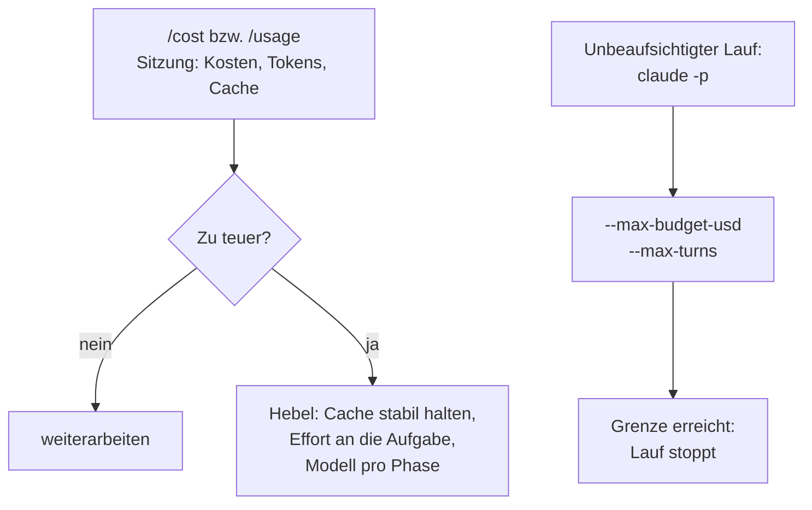

# S1.19 · Kosten im Blick: /cost, /usage und Budgetgrenzen

<!-- meta:start -->
> **Regal:** [Modelle & Kosten](README.md#cost) · **Stufe:** Kern · **~15 Min** · **Voraussetzungen:** [S1.1 Erster Kontakt: sofort eine Datei bauen](s1-01-erster-kontakt.md)
>
> ← [S1.18 Worktrees als Testlabor](s1-18-worktrees.md) · [Bibliothek](README.md) · [S1.20 Praxis-Station Session 1: eine Übung wählen](s1-20-praxis-station-1.md) →
<!-- meta:end -->

## Schnellcheck

- Hast du schon einmal nach einer Sitzung `/cost` geöffnet und daraus eine Modell- oder Effort-Entscheidung abgeleitet?
- Kannst du ohne Nachschlagen sagen, wann du `--max-budget-usd` setzt und in welchem Modus das Flag überhaupt wirkt?

## Auf einen Blick

Für den Anfang reichen drei Dinge: `/cost` (ein anderer Name für `/usage`) zeigt, was die laufende Sitzung bisher gekostet hat; das Standardmodell, das Opus-Tier, ist ein guter Start; und alles, was unbeaufsichtigt als `claude -p` läuft, deckelst du mit `--max-budget-usd` und `--max-turns`. Beide Grenzen wirken nur im Print-Modus (`-p`), nicht in einer interaktiven Sitzung.

Vor jedem langen Lauf fragst du dich: Geht das mit Cache, mit weniger Effort oder mit einem günstigeren Modell für diese Phase? Preise, Pipeline-Rechnung und Caching im Detail kommen später in [S4.4](s4-04-ci-zugang-und-kosten.md).

## Bild im Kopf

Ein Wachdienst rechnet mit Stundenzetteln ab. Der Stundenzettel der laufenden Schicht ist `/cost`: Er zeigt, was diese Schicht bisher gekostet hat. Die Budgetgrenze ist das Tank- und Zeitbudget der Nachtstreife, die allein unterwegs ist: Ist es aufgebraucht, kehrt die Streife zurück, statt weiterzufahren. Dieses Budget gilt nur für Streifen ohne Aufsicht, also für `claude -p`-Läufe, nicht für einen Einsatz, bei dem du danebenstehst.



## Im Detail

### Kosten sind eine Variable

Claude Code kostet Geld, pro Sitzung, pro Tag, pro Team. Wer nicht weiß, was er ausgibt, weiß nicht, wo er optimieren kann. Dieses Kapitel macht Kosten zu einer bewussten Größe statt zu einer Überraschung am Monatsende. Modelle und Effort-Stufen kennst du aus [S1.7](s1-07-modellwahl-und-effort.md); hier geht es darum, was sie in der Praxis kosten und wie du das im Griff behältst.

### Verbrauch ablesen: /cost, /usage und /insights

Für den Verbrauch hat Claude Code einen Befehl: `/usage`. `/cost` und `/stats` sind andere Namen dafür. Jede Ansicht beantwortet eine andere Frage:

| Befehl | Frage | Was du siehst |
|---|---|---|
| `/cost` bzw. `/usage` | Was hat diese Sitzung bisher gekostet? | Der Session-Block: Gesamtkosten, Dauer, Code-Änderungen und die Kosten je Modell. |
| `/usage` im Abo (Pro, Max, Team, Enterprise) | Was hat meinen Verbrauch getrieben? | Nutzungsbalken, Aktivität und eine Aufschlüsselung auf Skills, Subagents, Plugins und MCP-Server; `d` und `w` wechseln zwischen den letzten 24 Stunden und 7 Tagen. |
| `/insights` | Wie arbeite ich, und wo hakt es? | Ein HTML-Bericht über deine letzten Sitzungen: woran du arbeitest, wo es Reibung gibt, was du ausprobieren könntest. Kein Kostenbericht; der Bericht verbraucht selbst Tokens. |

Den Dollarbetrag rechnet Claude Code lokal aus den Tokens zum Listenpreis aus. Er ist eine Schätzung; verbindlich ist die Usage-Seite der [Claude Console](https://platform.claude.com/usage). Mit einem Pro- oder Max-Abo ist der Betrag für die Abrechnung nicht relevant, zum Vergleich von Modellen und Stufen taugt er trotzdem. `/clear` setzt die Summen zurück, die nächste Sitzung beginnt wieder bei null.

Eine nützliche Gewohnheit: Wirf einen Blick auf `/cost`, wann immer du etwas Nicht-Triviales getan hast, etwa einen Refactor über mehrere Dateien, eine lange Planungsrunde oder einen Recherche-Umweg. Das dauert zwei Sekunden und erspart dir am Ende der Woche die Frage „Wie viel habe ich eigentlich ausgegeben?“

### Der 5-Minuten-Kern: drei Sparhebel

Diese drei Gewohnheiten brauchst du ab dem ersten Tag, auch ohne die Vertiefung in [S4.4](s4-04-ci-zugang-und-kosten.md):

1. **Stabilen Kontext cachen:** Halte `CLAUDE.md` und geladene Skills während eines Arbeitsblocks stabil. Wiederholte Anfragen innerhalb des Cache-Fensters sind viel günstiger als Kaltstarts.
2. **Effort an die Denklast anpassen:** `/effort low` oder `medium` für mechanische Änderungen; `xhigh` oder `max` nur für Architektur, Root-Cause-Analyse oder heikle Sicherheitsfragen ([S1.7](s1-07-modellwahl-und-effort.md)).
3. **Ein Modell pro Phase:** Plane und prüfe mit dem stärksten Modell nur, wo Urteil zählt; Routinecode schreibt Sonnet, günstige erste Lesedurchgänge macht Haiku ([S4.1](s4-01-modell-pro-phase.md)).

Kurzform: Frag dich vor jedem langen Lauf, ob er den Cache nutzen, mit weniger Effort laufen oder ein günstigeres Modell für diese Phase nehmen kann. Wenn ja, stell das um, bevor die Tokens fließen.

### Budgetgrenzen für unbeaufsichtigte Läufe

Lässt du Claude lange ohne Aufsicht laufen, können Kosten still davonlaufen. Für Läufe im Print-Modus, also `claude -p` in Skripten, CI und geplanten Jobs, gibt es zwei harte Grenzen:

- `--max-budget-usd 5.00`: harte Obergrenze in Dollar für diesen `-p`-Lauf. Ausgaben von Subagents zählen mit.
- `--max-turns <n>`: harte Grenze für die Zahl der Agenten-Runden; ist sie erreicht, endet der Lauf mit einem Fehler. Die CLI-Referenz dokumentiert das Flag, `claude --help` listet es nicht.

Beide wirken nur im Print-Modus (`-p`): Das Budget begrenzt davonlaufende Kosten, das Rundenlimit davonlaufende Schleifen. In einer interaktiven Sitzung, auch mit `/loop` oder `/goal`, greifen sie nicht. Für CI und jeden unbeaufsichtigten Ablauf sind sie Pflicht. `claude -p` lernst du in [S4.3](s4-03-headless.md) genauer kennen, die CI-Praxis in [S4.4](s4-04-ci-zugang-und-kosten.md) und das Absichern autonomer Loops in [S3.13](s3-13-autonome-loops-absichern.md).

Beispiel:

```bash
claude --max-budget-usd 2.00 -p "/loop check deploy status"
```

Ist das Limit erreicht, stoppt Claude Code den Lauf, statt weiterzuarbeiten. Prüf in CI den Exit-Status: Ein fehlgeschlagener `-p`-Lauf endet mit einem Code ungleich 0. Das Beispiel zeigt die Form des Aufrufs; `/loop` selbst ist für eine offene Sitzung gedacht. Wie du wiederkehrende Läufe ohne offene Sitzung planst, zeigt [S3.12](s3-12-zeitgesteuert-arbeiten.md).

## Selbst machen

### Übung: den Alltag unter 5 Dollar bringen (etwa 25 Minuten)

**Priorität:** Sollte man machen; wertvoll, aber verzichtbar, wenn die Zeit knapp ist.

**Ziel:** Für drei Abläufe, die du wirklich nutzt, eine kostenbewusste Konfiguration festlegen. Behandle Modell und Effort nicht mehr als Voreinstellung, sondern wähl sie bewusst.

**Schritt 1: drei Abläufe aus deinem Alltag wählen**

Nimm drei Dinge, die du regelmäßig mit Claude Code machst oder machen wirst. Beispiele, an deinen Bereich angepasst:

- einen Pull Request mit etwa 100 Zeilen reviewen
- einen Fehler in einer unbekannten Codebasis beheben
- Docstrings oder kurze Dokumentation für eine Funktion schreiben
- einen Parser für ein neues Ereignisprotokoll-Format erzeugen
- eine Commit-Nachricht nach einer größeren lokalen Änderung entwerfen

**Schritt 2: je Ablauf Modell, Effort und Flags festlegen**

Füll deine eigene Tabelle aus. Die Spalten zählen mehr als die genauen Werte:

| Ablauf | Modell | Effort | Weitere Flags | Kostenband (grob) |
|---|---|---|---|---|
| Code-Review (etwa 100 Zeilen) | ? | ? | ? | ? |
| Fehler in unbekanntem Code | ? | ? | ? | ? |
| Doku oder Kommentare schreiben | ? | ? | ? | ? |

**Schritt 3: jede Wahl begründen**

Frag dich für jede Zeile:

- Warum dieses Modell? (Tiefe gegen Tempo gegen Kosten.)
- Warum diese Stufe? (Denklast der Aufgabe.)
- Welche Flags helfen? (Vor allem `--max-budget-usd` als Sicherheitsnetz für unbeaufsichtigte `-p`-Läufe.)

**Schritt 4: mit einem echten Lauf prüfen**

Nimm einen Ablauf aus deiner Tabelle, führ ihn einmal mit deiner Konfiguration aus und öffne `/cost`. Passt die Zahl zu dem Kostenband, das du erwartet hast? Wenn nicht, justiere nach. Genaue Dollar-Schätzungen hebst du dir für [S4.4](s4-04-ci-zugang-und-kosten.md) auf, wo Budgetgrenzen in CI und wiederholbare Läufe die Rechnung aussagekräftiger machen.

**Schritt 5: die Konfiguration festhalten**

Halte die Entscheidung fest, damit du sie nächste Woche nicht neu überlegen musst. Zwei sinnvolle Wege, entweder ein Shell-Alias:

<!-- cockpit:example -->
```bash
# ~/.bashrc or ~/.zshrc
alias claude-review='claude --model sonnet --effort medium --max-budget-usd 0.30'
alias claude-deep='claude --model opus --effort xhigh --max-budget-usd 2.00'
alias claude-quick='claude --model haiku'   # Haiku has no effort setting
```

`--max-budget-usd` wirkt nur im Print-Modus: Rufst du `claude-review` interaktiv auf, begrenzt die Zahl nichts; als Kappe greift sie erst bei `claude-review -p "…"`. `--model` und `--effort` gelten nur für die gestartete Sitzung und ändern deinen gespeicherten Standard nicht.

Oder ein kleiner eigener Skill, der den passenden Aufruf kapselt. Skills kommen in Session 2 ([S2.1](s2-01-skills-und-commands.md)); für jetzt reicht ein Alias.

**Geschafft, wenn:**

- [ ] du eine ausgefüllte Tabelle mit drei Abläufen hast, jeder mit Modell, Effort und grobem Kostenband
- [ ] jede Zeile eine Begründung in einem Satz hat (nicht nur „fühlte sich richtig an“)
- [ ] mindestens ein Ablauf live gelaufen und mit `/cost` geprüft ist
- [ ] du einen Alias oder eine Notiz hast, die deine Konfiguration für künftige Läufe festhält

**Zum Nachdenken:**

- Welche Konfiguration war pro Lauf am günstigsten? War die Qualität ausreichend?
- Wo lag der größte Kostenhebel: bei der Modellwahl, bei der Effort-Stufe oder bei der Länge von `CLAUDE.md`?
- Würdest du anders einstellen, wenn das Budget von deinem Arbeitgeber statt aus deiner eigenen Tasche käme? Warum?
- Welche deiner Abläufe brauchen `--max-budget-usd` als hartes Sicherheitsnetz? (Tipp: alles, was unbeaufsichtigt, in CI oder in einer Schleife als `-p`-Lauf läuft.)

**Hinweise:**

- Wenn dir die Modelle neu sind: Fang für den Fehler mit Sonnet und `medium` an, für das Code-Review mit Sonnet und `low`, für die Doku mit Haiku (ohne Effort). Experimentiere von dort aus.
- `--max-budget-usd` ist eine billige Versicherung: Schon eine niedrige Grenze bei einem Routine-`-p`-Lauf fängt davonlaufende Schleifen ab, ohne normale Arbeit zu stören.
- Optimier nicht zu früh. Es geht nicht darum, Cent-Beträge herauszuquetschen, sondern darum, bewusst zu wählen, statt aus Versehen immer für Opus mit xhigh zu zahlen.

## Typische Fallen

- **Die Budgetgrenze greift nicht.** `--max-budget-usd` und `--max-turns` wirken nur mit `-p`. In einer interaktiven Sitzung, auch mit `/loop` oder `/goal`, begrenzen sie nichts.
- **`claude -p` läuft endlos.** Setz beide Grenzen, `--max-budget-usd` für die Kosten und `--max-turns <n>` für die Runden. In CI prüfst du vor dem Lauf, dass beide gesetzt sind.
- **Der Betrag in `/cost` passt nicht zur Rechnung.** Claude Code schätzt zum Listenpreis. Verbindlich ist die Usage-Seite der Claude Console; mit einem Pro- oder Max-Abo ist der Betrag für die Abrechnung nicht relevant.
- **`/insights` zeigt keine Kosten je Skill.** Der Bericht beschreibt, wie du arbeitest. Welche Skills, Subagents, Plugins und MCP-Server deinen Verbrauch treiben, zeigt im Abo `/usage`.

## Check

Du kannst mit `/cost` bzw. `/usage` den Verbrauch deiner Sitzung ablesen, einen `claude -p`-Lauf mit `--max-budget-usd` und `--max-turns` deckeln und vor einem langen Lauf mindestens einen Sparhebel nennen: Cache, Effort oder Modell pro Phase.

1. Was ist der günstigste Weg, damit eine Routineaufgabe nicht zur Kostenüberraschung wird?
2. In welchem Modus wirken `--max-budget-usd` und `--max-turns`, und was begrenzt jedes der beiden?
3. Warum startest du vor einem Modellvergleich mit `/clear` neu?

<details><summary>Quizfrage</summary>

**Frage:** Du hast ein Max-Abo und willst wissen, ob ein bestimmter Skill einen großen Teil deines Verbrauchs der letzten Woche ausmacht. Wo schaust du nach?

- **Richtig:** In `/usage`: Die Plan-Ansicht schlüsselt den Verbrauch auf Skills, Subagents, Plugins und MCP-Server auf, `w` zeigt 7 Tage.
- Falsch: In `/insights`: Der HTML-Bericht listet die Kosten je Skill und je Modell für die letzten sieben Tage übersichtlich als Tabelle auf.
- Falsch: In `/context`: Das farbige Raster zeigt, welcher Skill wie viel von deinem Wochenbudget verbraucht hat.
- Falsch: Nirgends in Claude Code: Den Verbrauch je Skill zeigt nur das Dashboard der Claude Console im Browser an.

</details>

## Weiterlesen

- [Kosten verwalten](https://code.claude.com/docs/en/costs)
- [CLI-Referenz](https://code.claude.com/docs/en/cli-reference)
- [Befehlsreferenz](https://code.claude.com/docs/en/commands)
- [S1.7 · Modellwahl und Effort](s1-07-modellwahl-und-effort.md)
- [S4.1 · Das richtige Modell pro Phase](s4-01-modell-pro-phase.md)
- [S4.3 · Headless: claude -p als Pipeline-Stufe](s4-03-headless.md)
- [S4.4 · CI-Zugangsdaten, Kostengrenzen und Kosten-Feinschliff](s4-04-ci-zugang-und-kosten.md)
- [S3.12 · Zeitgesteuert arbeiten: /loop, /goal, /schedule, Routinen](s3-12-zeitgesteuert-arbeiten.md)
- [S3.13 · Autonome Loops absichern: Budget und Worktree](s3-13-autonome-loops-absichern.md)
