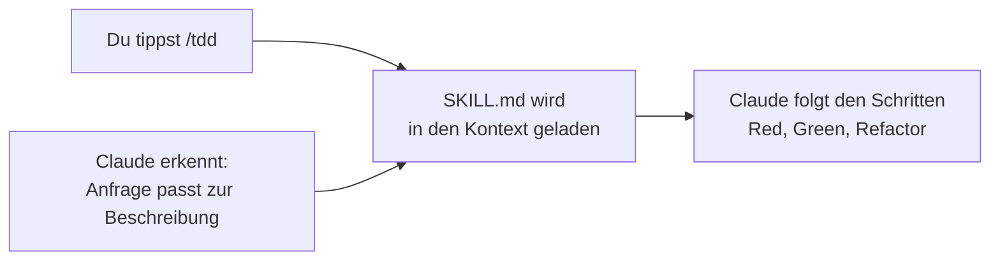

# S2.1 · Skills sind Dienstanweisungen, Commands sind Knöpfe

<!-- meta:start -->
> **Regal:** [Skills & Commands](README.md#skills) · **Stufe:** Kern · **~25 Min** · **Voraussetzungen:** [S1.10 CLAUDE.md: die Hausordnung des Projekts](s1-10-claude-md.md)
>
> ← [X.2 Mit Claude Code lernen](x-02-lernen-mit-claude-code.md) · [Bibliothek](README.md) · [S2.2 Eine SKILL.md schreiben](s2-02-skill-schreiben.md) →
<!-- meta:end -->

## Schnellcheck

- Kannst du ohne Nachschlagen sagen, was in einer SKILL.md steht und was der Slash-Befehl dazu beiträgt?
- Kannst du für eine Anweisung, die du oft tippst, begründen, ob sie in die CLAUDE.md oder in einen Skill gehört?

## Auf einen Blick

Ein Skill ist eine wiederverwendbare Anweisung in einer Datei, der `SKILL.md`. Claude Code lädt sie in den Kontext, wenn du sie aufrufst oder wenn Claude erkennt, dass sie zu deiner Anfrage passt. Der Command ist der Auslöser, den du tippst, etwa `/tdd`. Das Wissen steckt in der SKILL.md, der Befehl holt sie nur in den Kontext. Bis dahin liegt von jedem Skill nur seine Beschreibung im Kontext, nicht sein Inhalt.

## Bild im Kopf

In der Leitstelle liegt ein Ordner mit Dienstanweisungen. Jedes Blatt trägt oben eine Überschrift („Bewegung im Serverraum A") und darunter den Ablauf: Kamerabild prüfen, Schichtleitung anrufen, Streife schicken, Vorfall protokollieren. Die Überschriften kennt jede Wache auswendig, den Ablauf liest sie erst, wenn sie das Blatt aufschlägt. Aufschlagen kann es auf zwei Wegen: Du drückst den Alarmknopf, der das Blatt vorlegt, oder die Wache schlägt es selbst auf, weil die Lage zur Überschrift passt.

- **Skill = Dienstanweisung.** Das Blatt im Ordner: Überschrift (`description`) und Ablauf.
- **Command = Alarmknopf.** Deine Art, ein bestimmtes Blatt vorzulegen: `/tdd`.



## Im Detail

### Das Problem: dieselben Anweisungen immer wieder

Wenn du öfter mit Claude Code arbeitest, siehst du Muster. Du beginnst Sitzungen immer gleich, willst Commits immer im selben Format und Tests immer vor der Implementierung. Diese Anweisungen jedes Mal neu zu schreiben, kostet Zeit und ist fehleranfällig.

### Skills lösen das

Ein Skill ist eine wiederverwendbare Prompt-Vorlage: Anweisungen in einer Datei, die in Claudes Kontext geladen werden, wenn der Skill aufgerufen wird. Statt in jeder Sitzung „arbeite nach TDD, schreib zuerst den fehlschlagenden Test, dann implementiere …" zu tippen, tippst du `/tdd`, und Claude hat die Anweisung vor sich.

Ein Skill kommt auf zwei Wegen ins Spiel: Du rufst ihn mit `/name` auf, oder Claude lädt ihn selbst, wenn deine Anfrage zu seiner Beschreibung passt. Die Übung unten zeigt beide Wege und den Unterschied zwischen Beschreibung und Inhalt.

### Commands sind die Einstiegspunkte

Commands sind das, was du tippst. Ein Command kann einen Skill laden, ihm Argumente übergeben oder einen Ablauf starten. Er ist der Knopf an der Wand, nicht die Prozedur dahinter.

Vorab eine Einordnung, die [S2.3](s2-03-wer-skills-ausloest.md) genauer zeigt: Technisch sind Commands und Skills zusammengelegt. Eine Datei `.claude/commands/deploy.md` und ein Skill `.claude/skills/deploy/SKILL.md` erzeugen beide den Befehl `/deploy`. „Skill" und „Command" bezeichnen deshalb vor allem zwei Rollen, die Anweisung und den Auslöser, keine zwei Arten von Dateien.

### Skill oder CLAUDE.md?

Die CLAUDE.md ([S1.10](s1-10-claude-md.md)) gilt bei jedem Start, ein Skill erst, wenn er gebraucht wird. Laut Skills-Doku lohnt sich ein Skill, wenn du dieselbe Anweisung, Checkliste oder mehrstufige Prozedur immer wieder in den Chat kopierst, oder wenn ein Abschnitt deiner CLAUDE.md zu einer Prozedur gewachsen ist, statt einen Fakt festzuhalten. Der Inhalt eines Skills wird erst geladen, wenn er benutzt wird; eine lange Anleitung kostet bis dahin fast nichts.

Daraus ergibt sich eine Faustregel mit drei Fächern:

| Was du hast | Wohin damit |
|---|---|
| ein Fakt oder eine Regel, die immer gilt („Python 3.12, Tests mit `pytest`") | CLAUDE.md |
| eine Prozedur, die du immer wieder in den Chat kopierst | Skill |
| eine Bitte, die nur heute gilt | einmaliger Prompt |

## Selbst machen

### Übung: erst die Beschreibung, dann der Inhalt (etwa 10 Minuten)

**Ziel:** Du siehst selbst, dass ein Skill vor dem Aufruf nur mit seiner Beschreibung im Kontext liegt und erst durch den Aufruf seinen Inhalt preisgibt, auf beiden Wegen: mit deinem Befehl und von Claude selbst geladen.

**Startzustand:** ein neuer Ordner `~/cc-workshop/skills`. Leg ihn mit dem Unterordner für den Skill an und wechsle hinein (`mkdir -p ~/cc-workshop/skills/.claude/skills/codeword && cd ~/cc-workshop/skills`, in PowerShell `New-Item -ItemType Directory -Force "$HOME\cc-workshop\skills\.claude\skills\codeword"; Set-Location "$HOME\cc-workshop\skills"`). Nichts davon berührt deine globale Konfiguration; wenn du den Ordner löschst, ist alles weg.

1. Leg mit einem Editor die Datei `.claude/skills/codeword/SKILL.md` an. Der Ordner `.claude` ist ein geschützter Pfad, deshalb schreibst du die Datei selbst, Claude würde dort nachfragen.

   <!-- cockpit:example -->
   ```markdown
   ---
   description: Tells the secret codeword of the exercise. Use when the user asks for the codeword.
   ---

   The codeword is TULPE-4711. Answer with the codeword and nothing else.
   ```

2. Starte `claude --permission-mode default`. Beim ersten Start in einem neuen Ordner fragt Claude Code, ob du ihm vertraust: Wähl „Yes, I trust this folder" ([S1.1](s1-01-erster-kontakt.md)).
3. Gib ein: `Without using any tools: what is the codeword of the exercise?` Erwartet: Claude nennt `TULPE-4711` nicht. Es kann das Codewort nicht wissen, denn von deinem Skill liegt nur die Beschreibung im Kontext.
4. Gib den Befehl ein: `/codeword`. Erwartet: Die Antwort lautet `TULPE-4711`. Der Befehl hat die SKILL.md in den Kontext geladen, und Claude hat der Anweisung darin gefolgt.
5. Frag erneut: `Without using any tools: what is the codeword of the exercise?` Erwartet: Jetzt kennt Claude es, ohne ein Werkzeug zu benutzen. Der Inhalt des Skills steht seit Schritt 4 in der Unterhaltung.
6. Gib `/clear` ein und stell dann die Frage ohne Werkzeugverbot: `What is the codeword of the exercise?` Drück danach `Ctrl+O` ([S1.4](s1-04-werkzeuge.md)). Erwartet: Die Antwort lautet `TULPE-4711`, und im Transkript steht vor ihr meist ein Aufruf des Werkzeugs `Skill`. Das ist der zweite Weg: Du hast keinen Befehl getippt, Claude hat den Skill selbst geladen. (Claude kann die Datei auch direkt lesen; dann steht dort ein `Read`-Aufruf. Beides zeigt, dass die Anweisung in der Datei steckt.) Drück noch einmal `Ctrl+O`, um zurückzukehren.

**Aufräumen:** Beende die Sitzung mit `/exit` und lösch den Ordner `~/cc-workshop/skills` selbst.

**Geschafft, wenn:**

- [ ] Claude in Schritt 3 das Codewort nicht nannte
- [ ] in Schritt 4 `TULPE-4711` erschien, nachdem du `/codeword` getippt hattest
- [ ] Claude es in Schritt 5 ohne Werkzeug wusste
- [ ] du in Schritt 6 im Transkript gesehen hast, woher die Antwort kam

### Übung: Aufgaben einsortieren (etwa 5 Minuten)

**Ziel:** Du entscheidest für sechs Aufgaben, ob sie in die CLAUDE.md, in einen Skill oder in einen einmaligen Prompt gehören, und wendest dieselbe Entscheidung dann auf drei Aufgaben aus deiner eigenen Arbeit an.

**Startzustand:** Stift und Papier oder eine Notizdatei. Du brauchst weder Claude Code noch einen Ordner.

1. Ordne jeder Aufgabe ein Fach zu (CLAUDE.md, Skill oder einmaliger Prompt):
   - a) „Das Projekt nutzt Python 3.12, Tests laufen mit `pytest`."
   - b) „Vor jedem Release: Changelog prüfen, Version erhöhen, Tag setzen, Notiz ans Team schicken." Du tippst diese Schritte seit Monaten jedes Mal in den Chat.
   - c) „Benenn die Funktion `calc` in `calculate_total` um."
   - d) In deiner CLAUDE.md ist ein Abschnitt auf 40 Zeilen Deploy-Anleitung gewachsen.
   - e) „Antworte in diesem Projekt immer auf Deutsch."
   - f) „Fass mir diese eine Fehlermeldung zusammen."
2. Schreib drei wiederkehrende Aufgaben aus deiner eigenen Arbeit auf und ordne sie genauso zu. Nimm Dinge, die du tatsächlich tippst, nicht erfundene.

<details><summary>Vergleich</summary>

a) und e) gehören in die CLAUDE.md: Beides sind Fakten oder Regeln, die immer gelten. b) und d) sind Skills: eine mehrstufige Prozedur, die du immer wieder kopierst, oder ein Abschnitt, der von einem Fakt zur Prozedur gewachsen ist. c) und f) sind einmalige Prompts: Sie gelten nur heute, ein Skill dafür lohnt sich nicht. Bei deinen eigenen drei Aufgaben hilft eine Frage: Würdest du es morgen genauso wieder eintippen? Dann ist es ein Skill oder ein CLAUDE.md-Eintrag, je nachdem, ob es eine Regel oder ein Ablauf ist.

</details>

**Geschafft, wenn:**

- [ ] du alle sechs Aufgaben zugeordnet und mit dem Vergleich abgeglichen hast
- [ ] du für jede deiner drei eigenen Aufgaben ein Fach und einen Satz Begründung notiert hast

## Typische Fallen

- **Einen Skill als Garantie behandeln.** Ein Skill ist eine Anweisung, der Claude folgt, wenn er geladen ist. Muss etwas bei einem Ereignis garantiert passieren, etwa ein Block vor einem gefährlichen Befehl, ist ein Hook das richtige Werkzeug ([S2.6](s2-06-hooks-als-sensoren.md)). Faustregel: Skill für „ich gebe Anweisungen immer wieder", Hook für „passiert automatisch im Hintergrund".
- **Den Namen für die Anweisung halten.** Claude folgt dem Inhalt der SKILL.md, nicht dem Namen des Befehls. Ein gut benannter Skill mit vagen Schritten bringt wenig; wie du ihn konkret machst, zeigt [S2.2](s2-02-skill-schreiben.md).
- **Einen Skill erwarten, den es nicht gibt.** `/tdd` funktioniert nur, wenn ein TDD-Skill in deiner Sitzung verfügbar ist. Welche Skills du hast, zeigt [S2.4](s2-04-mitgelieferte-skills.md).

## Check

Du kannst erklären, was in der SKILL.md steht und was der Befehl dazu tut, und für eine wiederkehrende Aufgabe begründen, ob sie ein Skill, ein CLAUDE.md-Eintrag oder ein einmaliger Prompt ist.

1. Was steht in der SKILL.md, und was macht der Slash-Befehl?
2. Auf welchen zwei Wegen kommt ein Skill in den Kontext, und was liegt vorher schon dort?
3. Wann gehört eine Anweisung in einen Skill statt in die CLAUDE.md?

<details><summary>Auflösung</summary>

1. Die SKILL.md enthält die Anweisung, der Claude folgt: oben eine Beschreibung, darunter den Ablauf. Der Slash-Befehl lädt sie nur in den Kontext; er ist der Auslöser, nicht die Prozedur.
2. Du rufst den Skill mit `/name` auf, oder Claude lädt ihn selbst, wenn deine Anfrage zur Beschreibung passt. Vorher liegt nur die Beschreibung im Kontext, der Inhalt wird erst beim Aufruf geladen.
3. Wenn es eine Prozedur ist, die du immer wieder in den Chat kopierst, oder ein CLAUDE.md-Abschnitt, der von einem Fakt zu einer Prozedur gewachsen ist. Die CLAUDE.md gilt bei jedem Start, ein Skill erst, wenn er gebraucht wird.

</details>

<details><summary>Quizfrage</summary>

**Frage:** Du kopierst für jedes Release dieselbe Checkliste mit 30 Zeilen in den Chat. Du überlegst, sie fest zu hinterlegen, und willst, dass sie nur dann Platz im Kontext braucht, wenn du ein Release vorbereitest. Was tust du?

- **Richtig:** Du legst sie als Skill ab: Von ihm liegt nur die Beschreibung im Kontext, der Inhalt wird erst geladen, wenn du `/name` tippst oder Claude ihn für passend hält.
  - Warum: Erst beim Aufruf lädt ein Skill seinen Inhalt; bis dahin liegt nur die Beschreibung im Kontext. So kostet die lange Checkliste fast nichts, bis du ein Release vorbereitest.
- Falsch: Du schreibst sie in die CLAUDE.md, denn dort liest Claude sie nur beim ersten Prompt der Sitzung und lädt sie danach nicht mehr.
  - Warum: Die CLAUDE.md gilt bei jedem Start und liegt in jeder Sitzung im Kontext; nach einer Verdichtung lädt Claude Code sie neu (S1.8). Sie kostet also dauerhaft Platz, nicht nur beim Release.
- Falsch: Du trägst sie in `.claude/settings.json` ein, denn diese Datei nimmt Checklisten als Regel auf und zeigt sie Claude bei jedem Prompt.
  - Warum: In der `settings.json` stehen Rechte-Regeln, die Werkzeuge und Befehle freigeben oder sperren (S1.5). Eine Checkliste, die du immer wieder in den Chat kopierst, ist eine Prozedur und gehört in einen Skill.
- Falsch: Du legst sie als `release.md` ins Projekt, denn Claude liest jede Markdown-Datei im Ordner von selbst, sobald sie zur Aufgabe passt.
  - Warum: Eine lose Markdown-Datei hat keine Beschreibung im Kontext, an der Claude erkennt, dass sie zum Release passt. Dieses Auswählen leistet erst ein Skill: Seine Beschreibung liegt vorab im Kontext.

</details>

## Weiterlesen

- [Skills-Doku](https://code.claude.com/docs/en/skills)
- [S1.10 · CLAUDE.md: die Hausordnung des Projekts](s1-10-claude-md.md)
- [S2.2 · Eine SKILL.md schreiben](s2-02-skill-schreiben.md)
- [S2.3 · Skills oder Commands, und wer sie auslösen darf](s2-03-wer-skills-ausloest.md)
- [S2.4 · Mitgelieferte Skills](s2-04-mitgelieferte-skills.md)
- [S2.6 · Hooks als Sensoren: die drei Eckpfeiler](s2-06-hooks-als-sensoren.md)
