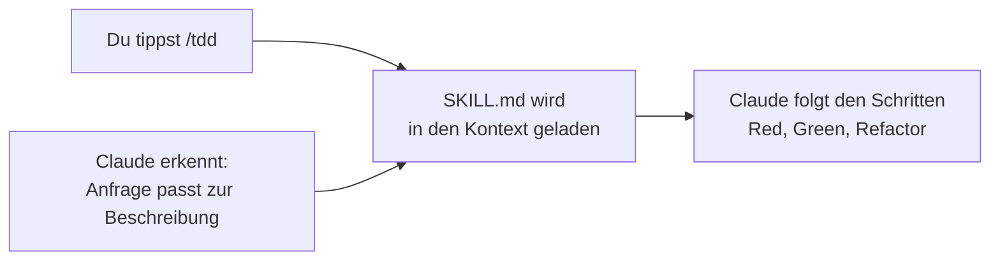

# S2.1 · Skills sind Dienstanweisungen, Commands sind Knöpfe

<!-- meta:start -->
> **Regal:** [Skills & Commands](README.md#skills) · **Stufe:** Kern · **~12 Min** · **Voraussetzungen:** [S1.10 CLAUDE.md: die Hausordnung des Projekts](s1-10-claude-md.md)
>
> ← [S1.20 Praxis-Station Session 1: eine Übung wählen](s1-20-praxis-station-1.md) · [Bibliothek](README.md) · [S2.2 Eine SKILL.md schreiben](s2-02-skill-schreiben.md) →
<!-- meta:end -->

## Schnellcheck

- Kannst du ohne Nachschlagen erklären, was in einer SKILL.md steht und welche Rolle der Slash-Befehl dazu spielt?
- Hast du schon einmal eine wiederkehrende Anweisung, etwa dein Commit-Format oder einen TDD-Ablauf, als Datei gepflegt, statt sie jedes Mal neu einzutippen?

## Auf einen Blick

Ein Skill ist eine wiederverwendbare Anweisung in einer Datei, der `SKILL.md`. Claude Code lädt sie in den Kontext, wenn du sie aufrufst oder wenn Claude erkennt, dass sie zu deiner Anfrage passt. Der Command ist der Auslöser, den du tippst, etwa `/tdd`. Das Wissen steckt in der SKILL.md, der Befehl ist nur der Knopf.

## Bild im Kopf

In einer Sicherheitszentrale liegen Dienstanweisungen aus, auf Englisch SOPs (Standard Operating Procedures): laminierte Blätter, die genau festlegen, was die Wache bei einem bestimmten Alarm tut. Die Anweisung für „Bewegung im Serverraum A" lautet etwa: Kamerabild prüfen, Schichtleitung anrufen, Streife schicken, Vorfall protokollieren. Der Alarmknopf selbst weiß davon nichts. Er löst nur aus; das Wissen steckt in der Dienstanweisung.

- **Skill = Dienstanweisung.** Ausführliche, wiederverwendbare Anweisungen: das „Was ist zu tun".
- **Command = Alarmknopf.** Was die Bedienung drückt: das „Wie löse ich es aus".

`/tdd` ist der Knopf. Die SKILL.md für TDD ist die Dienstanweisung, die Claude liest und befolgt.



## Im Detail

### Das Problem: dieselben Anweisungen immer wieder

Wenn du öfter mit Claude Code arbeitest, siehst du Muster. Du beginnst Sitzungen immer gleich, willst Commits immer im selben Format und Tests immer vor der Implementierung. Diese Anweisungen jedes Mal neu zu schreiben, kostet Zeit und ist fehleranfällig.

### Skills lösen das

Ein Skill ist eine wiederverwendbare Prompt-Vorlage: Anweisungen in einer Datei, die in Claudes Kontext geladen werden, wenn der Skill aufgerufen wird. Statt in jeder Sitzung „arbeite nach TDD, schreib zuerst den fehlschlagenden Test, dann implementiere …" zu tippen, tippst du `/tdd`, und Claude weiß, was zu tun ist.

Ein Skill kommt auf zwei Wegen ins Spiel: Du rufst ihn mit `/name` auf, oder Claude lädt ihn selbst, wenn deine Anfrage zu seiner Beschreibung passt.

### Commands sind die Einstiegspunkte

Commands sind das, was du tippst. Ein Command kann einen Skill laden, ihm Argumente übergeben oder einen Ablauf starten. Er ist der Knopf an der Wand, nicht die Prozedur dahinter.

Vorab eine Einordnung, die [S2.3](s2-03-wer-skills-ausloest.md) genauer zeigt: Technisch sind Commands und Skills inzwischen zusammengelegt. Eine Datei `.claude/commands/deploy.md` und ein Skill `.claude/skills/deploy/SKILL.md` erzeugen beide den Befehl `/deploy`. „Skill" und „Command" bezeichnen deshalb vor allem zwei Rollen, die Anweisung und den Auslöser, keine zwei Arten von Dateien.

### Skill oder CLAUDE.md?

Die CLAUDE.md ([S1.10](s1-10-claude-md.md)) gilt bei jedem Start, ein Skill erst, wenn er gebraucht wird. Laut Skills-Doku lohnt sich ein Skill, wenn du dieselbe Anweisung, Checkliste oder mehrstufige Prozedur immer wieder in den Chat kopierst, oder wenn ein Abschnitt deiner CLAUDE.md zu einer Prozedur gewachsen ist, statt einen Fakt festzuhalten. Der Inhalt eines Skills wird erst geladen, wenn er benutzt wird; eine lange Anleitung kostet bis dahin fast nichts.

### Ausprobieren

Tipp in Claude Code:

<!-- cockpit:example -->
```
/tdd
# oder alle verfügbaren Skills auflisten:
/skills
```

`/tdd` gibt es nur, wenn ein TDD-Skill installiert ist. `/skills` zeigt dir, welche Skills in deiner Sitzung verfügbar sind.

## Typische Fallen

- **Einen Skill als Garantie behandeln.** Ein Skill ist eine Anweisung, der Claude folgt, wenn er geladen ist. Muss etwas bei einem Ereignis garantiert passieren, etwa ein Block vor einem gefährlichen Befehl, ist ein Hook das richtige Werkzeug ([S2.6](s2-06-hooks-als-sensoren.md)). Faustregel: Skill für „ich gebe Anweisungen immer wieder", Hook für „passiert automatisch im Hintergrund".
- **Den Namen für die Anweisung halten.** Claude folgt dem Inhalt der SKILL.md, nicht dem Namen des Befehls. Ein gut benannter Skill mit vagen Schritten bringt wenig; wie du ihn konkret machst, zeigt [S2.2](s2-02-skill-schreiben.md).

## Check

Du kannst erklären, warum du `/tdd` tippst, statt jedes Mal die TDD-Regeln neu zu schreiben, und den Unterschied zwischen dem Command (Auslöser) und der SKILL.md (hinterlegte Anweisung) benennen.

1. Was steht in der SKILL.md, und was macht der Slash-Befehl?
2. Auf welchen zwei Wegen kommt ein Skill in den Kontext?
3. Wann gehört eine Anweisung in einen Skill statt in die CLAUDE.md?

<details><summary>Quizfrage</summary>

**Frage:** Welcher Teil legt fest, was Claude tut, und welcher löst es nur aus?

- **Richtig:** Die SKILL.md enthält die Anweisungen, denen Claude folgt; der Command wie `/tdd` lädt sie nur in den Kontext.
- Falsch: Der Command-Name trägt die Anweisungen; die SKILL.md ist nur ein Eintrag, damit `/skills` den Befehl findet.
- Falsch: Beide steuern gleich viel: Der Command legt fest, was Claude tut, die SKILL.md nur, wann er gestartet wird.
- Falsch: Ein PreToolUse-Hook lädt bei jedem Prompt die passende SKILL.md; der Command ist nur eine Abkürzung daran vorbei.

</details>

## Weiterlesen

- [Skills-Doku](https://code.claude.com/docs/en/skills)
- [S1.10 · CLAUDE.md: die Hausordnung des Projekts](s1-10-claude-md.md)
- [S2.2 · Eine SKILL.md schreiben](s2-02-skill-schreiben.md)
- [S2.3 · Skills oder Commands, und wer sie auslösen darf](s2-03-wer-skills-ausloest.md)
- [S2.4 · Mitgelieferte Skills](s2-04-mitgelieferte-skills.md)
- [S2.6 · Hooks als Sensoren: die drei Eckpfeiler](s2-06-hooks-als-sensoren.md)
