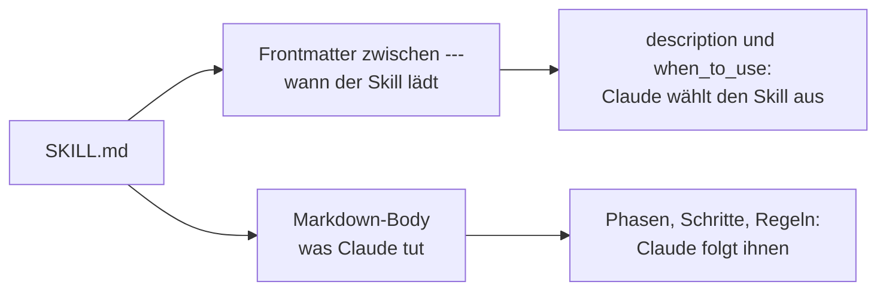

# S2.2 · Eine SKILL.md schreiben

<!-- meta:start -->
> **Regal:** [Skills & Commands](README.md#skills) · **Stufe:** Kern · **~25 Min** · **Voraussetzungen:** [S2.1 Skills sind Dienstanweisungen, Commands sind Knöpfe](s2-01-skills-und-commands.md)
>
> ← [S2.1 Skills sind Dienstanweisungen, Commands sind Knöpfe](s2-01-skills-und-commands.md) · [Bibliothek](README.md) · [S2.3 Skills oder Commands, und wer sie auslösen darf](s2-03-wer-skills-ausloest.md) →
<!-- meta:end -->

## Schnellcheck

- Kannst du ohne Nachschlagen sagen, welches Feld einer SKILL.md Claude zur Entscheidung nutzt, ob er den Skill von selbst lädt?
- Kannst du sagen, wo ein Skill liegt, der nur in einem Projekt gilt, und wo einer, der in all deinen Projekten gilt?

## Auf einen Blick

Eine SKILL.md hat zwei Teile: oben das YAML-Frontmatter zwischen zwei `---`-Zeilen, das steuert, wann der Skill lädt, darunter den Markdown-Body mit den Anweisungen, denen Claude folgt. Das wichtigste Feld ist `description`: Claude entscheidet damit, wann der Skill passt. Ein Projekt-Skill liegt in `.claude/skills/<name>/SKILL.md` und kommt über Git zu deinem Team, ein persönlicher in `~/.claude/skills/<name>/SKILL.md` und gilt in all deinen Projekten.

## Bild im Kopf

Eine Dienstanweisung hat einen Kopf und einen Ablauf. Der Kopf sagt, wofür sie gilt und wann sie gezogen wird: „Alarm Zone A, Bewegungsmelder, nur außerhalb der Geschäftszeiten". Der Ablauf sagt, was die Wache Schritt für Schritt tut. Das Frontmatter ist der Kopf, der Body ist der Ablauf. Ist der Kopf unklar, greift niemand zur richtigen Anweisung, egal wie gut der Ablauf geschrieben ist.



## Im Detail

### Wo Skills liegen

Ein Skill ist ein Ordner mit einer Datei `SKILL.md`. Drei Orte sind für dich wichtig:

- `.claude/skills/<name>/SKILL.md`: im Projekt. Checkst du den Ordner ein, bekommt dein Team den Skill mit. Die Übung unten arbeitet hier, in einem Wegwerf-Projekt.
- `~/.claude/skills/<name>/SKILL.md`: persönlich, in **jedem Projekt** auf deinem Rechner verfügbar. Das ist dein eigener Werkzeugkasten für tägliche Abläufe.
- `skills/<name>/SKILL.md` in einem Plugin: teilbar und versionierbar über einen Marketplace. Plugin-Skills rufst du als `/plugin-name:skill-name` auf ([S2.11](s2-11-plugins-buendeln.md)).

Faustregel: Team-Konventionen als Projekt-Skill, eigene tägliche Abläufe als persönlicher Skill, „das könnten andere auch brauchen" als Plugin. Heißt derselbe Skill persönlich und im Projekt, gewinnt laut Doku der persönliche; eine Organisation kann außerdem Skills ausliefern, und die haben noch Vorrang.

Ein persönlicher Werkzeugkasten sieht etwa so aus:

```
~/.claude/skills/
  my-workflow/
    SKILL.md          # your custom instructions
  code-review/
    SKILL.md
  agent-orchestrator/
    SKILL.md
```

So legst du einen persönlichen Skill an:

```bash
mkdir -p ~/.claude/skills/my-workflow
# create SKILL.md with frontmatter + instructions
```

Danach kannst du ihn in jeder Claude-Code-Sitzung mit `/my-workflow` aufrufen. Oder du beschreibst einfach, was du willst: Claude vergleicht deine Anfrage mit der Beschreibung des Skills. Der Befehl heißt wie der Ordner oder, wenn du es setzt, wie das Feld `name`.

### Teil 1: das Frontmatter

Das Frontmatter ist der YAML-Kopf ganz oben in der Datei, zwischen zwei `---`-Zeilen, und die erste Zeile der Datei muss die öffnende `---` sein. Drei Felder reichen für den Anfang:

```yaml
---
name: tdd
description: >
  Test-Driven Development workflow. Use when the user wants to write tests first,
  implement after, or says "write tests before code".
when_to_use: >
  TDD, test first, write tests, red-green-refactor, failing test,
  or any request where implementation should wait for a failing test.
---
```

- `name`: der Name des Skills und damit der Befehl, den du tippst. Ohne `name` gilt der Ordnername.
- `description`: was der Skill tut und wann er passt. **Claude entscheidet anhand dieses Felds, wann der Skill geladen wird.** Stell den wichtigsten Einsatzfall an den Anfang: `description` und `when_to_use` zusammen werden in der Skill-Liste nach 1.536 Zeichen abgeschnitten.
- `when_to_use`: zusätzliche Hinweise, wann der Skill passt, etwa Trigger-Phrasen oder Beispielanfragen. Claude Code hängt sie in der Skill-Liste an die `description` an. Eine lange Trigger-Liste gehört hierher und nicht in eine überladene `description`.

Alle Felder sind optional, empfohlen ist nur `description`. Schreib die Feldnamen genau so wie in der Referenz, mit Bindestrichen; einzige Ausnahme ist `when_to_use`. Ein Feld, das Claude Code nicht kennt, ignoriert es still, ohne Fehlermeldung.

Weitere Felder lernst du dort, wo sie gebraucht werden: `disable-model-invocation`, `user-invocable` und `allowed-tools` in [S2.3](s2-03-wer-skills-ausloest.md), `argument-hint`, `arguments` und `shell` in [S2.5](s2-05-lebendige-prompts.md), `hooks` in [S2.9](s2-09-hook-typen.md), `context` und `agent` in [S3.2](s3-02-eingebaute-subagenten.md). Dazu kommen `model` und `effort` ([S1.7](s1-07-modellwahl-und-effort.md)) und `paths`: ein Glob-Muster, bei dem der Skill nur automatisch lädt, wenn Claude mit passenden Dateien arbeitet.

### Teil 2: der Body

Unter dem Frontmatter stehen die eigentlichen Anweisungen, denen Claude folgt, als normales Markdown:

```markdown
# TDD Workflow

You are following strict Test-Driven Development. Follow these steps exactly:

## Phase 1: Red (Write the Failing Test)
1. Ask the user what behavior needs to be implemented
2. Write the test FIRST — before any implementation code
3. Run the test and confirm it FAILS
4. Show the user the red output

## Phase 2: Green (Make It Pass)
1. Write the MINIMUM code needed to pass the test
2. No gold-plating, no extras — just enough to go green
3. Run the tests and confirm they PASS

## Phase 3: Refactor
1. Now clean up the code — remove duplication, improve naming
2. Tests must stay green throughout
3. Commit with a meaningful message

## Rules
- Never write implementation before a test exists
- Never write more code than necessary to pass the current tests
- If the user skips a phase, remind them of the process
```

Phasen mit nummerierten Schritten und eine Liste harter Regeln: So sieht eine brauchbare Dienstanweisung aus. Halte den Body knapp. Einmal geladen, bleibt sein Inhalt über die folgenden Runden im Kontext, jede Zeile kostet also immer wieder Tokens.

### Änderungen wirken sofort

Eine bestehende SKILL.md bearbeitest du bei laufender Sitzung: Claude Code beobachtet die Skill-Ordner und übernimmt die Änderung, ohne Neustart. Das gilt für Ordner, die schon beim Start existierten. Legst du `.claude/skills/` erst während der Sitzung an, führ `/reload-skills` aus. Mehr dazu in [S2.5](s2-05-lebendige-prompts.md#änderungen-wirken-sofort).

## Selbst machen

### Übung: einen Skill bauen und nachschärfen (etwa 15 Minuten)

**Ziel:** Du schreibst einen Skill mit Frontmatter und Body, rufst ihn mit `/commit-check` auf, schärfst ihn nach, bis seine Ausgabe etwas enthält, das der erste Entwurf nicht hatte, und prüfst, ob Claude ihn auch ohne Befehl lädt.

**Startzustand:** Git und Python ([S0.1](s0-01-werkstatt-einrichten.md)). Alles passiert im Wegwerf-Ordner `~/cc-workshop/skill-schreiben`; deine globale Konfiguration bleibt unberührt.

1. Leg den Ordner an, wechsle hinein und initialisiere Git:

   ```bash
   mkdir -p ~/cc-workshop/skill-schreiben/.claude/skills/commit-check
   cd ~/cc-workshop/skill-schreiben
   git init
   ```

   In PowerShell:

   ```powershell
   New-Item -ItemType Directory -Force "$HOME\cc-workshop\skill-schreiben\.claude\skills\commit-check"
   Set-Location "$HOME\cc-workshop\skill-schreiben"
   git init
   ```

2. Leg mit einem Editor `app.py` an und nimm sie mit `git add app.py` in den Index auf (ohne Commit):

   ```python
   def total(prices):
       print("debug", prices)
       # TODO fix rounding later
       return round(sum(prices), 2)
   ```

3. Leg `.claude/skills/commit-check/SKILL.md` an. Den Ordner `.claude` schreibst du selbst; Claude würde dort nachfragen, weil er ein geschützter Pfad ist.

   <!-- cockpit:example -->
   ```markdown
   ---
   name: commit-check
   description: Checks the staged changes before a commit. Use before committing or when the user asks for a pre-commit check.
   when_to_use: pre-commit check, check my staged changes, am I ready to commit
   ---

   # Commit check

   1. Run `git diff --staged` and read the changes.
   2. Report findings under these headings:
      - Debug output: any leftover `print(` or `console.log(`
      - Open TODOs: any `TODO` comment without a ticket number like `TODO-123`
   3. Start your answer with the line `PRE-COMMIT CHECK:`.

   ## Rules
   - Do not change any file.
   - Name file and line for every finding.
   ```

4. Starte `claude --permission-mode default` im Ordner und bestätige den Vertrauensdialog mit „Yes, I trust this folder" ([S1.1](s1-01-erster-kontakt.md)). Gib `/skills` ein. Erwartet: `commit-check` steht in der Liste. Schließ die Ansicht mit `Esc` und drück weder Leertaste noch Enter: Beide Tasten ändern dort die Sichtbarkeit eines Skills.
5. Gib `/commit-check` ein. Erwartet: Die Antwort beginnt mit `PRE-COMMIT CHECK:` und nennt zwei Funde in `app.py`, die Zeile mit `print("debug", prices)` und das `TODO` ohne Ticketnummer. Claude liest den Diff mit einem Lesebefehl; eine Rückfrage kommt nicht.
6. Schärf nach: Der erste Entwurf verlangt kein Urteil. Öffne die SKILL.md im Editor, ergänz diese Zeile als vierten Schritt und speichere:

   ```markdown
   4. End with a last line `VERDICT: BLOCK` if you found anything, otherwise `VERDICT: OK`.
   ```

   Bleib in derselben Sitzung, warte nach dem Speichern ein paar Sekunden (Claude Code braucht einen Moment, bis es die geänderte Datei bemerkt) und gib `/commit-check` noch einmal ein. Erwartet: Die Antwort endet jetzt mit `VERDICT: BLOCK`, ohne Neustart. Diese Zeile konnte der erste Entwurf nicht liefern.
7. Gib ohne Befehl ein: `Check my staged changes before I commit.` Drück danach `Ctrl+O`. Erwartet: Claude lädt den Skill selbst, im Transkript steht ein Aufruf des Werkzeugs `Skill`, und die Antwort beginnt mit `PRE-COMMIT CHECK:`. Lädt Claude ihn nicht, schreib den Satz, den du getippt hast, in `when_to_use` und versuch es erneut. Die automatische Wahl hängt an Claudes Urteil über die Beschreibung, nicht an einer festen Regel.

**Aufräumen:** Beende die Sitzung mit `/exit` und lösch den Ordner `~/cc-workshop/skill-schreiben` selbst.

**Geschafft, wenn:**

- [ ] `/skills` den Skill `commit-check` zeigte
- [ ] die Antwort auf `/commit-check` mit `PRE-COMMIT CHECK:` begann und beide Funde nannte
- [ ] die Antwort nach deiner Änderung ohne Neustart mit `VERDICT: BLOCK` endete
- [ ] Claude den Skill ohne Befehl geladen hat, oder du `when_to_use` so geschärft hast, dass er es tat

### Extra: der Panel-Migrations-Diff (etwa 25 Minuten)

**Ziel:** Einen Skill schreiben, der eine wiederkehrende, fehleranfällige Umwandlung von Konfigurationen festhält: eine echte Dienstanweisung, keine bloße Checkliste. Das Beispiel stammt aus der Zutrittstechnik. Nimm es, wie es ist, oder ersetz Format und Regeln durch etwas aus deiner eigenen Arbeit.

**Startzustand:** ein Ordner `~/cc-workshop/panel` mit drei Dateien (Git brauchst du hier nicht). `panel_new.json` zeigt das Zielformat, `panel_old.json` ist die erste Eingabe, `panel_old_2.json` eine zweite, leicht andere:

```json
{"doors": [{"id": "DOOR-01", "profile_seconds": 900}, {"id": "DOOR-02", "profile_seconds": 5400}]}
```

```json
{"doors": [{"id": "D7", "profile_minutes": 0.5}, {"id": "D12"}]}
```

```json
{"doors": [{"id": "D3", "profile_minutes": 2}, {"id": "D40"}]}
```

1. Starte Claude Code im Ordner und frag zuerst von Hand: `Convert panel_old.json to the format of panel_new.json.` Notier, welche Regel Claude falsch oder gar nicht umsetzt: das Auffüllen von `D7` zu `DOOR-07`, Minuten in Sekunden, die Tür ohne Profil.
2. Mach die Regeln ausdrücklich und speichere sie als `.claude/skills/panel-migrate/SKILL.md`: ID `D<Zahl>` wird `DOOR-<zweistellig>`, `profile_minutes` mal 60 wird `profile_seconds`, eine Tür ohne Profil wird gemeldet statt still umgewandelt. Leg den Ordner an, bevor du die nächste Sitzung startest.
3. Starte neu und ruf `/panel-migrate panel_old_2.json` auf. Der Text hinter dem Befehl ist das Argument; Claude sieht ihn am Ende des Skills ([S2.5](s2-05-lebendige-prompts.md)). Erwartet: `DOOR-03` mit `120` Sekunden und eine Meldung zu `D40`.

<details><summary>Vergleich</summary>

Ohne ausdrückliche Regeln rät Claude: Typische Fehler sind `DOOR-7` statt `DOOR-07` und eine stillschweigend ausgelassene oder mit `0` gefüllte Tür ohne Profil. Mit dem Skill sind die Regeln festgehalten; ob Claude sie bei einer neuen Eingabe einhält, siehst du an `DOOR-03` und an der Meldung zu `D40`.

</details>

**Geschafft, wenn:**

- [ ] der Skill `panel_old_2.json` mit `DOOR-03` und `120` Sekunden umgewandelt hat
- [ ] `D40` gemeldet statt still umgewandelt wurde

## Typische Fallen

- **Der Skill wird nicht geladen.** Prüf der Reihe nach: Steht er in `/skills`? Hat er `disable-model-invocation: true` (dann nur per `/name`, [S2.3](s2-03-wer-skills-ausloest.md))? Ist die `description` zu allgemein? Dann ergänz Trigger-Phrasen in `when_to_use`. Systematische Fehlersuche: [S4.9](s4-09-fehlersuche-werkzeuge.md).
- **Ein Feld wirkt nicht.** Claude Code ignoriert unbekannte Feldnamen ohne Meldung. `user_invocable` mit Unterstrich ist nicht `user-invocable`.
- **Neuer Skill-Ordner, aber kein Skill.** Hast du `.claude/skills/` erst während der laufenden Sitzung angelegt, beobachtet Claude Code diesen Ordner noch nicht. Führ `/reload-skills` aus oder starte neu.
- **Die Beschreibung ist zu lang.** In der Skill-Liste werden `description` und `when_to_use` zusammen nach 1.536 Zeichen abgeschnitten. Das Wichtigste gehört an den Anfang.
- **Die erste Zeile ist nicht `---`.** Dann liest Claude Code die ganze Datei als Skill-Inhalt, und das Frontmatter greift nicht.

## Check

Du kannst eine SKILL.md mit gültigem Frontmatter und klarem Body in einem Projekt anlegen, sie nachschärfen und erklären, wofür `description` und `when_to_use` jeweils da sind.

1. Welche zwei Teile hat eine SKILL.md, und was steuert jeder davon?
2. Wo liegt ein persönlicher Skill, wo ein Projekt-Skill?
3. Warum gehört der wichtigste Einsatzfall an den Anfang der `description`?

<details><summary>Auflösung</summary>

1. Das Frontmatter zwischen den `---`-Zeilen steuert, wann der Skill lädt; der Markdown-Body enthält die Anweisungen, denen Claude folgt.
2. Ein persönlicher Skill liegt in `~/.claude/skills/<name>/SKILL.md` und gilt in allen Projekten, ein Projekt-Skill in `.claude/skills/<name>/SKILL.md` und kommt über Git zum Team.
3. `description` und `when_to_use` werden in der Skill-Liste zusammen nach 1.536 Zeichen abgeschnitten, und Claude entscheidet anhand dieses Texts, ob der Skill passt. Was hinten steht, kann wegfallen.

</details>

<details><summary>Quizfrage</summary>

**Frage:** `/commit-check` funktioniert, aber Claude lädt den Skill bei „Check my staged changes" nie von selbst. Wo suchst du zuerst?

- **Richtig:** In `description` und `when_to_use`: Claude vergleicht deine Anfrage mit diesem Text, `/name` funktioniert davon unabhängig.
  - Warum: Claude entscheidet anhand der `description` (ergänzt durch `when_to_use`), wann er einen Skill lädt. `/name` braucht diesen Text nicht. Fehlt dein Satz dort, schreib ihn in `when_to_use`.
- Falsch: Im Body: Claude liest ihn schon vor dem Aufruf in jeder Sitzung und entscheidet anhand der ersten Zeile, ob der Skill zur Anfrage passt.
  - Warum: Vor dem Aufruf liegt nur die Beschreibung im Kontext (S2.1), nicht der Body. Der Body ist der Ablauf, dem Claude nach dem Laden folgt; ob der Skill passt, entscheidet die `description`.
- Falsch: Im Feld `name`: Claude lädt nur Skills, deren Name wörtlich in deiner Anfrage vorkommt, und `commit-check` fehlt in ihr.
  - Warum: Der Name ist der Befehl, den du tippst. Ausgewählt wird nach der Beschreibung: Claude vergleicht deine Anfrage mit ihr, der Skillname muss in der Anfrage gar nicht vorkommen.
- Falsch: In `.claude/settings.json`: Dort muss jeder Skill zuerst freigeschaltet werden, bevor Claude ihn selbst laden darf.
  - Warum: Ob Claude einen Skill selbst laden darf, regelt `disable-model-invocation` im Frontmatter (S2.3). Ohne den Schalter darf er es, eine Freischaltung braucht es nicht; hier hängt es an der `description`.

</details>

## Weiterlesen

- [Skills-Doku](https://code.claude.com/docs/en/skills)
- [S2.1 · Skills sind Dienstanweisungen, Commands sind Knöpfe](s2-01-skills-und-commands.md)
- [S2.3 · Skills oder Commands, und wer sie auslösen darf](s2-03-wer-skills-ausloest.md)
- [S2.5 · Lebendige Prompts: Argumente und dynamischer Inhalt](s2-05-lebendige-prompts.md)
- [S2.9 · Hook-Typen und Hooks in Komponenten](s2-09-hook-typen.md)
- [S2.11 · Plugins: ein Bündel schnüren](s2-11-plugins-buendeln.md)
- [S4.9 · Fehlersuche: /debug, --verbose, /doctor](s4-09-fehlersuche-werkzeuge.md)
