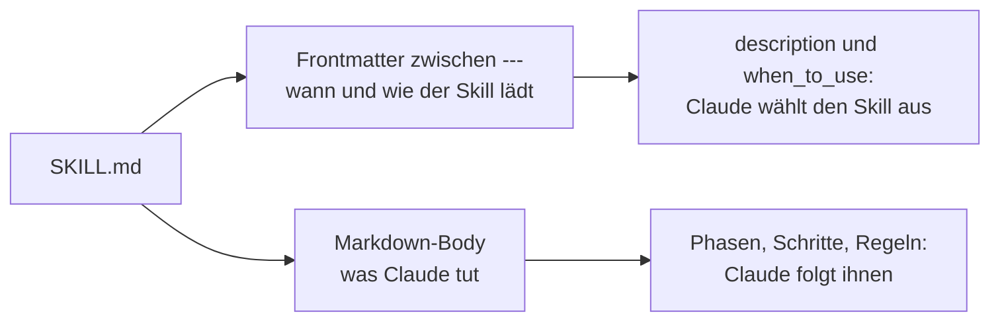

# S2.2 · Eine SKILL.md schreiben

<!-- meta:start -->
> **Regal:** [Skills & Commands](README.md#skills) · **Stufe:** Kern · **~18 Min** · **Voraussetzungen:** [S2.1 Skills sind Dienstanweisungen, Commands sind Knöpfe](s2-01-skills-und-commands.md)
>
> ← [S2.1 Skills sind Dienstanweisungen, Commands sind Knöpfe](s2-01-skills-und-commands.md) · [Bibliothek](README.md) · [S2.3 Skills oder Commands, und wer sie auslösen darf](s2-03-wer-skills-ausloest.md) →
<!-- meta:end -->

## Schnellcheck

- Kannst du ohne Nachschlagen eine SKILL.md schreiben, die Claude allein anhand ihrer `description` zum richtigen Zeitpunkt lädt?
- Hast du schon einmal einen Skill angelegt, der in all deinen Projekten verfügbar ist, und einen, den dein Team über Git bekommt?

## Auf einen Blick

Eine SKILL.md hat zwei Teile: oben das YAML-Frontmatter zwischen zwei `---`-Zeilen, das steuert, wann und wie der Skill lädt, darunter den Markdown-Body mit den Anweisungen, denen Claude folgt. Das wichtigste Feld ist `description`: Claude entscheidet damit, wann der Skill passt. Ein persönlicher Skill liegt in `~/.claude/skills/<name>/SKILL.md` und gilt in all deinen Projekten, ein Projekt-Skill in `.claude/skills/<name>/SKILL.md` und kommt über Git zu deinem Team.

## Bild im Kopf

Eine Dienstanweisung hat einen Kopf und einen Ablauf. Der Kopf sagt, wofür sie gilt und wann sie gezogen wird: „Alarm Zone A, Bewegungsmelder, nur außerhalb der Geschäftszeiten". Der Ablauf sagt, was die Wache Schritt für Schritt tut. Das Frontmatter ist der Kopf, der Body ist der Ablauf. Ist der Kopf unklar, greift niemand zur richtigen Anweisung, egal wie gut der Ablauf geschrieben ist.



## Im Detail

### Wo Skills liegen

Ein Skill ist ein Ordner mit einer Datei `SKILL.md`. Drei Orte sind für dich wichtig:

- `~/.claude/skills/<name>/SKILL.md`: persönlich, in **jedem Projekt** auf deinem Rechner verfügbar, nicht nur in einem Repo. Das ist dein eigener Werkzeugkasten.
- `.claude/skills/<name>/SKILL.md`: im Projekt. Checkst du den Ordner ein, bekommt dein Team den Skill mit.
- `skills/<name>/SKILL.md` in einem Plugin: teilbar und versionierbar über einen Marketplace. Plugin-Skills rufst du als `/plugin-name:skill-name` auf ([S2.11](s2-11-plugins-buendeln.md)).

Faustregel: Team-Konventionen als Projekt-Skill, eigene tägliche Abläufe als persönlicher Skill, „das könnten andere auch brauchen" als Plugin.

Ein persönlicher Werkzeugkasten sieht etwa so aus:

```
~/.claude/skills/
  my-workflow/
    SKILL.md          # your custom instructions
  code-review/
    SKILL.md
  agent-orchestrator/
    SKILL.md
```

So legst du einen persönlichen Skill an:

```bash
mkdir -p ~/.claude/skills/my-workflow
# create SKILL.md with frontmatter + instructions
```

Danach kannst du ihn in jeder Claude-Code-Sitzung mit `/my-workflow` aufrufen. Oder du beschreibst einfach, was du willst: Claude vergleicht deine Anfrage mit der Beschreibung des Skills. Der Befehl heißt wie der Ordner oder, wenn du es setzt, wie das Feld `name`.

### Teil 1: das Frontmatter

Das Frontmatter ist der YAML-Kopf ganz oben in der Datei, zwischen zwei `---`-Zeilen:

```yaml
---
name: tdd
description: >
  Test-Driven Development workflow. Use when user wants to write tests first,
  implement after, or says "write tests before code", "TDD", "red-green-refactor".
when_to_use: >
  TDD, test first, write tests, red-green-refactor, failing test,
  or any request where implementation should wait for a failing test.
argument-hint: "[target]"
arguments: [target]
model: sonnet
effort: high
paths: ["src/**", "tests/**"]
---
```

Die Grundfelder:

- `name`: der Name des Skills und damit der Befehl, den du tippst. Ohne `name` gilt der Ordnername.
- `description`: was der Skill tut und wann er passt. **Claude entscheidet anhand dieses Felds, wann der Skill geladen wird.** Stell den wichtigsten Einsatzfall an den Anfang.
- `when_to_use`: zusätzliche Hinweise, wann der Skill passt, etwa Trigger-Phrasen oder Beispielanfragen. Lange Trigger-Listen gehören besser hierher als in eine überladene `description`. In der Skill-Liste hängt Claude Code `when_to_use` an die `description` an.
- `argument-hint` und `arguments`: der Hinweis, den du beim Tippen siehst, und die benannten Argumente ([S2.5](s2-05-lebendige-prompts.md)).
- `model`, `effort`, `paths`: Steuerung von Ausführung und Geltungsbereich (Tabelle unten).

Alle Felder sind optional, empfohlen ist nur `description`. Schreib die Feldnamen genau so wie in der Referenz, mit Bindestrichen; einzige Ausnahme ist `when_to_use`. Ein Feld, das Claude Code nicht kennt, ignoriert es still, ohne Fehlermeldung.

Über `name` und `description` hinaus gibt es weitere Felder, die tatsächlich beeinflussen, wie Claude Code den Skill lädt, eingrenzt und ausführt:

```yaml
---
name: tdd
description: Test-Driven Development workflow. Use when writing tests before code.
when_to_use: >
  Triggers on TDD, test-first, red-green-refactor, "write tests before code"
argument-hint: "[guide|learn] [module]"
arguments: [mode, module]
model: sonnet
effort: high
paths: ["src/**/*.ts", "tests/**/*.ts"]
shell: powershell
hooks:
  PreToolUse:
    - matcher: "Bash"
      hooks:
        - type: command
          command: "./pre-test-check.sh"
---
```

| Feld | Was es tut |
|------|------------|
| `argument-hint` | Hinweis, der beim Tippen des Befehls erscheint, z. B. `/tdd [target]` |
| `arguments` | Liste benannter Argumente nach Position; im Body als `$mode`, `$module` … ([S2.5](s2-05-lebendige-prompts.md)) |
| `when_to_use` | zusätzliche Aktivierungshinweise, die Claude zusammen mit der `description` liest |
| `model` | welches Modell den Skill ausführt, z. B. `haiku`, `sonnet`, `opus`. Ohne `context: fork` gilt es für den Rest des aktuellen Turns, mit `context: fork` für den abgezweigten Subagenten. Für einfache Skills spart `haiku` Kosten ([S1.7](s1-07-modellwahl-und-effort.md)) |
| `effort` | `low` / `medium` / `high` / `xhigh` / `max`: Effort, solange der Skill aktiv ist; überschreibt den Wert der Sitzung. Welche Stufen es gibt, hängt vom Modell ab |
| `paths` | Glob-Muster. Der Skill lädt nur dann automatisch, wenn Claude mit passenden Dateien arbeitet |
| `shell` | `bash` (Standard) oder `powershell`: welche Shell die eingebetteten Befehle eines Skills ausführt ([S2.5](s2-05-lebendige-prompts.md)). Unter Windows wichtig |
| `hooks` | Hooks, die mit dem Skill kommen. Sie werden beim Aufruf registriert und bleiben bis zum Ende der Sitzung aktiv ([S2.9](s2-09-hook-typen.md)) |
| `context` | `fork` lässt den Skill in einem eigenen Subagenten-Kontext laufen, mit eigenem System-Prompt und eigenen Tools. Dieser Subagent sieht deinen bisherigen Gesprächsverlauf nicht |
| `agent` | mit `context: fork`: welcher Subagent-**Typ** den Skill ausführt (`Explore`, `Plan`, `general-purpose` oder ein eigener Agent). Ein Typ, kein Modell ([S3.2](s3-02-eingebaute-subagenten.md)) |

Die Felder, die regeln, wer einen Skill auslösen darf (`disable-model-invocation`, `user-invocable`, `allowed-tools`), erklärt [S2.3](s2-03-wer-skills-ausloest.md).

### Teil 2: der Body

Unter dem Frontmatter stehen die eigentlichen Anweisungen, denen Claude folgt, als normales Markdown:

```markdown
# TDD Workflow

You are following strict Test-Driven Development. Follow these steps exactly:

## Phase 1: Red (Write the Failing Test)
1. Ask the user what behavior needs to be implemented
2. Write the test FIRST — before any implementation code
3. Run the test and confirm it FAILS
4. Show the user the red output

## Phase 2: Green (Make It Pass)
1. Write the MINIMUM code needed to pass the test
2. No gold-plating, no extras — just enough to go green
3. Run the tests and confirm they PASS

## Phase 3: Refactor
1. Now clean up the code — remove duplication, improve naming
2. Tests must stay green throughout
3. Commit with a meaningful message

## Rules
- Never write implementation before a test exists
- Never write more code than necessary to pass the current tests
- If the user skips a phase, remind them of the process
```

Phasen mit nummerierten Schritten und eine Liste harter Regeln: So sieht eine brauchbare Dienstanweisung aus. Halte den Body knapp. Einmal geladen, bleibt sein Inhalt über die folgenden Runden im Kontext, jede Zeile kostet also immer wieder Tokens.

## Selbst machen

### Übung: deinen ersten Skill bauen

**Ziel:** Einen Ablauf, den du ohnehin immer wieder von Hand anstößt, in einen wiederverwendbaren Skill verwandeln. Danach musst du dieselben Anweisungen nicht mehr zweimal tippen.

**Hintergrund:** Denk an eine Aufgabe, die du in deinen Projekten immer wieder erledigst:

- Code-Review mit einer bestimmten Checkliste
- einen neuen Feature-Branch mit festen Schritten anlegen
- Fehlersuche in immer derselben Reihenfolge
- Commit-Nachrichten im Format deines Teams
- Dokumentation aus Code erzeugen

Du schreibst jetzt die Dienstanweisung für diese Aufgabe, als SKILL.md.

**Schritt 1: die wiederkehrende Aufgabe festlegen**

Nimm etwas Bestimmtes; je konkreter, desto besser. Beispiel: „Vor jedem Commit prüfe ich, dass die Tests grün sind, keine Debug-Logs übrig sind und die Commit-Nachricht unserem Format folgt."

Schreib es zuerst in Alltagssprache auf. Welche Schritte machst du immer? Welche Regeln wendest du immer an?

**Schritt 2: den Skill-Ordner anlegen**

```bash
# Create a directory for your skill under user skills
mkdir -p ~/.claude/skills/my-first-skill

# Verify it exists
ls ~/.claude/skills/
```

Gib ihm einen sprechenden Namen, klein geschrieben, mit Bindestrichen: `pre-commit-check`, `feature-setup`, `debug-workflow` und so weiter.

> **Windows:** In Git Bash laufen die Befehle wie gezeigt. In PowerShell nimmst du `New-Item -ItemType Directory -Force` statt `mkdir -p`.

**Schritt 3: die SKILL.md schreiben**

Leg `~/.claude/skills/my-first-skill/SKILL.md` an:

```bash
# Open in your editor, or create via Claude Code:
# "Create a SKILL.md file in ~/.claude/skills/my-first-skill/ for a pre-commit checklist skill"
```

Deine SKILL.md braucht:

<!-- cockpit:example -->
```markdown
---
name: my-first-skill
description: >
  [One sentence explaining what this skill does].
when_to_use: >
  [List 3-5 trigger situations or phrases that should activate this skill].
argument-hint: "[target]"
arguments: [target]
---

# [Skill Name]

[Detailed instructions for Claude to follow]

## Step 1: [First thing Claude should do]
[Details]

## Step 2: [Second thing]
[Details]

## Rules
- [Non-negotiable rules Claude must follow]
- [Add as many as needed]
```

**Schritt 4: den Skill aufrufen und testen**

Öffne Claude Code oder starte es neu. Dann löst du deinen Skill aus.

Variante A, direkt aufrufen:

```
/my-first-skill
```

Variante B, über eine Trigger-Phrase (Claude vergleicht deine Anfrage mit `description` und `when_to_use`):

```
[use one of the trigger phrases you wrote in the description]
```

Variante C, ausdrücklich nennen:

```
Use the my-first-skill skill to [describe your task]
```

**Schritt 5: nachschärfen**

Beobachte, wie Claude arbeitet. Folgt Claude allen Schritten? Lässt Claude etwas aus? Ist ein Schritt zu vage?

Bearbeite die SKILL.md, um das zu beheben, und teste wieder. Wiederhole das, bis Claude der Dienstanweisung genau so folgt, wie du es willst. Änderungen an einer bestehenden SKILL.md übernimmt Claude Code in der laufenden Sitzung ([S2.5](s2-05-lebendige-prompts.md#änderungen-wirken-sofort)).

**Geschafft, wenn:**

- [ ] `ls ~/.claude/skills/` deinen neuen Skill-Ordner zeigt
- [ ] die SKILL.md gültiges YAML-Frontmatter mit `name`, `description` und `when_to_use` hat
- [ ] Claude den Anweisungen deines Skills folgt, ohne dass du sie wiederholst
- [ ] du den Skill mindestens einmal verbessert hast
- [ ] der Skill in einer neuen Claude-Code-Sitzung genauso funktioniert (neu starten und ausprobieren)

**Tipps**

- **Claude greift den Skill nicht von selbst auf:** Prüf, ob deine Trigger-Phrasen in `description` und `when_to_use` zu dem passen, was du tippst. `description: >` ist ein YAML-Block-Skalar; achte darauf, dass die Folgezeilen richtig eingerückt sind.
- **Der Skill ist zu vage:** Schreib konkrete Prüfpunkte. Statt „prüfe den Code" etwa: „prüfe auf (1) fehlende Fehlerbehandlung, (2) übrig gebliebene `console.log`-Aufrufe, (3) Variablennamen mit weniger als 3 Zeichen".
- **Dir fällt keine Aufgabe ein:** Nimm diese: „Prüfe vor jedem git commit, dass (1) alle Tests grün sind, (2) keine TODO-Kommentare ohne Ticketnummer dazugekommen sind, (3) die gestagten Dateien zu dem passen, was ich ändern wollte, (4) die Commit-Nachricht dem Format Conventional Commits folgt."
- **Ideen finden:** Schau in deinen bisherigen Verlauf mit Claude Code. Welche Anweisungen wiederholst du? Das sind Kandidaten für Skills.

### Extra: der Panel-Migrations-Diff (etwa 25 Minuten, mittel)

**Ziel:** Einen Skill schreiben, der eine wiederkehrende, fehleranfällige Umwandlung von Konfigurationen festhält (Format Panel-A → Panel-B): eine echte Dienstanweisung, keine bloße Checkliste.

**Analogie:** eine Dienstanweisung für den Controller-Tausch, die jede Technikerin und jeder Techniker gleich anwendet.

1. Leg zwei Mini-Konfigurationen an: `panel_old.json` (Tür-IDs `D01`, Zeitprofile in **Minuten**) und als Ziel `panel_new.json` (Tür-IDs `DOOR-01`, Zeitprofile in **Sekunden**).
2. Frag zuerst von Hand: `Convert panel_old.json to the new format.` Achte darauf, welche Regel Claude falsch umsetzt: Minuten in Sekunden? Das Auffüllen der ID?
3. Mach die Regeln ausdrücklich und speichere sie als `~/.claude/skills/panel-migrate/SKILL.md`, die Umwandlungsregeln als Schritte, von denen nicht abgewichen wird.
4. Teste den Skill an einer **zweiten**, leicht anderen `panel_old_2.json`. Hält er die Regeln ein?
5. Bonus: Nimm einen Sonderfall dazu (fehlendes Zeitprofil) und prüfe, ob der Skill ihn *meldet*, statt still falsch umzuwandeln. Erkenntnis: Was dich bei 200 Türen teuer zu stehen kommt, ist jetzt eine feste Dienstanweisung.

## Typische Fallen

- **Der Skill wird nicht geladen.** Prüf der Reihe nach: Steht er in `/skills`? Hat er `disable-model-invocation: true` (dann nur per `/name`, [S2.3](s2-03-wer-skills-ausloest.md))? Beschränkt ein `paths`-Filter ihn auf bestimmte Dateien? Ist die `description` zu allgemein? Dann ergänz Trigger-Phrasen. Systematische Fehlersuche: [S4.9](s4-09-fehlersuche-werkzeuge.md).
- **Ein Feld wirkt nicht.** Claude Code ignoriert unbekannte Feldnamen ohne Meldung. `user_invocable` mit Unterstrich ist nicht `user-invocable`.
- **Neuer Skill-Ordner, aber kein Skill.** Hast du `~/.claude/skills/` erst während der laufenden Sitzung angelegt, beobachtet Claude Code diesen Ordner noch nicht. Führ `/reload-skills` aus oder starte neu.
- **Die Beschreibung ist zu lang.** In der Skill-Liste werden `description` und `when_to_use` zusammen nach 1.536 Zeichen abgeschnitten. Das Wichtigste gehört an den Anfang.

## Check

Du kannst eine SKILL.md mit gültigem Frontmatter und klarem Body anlegen, die Claude bei passenden Anfragen lädt, und erklären, wofür `description` und `when_to_use` jeweils da sind.

1. Welche zwei Teile hat eine SKILL.md, und was steuert jeder davon?
2. Wo liegt ein persönlicher Skill, wo ein Projekt-Skill?
3. Warum gehört der wichtigste Einsatzfall an den Anfang der `description`?

<details><summary>Quizfrage</summary>

**Frage:** Welche Rolle spielt das Feld `description` in einer SKILL.md?

- **Richtig:** Claude entscheidet damit, wann der Skill passt; `when_to_use` wird in der Skill-Liste nur angehängt.
- Falsch: Es ist nur für Menschen gedacht; ob der Skill lädt, entscheidet Claude allein anhand von `when_to_use`.
- Falsch: Es ist Pflicht; fehlt es, lädt Claude Code den Skill gar nicht und meldet beim Start einen Fehler.
- Falsch: Es legt den Befehl fest; `/name` entsteht aus dem ersten Wort der `description`, nicht aus dem Ordner.

</details>

## Weiterlesen

- [Skills-Doku](https://code.claude.com/docs/en/skills)
- [S2.1 · Skills sind Dienstanweisungen, Commands sind Knöpfe](s2-01-skills-und-commands.md)
- [S2.3 · Skills oder Commands, und wer sie auslösen darf](s2-03-wer-skills-ausloest.md)
- [S2.5 · Lebendige Prompts: Argumente und dynamischer Inhalt](s2-05-lebendige-prompts.md)
- [S2.9 · Hook-Typen und Hooks in Komponenten](s2-09-hook-typen.md)
- [S2.11 · Plugins: ein Bündel schnüren](s2-11-plugins-buendeln.md)
- [S4.9 · Fehlersuche: /debug, --verbose, /doctor](s4-09-fehlersuche-werkzeuge.md)
