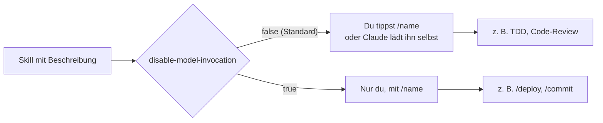

# S2.3 · Skills oder Commands, und wer sie auslösen darf

<!-- meta:start -->
> **Regal:** [Skills & Commands](README.md#skills) · **Stufe:** Kern · **~12 Min** · **Voraussetzungen:** [S2.2 Eine SKILL.md schreiben](s2-02-skill-schreiben.md)
>
> ← [S2.2 Eine SKILL.md schreiben](s2-02-skill-schreiben.md) · [Bibliothek](README.md) · [S2.4 Mitgelieferte Skills](s2-04-mitgelieferte-skills.md) →
<!-- meta:end -->

## Schnellcheck

- Kannst du ohne Nachschlagen sagen, welches Frontmatter-Feld aus einem Skill, den Claude selbst laden darf, einen reinen Handbefehl macht?
- Hast du schon einmal einen Deploy- oder Commit-Skill so abgesichert, dass Claude ihn nicht von selbst starten kann?

## Auf einen Blick

Commands und Skills sind in Claude Code zusammengelegt: `.claude/commands/deploy.md` und `.claude/skills/deploy/SKILL.md` erzeugen beide `/deploy` und funktionieren gleich. Die echte Grenze ist ein Schalter im Frontmatter: Mit `disable-model-invocation: true` startet der Skill nur, wenn du `/name` tippst; ohne ihn darf Claude ihn auch selbst laden. Zerstörerische oder kritische Aktionen wie `/deploy`, `/commit` oder `/delete` gehören deshalb auf `true`.

Ein zweites Feld wird oft falsch verstanden: `allowed-tools` schränkt nichts ein, es gibt Tools ohne Rückfrage frei. Prüf es bei jedem fremden Skill.

## Bild im Kopf

Ein Alarmknopf löst nur aus, wenn ein Mensch ihn drückt. Eine Dienstanweisung im Ordner der Leitstelle dagegen darf jede Wache selbst aufschlagen, sobald die Lage zu ihrer Überschrift passt. Beide beschreiben dieselbe Prozedur, der Unterschied liegt nur darin, wer sie in Gang setzen darf. Für die Räumung eines Gebäudes willst du einen Knopf, den jemand bewusst drückt, keine Anweisung, die jemand auf Verdacht aufschlägt.



## Im Detail

### Commands und Skills: dasselbe, andere Voreinstellung

Eine wichtige Klarstellung: In früheren Versionen von Claude Code waren Commands und Skills zwei getrennte Kategorien. Seit v2.x sind sie zu einem Konzept zusammengelegt.

Beide Dateien erzeugen denselben Slash-Befehl `/deploy`:

```
.claude/commands/deploy.md
.claude/skills/deploy/SKILL.md
```

Sie werden vom selben Mechanismus geladen und sehen für dich gleich aus. Beim Frontmatter gibt es einen kleinen Unterschied: Eine Command-Datei kennt `name` und `paths` nicht, alle anderen Felder schon. Die Begriffe „Command" und „Skill" leben in Doku und Community weiter, im Betrieb behandelt Claude Code beide gleich. Die Command-Datei ist das ältere Format und funktioniert weiter. Für Neues nimm einen Skill, denn nur ein Skill-Ordner kann Zusatzdateien mitbringen. Tragen ein Skill und eine Command-Datei denselben Namen, gewinnt der Skill.

Der Unterschied, auf den es ankommt, ist ein einzelner Schalter im Frontmatter:

<!-- cockpit:example -->
```yaml
---
name: deploy
disable-model-invocation: true   # Manual /deploy only — never auto-triggered
---
```

- `disable-model-invocation: false` (Standard): verhält sich wie ein klassischer **Skill**. Claude darf ihn selbst laden, wenn die Beschreibung zu deiner Anfrage passt.
- `disable-model-invocation: true`: verhält sich wie ein klassischer **Command**. Er startet nur, wenn du ausdrücklich `/deploy` tippst.

Mit `true` steht die Beschreibung des Skills gar nicht erst in Claudes Kontext. Versucht Claude trotzdem, den Skill aufzurufen, blockt Claude Code den Aufruf.

### Alte Begriffe, heutige Wirklichkeit

| Aspekt | „Command-Stil" (von Hand) | „Skill-Stil" (automatisch erkannt) |
|--------|---------------------------|------------------------------------|
| Schalter im Frontmatter | `disable-model-invocation: true` | `disable-model-invocation: false` (Standard) |
| Wer löst aus | Du (tippst `/name`) | Du ODER Claude (über die Beschreibung) |
| Typischer Einsatz | Zerstörerische oder kritische Aktionen: `/deploy`, `/commit`, `/delete` | Wiederverwendbare Abläufe: TDD, Code-Review, Formatierung |
| Analogie | Alarmknopf (jemand muss ihn drücken) | Dienstanweisung (jeder darf sie aufschlagen, auch weil die Überschrift passt) |
| Liegt in | `commands/*.md` oder `skills/*/SKILL.md` | `commands/*.md` oder `skills/*/SKILL.md` |

**Unterm Strich:** Beide Namen leben weiter, funktional sind sie zusammengelegt. Die echte Grenze ist `disable-model-invocation`, nicht der Dateipfad.

### So sieht eine Command-Datei aus

Commands liegen in `commands/*.md` in einem Plugin oder in `.claude/commands/` im Projekt. Du tippst sie direkt, etwa `/tdd`, `/commit` oder `/review`. Aus einer älteren Kursfassung stammt dieses Frontmatter für einen Commit-Befehl:

```yaml
---
name: commit
description: Create a structured git commit with conventional format
user_invocable: true
arguments:
  - name: message
    description: Optional commit message prefix
    required: false
---
```

**Achtung, so wirkt dieses Frontmatter nicht:**

- `user_invocable` mit Unterstrich kennt Claude Code nicht. Die Feldnamen haben Bindestriche, einzige Ausnahme ist `when_to_use`, und ein unbekanntes Feld ignoriert Claude Code still. Gemeint ist `user-invocable`, und das steht ohnehin auf `true`.
- `name` gilt in einer Command-Datei nicht. Der Befehl heißt wie die Datei, `commit.md` wird also zu `/commit`.
- `arguments` beschreibt die Referenz als Liste von Namen, etwa `arguments: [message]`, oder als String mit Leerzeichen. Objekte mit `description` und `required` nennt sie nicht.

Der Body eines Commands kann kurz sein und nur einen Skill anstoßen, oder er enthält eigene Anweisungen:

```markdown
# Commit Command

When invoked, follow this commit workflow:
1. Run `git status` to see what changed
2. Run `git diff --staged` to review staged changes
3. Write a commit message following Conventional Commits format:
   - feat: new feature
   - fix: bug fix
   - refactor: code restructure without behavior change
   - test: adding tests
   - docs: documentation only
4. Ask for confirmation before committing
5. Create the commit
```

### Die Steuerfelder: wer auslöst und was der Skill darf

Neben `name` und `description` haben Skills Steuerfelder, die für Sicherheit und Automatisierung zählen:

```yaml
---
name: deploy
description: Deploy the current branch to staging
disable-model-invocation: true    # ONLY manual /deploy — never auto-triggered
allowed-tools: Read Grep Bash     # Intent scoping (not hard security!)
context: fork                     # Run in an isolated subagent context (official skill field)
agent: Explore                    # WHICH subagent TYPE runs the fork (Explore/Plan/general-purpose/custom) — not a model
model: sonnet                     # Model for this skill, incl. the forked context
user-invocable: true              # Show in /skills list (false = background knowledge)
---
```

| Feld | Wirkung | Wann einsetzen |
|------|---------|----------------|
| `disable-model-invocation: true` | Nur von Hand; Claude lädt den Skill nie selbst | Kritische Aktionen: Deploy, Commit, Löschen |
| `user-invocable: false` | Verschwindet aus dem `/`-Menü; nur Claude kann ihn laden, du nicht | Hintergrundwissen, das Claude still lädt |
| `allowed-tools` | Gibt die genannten Tools **frei**: Claude darf sie in dem Turn, der den Skill aufruft, ohne Rückfrage nutzen | Wenige, eng benannte Tools für einen Ablauf, den du selbst auslöst |
| `context`, `agent`, `model` | Eigener Subagenten-Kontext, sein Typ, das Modell | Feldtabelle in [S2.2](s2-02-skill-schreiben.md#teil-1-das-frontmatter) |

### `allowed-tools` ist eine Freigabe, keine Grenze

Der Kommentar im Beispiel oben („Intent scoping") führt in die Irre. Laut Skills-Doku darf Claude die genannten Tools in dem Turn, der den Skill aufruft, ohne Rückfrage nutzen; die Freigabe endet mit deiner nächsten Nachricht. Eingeschränkt wird dabei nichts: Alle anderen Tools bleiben verfügbar und laufen weiter über deine Rechte-Regeln ([S1.5](s1-05-rechte-im-alltag.md)).

Das hat eine Sicherheitsseite. Ein Skill kann sich selbst weitreichende Rechte geben, und Claude Code wendet die `allowed-tools` eines Projekt-Skills auch in einem `-p`-Lauf in einem Ordner an, dem du nie vertraut hast. Prüf deshalb die `allowed-tools` der Skills in einem fremden Repository, bevor du Claude Code dort startest ([S2.13](s2-13-plugin-lieferkette.md)). Willst du einem Skill Tools wirklich wegnehmen, nimm `disallowed-tools` oder deny-Regeln in deinen Rechte-Einstellungen.

## Typische Fallen

- **Der Skill springt zu oft an.** Die Beschreibung ist zu breit, die Trigger-Phrasen zu allgemein. Schärf sie nach, oder setz `disable-model-invocation: true`; dann läuft der Skill nur noch über `/name`.
- **`user-invocable: false` für eine Sperre halten.** Es versteckt den Skill vor dir, nicht vor Claude. Soll Claude ihn nicht laden, brauchst du `disable-model-invocation: true`.
- **Tippfehler im Feldnamen.** `disable_model_invocation` oder `user_invocable` ignoriert Claude Code ohne Meldung, und der gewollte Schutz fehlt dann still.
- **`allowed-tools` als Einschränkung lesen.** Es erweitert die Freigaben, statt sie zu begrenzen (siehe oben).

## Check

Du kannst erklären, warum Skill und Command technisch dasselbe sind, und begründen, warum ein Deploy-Skill `disable-model-invocation: true` braucht.

1. Was unterscheidet `.claude/commands/deploy.md` im Betrieb von `.claude/skills/deploy/SKILL.md`?
2. Wer darf einen Skill mit `disable-model-invocation: true` auslösen, wer einen mit `user-invocable: false`?
3. Was bewirkt `allowed-tools`, und was bewirkt es nicht?

<details><summary>Quizfrage</summary>

**Frage:** Ein Skill für das Produktions-Deployment lässt `disable-model-invocation` auf dem Standardwert. Was ist das Risiko?

- **Richtig:** Claude darf den Skill selbst laden, wenn eine Anfrage zur Beschreibung passt, etwa „Was bräuchte es, um das live zu bringen?".
- Falsch: Keines: Das Feld regelt nur, ob der Skill in der `/skills`-Liste auftaucht; selbst auslösen kann Claude einen Skill ohnehin nie.
- Falsch: Der Skill lädt gar nicht, weil Deploy-Skills zusätzlich ein Feld `scope: production` im Frontmatter brauchen.
- Falsch: Jeder verbundene MCP-Server kann den Skill dann über eine Folge von Tool-Aufrufen von außen starten.

</details>

## Weiterlesen

- [Skills-Doku: wer einen Skill aufruft](https://code.claude.com/docs/en/skills#control-who-invokes-a-skill)
- [Skills-Doku: Tools für einen Skill freigeben](https://code.claude.com/docs/en/skills#pre-approve-tools-for-a-skill)
- [S2.2 · Eine SKILL.md schreiben](s2-02-skill-schreiben.md)
- [S2.5 · Lebendige Prompts: Argumente und dynamischer Inhalt](s2-05-lebendige-prompts.md)
- [S1.5 · Rechte im Alltag: default und acceptEdits](s1-05-rechte-im-alltag.md)
- [S2.13 · Lieferkettenrisiken bei Plugins](s2-13-plugin-lieferkette.md)
- [S3.10 · Netzwerk und Skills härten](s3-10-netzwerk-und-skills-haerten.md)
