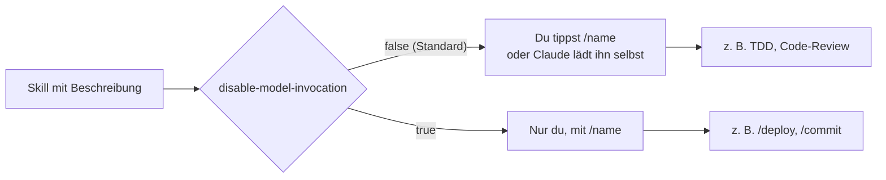

# S2.3 · Skills oder Commands, und wer sie auslösen darf

<!-- meta:start -->
> **Regal:** [Skills & Commands](README.md#skills) · **Stufe:** Kern · **~25 Min** · **Voraussetzungen:** [S2.2 Eine SKILL.md schreiben](s2-02-skill-schreiben.md)
>
> ← [S2.2 Eine SKILL.md schreiben](s2-02-skill-schreiben.md) · [Bibliothek](README.md) · [S2.4 Mitgelieferte Skills](s2-04-mitgelieferte-skills.md) →
<!-- meta:end -->

## Schnellcheck

- Kannst du ohne Nachschlagen sagen, welches Frontmatter-Feld verhindert, dass Claude einen Skill von selbst startet?
- Kannst du sagen, ob `allowed-tools` die Werkzeuge eines Skills einschränkt?

## Auf einen Blick

Commands und Skills sind in Claude Code zusammengelegt: `.claude/commands/deploy.md` und `.claude/skills/deploy/SKILL.md` erzeugen beide `/deploy` und funktionieren gleich. Die echte Grenze ist ein Schalter im Frontmatter: Mit `disable-model-invocation: true` startet der Skill nur, wenn du `/name` tippst; ohne ihn darf Claude ihn auch selbst laden. Zerstörerische oder kritische Aktionen wie `/deploy` oder `/commit` gehören deshalb auf `true`.

Ein zweites Feld wird oft falsch verstanden: `allowed-tools` schränkt nichts ein, es gibt Tools ohne Rückfrage frei. Prüf es bei jedem fremden Skill.

## Bild im Kopf

Aus [S2.1](s2-01-skills-und-commands.md) kennst du den Ordner mit den Dienstanweisungen: Jedes Blatt kann auf zwei Wegen aufgeschlagen werden, mit dem Alarmknopf durch dich oder von der Wache selbst, wenn die Lage zur Überschrift passt. `disable-model-invocation: true` nimmt die Überschrift aus dem Ordner der Wache: Das Blatt liegt weiter bereit, aber nur der Knopf schlägt es auf. Für die Räumung eines Gebäudes willst du genau das: eine Anweisung, die jemand bewusst auslöst, und keine, die jemand auf Verdacht aufschlägt.



## Im Detail

### Commands und Skills: dasselbe, andere Voreinstellung

In früheren Versionen von Claude Code waren Commands und Skills zwei getrennte Kategorien. Heute sind sie ein Konzept: Die Doku sagt, eine Datei `.claude/commands/deploy.md` und ein Skill `.claude/skills/deploy/SKILL.md` erzeugen beide `/deploy` und funktionieren gleich.

```
.claude/commands/deploy.md
.claude/skills/deploy/SKILL.md
```

Beim Frontmatter gibt es einen kleinen Unterschied: Eine Command-Datei kennt `name` und `paths` nicht, alle anderen Felder schon; der Befehl heißt wie die Datei. Die Command-Datei ist das ältere Format und funktioniert weiter. Für Neues nimm einen Skill, denn nur ein Skill-Ordner kann Zusatzdateien mitbringen. Tragen ein Skill und eine Command-Datei denselben Namen, gewinnt der Skill.

Der Unterschied, auf den es ankommt, ist ein einzelner Schalter im Frontmatter:

<!-- cockpit:example -->
```yaml
---
name: deploy
disable-model-invocation: true   # Manual /deploy only — never auto-triggered
---
```

- `disable-model-invocation: false` (Standard): Claude darf den Skill selbst laden, wenn die Beschreibung zu deiner Anfrage passt, und du kannst ihn mit `/name` aufrufen.
- `disable-model-invocation: true`: Der Skill startet nur, wenn du ausdrücklich `/deploy` tippst. Seine Beschreibung steht dann gar nicht erst in Claudes Kontext. Versucht Claude trotzdem, den Skill aufzurufen, blockt Claude Code den Aufruf und Claude schlägt dir meist vor, `/deploy` selbst zu tippen.

Beides ist ein Schalter, kein eigener Dateityp. Wie viel Rückfrage dazwischenliegt, wenn Claude einen Skill selbst lädt, hängt vom Rechte-Modus ab ([S1.5](s1-05-rechte-im-alltag.md)). Verlass dich bei kritischen Aktionen nicht darauf, sondern setz den Schalter.

### Eine Command-Datei mit Argument

Commands liegen in `.claude/commands/` im Projekt oder in `commands/*.md` in einem Plugin. Du tippst sie direkt, etwa `/commit`. Das Frontmatter einer Command-Datei sieht so aus:

```yaml
---
description: Create a structured git commit with conventional format
disable-model-invocation: true
arguments: [message]
---
```

Der Befehl heißt wie die Datei, `commit.md` wird also zu `/commit`. `arguments` nimmt eine Liste von Namen oder einen String mit Leerzeichen; wie Argumente im Text ankommen, zeigt [S2.5](s2-05-lebendige-prompts.md). Der Body kann kurz sein oder einen ganzen Ablauf enthalten:

```markdown
# Commit Command

When invoked, follow this commit workflow:
1. Run `git status` to see what changed
2. Run `git diff --staged` to review staged changes
3. Write a commit message following Conventional Commits format:
   - feat: new feature
   - fix: bug fix
   - refactor: code restructure without behavior change
   - test: adding tests
   - docs: documentation only
4. Ask for confirmation before committing
5. Create the commit
```

### Die Steuerfelder: wer auslöst und was der Skill darf

Zwei Felder regeln, wer einen Skill auslösen darf, ein drittes gibt Werkzeuge frei:

| Feld | Wirkung | Wann einsetzen |
|------|---------|----------------|
| `disable-model-invocation: true` | Claude lädt den Skill nie selbst; nur du, mit `/name` | Kritische Aktionen: Deploy, Commit, Löschen |
| `user-invocable: false` | Verschwindet aus dem `/`-Menü; du kannst ihn nicht tippen, Claude kann ihn laden | Hintergrundwissen, das Claude still lädt |
| `allowed-tools` | Gibt die genannten Tools **frei**: Claude darf sie in dem Turn, der den Skill aufruft, ohne Rückfrage nutzen | Wenige, eng benannte Tools für einen Ablauf, den du selbst auslöst |

So sieht ein Deploy-Skill mit beiden Absicherungen aus:

```yaml
---
name: deploy
description: Deploy the current branch to staging
disable-model-invocation: true    # only you can start it, with /deploy
allowed-tools: Bash(git status *) # pre-approves this call for the turn of /deploy; restricts nothing
---
```

### `allowed-tools` ist eine Freigabe, keine Grenze

Laut Skills-Doku darf Claude die genannten Tools in dem Turn, der den Skill aufruft, ohne Rückfrage nutzen; die Freigabe endet mit deiner nächsten Nachricht. Eingeschränkt wird dabei nichts: Alle anderen Tools bleiben verfügbar und laufen weiter über deine Rechte-Regeln ([S1.5](s1-05-rechte-im-alltag.md)).

Das hat eine Sicherheitsseite. Ein Skill kann sich selbst weitreichende Rechte geben, und Claude Code wendet die `allowed-tools` eines Projekt-Skills auch in einem `-p`-Lauf in einem Ordner an, dem du nie vertraut hast. Prüf deshalb die `allowed-tools` der Skills in einem fremden Repository, bevor du Claude Code dort startest ([S2.13](s2-13-plugin-lieferkette.md)). Willst du einem Skill Tools wirklich wegnehmen, nimm das Feld `disallowed-tools` oder Deny-Regeln in deinen Rechte-Einstellungen.

## Selbst machen

### Übung: wer darf den Skill starten? (etwa 10 Minuten)

**Ziel:** Du siehst, dass ein Skill mit Standardwerten von Claude selbst gestartet werden kann, und dass `disable-model-invocation: true` das beendet, während `/deploy` weiter funktioniert.

**Startzustand:** ein neuer Ordner `~/cc-workshop/deploy`. Leg ihn mit dem Skill-Ordner an und wechsle hinein (`mkdir -p ~/cc-workshop/deploy/.claude/skills/deploy && cd ~/cc-workshop/deploy`, in PowerShell `New-Item -ItemType Directory -Force "$HOME\cc-workshop\deploy\.claude\skills\deploy"; Set-Location "$HOME\cc-workshop\deploy"`). Der Skill schreibt nur eine Textdatei; ein echtes Deployment gibt es nicht.

1. Leg die Datei `.claude/skills/deploy/SKILL.md` von Hand an (der Ordner `.claude` ist ein geschützter Pfad):

   ```markdown
   ---
   name: deploy
   description: Deploys the current branch to staging. Use when the user says deploy, ship it or go live.
   ---

   Create the file deployed.txt containing the single line `DEPLOYED to staging`, then confirm.
   ```

2. Starte `claude --permission-mode default` und bestätige den Vertrauensdialog. Gib ein: `Deploy the current branch to staging.` Du tippst `/deploy` nicht. Erwartet: Claude ruft den Skill auf; je nach Rückfrage gibst du ihn mit „Yes" frei, und auch das Anlegen von `deployed.txt` bestätigst du. Drück danach `Ctrl+O`: Im Transkript steht ein Aufruf des Werkzeugs `Skill`, und `deployed.txt` liegt im Ordner. (Fragt Claude nur zurück, was es deployen soll, hat es den Skill nicht gewählt. Das zeigt, dass die Wahl an seinem Urteil hängt; probier den Satz „ship it".)
3. Beende die Sitzung mit `/exit`, lösch `deployed.txt` und ergänz in der SKILL.md im Frontmatter die Zeile `disable-model-invocation: true` direkt unter `name: deploy`.
4. Starte `claude --permission-mode default` neu und gib denselben Satz ein: `Deploy the current branch to staging.` Erwartet: Claude startet den Skill nicht von selbst. Entweder kennt es ihn gar nicht, oder ein Versuch wird geblockt und es schlägt vor, dass du `/deploy` tippst. Will Claude sich stattdessen mit einem Shell-Befehl im Ordner umsehen, lehn die Rückfrage ab. Im Transkript (`Ctrl+O`) steht kein erfolgreicher Skill-Aufruf, und `deployed.txt` gibt es nicht.
5. Gib jetzt `/deploy` ein. Erwartet: Der Skill läuft, `deployed.txt` entsteht (nach deiner Bestätigung des Anlegens).

**Aufräumen:** Beende die Sitzung mit `/exit` und lösch den Ordner `~/cc-workshop/deploy` selbst.

**Geschafft, wenn:**

- [ ] Claude den Skill in Schritt 2 ohne deinen Befehl geladen hat (Skill-Aufruf im Transkript, `deployed.txt` vorhanden)
- [ ] nach dem Schalter derselbe Satz in Schritt 4 keinen Skill-Aufruf und keine `deployed.txt` ergab
- [ ] `/deploy` in Schritt 5 trotzdem funktionierte

### Übung: `allowed-tools` ist eine Freigabe (etwa 5 Minuten)

**Ziel:** Du siehst, dass `allowed-tools` ein Werkzeug für einen Turn freigibt, ohne die übrigen zu sperren oder freizugeben.

**Startzustand:** ein neuer Ordner `~/cc-workshop/freigabe` mit dem Skill-Ordner (`mkdir -p ~/cc-workshop/freigabe/.claude/skills/note && cd ~/cc-workshop/freigabe`, in PowerShell `New-Item -ItemType Directory -Force "$HOME\cc-workshop\freigabe\.claude\skills\note"; Set-Location "$HOME\cc-workshop\freigabe"`).

1. Leg `.claude/skills/note/SKILL.md` an:

   ```markdown
   ---
   name: note
   description: Writes a note file and a backup folder.
   disable-model-invocation: true
   allowed-tools: Write
   ---

   Create the file note.txt containing the line `OK`. Then create a folder named backup with the shell command `mkdir backup`.
   ```

2. Starte `claude --permission-mode default` (Vertrauensdialog bestätigen) und gib `/note` ein. Erwartet: `note.txt` entsteht ohne Rückfrage, denn `Write` ist für diesen Turn freigegeben. Das `mkdir` dagegen fragt nach: Die Shell war nicht freigegeben und auch nicht gesperrt. Lehn die Rückfrage mit „No" ab.
3. Gib in der nächsten Nachricht ein: `Create other.txt containing the word two.` Erwartet: Jetzt fragt Claude Code auch beim Schreiben nach. Die Freigabe galt nur für den Turn von `/note`. Lehn ab.

**Aufräumen:** Beende die Sitzung mit `/exit` und lösch den Ordner `~/cc-workshop/freigabe` selbst.

**Geschafft, wenn:**

- [ ] `note.txt` ohne Rückfrage entstand
- [ ] das `mkdir` trotzdem nachfragte
- [ ] `other.txt` in der nächsten Nachricht wieder nachfragte

## Typische Fallen

- **Der Skill springt zu oft an.** Die Beschreibung ist zu breit, die Trigger-Phrasen zu allgemein. Schärf sie nach, oder setz `disable-model-invocation: true`; dann läuft der Skill nur noch über `/name`.
- **`user-invocable: false` für eine Sperre halten.** Es versteckt den Skill vor dir, nicht vor Claude. Soll Claude ihn nicht laden, brauchst du `disable-model-invocation: true`.
- **Tippfehler im Feldnamen.** `disable_model_invocation` oder `user_invocable` mit Unterstrich ignoriert Claude Code ohne Meldung, und der gewollte Schutz fehlt dann still.
- **`allowed-tools` als Einschränkung lesen.** Es erweitert die Freigaben, statt sie zu begrenzen (siehe oben).

## Check

Du kannst erklären, warum Skill und Command technisch dasselbe sind, begründen, warum ein Deploy-Skill `disable-model-invocation: true` braucht, und sagen, was `allowed-tools` tut und was nicht.

1. Was haben `.claude/commands/deploy.md` und `.claude/skills/deploy/SKILL.md` gemeinsam, und welcher gewinnt bei gleichem Namen?
2. Wer darf einen Skill mit `disable-model-invocation: true` auslösen, wer einen mit `user-invocable: false`?
3. Was bewirkt `allowed-tools`, und was bewirkt es nicht?

<details><summary>Auflösung</summary>

1. Beide erzeugen `/deploy` und funktionieren gleich, weil Commands und Skills zusammengelegt sind. Bei gleichem Namen gewinnt der Skill.
2. Bei `disable-model-invocation: true` nur du mit `/name`; Claude lädt den Skill nie selbst. Bei `user-invocable: false` nur Claude; du kannst ihn nicht tippen.
3. Es gibt die genannten Tools in dem Turn, der den Skill aufruft, ohne Rückfrage frei; die Freigabe endet mit deiner nächsten Nachricht. Es schränkt nichts ein: Alle anderen Tools bleiben verfügbar und laufen über deine Rechte-Regeln.

</details>

<details><summary>Quizfrage</summary>

**Frage:** Ein Skill für das Produktions-Deployment lässt `disable-model-invocation` auf dem Standardwert. Was ist das Risiko?

- **Richtig:** Claude darf den Skill selbst laden, wenn eine Anfrage zur Beschreibung passt, etwa „Was bräuchte es, um das live zu bringen?".
- Falsch: Keines: Das Feld bestimmt nur, ob der Skill in der `/skills`-Liste erscheint; selbst laden kann Claude einen Skill ohnehin nie.
- Falsch: Der Standardwert schaltet den Handbefehl ab, sodass nur noch Claude den Skill starten darf und du nicht mehr.
- Falsch: Keines: Mit einem `allowed-tools`-Feld darf der Skill nur die dort genannten Tools nutzen, also kann ein Deploy nie mehr tun als vorgesehen.

</details>

## Weiterlesen

- [Skills-Doku: wer einen Skill aufruft](https://code.claude.com/docs/en/skills#control-who-invokes-a-skill)
- [Skills-Doku: Tools für einen Skill freigeben](https://code.claude.com/docs/en/skills#pre-approve-tools-for-a-skill)
- [S2.2 · Eine SKILL.md schreiben](s2-02-skill-schreiben.md)
- [S2.5 · Lebendige Prompts: Argumente und dynamischer Inhalt](s2-05-lebendige-prompts.md)
- [S1.5 · Rechte im Alltag: default und acceptEdits](s1-05-rechte-im-alltag.md)
- [S2.13 · Lieferkettenrisiken bei Plugins](s2-13-plugin-lieferkette.md)
- [S3.10 · Netzwerk und Skills härten](s3-10-netzwerk-und-skills-haerten.md)
