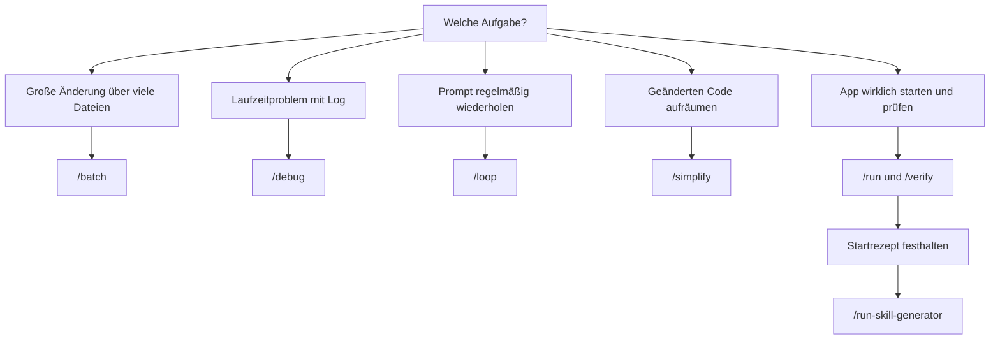

# S2.4 · Mitgelieferte Skills

<!-- meta:start -->
> **Regal:** [Skills & Commands](README.md#skills) · **Stufe:** Kern · **~12 Min** · **Voraussetzungen:** [S2.1 Skills sind Dienstanweisungen, Commands sind Knöpfe](s2-01-skills-und-commands.md)
>
> ← [S2.3 Skills oder Commands, und wer sie auslösen darf](s2-03-wer-skills-ausloest.md) · [Bibliothek](README.md) · [S2.5 Lebendige Prompts: Argumente und dynamischer Inhalt](s2-05-lebendige-prompts.md) →
<!-- meta:end -->

## Schnellcheck

- Kannst du ohne Nachschlagen sagen, womit du in einer Sitzung nachsiehst, welche Skills es gibt?
- Kannst du für „in 80 Dateien dieselbe Änderung machen" sagen, welchen mitgelieferten Skill du nimmst?

## Auf einen Blick

Claude Code bringt mitgelieferte Skills (bundled skills) mit: Anleitungen auf Prompt-Basis, die ohne Installation bereitstehen, etwa `/batch`, `/debug`, `/loop`, `/simplify` und `/verify`. Anders als die meisten eingebauten Befehle führen sie keine feste Logik aus, sondern geben Claude genaue Anweisungen, und Claude erledigt die Arbeit mit seinen Tools. Welche es gibt, ändert sich mit den Versionen. Eine Liste lohnt sich nicht auswendig zu lernen; wichtig ist, dass du weißt, wo du nachsiehst und wonach du wählst.

## Bild im Kopf

Mitgelieferte Skills sind wie die Dienstanweisungen, die ab Werk mit einer Sicherheitsanlage kommen. `/batch` ist wie ein Firmware-Update, das auf alle Türcontroller gleichzeitig ausgerollt wird, jeder in seinem eigenen abgeschotteten Worktree, damit ein Fehler an einem Controller die anderen nicht lahmlegt. `/verify` entspricht dem Moment, in dem du nach dem Schlosstausch die Tür wirklich öffnest: Repariert ist sie erst, wenn du sie benutzt hast.



## Im Detail

### Die wichtigsten mitgelieferten Skills

Laut Skills-Doku sind die meisten mitgelieferten Skills in jeder Sitzung verfügbar. Einige hängen an einem Feature, und die Einstellung `disableBundledSkills` schaltet sie ab. Sie unterscheiden sich von eingebauten Befehlen, die feste Logik ausführen. In der [Befehlsreferenz](https://code.claude.com/docs/en/commands) ist jeder mitgelieferte Skill mit **Skill** markiert; die folgende Tabelle ist nur eine Auswahl.

| Skill | Was er tut | Beispiel |
|-------|------------|----------|
| `/batch <instruction>` | Große Änderungen parallel: zerlegt die Arbeit in unabhängige Teile und bearbeitet jeden in einem eigenen Git-Worktree | `/batch migrate src/ from Solid to React` |
| `/claude-api` | Lädt Referenzmaterial zur Claude API und zu Managed Agents für die Sprache deines Projekts | `/claude-api` |
| `/debug [description]` | Schaltet das Debug-Log ein und wertet es aus | `/debug failing mcp auth` |
| `/loop [interval] [prompt]` | Führt einen Prompt wiederholt aus, solange die Sitzung offen ist | `/loop 5m check deploy status` |
| `/simplify [target]` | Prüft geänderten Code parallel auf Aufräumpotenzial und wendet die Korrekturen an; nach Fehlern sucht er nicht | `/simplify` |
| `/run` | Startet und bedient deine App, damit du eine Änderung laufen siehst | `/run` |
| `/verify` | Prüft Änderungen, indem er die App wirklich baut und ausführt, statt sich auf Tests zu verlassen | `/verify` |
| `/run-skill-generator` | Hält fest, wie dein Projekt gebaut und gestartet wird, als Projekt-Skill für `/run` und `/verify` | `/run-skill-generator` |
| `/fewer-permission-prompts` | Durchsucht deine Transkripte nach häufigen lesenden Bash- und MCP-Aufrufen und trägt eine Allowlist in die `.claude/settings.json` des Projekts ein | `/fewer-permission-prompts` |

`/verify` startet nur, wenn du ihn aufrufst; Claude lädt ihn nicht von selbst. Das hält laut Doku die Kontrolle bei dir, wann diese längeren Prüfungen Zeit und Tokens kosten.

Vertiefung: `/batch` in [S3.4](s3-04-orchestrierungsmuster.md), `/loop` in [S3.12](s3-12-zeitgesteuert-arbeiten.md), `/debug` in [S4.9](s4-09-fehlersuche-werkzeuge.md), Rechte und Allowlists in [S1.5](s1-05-rechte-im-alltag.md).

### Das Startrezept festhalten: `/run-skill-generator`

`/run` und `/verify` kommen ohne Einrichtung aus. Sie leiten aus dem Projekttyp und aus README, `package.json` oder `Makefile` ab, wie deine App startet. Braucht dein Projekt mehr als einen Standardstart, etwa eine Datenbank, eine Env-Datei oder einen mehrstufigen Build, wird diese Ableitung unzuverlässig. Dann hilft:

<!-- cockpit:example -->
```
/run-skill-generator
```

Der Skill bringt deine App aus einer sauberen Umgebung zum Laufen, hält fest, was funktioniert hat (Installationsbefehle, Env-Variablen, Startskript), und legt das als Projekt-Skill unter `.claude/skills/run-<name>/` ab. Danach folgen `/run`, `/verify` und andere Agenten im Repo diesem Rezept, statt es jedes Mal neu herauszufinden. Führ ihn einmal pro Projekt aus und wieder, wenn sich Build oder Start ändern.

### Was verfügbar ist: `/skills` und `/context`

`/skills` listet die Skills aus Projekt, Benutzerordner und Plugins. Du kannst die Liste filtern, mit `t` nach Token-Verbrauch sortieren und mit `Esc` schließen. Leertaste und Enter ändern dort, ob ein Skill für Claude und das `/`-Menü sichtbar ist; lass sie beim Nachsehen in Ruhe. Die mitgelieferten Skills zeigt `/skills` nicht. Die stehen im Abschnitt über Skills in `/context`, und `/context all` nennt sie einzeln.

Wann sich ein eigener Skill lohnt, steht in [S2.1](s2-01-skills-und-commands.md), wie du ihn schreibst, in [S2.2](s2-02-skill-schreiben.md) und [S2.3](s2-03-wer-skills-ausloest.md). Springt ein eigener Skill nicht wie erwartet an, helfen [S4.9](s4-09-fehlersuche-werkzeuge.md) und [S4.10](s4-10-diagnose-schritt-fuer-schritt.md).

## Selbst machen

### Übung: nachsehen und wählen (etwa 5 Minuten)

**Ziel:** Du findest die mitgelieferten Skills in deiner eigenen Sitzung und ordnest vier Aufgaben dem passenden Skill zu.

**Startzustand:** ein neuer, leerer Ordner `~/cc-workshop/bundled` (`mkdir -p ~/cc-workshop/bundled && cd ~/cc-workshop/bundled`, in PowerShell `New-Item -ItemType Directory -Force "$HOME\cc-workshop\bundled"; Set-Location "$HOME\cc-workshop\bundled"`).

1. Starte `claude --permission-mode default` und bestätige den Vertrauensdialog. Gib `/skills` ein. Erwartet: eine Liste deiner eigenen und Plugin-Skills, womöglich leer; `simplify` und `batch` stehen nicht darin. Schließ die Ansicht mit `Esc`.
2. Gib `/context all` ein und such den Abschnitt zu den Skills. Erwartet: Dort stehen Namen, darunter mitgelieferte aus der Befehlsreferenz, etwa `simplify`. Findest du keinen Namen, nimm `/context` ohne `all` und die Befehlsreferenz.
3. Ordne zu, ohne nachzuschlagen: Welchen Skill nimmst du für (a) dieselbe API-Änderung in 80 Dateien, (b) einen Fehler, bei dem du das Debug-Log lesen musst, (c) „prüf alle fünf Minuten, ob der Build fertig ist", (d) „starte die App und sieh nach, ob meine Änderung wirklich läuft"?

<details><summary>Vergleich</summary>

(a) `/batch`: zerlegt die Arbeit in unabhängige Teile, je ein Git-Worktree. (b) `/debug`: schaltet das Debug-Log ein und wertet es aus. (c) `/loop 5m …`: wiederholt den Prompt, solange die Sitzung offen ist. (d) `/verify`, bei Bedarf mit `/run` zum Starten und mit `/run-skill-generator`, wenn der Start mehr als einen Standardbefehl braucht.

</details>

**Geschafft, wenn:**

- [ ] du in `/skills` gesehen hast, dass die mitgelieferten Skills dort fehlen, und sie in `/context all` gefunden hast
- [ ] du alle vier Zuordnungen vor dem Vergleich notiert hast

### Übung: `/simplify` an einer eigenen Änderung (etwa 10 Minuten)

**Ziel:** Du lässt einen mitgelieferten Skill an einer echten, noch nicht committeten Änderung laufen und prüfst im Diff, was er geändert hat.

**Startzustand:** Git und Python ([S0.1](s0-01-werkstatt-einrichten.md)). Du arbeitest im Ordner `~/cc-workshop/bundled` aus der ersten Übung; der Ordner darf leer sein.

1. Leg `helpers.py` und `report.py` an:

   ```python
   def mean(values):
       return sum(values) / len(values)
   ```

   ```python
   from helpers import mean


   def class_average(scores):
       return mean(scores)
   ```

2. Mach daraus einen Git-Stand: `git init`, `git add .`, dann `git -c user.name=learner -c user.email=learner@example.com commit -m start`. Hänge danach diese Funktion an `report.py` an und committe sie nicht:

   ```python
   def exam_average(results):
       total = 0
       for r in results:
           total = total + r
       return total / len(results)
   ```

3. Starte `claude --permission-mode default` und gib `/simplify` ein. Der Skill prüft den geänderten Code mit mehreren Agenten gleichzeitig. Das kann eine Minute dauern, und er kann selbst um Freigabe bitten. Bestätige, was er ändern will, und lies seine Zusammenfassung.
4. Beende die Sitzung und führ `git diff` aus. Erwartet: Das Diff gegen den Commit zeigt, was `/simplify` an `exam_average` geändert hat. Typisch ist, dass die Schleife entfällt und die Funktion das vorhandene `mean` benutzt; welche Änderung Claude wählt, kann abweichen. Sucht der Skill nach Fehlern? Nein: Die Doku sagt, er prüft nur auf Aufräumpotenzial, für Fehler nimmst du `/code-review`.

**Aufräumen:** Lösch den Ordner `~/cc-workshop/bundled` selbst.

**Geschafft, wenn:**

- [ ] `/simplify` auf deine uncommittete Änderung lief und du seine Zusammenfassung gelesen hast
- [ ] `git diff` zeigt eine Änderung an `exam_average`, die der Skill vorgenommen hat
- [ ] du sagen kannst, welche Art von Problemen `/simplify` nicht sucht

## Typische Fallen

- **Die Tabelle für vollständig halten.** Die Auswahl veraltet schnell. Den Stand deiner Sitzung zeigen `/skills` und `/context`, die vollständige Liste die Befehlsreferenz.
- **In `/skills` nach `/simplify` suchen.** Mitgelieferte Skills stehen dort nicht; sie erscheinen in `/context`.
- **`/verify` durch einen grünen Testlauf ersetzen.** Tests prüfen einzelne Einheiten; `/verify` startet die App und beobachtet, was sie tut. Genau darin liegt sein Wert.
- **Einen eigenen Skill wie einen mitgelieferten nennen.** Ein persönlicher oder Projekt-Skill mit demselben Namen ersetzt den mitgelieferten Befehl, seine Aliase nicht.
- **`/fewer-permission-prompts` ungeprüft übernehmen.** Der Skill schreibt Freigaben in die `.claude/settings.json` des Projekts. Lies die Liste, bevor du sie eincheckst.

## Check

Du kannst nachsehen, welche Skills in deiner Sitzung verfügbar sind, für eine Aufgabe den passenden mitgelieferten Skill wählen und erklären, warum `/verify` nicht durch einen Testlauf ersetzt wird.

1. Womit siehst du nach, welche Skills verfügbar sind, und was zeigt `/skills` nicht?
2. Du sollst in 80 Dateien dieselbe API-Änderung machen. Welchen Skill nimmst du, und wie arbeitet er?
3. Was macht `/run-skill-generator`, und wann führst du ihn erneut aus?

<details><summary>Auflösung</summary>

1. Mit `/skills` für Projekt-, persönliche und Plugin-Skills und mit `/context` für alle, auch die mitgelieferten. `/skills` zeigt die mitgelieferten Skills nicht.
2. `/batch`: Er zerlegt die Arbeit in unabhängige Teile und bearbeitet jeden in einem eigenen Git-Worktree.
3. Er bringt die App aus einer sauberen Umgebung zum Laufen, hält fest, was funktioniert hat, und legt es als Projekt-Skill unter `.claude/skills/run-<name>/` ab, damit `/run` und `/verify` diesem Rezept folgen. Du führst ihn einmal pro Projekt aus und wieder, wenn sich Build oder Start ändern.

</details>

<details><summary>Quizfrage</summary>

**Frage:** Was unterscheidet `/verify` von einem normalen Testlauf wie `pytest` oder `npm test`?

- **Richtig:** Er baut und startet die App und beobachtet ihr Verhalten, statt sich auf Tests oder Typprüfungen zu verlassen.
- Falsch: Er ist ein Kürzel für den erkannten Test-Runner und wählt nur selbst zwischen `pytest`, `npm test` und `cargo test`.
- Falsch: Er führt statische Analyse aus, also ESLint, mypy oder tsc, und ergänzt so den Testlauf um Lint- und Typfehler.
- Falsch: Er startet die App nur, wenn du vorher `/run-skill-generator` ausgeführt hast; ohne Startrezept bricht er sofort ab.

</details>

## Weiterlesen

- [Skills-Doku: mitgelieferte Skills](https://code.claude.com/docs/en/skills#bundled-skills)
- [Befehlsreferenz](https://code.claude.com/docs/en/commands)
- [S2.1 · Skills sind Dienstanweisungen, Commands sind Knöpfe](s2-01-skills-und-commands.md)
- [S2.2 · Eine SKILL.md schreiben](s2-02-skill-schreiben.md)
- [S3.4 · Orchestrierungsmuster: Fan-out, Pipeline, Hierarchie](s3-04-orchestrierungsmuster.md)
- [S3.12 · Zeitgesteuert arbeiten: /loop, /goal, /schedule, Routinen](s3-12-zeitgesteuert-arbeiten.md)
- [S4.9 · Fehlersuche: /debug, --verbose, /doctor](s4-09-fehlersuche-werkzeuge.md)
