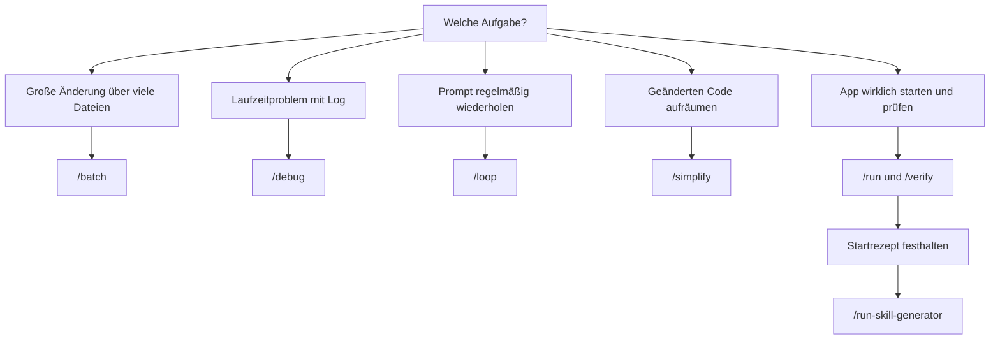

# S2.4 · Mitgelieferte Skills

<!-- meta:start -->
> **Regal:** [Skills & Commands](README.md#skills) · **Stufe:** Kern · **~12 Min** · **Voraussetzungen:** [S2.1 Skills sind Dienstanweisungen, Commands sind Knöpfe](s2-01-skills-und-commands.md)
>
> ← [S2.3 Skills oder Commands, und wer sie auslösen darf](s2-03-wer-skills-ausloest.md) · [Bibliothek](README.md) · [S2.5 Lebendige Prompts: Argumente und dynamischer Inhalt](s2-05-lebendige-prompts.md) →
<!-- meta:end -->

## Schnellcheck

- Kannst du ohne Nachschlagen vier mitgelieferte Skills nennen und sagen, wofür `/verify` statt eines Testlaufs gedacht ist?
- Hast du schon einmal mit `/skills` nachgesehen, welche Skills in deiner Sitzung tatsächlich verfügbar sind?

## Auf einen Blick

Claude Code bringt mitgelieferte Skills (bundled skills) mit: Anleitungen auf Prompt-Basis, die ohne Installation bereitstehen, etwa `/batch`, `/debug`, `/loop`, `/simplify` und `/verify`. Anders als die meisten eingebauten Befehle führen sie keine feste Logik aus, sondern geben Claude genaue Anweisungen, und Claude erledigt die Arbeit mit seinen Tools. Welche es gibt, ändert sich mit den Versionen; `/skills` zeigt dir den Stand auf deinem Rechner.

## Bild im Kopf

Mitgelieferte Skills sind wie die Dienstanweisungen, die ab Werk mit einer Sicherheitsanlage kommen. `/batch` ist wie ein Firmware-Update, das auf alle Türcontroller gleichzeitig ausgerollt wird, jeder in seinem eigenen abgeschotteten Worktree, damit ein Fehler an einem Controller die anderen nicht lahmlegt. `/verify` entspricht dem Moment, in dem du nach dem Schlosstausch die Tür wirklich öffnest: Repariert ist sie erst, wenn du sie benutzt hast.



## Im Detail

### Die wichtigsten mitgelieferten Skills

Mitgelieferte Skills sind in jeder Sitzung ohne Installation verfügbar. Sie unterscheiden sich von eingebauten Befehlen, die feste Logik ausführen.

> **Versionshinweis:** Welche mitgelieferten Skills es gibt, ändert sich von Release zu Release. `/skills` zeigt dir den genauen Stand auf deinem Rechner, im Workshop auf dem Rechner der Moderation. Die Tabelle unten ist die Auswahl dieses Kurses. In der [Befehlsreferenz](https://code.claude.com/docs/en/commands) ist jeder mitgelieferte Skill mit **Skill** markiert.

| Skill | Was er tut | Beispiel |
|-------|------------|----------|
| `/batch <instruction>` | Große Änderungen parallel: zerlegt die Arbeit in unabhängige Teile und bearbeitet jeden in einem eigenen Git-Worktree | `/batch migrate src/ from Solid to React` |
| `/claude-api` | Lädt Referenzmaterial zur Claude API und zu Managed Agents für die Sprache deines Projekts | `/claude-api` |
| `/debug [description]` | Schaltet das Debug-Log ein und wertet es aus | `/debug failing mcp auth` |
| `/loop [interval] [prompt]` | Führt einen Prompt wiederholt aus, solange die Sitzung offen ist | `/loop 5m check deploy status` |
| `/simplify [target]` | Prüft geänderten Code parallel auf Aufräumpotenzial und wendet die Korrekturen an; nach Fehlern sucht er nicht | `/simplify` |
| `/run` | Startet und bedient deine App, damit du eine Änderung laufen siehst | `/run` |
| `/verify` | Prüft Änderungen, indem er die App wirklich baut und ausführt, statt sich auf Tests zu verlassen | `/verify` |
| `/run-skill-generator` | Hält fest, wie dein Projekt gebaut und gestartet wird, als Projekt-Skill für `/run` und `/verify` | `/run-skill-generator` |
| `/fewer-permission-prompts` | Durchsucht deine Transkripte nach häufigen lesenden Bash- und MCP-Aufrufen und trägt eine Allowlist in die `.claude/settings.json` des Projekts ein | `/fewer-permission-prompts` |

`/run`, `/verify` und `/run-skill-generator` kamen mit v2.1.145 dazu. `/verify` startet nur, wenn du ihn aufrufst; Claude lädt ihn nicht von selbst.

Vertiefung: `/batch` in [S3.4](s3-04-orchestrierungsmuster.md), `/loop` in [S3.12](s3-12-zeitgesteuert-arbeiten.md), `/debug` in [S4.9](s4-09-fehlersuche-werkzeuge.md), Rechte und Allowlists in [S1.5](s1-05-rechte-im-alltag.md).

### Das Startrezept festhalten: `/run-skill-generator`

`/run` und `/verify` kommen ohne Einrichtung aus. Sie leiten aus dem Projekttyp und aus README, `package.json` oder `Makefile` ab, wie deine App startet. Braucht dein Projekt mehr als einen Standardstart, etwa eine Datenbank, eine Env-Datei oder einen mehrstufigen Build, wird diese Ableitung unzuverlässig. Dann hilft:

<!-- cockpit:example -->
```
/run-skill-generator
```

Der Skill bringt deine App aus einer sauberen Umgebung zum Laufen, hält fest, was funktioniert hat (Installationsbefehle, Env-Variablen, Startskript), und legt das als Projekt-Skill unter `.claude/skills/run-<name>/` ab. Danach folgen `/run`, `/verify` und andere Agenten im Repo diesem Rezept, statt es jedes Mal neu herauszufinden. Führ ihn einmal pro Projekt aus und wieder, wenn sich Build oder Start ändern.

### Wann du einen eigenen Skill schreibst

Ein eigener Skill lohnt sich, wenn du eine Aufgabe dreimal pro Woche oder öfter erledigst oder den Ablauf ins Team-Repo einchecken willst (`.claude/skills/` liegt unter Git). Für Einmaliges schreibst du den Prompt direkt. Wie du den Skill schreibst, zeigen [S2.2](s2-02-skill-schreiben.md) und [S2.3](s2-03-wer-skills-ausloest.md).

Einen neuen Skill testest du, indem du ihn beim Namen aufrufst:

```
/<your-new-skill-name>
```

Die `description` ist dabei der wichtigste Hebel, damit Claude den Skill auch selbst erkennt. Springt er nicht wie erwartet an, helfen [S4.9](s4-09-fehlersuche-werkzeuge.md) und [S4.10](s4-10-diagnose-schritt-fuer-schritt.md).

### Was verfügbar ist: `/skills`

Mit `/skills` siehst du in jeder Sitzung alle verfügbaren Skills: mitgelieferte, persönliche, Projekt- und Plugin-Skills. So findest du heraus, was installiert ist und was du nutzen kannst. In der Liste kannst du nach Name, Beschreibung oder Herkunft filtern und mit `t` nach Token-Verbrauch sortieren.

## Typische Fallen

- **Die Tabelle für vollständig halten.** Die Auswahl veraltet schnell. Den Stand deiner Sitzung zeigt `/skills`, die vollständige Liste die Befehlsreferenz.
- **`/verify` durch einen grünen Testlauf ersetzen.** Tests prüfen einzelne Einheiten; `/verify` startet die App und beobachtet, was sie tut. Genau darin liegt sein Wert.
- **Einen eigenen Skill wie einen mitgelieferten nennen.** Ein persönlicher oder Projekt-Skill mit demselben Namen ersetzt den mitgelieferten Befehl.
- **`/fewer-permission-prompts` ungeprüft übernehmen.** Der Skill schreibt Freigaben in die `.claude/settings.json` des Projekts. Lies die Liste, bevor du sie eincheckst.

## Check

Du kannst vier mitgelieferte Skills mit ihrem Einsatz benennen und erklären, warum `/verify` nicht durch einen Testlauf ersetzt wird.

1. Wie findest du heraus, welche mitgelieferten Skills auf deinem Rechner verfügbar sind?
2. Was macht `/run-skill-generator`, und wann führst du ihn erneut aus?
3. Wofür nimmst du `/batch`, wofür `/loop`?

<details><summary>Quizfrage</summary>

**Frage:** Was unterscheidet `/verify` von einem normalen Testlauf wie `pytest` oder `npm test`?

- **Richtig:** Er baut und startet die App und beobachtet ihr Verhalten, statt sich auf Tests oder Typprüfungen zu verlassen.
- Falsch: Er ist ein Kürzel für den erkannten Test-Runner und wählt nur selbst zwischen `pytest`, `npm test` und `cargo test`.
- Falsch: Er führt statische Analyse aus, also ESLint, mypy oder tsc, und ergänzt so den Testlauf um Lint- und Typfehler.
- Falsch: Er verbindet sich immer mit dem Playwright-MCP und bricht ohne aktive Browser-Verbindung mit einem Fehler ab.

</details>

## Weiterlesen

- [Skills-Doku: mitgelieferte Skills](https://code.claude.com/docs/en/skills#bundled-skills)
- [Befehlsreferenz](https://code.claude.com/docs/en/commands)
- [S2.1 · Skills sind Dienstanweisungen, Commands sind Knöpfe](s2-01-skills-und-commands.md)
- [S2.2 · Eine SKILL.md schreiben](s2-02-skill-schreiben.md)
- [S3.4 · Orchestrierungsmuster: Fan-out, Pipeline, Hierarchie](s3-04-orchestrierungsmuster.md)
- [S3.12 · Zeitgesteuert arbeiten: /loop, /goal, /schedule, Routinen](s3-12-zeitgesteuert-arbeiten.md)
- [S4.9 · Fehlersuche: /debug, --verbose, /doctor](s4-09-fehlersuche-werkzeuge.md)
