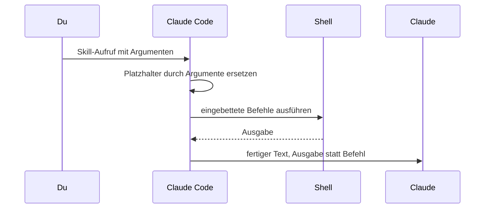

# S2.5 · Lebendige Prompts: Argumente und dynamischer Inhalt

<!-- meta:start -->
> **Regal:** [Skills & Commands](README.md#skills) · **Stufe:** Vertiefung · **~15 Min** · **Voraussetzungen:** [S2.2 Eine SKILL.md schreiben](s2-02-skill-schreiben.md)
>
> ← [S2.4 Mitgelieferte Skills](s2-04-mitgelieferte-skills.md) · [Bibliothek](README.md) · [S2.6 Hooks als Sensoren: die drei Eckpfeiler](s2-06-hooks-als-sensoren.md) →
<!-- meta:end -->

## Schnellcheck

- Kannst du ohne Nachschlagen einen Skill schreiben, der den aktuellen `git diff` automatisch in den Prompt setzt?
- Hast du schon einmal bei einem fremden Skill nachgesehen, ob er beim Aufruf Shell-Befehle ausführt?

## Auf einen Blick

Skills müssen kein starres Markdown sein. Beim Aufruf ersetzt Claude Code Platzhalter wie `$ARGUMENTS`, `$0` oder `$mode` durch deine Argumente, und eine Zeile `` !`befehl` `` führt einen Shell-Befehl auf deinem Rechner aus und setzt seine Ausgabe in den Text, bevor Claude ihn liest. Das macht Skills zu lebendigen Prompts und ist zugleich eine neue Angriffsfläche: Prüf fremde Skills, bevor du sie aufrufst; mit `disableSkillShellExecution` lässt sich die Ausführung abschalten.

## Bild im Kopf

Das ist wie eine Zugangskontrolle, die bei jedem Kartenscan frische Ausweisdaten aus dem Verzeichnis abruft, statt sich auf einen Ausdruck von heute Morgen zu verlassen. Die Karte, die jemand vorhält, sind die Argumente; die Live-Abfrage ist der eingebettete Befehl. Mächtig, aber auch eine neue Angriffsfläche: Wer die Abfrage manipulieren kann, bestimmt, was am Leser ankommt.



## Im Detail

### Argumente einsetzen

Bekommt ein Skill Argumente, setzt Claude Code sie beim Aufruf in den Body ein. Die benannten Platzhalter passen zur Liste `arguments:` im Frontmatter:

| Platzhalter | Bedeutung |
|-------------|-----------|
| `$ARGUMENTS` | alle Argumente als ein String, so wie getippt |
| `$0`, `$1`, …, `$N` | einzelne Argumente nach Position, **ab 0 gezählt**: `$0` ist das erste, `$1` das zweite (Langform `$ARGUMENTS[0]`, `$ARGUMENTS[1]` …) |
| `$mode`, `$module`, … | benannte Argumente aus der Liste `arguments:` im Frontmatter, in derselben Reihenfolge |
| `${CLAUDE_SESSION_ID}` | ID der laufenden Sitzung |
| `${CLAUDE_EFFORT}` | aktueller Effort: `low`, `medium`, `high`, `xhigh` oder `max` |
| `${CLAUDE_SKILL_DIR}` | Ordner, in dem die `SKILL.md` des Skills liegt; bei Plugin-Skills der Unterordner des Skills, nicht die Plugin-Wurzel |

Die Referenz nennt weitere Variablen, etwa `${CLAUDE_PROJECT_DIR}` für die Projektwurzel und, nur in Plugin-Skills, `${CLAUDE_PLUGIN_ROOT}` für den Installationsordner des Plugins ([S2.11](s2-11-plugins-buendeln.md)).

**Beispiel**, positionelle und benannte Argumente gemischt:

```markdown
---
name: review
description: Run a review against a target module
argument-hint: "[mode] [module]"
arguments: [mode, module]
---

# Review Skill

You are running the **$mode** review on module **$module**.

Session: ${CLAUDE_SESSION_ID}
Effort: ${CLAUDE_EFFORT}

Raw input: $ARGUMENTS
First positional: $1
```

Aufgerufen als `/review strict auth-service` sieht der Body `$mode = strict`, `$module = auth-service`, `$0 = strict`, `$1 = auth-service` und `$ARGUMENTS = "strict auth-service"`. Achtung: Die Zeile `First positional: $1` im Beispiel ist falsch beschriftet. Weil die Zählung bei 0 beginnt, zeigt sie `auth-service`, also das zweite Argument; das erste wäre `$0`.

Gut zu wissen:

- Mehrwortige Werte setzt du in Anführungszeichen: Bei `/my-skill "hello world" second` ist `$0` gleich `hello world` und `$1` gleich `second`.
- Übergibst du Argumente, aber kein Platzhalter im Skill nimmt sie auf, hängt Claude Code sie als `ARGUMENTS: <Wert>` ans Ende an. Claude sieht also trotzdem, was du getippt hast.

### Live-Kontext einbetten: `` !`befehl` ``

Die Syntax `` !`<command>` `` führt einen Shell-Befehl aus, wenn der Skill aufgerufen wird, und setzt seine Ausgabe direkt in den Prompt ein:

<!-- cockpit:example -->
```markdown
# Pre-Commit Skill

Current git diff:
!`git diff HEAD`

Current branch:
!`git branch --show-current`

Failing tests:
!`pytest --tb=no -q 2>&1 | tail -20`

Now review the diff and propose a commit message.
```

Beim Aufruf werden die `!`-Zeilen durch die echte Ausgabe der Befehle ersetzt, **bevor** der Text das Modell erreicht. Claude sieht die Daten, nicht den Befehl. So sammeln Skills ihren aktuellen Kontext selbst ein und werden von statischem Markdown zu **lebendigen Prompts**.

Was du über die Ausführung wissen solltest:

- Die Inline-Form wirkt nur am Zeilenanfang oder nach einem Leerzeichen. In `` KEY=!`cmd` `` bleibt der Platzhalter reiner Text.
- Scheitert ein Befehl, bricht der ganze Skill-Aufruf ab, und Claude sieht den Skill gar nicht. Mit der Standard-Shell `bash` gilt jeder Exit-Code ungleich 0 als Fehler; nur bei Such- und Vergleichsbefehlen ist Exit-Code 1 ein normales Ergebnis. Einen Befehl, der absichtlich mit einem Fehlercode enden darf, ergänzt du um `|| true`.
- Die Befehle fragen nie nach einer Freigabe. Claude Code prüft jeden gegen deine Rechte-Regeln: Eine deny-Regel bricht den Aufruf ab, und außerhalb des auto-Modus auch jeder Befehl, der nicht erlaubt ist. Erlauben kann ihn auch der Skill selbst, über `allowed-tools` ([S2.3](s2-03-wer-skills-ausloest.md)); deny- und ask-Regeln haben trotzdem Vorrang. Im auto-Modus bricht ein nicht freigegebener Befehl den Aufruf nicht ab: Claude bekommt dann die Anweisung, ihn selbst auszuführen, und dieser Aufruf durchläuft die üblichen Prüfungen des auto-Modus.

### Die Kehrseite: eine neue Angriffsfläche

Die eingebetteten Befehle laufen auf deinem Rechner, mit deinen Rechten, bevor das Modell etwas sieht. Claude bekommt nur ihre Ausgabe und kann sie nicht ablehnen. Ein fremder Skill, etwa aus einem ungeprüften Plugin, kann so Befehle mitbringen; gibt er sich per `allowed-tools` selbst die Freigabe, laufen sie ohne Rückfrage.

**Härtung im Unternehmen:** Die Ausführung lässt sich abschalten:

```json
{
  "disableSkillShellExecution": true
}
```

Mit dieser Einstellung ersetzt Claude Code jeden eingebetteten Befehl durch `[shell command execution disabled by policy]`, statt ihn auszuführen; die Skills bleiben reiner Text. Das gilt für Skills und Commands aus Nutzer-, Projekt- und Plugin-Quellen und aus zusätzlichen Verzeichnissen; mitgelieferte und verwaltete Skills sind ausgenommen. Setzen kannst du die Einstellung in jeder `settings.json`. Am meisten bringt sie in den Managed Settings, weil Nutzer sie dort nicht überschreiben können. Mehr zur Härtung: [S3.10](s3-10-netzwerk-und-skills-haerten.md).

### Änderungen wirken sofort

Dateien in `~/.claude/skills/` und `.claude/skills/` übernimmt Claude Code live, **ohne Neustart**. Du bearbeitest eine `SKILL.md`, speicherst und rufst den Skill erneut auf: Der neue Inhalt ist sofort da. So schreibst du Skills in kurzen Runden: ändern, testen, ändern, testen.

Zwei Ausnahmen nennt die Doku. Legst du einen Skill-Ordner auf oberster Ebene erst während der Sitzung an, führ `/reload-skills` aus, und nach jeder weiteren Änderung dort wieder, weil Claude Code diesen Ordner noch nicht beobachtet. Und die Live-Erkennung gilt nur für den Text der `SKILL.md`: Ist der Skill-Ordner zugleich ein Plugin, brauchen Änderungen an `hooks/`, `.mcp.json` oder `agents/` ein `/reload-plugins`.

## Typische Fallen

- **Das erste Argument mit `$1` holen.** `$1` ist das zweite Argument, das erste ist `$0`. Ein benannter Platzhalter wie `$mode` umgeht die Verwechslung.
- **Der Skill startet nicht, es erscheint `Shell command failed for pattern …`.** Ein eingebetteter Befehl ist gescheitert, und mit ihm der ganze Aufruf. Die Ausgabe des Befehls steht in der Meldung unter `[stderr]`.
- **Der Skill kann keinen Shell-Befehl ausführen.** Ist `disableSkillShellExecution: true` gesetzt? Steht das Ausrufezeichen direkt vor dem Backtick, am Zeilenanfang oder nach einem Leerzeichen? Blockt eine Rechte-Regel den Befehl? Dann lautet die Meldung `Shell command permission check failed for pattern …`; prüf die Regeln mit `/permissions`.
- **Windows ohne Git Bash.** Steht im Frontmatter `shell: bash` und Git Bash fehlt, scheitert der Aufruf, bevor ein Befehl läuft. Mit `shell: powershell` laufen die Befehle über das PowerShell-Tool, sofern es aktiv ist; unter Windows ohne Git Bash ist es das von Haus aus.

## Check

Du kannst erklären, wann genau `` !`git diff HEAD` `` in einer SKILL.md ausgeführt wird, nämlich beim Aufruf und bevor Claude den Text sieht, und warum `disableSkillShellExecution` in regulierten Umgebungen sinnvoll ist.

1. Was sieht der Body bei `/review strict auth-service` in `$0`, `$1` und `$module`?
2. Was passiert mit dem ganzen Skill, wenn ein eingebetteter Befehl scheitert?
3. Welche Skills nimmt `disableSkillShellExecution` aus?

<details><summary>Quizfrage</summary>

**Frage:** Wann läuft ein `` !`git diff HEAD` ``-Block in einer SKILL.md, und was folgt daraus für die Angriffsfläche?

- **Richtig:** Beim Aufruf, bevor der Text das Modell erreicht; Claude sieht nur die Ausgabe und kann den Befehl nicht ablehnen.
- Falsch: Erst wenn Claude den Text liest; Claude entscheidet dann selbst, ob der Befehl wirklich läuft, und lehnt gefährliche ab.
- Falsch: Nur bei einem Aufruf von Hand mit `/name`; lädt Claude den Skill selbst, überspringt Claude Code alle Befehle.
- Falsch: Beim Start der Sitzung, als PreToolUse-Hook registriert; deshalb ist `disableSkillShellExecution` überflüssig.

</details>

## Weiterlesen

- [Skills-Doku: Argumente übergeben](https://code.claude.com/docs/en/skills#pass-arguments-to-skills)
- [Skills-Doku: dynamischen Kontext einbetten](https://code.claude.com/docs/en/skills#inject-dynamic-context)
- [S2.2 · Eine SKILL.md schreiben](s2-02-skill-schreiben.md)
- [S2.3 · Skills oder Commands, und wer sie auslösen darf](s2-03-wer-skills-ausloest.md)
- [S2.11 · Plugins: ein Bündel schnüren](s2-11-plugins-buendeln.md)
- [S3.10 · Netzwerk und Skills härten](s3-10-netzwerk-und-skills-haerten.md)
