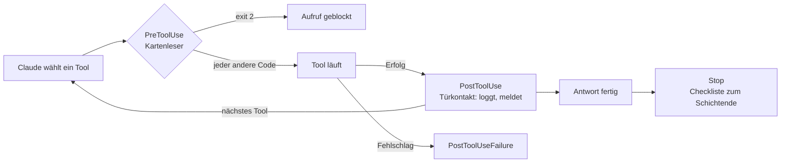

# S2.6 · Hooks als Sensoren: die drei Eckpfeiler

<!-- meta:start -->
> **Regal:** [Hooks](README.md#hooks) · **Stufe:** Kern · **~20 Min** · **Voraussetzungen:** [S1.5 Rechte im Alltag: default und acceptEdits](s1-05-rechte-im-alltag.md)
>
> ← [S2.5 Lebendige Prompts: Argumente und dynamischer Inhalt](s2-05-lebendige-prompts.md) · [Bibliothek](README.md) · [S2.7 Die wichtigsten Hook-Ereignisse](s2-07-hook-ereignisse.md) →
<!-- meta:end -->

## Schnellcheck

- Kannst du ohne Nachschlagen sagen, welcher der drei Eckpfeiler-Hooks eine Aktion verhindern kann und welcher nur reagiert?
- Kannst du sagen, nach welchen Tool-Aufrufen PostToolUse feuert und nach welchen nicht?

## Auf einen Blick

Hooks sind automatische Aktionen, die bei festen Ereignissen in Claude Code laufen, ohne dass du jedes Mal daran denken musst. Drei Ereignisse tragen fast alles: PreToolUse feuert vor einem Tool-Aufruf und kann ihn blocken; PostToolUse feuert danach, aber nur nach einem erfolgreichen Aufruf, und kann reagieren, loggen, melden; Stop feuert, wenn Claude eine Antwort beendet hat und auf deine nächste Eingabe wartet. Geblockt wird über den Exit-Code allein nur mit `exit 2`; jeder andere Code, ein Absturz oder ein Timeout lässt die Aktion laufen. Der zweite Weg, eine JSON-Entscheidung, steht in [S2.10](s2-10-hook-ausgaben.md).

## Bild im Kopf

In einer Zutrittskontrolle feuert der Kartenleser, sobald jemand eine Karte vorhält. Bevor die Tür aufgeht, prüft das System: Ist die Karte berechtigt, gilt sie zu dieser Uhrzeit, ist der Bereich gerade zugänglich? Das ist PreToolUse, eine Prüfung, die die Aktion verhindern kann. Der Türkontakt meldet nach dem Öffnen, wer wann durch welche Tür gegangen ist. Das ist PostToolUse, ein Protokoll nach dem Ereignis; ging die Tür gar nicht auf, gibt es nichts zu melden. Die Checkliste zum Schichtende läuft, wenn der Wachmann den Schichtbericht abschließt, nicht weil die Uhr 18:00 zeigt. Das ist Stop: ausgelöst durch ein Ereignis, nicht durch die Uhr.

Die Sensoren ersetzen die Wachleute nicht. Sie nehmen ihnen das wiederholte Prüfen ab, damit sie sich um die Ausnahmen kümmern können.



## Im Detail

### Die Kernidee

Hooks sind automatische Aktionen, die als Reaktion auf Ereignisse in Claude Code laufen, ohne dass du daran denken musst, sie anzustoßen. Im Grundfall führen sie Shell-Befehle aus (Skripte, Programme, `echo`-Zeilen, `curl`-Aufrufe), und zwar an festen Stellen in Claudes Arbeitsablauf. Weitere Hook-Typen wie `http` oder `prompt` zeigt [S2.9](s2-09-hook-typen.md).

Stell dir Hooks als **Event-Listener** für Claudes Verhalten vor. Wenn etwas passiert (Claude nutzt ein Tool, Claude beendet eine Antwort, Claude will gleich einen Bash-Befehl ausführen), kann ein Hook feuern. Der Unterschied zu einem Skill ([S2.1](s2-01-skills-und-commands.md)): Einen Skill lädt Claude, wenn du ihn aufrufst oder die Anfrage passt, und er gibt Anweisungen, denen Claude folgen kann. Ein Hook läuft von selbst an einem festen Ereignis, ob Claude daran denkt oder nicht.

Wo ein Hook steht, bestimmt, wofür er gilt: In `.claude/settings.json` nur im Projekt, in `~/.claude/settings.json` in all deinen Projekten ([S2.8](s2-08-hook-einrichten.md)). Die Übung unten nutzt die Projektdatei eines Wegwerf-Ordners. Wichtig dabei: Claude Code führt Hooks aus Settings-Dateien erst aus, wenn du den Vertrauensdialog für den Ordner bestätigt hast.

### Die drei Eckpfeiler

**PreToolUse: vorher, kann blocken.** Feuert, bevor Claude ein Tool nutzt, also einen Bash-Befehl ausführt, eine Datei bearbeitet oder einen MCP-Server aufruft. Der Hook bekommt mit, was Claude gleich tun will. Er kann die Aktion loggen, dich warnen oder sie **ganz blocken**: mit `exit 2` oder mit einer JSON-Entscheidung. Über den Exit-Code allein blockt nur 2: `exit 1`, ein Absturz oder ein Timeout melden nur einen Hook-Fehler, und die Aktion läuft weiter. Für einen Wächter ist das die gefährliche Fehlerrichtung.

**PostToolUse: nachher, kann reagieren.** Feuert, nachdem ein Tool-Aufruf erfolgreich war. Er kann festhalten, was passiert ist, Folgeaktionen anstoßen, Benachrichtigungen schicken, in ein Audit-Log schreiben. Rückgängig macht er nichts. Schlägt der Aufruf fehl, etwa weil ein Befehl mit einem Fehlercode endet, feuert stattdessen PostToolUseFailure; ein Protokoll-Hook nur an PostToolUse sieht fehlgeschlagene Aufrufe nicht.

**Stop: wenn Claude fertig ist.** Feuert, wenn Claude eine Antwort beendet hat und auf deine nächste Eingabe wartet, nicht aber nach einem Abbruch durch dich; bei einem API-Fehler feuert StopFailure. Einsatz: Zusammenfassungen, Aufräumarbeiten, Statusmeldungen. Ein Stop-Hook kann Claude sogar am Aufhören hindern: Endet er mit `exit 2`, macht Claude weiter.

### So sieht ein Wächter im Kern aus

Ein PreToolUse-Hook für Bash bekommt den Aufruf als JSON auf stdin, sucht im Befehl nach einem gefährlichen Muster und entscheidet über den Exit-Code:

```bash
#!/bin/bash
# Der Bash-Befehl steht in tool_input.command; nur exit 2 blockt.
INPUT=$(cat)
COMMAND=$(printf '%s' "$INPUT" | jq -r '.tool_input.command // ""')
if printf '%s' "$COMMAND" | grep -qiE 'rm[[:space:]]+-rf|git push.*--force'; then
  echo "Destructive command blocked" >&2
  exit 2   # exit 1 wuerde NICHT blocken
fi
exit 0
```

Diese Kurzfassung zeigt nur das Prinzip. Fehlt `jq`, bleibt `COMMAND` leer, und der Befehl läuft durch. Die getestete Fassung in [S2.8](s2-08-hook-einrichten.md) blockt in diesem Fall lieber.

## Selbst machen

### Übung: drei Sensoren in einer Logdatei (etwa 10 Minuten)

**Ziel:** Du trägst je einen Hook für PreToolUse, PostToolUse und Stop ein und liest in einer Logdatei, in welcher Reihenfolge sie feuern und wann nicht.

**Startzustand:** ein neuer Ordner `~/cc-workshop/hooks-sensoren` (`mkdir -p ~/cc-workshop/hooks-sensoren/.claude && cd ~/cc-workshop/hooks-sensoren`, in PowerShell `New-Item -ItemType Directory -Force "$HOME\cc-workshop\hooks-sensoren\.claude"; Set-Location "$HOME\cc-workshop\hooks-sensoren"`). Du brauchst weder `jq` noch Node.js: Die Hooks sind einzeilige `echo`-Befehle, die in Git Bash und in PowerShell gleich laufen. Alles bleibt in diesem Ordner.

1. Leg von Hand die Datei `.claude/settings.json` an (`.claude` ist ein geschützter Pfad). Jeder Hook hängt sein Stichwort an die Datei `hook-log.txt` im Projektordner:

   <!-- cockpit:example -->
   ```json
   {
     "hooks": {
       "PreToolUse": [
         {
           "matcher": "Bash|PowerShell",
           "hooks": [{"type": "command", "command": "echo pre >> \"${CLAUDE_PROJECT_DIR}/hook-log.txt\""}]
         }
       ],
       "PostToolUse": [
         {
           "matcher": "Bash|PowerShell",
           "hooks": [{"type": "command", "command": "echo post >> \"${CLAUDE_PROJECT_DIR}/hook-log.txt\""}]
         }
       ],
       "Stop": [
         {
           "hooks": [{"type": "command", "command": "echo stop >> \"${CLAUDE_PROJECT_DIR}/hook-log.txt\""}]
         }
       ]
     }
   }
   ```

   `${CLAUDE_PROJECT_DIR}` ist laut Doku die Projektwurzel, in der die Sitzung gestartet wurde. Der Matcher `Bash|PowerShell` trifft Shell-Befehle auf beiden Systemen; warum, steht in [S2.8](s2-08-hook-einrichten.md).
2. Starte `claude --permission-mode default` im Ordner und bestätige den Vertrauensdialog mit „Yes, I trust this folder" ([S1.1](s1-01-erster-kontakt.md)). Ohne diese Bestätigung laufen Hooks aus Settings-Dateien nicht.
3. Gib `/hooks` ein. Erwartet: eine schreibgeschützte Ansicht, in der deine Hooks unter PreToolUse, PostToolUse und Stop auftauchen, mit der Projekt-Einstellung als Herkunft. Schließ sie mit `Esc`.
4. Gib ein: `Run the shell command echo hello and tell me what it prints.` Lies danach die Logdatei in einem zweiten Terminal im selben Ordner (`cat hook-log.txt`, in PowerShell `Get-Content hook-log.txt`). Erwartet: drei Zeilen in dieser Reihenfolge: `pre`, `post`, `stop`. (Führt Claude zusätzliche Befehle aus, stehen mehr `pre`- und `post`-Paare dazwischen; `stop` kommt erst am Ende der Antwort.)
5. Gib ein: `What is 2 plus 2? Do not use any tools.` Lies die Datei erneut. Erwartet: Es ist genau eine Zeile `stop` dazugekommen, ohne `pre` und `post`. Stop feuert nach jeder Antwort, die Tool-Hooks nur bei Tool-Aufrufen.
6. Gib ein: `Run the shell command git show no-such-commit and show me the output.` Einen Commit dieses Namens gibt es nicht (und in diesem Ordner nicht einmal ein Repository), der Befehl endet also mit einem Fehlercode. Lies die Datei erneut. Erwartet: Für diesen Aufruf steht `pre` in der Datei, aber kein `post`, danach `stop`. Der Aufruf ist fehlgeschlagen, und PostToolUse feuert nur nach Erfolg.

**Aufräumen:** Beende die Sitzung mit `/exit` und lösch den Ordner `~/cc-workshop/hooks-sensoren` selbst. Die Hooks hingen nur an diesem Ordner.

**Geschafft, wenn:**

- [ ] `/hooks` deine drei Hooks zeigte
- [ ] nach dem `echo`-Auftrag `pre`, `post`, `stop` in dieser Reihenfolge in der Datei standen
- [ ] die Frage ohne Werkzeug nur ein zusätzliches `stop` erzeugte
- [ ] der fehlgeschlagene `git show` ein `pre`, aber kein `post` hinterließ

## Typische Fallen

- **Blocken mit `exit 1`.** Das blockt nicht. Über den Exit-Code allein stoppt nur `exit 2` einen PreToolUse-Aufruf; jeder andere Code meldet einen Hook-Fehler, und die Aktion läuft.
- **Der Hook feuert nie.** Du hast den Vertrauensdialog für den Ordner nicht bestätigt, oder der Matcher trifft das Tool nicht: Unter Windows laufen Shell-Befehle meist über das PowerShell-Tool, mit `"Bash"` allein feuert nichts. `/hooks` zeigt, was registriert ist.
- **Protokoll-Hook an PostToolUse und fehlgeschlagene Befehle.** Ein Testlauf mit Fehlschlägen endet mit einem Fehlercode und taucht dort nicht auf. Willst du auch Fehlschläge sehen, brauchst du PostToolUseFailure.
- **Stop mit dem Sitzungsende verwechseln.** Stop feuert nach jeder abgeschlossenen Antwort, nicht erst am Ende. Für das saubere Ende der Sitzung gibt es SessionEnd ([S2.7](s2-07-hook-ereignisse.md)).
- **Hooks für eine harte Grenze halten.** Hooks sind Best-Effort-Wächter. Warum, und womit du sie kombinierst, steht in [S2.8](s2-08-hook-einrichten.md).

## Check

Du kannst die drei Eckpfeiler-Hooks benennen, erklären, welcher blockieren kann und wann PostToolUse nicht feuert, und den Unterschied zu einem Skill nennen.

1. Warum musst du an einen Hook nicht denken, damit er läuft, und was unterscheidet ihn darin von einem Skill?
2. Wie kann ein PreToolUse-Hook einen Aufruf verhindern, und was passiert, wenn er mit `exit 1` endet?
3. Wann feuert PostToolUse nicht, obwohl Claude ein Tool benutzt hat?

<details><summary>Auflösung</summary>

1. Ein Hook läuft von selbst an einem festen Ereignis, etwa vor jedem Tool-Aufruf. Einen Skill lädt Claude nur, wenn du ihn aufrufst oder die Anfrage zur Beschreibung passt, und er gibt Anweisungen, denen Claude folgen kann.
2. Über den Exit-Code mit `exit 2` (daneben mit einer JSON-Entscheidung, [S2.10](s2-10-hook-ausgaben.md)). Mit `exit 1` meldet Claude Code nur einen Hook-Fehler, und die Aktion läuft weiter.
3. Wenn der Tool-Aufruf fehlgeschlagen ist, etwa weil ein Befehl mit einem Fehlercode endet. Dann feuert PostToolUseFailure.

</details>

<details><summary>Quizfrage</summary>

**Frage:** Dein PreToolUse-Wächter erkennt einen gefährlichen Befehl und endet mit `exit 1`. Was passiert mit dem Befehl?

- **Richtig:** Er läuft: `exit 1` meldet nur einen Hook-Fehler, über den Exit-Code allein blockt nur `exit 2`.
- Falsch: Er wird geblockt, denn Claude Code behandelt jeden Exit-Code ungleich 0 als Ablehnung des Tool-Aufrufs.
- Falsch: Er wird geblockt, sobald der Hook zusätzlich eine Begründung auf stderr schreibt, wie im Skript davor.
- Falsch: Er läuft nicht, weil ein Hook-Fehler den ganzen Tool-Aufruf abbricht, genau wie ein Timeout des Hooks.

</details>

## Weiterlesen

- [Hooks-Referenz](https://code.claude.com/docs/en/hooks)
- [Hooks-Leitfaden](https://code.claude.com/docs/en/hooks-guide)
- [S2.7 · Die wichtigsten Hook-Ereignisse](s2-07-hook-ereignisse.md)
- [S2.8 · Einen Hook einrichten, der wirklich blockt](s2-08-hook-einrichten.md)
- [S2.9 · Hook-Typen und Hooks in Komponenten](s2-09-hook-typen.md)
- [S1.5 · Rechte im Alltag: default und acceptEdits](s1-05-rechte-im-alltag.md)
