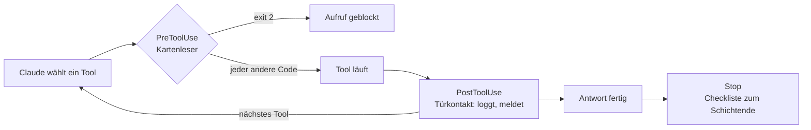

# S2.6 · Hooks als Sensoren: die drei Eckpfeiler

<!-- meta:start -->
> **Regal:** [Hooks](README.md#hooks) · **Stufe:** Kern · **~15 Min** · **Voraussetzungen:** [S1.5 Rechte im Alltag: default und acceptEdits](s1-05-rechte-im-alltag.md)
>
> ← [S2.5 Lebendige Prompts: Argumente und dynamischer Inhalt](s2-05-lebendige-prompts.md) · [Bibliothek](README.md) · [S2.7 Die wichtigsten Hook-Ereignisse](s2-07-hook-ereignisse.md) →
<!-- meta:end -->

## Schnellcheck

- Kannst du ohne Nachschlagen sagen, welcher der drei Eckpfeiler-Hooks eine Aktion verhindern kann und welcher nur reagiert?
- Hast du schon einmal eine Aktion von Claude automatisch geprüft oder protokolliert, ohne dafür den Prompt zu ändern?

## Auf einen Blick

Hooks sind automatische Aktionen, die bei festen Ereignissen in Claude Code laufen, ohne dass du jedes Mal daran denken musst. Drei Ereignisse tragen fast alles: PreToolUse feuert vor einem Tool-Aufruf und kann ihn blocken, aber nur mit `exit 2`; PostToolUse feuert danach und kann reagieren, loggen, melden; Stop feuert, wenn Claude eine Antwort beendet hat und auf deine nächste Eingabe wartet. Jeder andere Exit-Code als 2 blockt nicht: Die Aktion läuft weiter.

## Bild im Kopf

In einer Zutrittskontrolle feuert der Kartenleser, sobald jemand eine Karte vorhält. Bevor die Tür aufgeht, prüft das System: Ist die Karte berechtigt, gilt sie zu dieser Uhrzeit, ist der Bereich gerade zugänglich? Das ist PreToolUse, eine Prüfung, die die Aktion verhindern kann. Der Türkontakt meldet nach dem Öffnen, wer wann durch welche Tür gegangen ist. Das ist PostToolUse, ein Protokoll nach dem Ereignis. Die Checkliste zum Schichtende läuft, wenn der Wachmann den Schichtbericht abschließt, nicht weil die Uhr 18:00 zeigt. Das ist Stop: ausgelöst durch ein Ereignis, nicht durch die Uhr.

Die Sensoren ersetzen die Wachleute nicht. Sie nehmen ihnen das wiederholte Prüfen ab, damit sie sich um die Ausnahmen kümmern können.



## Im Detail

### Die Kernidee

Hooks sind automatische Aktionen, die als Reaktion auf Ereignisse in Claude Code laufen, ohne dass du daran denken musst, sie anzustoßen. Im Grundfall führen sie Shell-Befehle aus (Skripte, Programme, `echo`-Zeilen, `curl`-Aufrufe), und zwar an festen Stellen in Claudes Arbeitsablauf. Weitere Hook-Typen wie `http` oder `prompt` zeigt [S2.9](s2-09-hook-typen.md).

Stell dir Hooks als **Event-Listener** für Claudes Verhalten vor. Wenn etwas passiert (Claude nutzt ein Tool, Claude beendet eine Antwort, Claude will gleich einen Bash-Befehl ausführen), kann ein Hook feuern.

### Die drei Eckpfeiler

**PreToolUse: vorher, kann blocken.** Feuert, bevor Claude ein Tool nutzt, also einen Bash-Befehl ausführt, eine Datei bearbeitet oder einen MCP-Server aufruft. Der Hook bekommt mit, was Claude gleich tun will. Er kann die Aktion loggen, dich warnen oder sie **ganz blocken**, indem er mit Code 2 endet. Nur 2 blockt: `exit 1`, ein Absturz oder ein Timeout melden nur einen Hook-Fehler, und die Aktion läuft weiter. Für einen Wächter ist das die gefährliche Fehlerrichtung.

**PostToolUse: nachher, kann reagieren.** Feuert, nachdem Claude ein Tool genutzt und das Ergebnis bekommen hat. Er kann festhalten, was passiert ist, Folgeaktionen anstoßen, Benachrichtigungen schicken, in ein Audit-Log schreiben.

**Stop: wenn Claude fertig ist.** Feuert, wenn Claude eine Antwort beendet hat und auf deine nächste Eingabe wartet. Einsatz: Zusammenfassungen, Aufräumarbeiten, Statusmeldungen.

### So sieht ein Wächter im Kern aus

Ein PreToolUse-Hook für Bash bekommt den Aufruf als JSON auf stdin, sucht im Befehl nach einem gefährlichen Muster und entscheidet über den Exit-Code:

<!-- cockpit:example -->
```bash
#!/bin/bash
# Der Bash-Befehl steht in tool_input.command; nur exit 2 blockt.
INPUT=$(cat)
COMMAND=$(printf '%s' "$INPUT" | jq -r '.tool_input.command // ""')
if printf '%s' "$COMMAND" | grep -qiE 'rm[[:space:]]+-rf|git push.*--force'; then
  echo "Destructive command blocked" >&2
  exit 2   # exit 1 wuerde NICHT blocken
fi
exit 0
```

Diese Kurzfassung zeigt nur das Prinzip. Fehlt `jq`, bleibt `COMMAND` leer, und der Befehl läuft durch. Die getestete Fassung in [S2.8](s2-08-hook-einrichten.md) blockt in diesem Fall lieber.

## Vorführen

Die Demo „Hooks: die Alarmanlage" steht in [S2.8](s2-08-hook-einrichten.md). Zu den drei Eckpfeilern gehören diese Sprechpunkte.

<details><summary>Für Moderierende</summary>

Einstieg: „Hooks sind Sensoren in deinem Workflow. Sie feuern bei Ereignissen. Sie sind keine Policy-Durchsetzung, sondern Best-Effort-Wächter."

Sprechpunkte:

- „Hooks sind die Sensoren deiner Alarmanlage: Sie feuern bei Ereignissen, nicht auf Zuruf."
- „PreToolUse ist der Sensor, der prüft, bevor die Tür aufgeht. Er kann sie verriegeln, aber nur mit `exit 2`."
- „PostToolUse ist der Sensor, der protokolliert, nachdem jemand durch ist."
- „Stop ist die Meldung zum Schichtende: Sie feuert, wenn Claude mit der Antwort fertig ist."
- „Eine Hook-Konfiguration gilt für jede Sitzung, jedes Projekt und jedes Teammitglied, das dieselbe Konfiguration nutzt."
- „So prüfst du Sicherheitsstandards, Code-Konventionen und Compliance-Vorgaben automatisch."

</details>

## Typische Fallen

- **Blocken mit `exit 1`.** Das blockt nicht. Nur `exit 2` stoppt einen PreToolUse-Aufruf; jeder andere Code meldet einen Hook-Fehler, und die Aktion läuft.
- **Stop mit dem Sitzungsende verwechseln.** Stop feuert nach jeder Antwort. Für das saubere Ende der Sitzung gibt es SessionEnd ([S2.7](s2-07-hook-ereignisse.md)).
- **Hooks für eine harte Grenze halten.** Hooks sind Best-Effort-Wächter. Warum, und womit du sie kombinierst, steht in [S2.8](s2-08-hook-einrichten.md).

## Check

Du kannst die drei Eckpfeiler-Hooks benennen, erklären, welcher blockieren kann und welcher nicht, und für jeden ein konkretes Beispiel nennen.

1. Warum musst du an einen Hook nicht denken, damit er läuft — und was unterscheidet ihn darin von einem Skill, den du aufrufst?
2. Was passiert, wenn ein PreToolUse-Hook mit `exit 1` endet?
3. Warum ist Stop kein Uhrzeit-Ereignis?

<details><summary>Quizfrage</summary>

**Frage:** Welcher der drei Eckpfeiler-Hooks kann einen Tool-Aufruf verhindern, bevor er läuft, und wie signalisiert er das?

- **Richtig:** PreToolUse mit `exit 2`: Er läuft vor dem Aufruf; PostToolUse und Stop kommen erst, wenn der Aufruf gelaufen ist.
- Falsch: Alle drei, jeweils mit `exit 1`: PostToolUse macht den Aufruf wieder rückgängig, und Stop verwirft die gerade fertige Antwort.
- Falsch: Keiner der drei: Hooks können nur Warnungen loggen, Blocken geht ausschließlich über `permissions.deny`.
- Falsch: PreToolUse, aber nur bei Bash; für Edit, Write und MCP-Tools bleibt dir dann nur `permissions.deny`.

</details>

## Weiterlesen

- [Hooks-Referenz](https://code.claude.com/docs/en/hooks)
- [Hooks-Leitfaden](https://code.claude.com/docs/en/hooks-guide)
- [S2.7 · Die wichtigsten Hook-Ereignisse](s2-07-hook-ereignisse.md)
- [S2.8 · Einen Hook einrichten, der wirklich blockt](s2-08-hook-einrichten.md)
- [S2.9 · Hook-Typen und Hooks in Komponenten](s2-09-hook-typen.md)
- [S1.5 · Rechte im Alltag: default und acceptEdits](s1-05-rechte-im-alltag.md)
